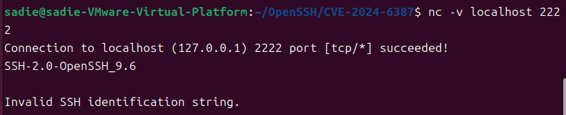
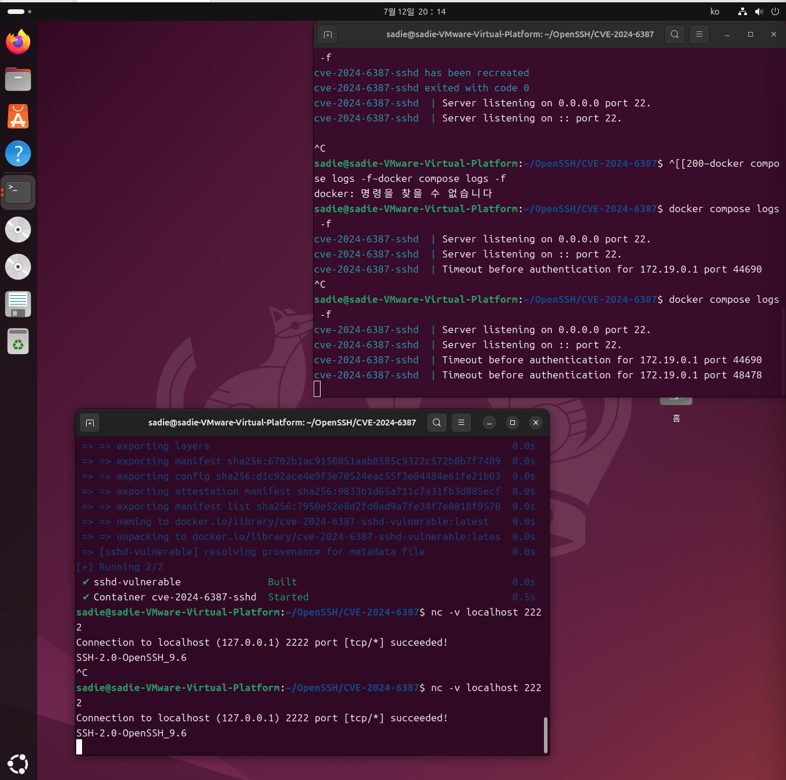
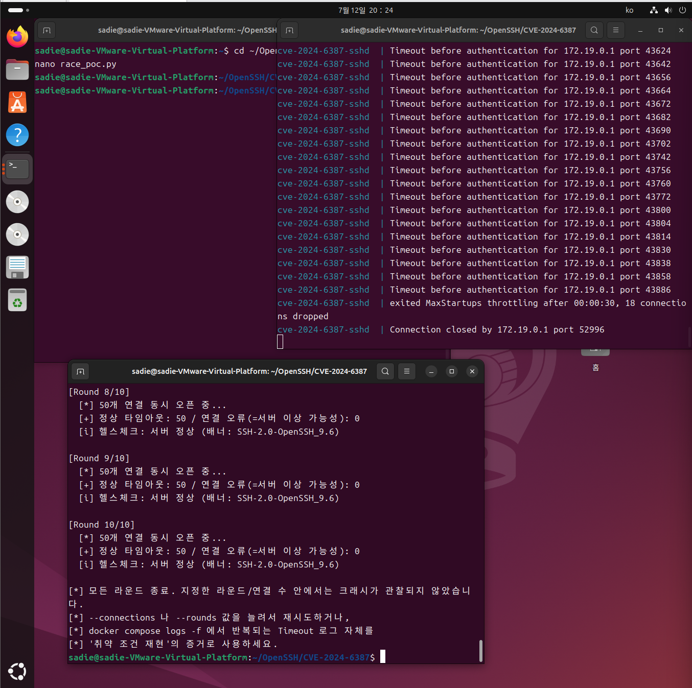

# CVE-2024-6387 (regreSSHion) — OpenSSH Signal Handler Race Condition

- **컴포넌트**: OpenSSH (portable, glibc 기반 Linux)
- **취약 버전**: 8.5p1 ~ 9.7p1 (4.4p1 이전 버전도 재도입된 취약점으로 영향)
- **CVSS 3.1 (참고)**: 9.8 (Critical)
- **공격 조건**: 네트워크 접근 가능, 인증 불필요 (Unauthenticated)
- **환경**: Ubuntu 22.04 + OpenSSH 9.6p1 (소스 빌드)

---

## 1. 취약점 요약

OpenSSH의 sshd는 클라이언트가 LoginGraceTime(기본 120초) 안에 로그인을 완료하지 않으면 SIGALRM 시그널을 보내서 연결을 끊어버린다. 그런데 이 시그널을 처리하는 핸들러 안에서 syslog()를 호출하는데, 이게 문제였다. signal handler 안에서는 호출하면 안 되는 함수들이 있는데(async-signal-unsafe 함수라고 부른다), syslog()가 여기 해당한다.

이 취약점은 2006년에 한 번 발견돼서 CVE-2006-5051로 패치됐던 문제인데, 2020년 OpenSSH 8.5로 넘어가면서 코드를 리팩토링하는 과정에서 똑같은 문제가 다시 들어가 버렸다. 그래서 이름도 "regreSSHion"(regression + SSH)이다. 특정한 타이밍에 race condition이 발생하면 메모리 손상으로 이어질 수 있으며, Qualys 분석에서는 이를 이용한 인증 없는 원격 코드 실행(RCE) 가능성이 제시되었다.

다만 실제로 RCE까지 성공시키려면 성공 확률이 굉장히 낮다. 분석 자료를 보면 32비트 환경에서 평균 몇 시간, glibc 64비트 환경에서는 그보다 훨씬 오래 반복 시도가 필요하다고 한다. 여기에 heap grooming이나 ASLR 우회까지 같이 필요해서 과제 시간 안에 완전한 RCE를 재현하는 건 현실적으로 어렵다고 판단했다. 그래서 이번 실습에서는 다음 세 가지를 목표로 잡았다.

1. 취약한 버전에서 문제가 재현되는지 확인
2. race condition이 발생할 수 있는 타이밍(SIGALRM 트리거 지점)이 실제로 반복 재현되는지 확인
3. 다수의 연결을 동시에 몰았을 때 서버가 어떻게 반응하는지 관찰

---

## 2. 환경 구성

docker-compose.yml 하나로 실습 환경을 구성할 수 있도록 만들었다. 이미 취약하게 빌드된 이미지를 사용하는 대신, Ubuntu 22.04 위에서 OpenSSH 9.6p1 소스를 직접 컴파일하는 방식으로 Dockerfile을 작성했다.

### Dockerfile

아래 Dockerfile은 Ubuntu 22.04 환경에서 OpenSSH 9.6p1을 소스에서 직접 빌드하여 취약한 SSH 서버를 구성한다. 또한 LoginGraceTime을 30초로 설정해 타임아웃 실험을 반복하기 쉽도록 했다.

```dockerfile
FROM ubuntu:22.04

ENV DEBIAN_FRONTEND=noninteractive

# OpenSSH 빌드에 필요한 패키지 설치
RUN apt-get update && apt-get install -y \
    build-essential \
    zlib1g-dev \
    libssl-dev \
    wget \
    && rm -rf /var/lib/apt/lists/*

WORKDIR /build

# OpenSSH 9.6p1 소스 다운로드 및 압축 해제
RUN wget https://cdn.openbsd.org/pub/OpenBSD/OpenSSH/portable/openssh-9.6p1.tar.gz \
    && tar -xzf openssh-9.6p1.tar.gz

WORKDIR /build/openssh-9.6p1

# 취약 버전을 직접 빌드하여 실습 환경 구성
RUN ./configure --prefix=/usr --sysconfdir=/etc/ssh && make && make install

# sshd 실행에 필요한 디렉터리와 호스트 키 생성
RUN mkdir -p /run/sshd
RUN ssh-keygen -A

# LoginGraceTime을 30초로 설정해 테스트 사이클 단축
RUN echo "LoginGraceTime 30" >> /etc/ssh/sshd_config

# sshd 권한 분리(privilege separation)용 시스템 계정
RUN groupadd -r sshd && useradd -r -g sshd -s /usr/sbin/nologin sshd

# 데모용 테스트 계정
RUN useradd -m -s /bin/bash testuser && echo "testuser:testpass" | chpasswd

EXPOSE 22
CMD ["/usr/sbin/sshd", "-D", "-e"]
```

OpenSSH를 배포 패키지가 아닌 소스 코드에서 직접 빌드하여, 실습 환경이 실제 취약 버전(OpenSSH 9.6p1)임을 보장하였다.

> LoginGraceTime은 기본값인 120초 대신 30초로 짧게 잡았다. 처음에는 따로 설정하지 않고 그냥 테스트했는데, 타임아웃 재현 실험을 한 번 할 때마다 기본값인 2분을 매번 기다려야 해서 반복 테스트하기엔 너무 비효율적이었다. 그래서 LoginGraceTime을 30으로 명시적으로 넣어서 테스트 사이클을 줄였다. 값을 줄인다고 해서 취약점이 발생하는 원리 자체가 바뀌는 건 아니다 — SIGALRM이 발생하는 타이밍만 앞당겨질 뿐이다.
>
> -e 옵션은 sshd 로그를 syslog가 아니라 컨테이너 표준 출력(stderr)으로 뽑기 위한 옵션이다. 컨테이너 안에 syslog 데몬을 따로 안 띄웠기 때문에, 이게 없으면 docker compose logs로 로그가 하나도 안 보인다. 처음엔 이걸 몰라서 로그 창이 계속 조용하길래 타임아웃이 안 걸리는 줄 알았는데, 알고 보니 로그 자체가 안 남고 있었던 거라 뒤늦게 이 옵션을 추가했다.

### docker-compose.yml

```yaml
services:
  sshd-vulnerable:
    build:
      context: .
      dockerfile: Dockerfile
    container_name: cve-2024-6387-sshd
    ports:
      - "2222:22"
    restart: unless-stopped
```

docker-compose.yml은 Dockerfile을 이용해 취약한 OpenSSH 환경을 빌드하고, SSH 서비스를 호스트의 2222 포트로 노출하도록 구성하였다.

### 실행 명령

PR이 병합되기 전(현재)에는 아래처럼 브랜치를 지정해서 클론한다.

```bash
git clone -b add-cve-2024-6387 https://github.com/swimmmmy/kr-vulhub.git
cd kr-vulhub/OpenSSH/CVE-2024-6387
docker compose up -d --build
```

PR이 main에 병합된 이후에는 브랜치 지정 없이 아래 명령으로도 동일하게 실행된다.

```bash
git clone https://github.com/gunh0/kr-vulhub.git
cd kr-vulhub/OpenSSH/CVE-2024-6387
docker compose up -d --build
```

컨테이너가 정상적으로 떠 있는지, 취약 버전이 맞는지는 아래 명령으로 확인할 수 있다.

```bash
docker compose ps
docker compose exec sshd-vulnerable ssh -V
```

`ssh -V` 실행 결과에 `OpenSSH_9.6p1`이 포함되어 있으면 환경이 의도한 대로 구성된 것이다.

---

## 3. 취약 조건

| 항목 | 값 | 비고 |
|---|---|---|
| OpenSSH 버전 | 9.6p1 | 영향 범위(8.5p1~9.7p1) 내 |
| 빌드 환경 | glibc 기반 Linux (Ubuntu 22.04) | 분석 자료에서는 glibc의 malloc 구현 방식 때문에 이 문제가 실제 위협으로 이어졌다고 보고, musl libc 환경에서는 같은 영향이 보고되지 않았다 |
| 인증 방식 | 불필요 (Unauthenticated) | 네트워크 접근만으로 트리거 가능 |
| LoginGraceTime | 30초 (기본 120초에서 단축, 2절 참고) | 값과 무관하게 트리거 지점 자체는 동일 |

먼저 대상 서버가 취약한 버전인지 배너로 확인했다.

```bash
nc -v localhost 2222
```

```
Connection to localhost (127.0.0.1) 2222 port [tcp/*] succeeded!
SSH-2.0-OpenSSH_9.6
```



---

## 4. 재현 절차

### 4-1. 단일 연결 타임아웃 (race condition 트리거 지점 확인)

로그인 시도를 아예 안 하고 접속만 열어둔 채로 기다리면, LoginGraceTime이 지나는 순간 서버가 SIGALRM을 발생시키면서 연결을 강제로 끊는다. 바로 이 지점이 signal handler race condition이 발생할 수 있는 타이밍이다.

```bash
# 터미널 A: 로그 감시
docker compose logs -f sshd-vulnerable

# 터미널 B: 접속 후 아무 입력 없이 대기
nc -v localhost 2222
```

30초쯤 지나면 터미널 A에 아래 로그가 뜨는데, 두 번 접속해서 두 번 다 재현되는 걸 확인했다.

```
cve-2024-6387-sshd | Timeout before authentication for 172.19.0.1 port 44690
cve-2024-6387-sshd | Timeout before authentication for 172.19.0.1 port 48478
```



### 4-2. 대량 동시 연결로 race condition 유발 시도

이번엔 로그인 안 한 연결을 한꺼번에 여러 개 열어서, SIGALRM이 짧은 시간 안에 몰려서 발생하도록 유도해봤다 (poc.py, 5절 참고). 실제 취약점을 악용하는 exploit이 아니라, SIGALRM이 반복적으로 발생하는 환경을 만들기 위한 테스트 스크립트다.

```bash
python3 poc.py 127.0.0.1 2222 --connections 50 --rounds 10
```

10라운드(연결 500회)를 돌려봤는데, 완전한 크래시나 RCE는 관찰되지 않았다. 대신 서버(sshd) 쪽 로그에는 이런 게 떴다.

```
cve-2024-6387-sshd | exited MaxStartups throttling after 00:00:30, 18 connections dropped
cve-2024-6387-sshd | Connection closed by 172.19.0.1 port 52996
```

로그를 확인해보니 MaxStartups라는 게 동작한 걸 볼 수 있었다. 찾아보니 sshd가 미인증 연결 수를 제한하는 자체 보호 기능이었는데, 로그를 통해 다수의 미인증 연결이 생성되면서 해당 보호 기능이 동작했음을 확인할 수 있었다.



> Qualys 보고서(TRA-2024-006)를 보면 실제 RCE까지 성공시키려면 장시간 반복 시도에 더해 heap grooming, ASLR 우회 같은 추가 작업이 필요한 것으로 나와 있다. 이번 실습에서는 시간 관계상 완전한 RCE 재현 대신, 취약 버전에서 타임아웃과 race condition의 트리거가 정상적으로 재현되는 것까지 확인하는 데 집중했다.

---

## 5. PoC 코드

처음에는 nc를 여러 개 띄워서 수동으로 반복 테스트하려고 했는데, 매번 여러 창을 열고 타이밍을 맞추는 게 너무 번거로웠다. 그래서 같은 동작(연결 → 대기)을 자동으로 여러 번 반복해주는 간단한 Python 스크립트를 작성했다. 본 스크립트는 취약점을 직접 악용하는 exploit이 아니라, 다수의 미인증 연결을 반복 생성하여 LoginGraceTime 타이머(SIGALRM)가 빈번하게 발생하는 환경을 자동으로 구성하기 위한 실습용 PoC이다.

poc.py — 미인증 연결을 동시에 여러 개 만들어서 race condition이 발생할 확률을 높이는 스크립트

```python
#!/usr/bin/env python3
import socket
import threading
import time
import argparse
import sys


# 하나의 SSH 연결을 생성하고 LoginGraceTime 동안 유지
def open_and_hold_connection(target_ip, target_port, results, idx):
    try:
        sock = socket.socket(socket.AF_INET, socket.SOCK_STREAM)
        sock.settimeout(40)
        sock.connect((target_ip, target_port))
        # SSH 서버 배너를 받아 연결이 정상적으로 이루어졌는지 확인
        banner = sock.recv(256)
        start = time.time()
        try:
            # 추가 데이터를 보내지 않고 대기하여 LoginGraceTime 타임아웃을 유도
            sock.recv(1)
        except socket.timeout:
            pass
        elapsed = time.time() - start
        results[idx] = {"banner": banner.decode(errors="replace").strip(),
                         "elapsed": round(elapsed, 2), "error": None}
    except Exception as e:
        results[idx] = {"banner": None, "elapsed": None, "error": str(e)}
    finally:
        try:
            sock.close()
        except Exception:
            pass


# 여러 개의 연결을 동시에 생성
def run_round(target_ip, target_port, connections):
    threads = []
    results = [None] * connections
    for i in range(connections):
        t = threading.Thread(target=open_and_hold_connection,
                              args=(target_ip, target_port, results, i))
        threads.append(t)
        t.start()
        # 연결 생성 시점을 약간 분산시켜 스레드 생성이 과도하게 몰리는 것을 방지
        time.sleep(0.01)
    for t in threads:
        t.join()
    return results


# SSH 서버가 계속 살아있는지 확인
def check_server_alive(target_ip, target_port):
    try:
        sock = socket.socket(socket.AF_INET, socket.SOCK_STREAM)
        sock.settimeout(5)
        sock.connect((target_ip, target_port))
        banner = sock.recv(256)
        sock.close()
        return True, banner.decode(errors="replace").strip()
    except Exception as e:
        return False, str(e)


# 전체 실험 수행
def main():
    parser = argparse.ArgumentParser()
    parser.add_argument("target_ip")
    parser.add_argument("target_port", type=int)
    parser.add_argument("--connections", type=int, default=50)
    parser.add_argument("--rounds", type=int, default=10)
    args = parser.parse_args()

    alive, banner = check_server_alive(args.target_ip, args.target_port)
    if not alive:
        print(f"[!] 대상 서버에 연결할 수 없습니다: {banner}")
        sys.exit(1)
    print(f"[*] 초기 상태: 서버 정상 (배너: {banner})")

    for round_num in range(1, args.rounds + 1):
        print(f"[Round {round_num}/{args.rounds}]")
        run_round(args.target_ip, args.target_port, args.connections)
        # 각 라운드 종료 후 SSH 서비스가 계속 동작하는지 확인
        alive, banner = check_server_alive(args.target_ip, args.target_port)
        if not alive:
            print(f"[!!!] 서버 응답 없음 — 크래시 가능성: {banner}")
            sys.exit(0)
        print(f"  [i] 헬스체크 정상 (배너: {banner})")

    print("[*] 모든 라운드 종료.")


if __name__ == "__main__":
    main()
```

실행 방법:

```bash
python3 poc.py 127.0.0.1 2222 --connections 50 --rounds 10
```

---

## 6. 실행 결과

| 테스트 항목 | 결과 |
|---|---|
| 취약 버전 확인 (배너) | ✅ OpenSSH_9.6 확인, CVE 영향 범위 내 |
| LoginGraceTime 타임아웃 재현 | ✅ 2회 반복 재현 (서로 다른 포트 번호로 확인) |
| 대량 동시 연결 부하 유발 | ✅ MaxStartups 스로틀링 발동 확인 (18개 연결 강제 정리) |
| 완전한 RCE 재현 | ❌ 재현하지 않음 (실습 범위를 벗어나며, Qualys 분석에서도 장시간 반복 시도와 추가 조건이 필요한 것으로 설명) |

SSH 서비스는 모든 라운드에서 정상적으로 응답했으며, 서버 크래시는 발생하지 않았다. 따라서 본 실습에서는 취약점의 트리거 조건은 재현했지만, 실제 메모리 손상이나 RCE까지는 확인되지 않았다.

---

## 7. 대응 방안

1. **OpenSSH 업그레이드**: OpenSSH 9.8p1 이상으로 업데이트하거나, 벤더가 제공하는 보안 패치가 적용된 배포판 패키지를 사용한다. 배포판의 버전 표기(예: 9.6)만으로는 패치 여부를 알 수 없는 경우가 있어, 실제 패치 적용 여부를 확인하는 것이 중요하다.
2. **LoginGraceTime 단축**: 재시도 가능한 시간 창을 줄여서 공격 성공 확률을 낮출 수 있다. 다만 너무 짧게 잡으면 정상 사용자 연결도 끊길 수 있어서 균형이 필요하다.
3. **네트워크 접근 제한**: SSH 포트를 아무나 접근 못 하게 VPN이나 관리 네트워크로 제한하는 게 좋다.
4. **연결 속도 제한**: 방화벽이나 `fail2ban` 같은 도구로 같은 IP에서 짧은 시간에 여러 번 연결하는 걸 막을 수 있다.
5. **모니터링**: Timeout before authentication 로그가 급증하거나 짧은 시간에 미인증 연결이 반복되는 패턴을 탐지하도록 모니터링 및 알림을 구성하는 것이 효과적이다.

실습 환경은 아래 명령으로 정리할 수 있다.

```bash
docker compose down
```

---

## 참고 자료

1. NIST National Vulnerability Database (NVD). CVE-2024-6387.
2. Qualys Threat Research Unit. "regreSSHion: OpenSSH's Race Condition Remote Code Execution Vulnerability (TRA-2024-006)".
3. OpenSSH Release Notes 9.8.
