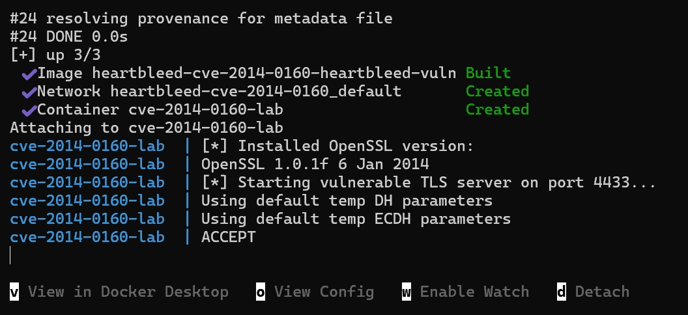
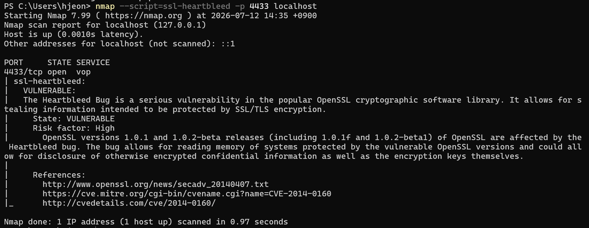

# [CVE-2014-0160] Heartbleed - OpenSSL 1.0.1f 메모리 정보 유출 취약점

## 1. 요약

- **CVE ID**: CVE-2014-0160 (Heartbleed)
- **대상 소프트웨어**: OpenSSL 1.0.1 ~ 1.0.1f (1.0.1g에서 패치)
- **CVSS 점수**: 7.5 (High)
- **CVSS 벡터**: `AV:N/AC:L/Au:N/C:P/I:N/A:N` (CVSS v2)
  - AV:N (네트워크에서 원격 공격 가능)
  - AC:L (공격 난이도 낮음 — 별도 조건 불필요)
  - Au:N (인증 불필요)
  - C:P (기밀성 부분 침해 — 힙 메모리 일부 유출)
  - I:N / A:N (무결성·가용성에는 직접 영향 없음)
- **취약점 유형**: 정보 노출 (CWE-125, Out-of-bounds Read)
- **한 줄 요약**: TLS Heartbeat 확장 기능에서 클라이언트가 보낸 요청 길이를
  서버가 검증하지 않아, 서버 프로세스의 힙 메모리 최대 64KB를
  응답으로 그대로 반환받을 수 있는 취약점. 이 메모리에는 개인키,
  세션 쿠키, 비밀번호 등 민감정보가 포함될 수 있음.

## 2. 환경 구성 (재현 절차)

### 2.1 사전 요구사항
- Docker, Docker Compose 설치
- (선택) nmap — 취약점 확인용

### 2.2 저장소 구조
```
heartbleed-cve-2014-0160/
├── Dockerfile          # OpenSSL 1.0.1f 소스 빌드 (멀티스테이지)
├── docker-compose.yml  # 컨테이너 기동 정의
├── entrypoint.sh        # 취약 서버 구동 스크립트
└── certs/
    ├── server.crt       # 테스트용 self-signed 인증서
    └── server.key
```

### 2.3 환경 구축 방식 및 시행착오

취약한 OpenSSL 1.0.1f를 재현 가능하게 확보하는 과정에서 두 차례
방식을 변경함. 이 과정 자체가 "왜 특정 방식을 선택했는지"에 대한
근거이자, 재현 시 흔히 마주칠 수 있는 함정을 미리 확인한 결과이므로
기록함.

**1차 시도 — apt 패키지 pinning (실패)**
```dockerfile
FROM ubuntu:14.04
RUN apt-get install -y openssl=1.0.1f-1ubuntu2
```
Ubuntu 14.04(trusty)는 2019년 EOL 처리되어 `archive.ubuntu.com`에서
패키지가 제거됨. `old-releases.ubuntu.com`으로 우회했으나, 해당
미러조차 트러스티의 `Packages` 인덱스 파일을 404로 반환하는
상태였음 → **자체완결성 관점에서도 이 방식은 부적합** (미러가
언제든 사라질 수 있는 외부 자원에 전적으로 의존).

**2차 시도 — OpenSSL 공식 소스 아카이브 (실패)**
```
https://www.openssl.org/source/old/1.0.1/openssl-1.0.1f.tar.gz
```
openssl.org가 GitHub Releases로 리다이렉트했으나, 해당 태그의
Release 자산이 존재하지 않아 404.

**최종 방식 — GitHub 공식 저장소 태그 아카이브 (성공)**
```
https://github.com/openssl/openssl/archive/refs/tags/OpenSSL_1_0_1f.tar.gz
```
Git 태그는 프로젝트 관행상 삭제되지 않으므로 상대적으로 안정적인
소스. `ubuntu:20.04`(지원 중인 LTS) 위에서 멀티스테이지로 직접
컴파일하여, 외부 미러/이미지에 의존하지 않는 자체완결형 환경을
구성함.

컴파일 과정에서도 두 가지 이슈를 추가로 해결함:
- `make -j$(nproc)` 병렬 빌드 시 이 시점 Makefile의 알려진
  race condition으로 실패 → 순차 빌드(`make`)로 전환
- `make install`의 `install_docs` 단계에서 최신 `pod2man`이 2014년
  작성된 POD 문서 문법을 파싱하지 못해 실패 → 문서 설치가
  필요하지 않으므로 `make install_sw`(바이너리/라이브러리만)로
  대체

### 2.4 실행 방법

```bash
git clone [본인 fork 저장소 URL]
cd heartbleed-cve-2014-0160
docker compose up --build
```

빌드 완료 후 아래와 같은 로그가 출력되며 서버가 4433 포트에서
연결을 대기함:

```
[*] Installed OpenSSL version:
OpenSSL 1.0.1f 6 Jan 2014
[*] Starting vulnerable TLS server on port 4433...
Using default temp DH parameters
Using default temp ECDH parameters
ACCEPT
```



### 2.5 취약점 확인

```bash
nmap --script=ssl-heartbleed -p 4433 localhost
```

## 3. 취약점 분석

### 3.1 Heartbeat 확장이란?
TLS/DTLS의 Heartbeat 확장(RFC 6520)은 연결이 살아있는지 확인하기
위한 기능. 클라이언트가 임의의 payload와 그 길이를 담아 보내면,
서버가 동일한 payload를 그대로 돌려주는 방식으로 동작함.

### 3.2 근본 원인
Heartbeat 요청 패킷은 다음 구조를 가짐:

```
[타입(1B)] [payload_length(2B)] [payload] [padding]
```

취약한 OpenSSL 구현(`ssl/t1_lib.c`의 `tls1_process_heartbeat` 함수)은
클라이언트가 명시한 `payload_length` 값을 그대로 신뢰하고, **실제
전송된 payload의 실제 길이와 일치하는지 검증하지 않음**. 예를 들어
실제 payload는 1바이트만 보내면서 `payload_length`를 65535
(최대값)로 조작하면, 서버는 응답 시 요청받은 길이만큼 자신의
**힙 메모리 영역**을 그대로 읽어서 클라이언트에게 돌려줌.

### 3.3 왜 위험한가
- 인증 불필요, 원격에서 익명으로 공격 가능
- 요청 1회당 최대 64KB의 프로세스 메모리 유출
- 반복 요청으로 힙의 다른 영역까지 광범위하게 탈취 가능
- 유출되는 메모리에 다음이 포함될 수 있음:
  - TLS 개인키 (서버 인증서의 private key)
  - 활성 세션의 쿠키/토큰
  - 사용자가 전송한 평문 데이터 (로그인 정보 등)

### 3.4 우리 환경에서 확인된 동작
`nmap --script=ssl-heartbleed` 스캔 결과, 4433 포트에서
`State: VULNERABLE`로 확인됨 (4장 실행결과 참고). 이는 조작된
heartbeat 요청에 대해 서버가 요청 길이 검증 없이 응답했음을
의미함.

## 4. 실행 결과

### 4.1 환경 구축 로그 (컴파일 성공 확인)

```
[*] Installed OpenSSL version:
OpenSSL 1.0.1f 6 Jan 2014
[*] Starting vulnerable TLS server on port 4433...
Using default temp DH parameters
Using default temp ECDH parameters
ACCEPT
```

→ 취약 버전인 OpenSSL 1.0.1f가 정상적으로 컴파일되어 4433 포트에서
서비스 중임을 확인.

### 4.2 nmap을 이용한 취약점 스캔 결과

```
PS C:\Users\hjeon> nmap --script=ssl-heartbleed -p 4433 localhost
Starting Nmap 7.99 ( https://nmap.org ) at 2026-07-12 14:35 +0900
Nmap scan report for localhost (127.0.0.1)
Host is up (0.0010s latency).

PORT     STATE SERVICE
4433/tcp open  vop
| ssl-heartbleed:
|   VULNERABLE:
|   The Heartbleed Bug is a serious vulnerability in the popular
|   OpenSSL cryptographic software library. It allows for stealing
|   information intended to be protected by SSL/TLS encryption.
|     State: VULNERABLE
|     Risk factor: High
|       OpenSSL versions 1.0.1 and 1.0.2-beta releases (including
|       1.0.1f and 1.0.2-beta1) of OpenSSL are affected by the
|       Heartbleed bug. The bug allows for reading memory of systems
|       protected by the vulnerable OpenSSL versions and could allow
|       for disclosure of otherwise encrypted confidential information
|       as well as the encryption keys themselves.
|
|     References:
|       http://www.openssl.org/news/secadv_20140407.txt
|       https://cve.mitre.org/cgi-bin/cvename.cgi?name=CVE-2014-0160
|_      http://cvedetails.com/cve/2014-0160/

Nmap done: 1 IP address (1 host up) scanned in 0.97 seconds
```



### 4.3 결과 해석
- `State: VULNERABLE`로 명확히 탐지됨 — 우리가 구축한 컨테이너가
  실제로 Heartbleed에 노출되어 있음을 확인
- nmap이 자체적으로 조작된 heartbeat 요청을 보내 서버의 응답
  동작을 검사한 결과이며, 이는 3.4절에서 설명한 검증 누락 동작과
  일치함
- Risk factor: High로 분류됨 (CVSS 7.5와 부합)

## 5. 대응 방안

### 5.1 근본 해결책 — 버전 업그레이드
가장 확실한 대응은 **OpenSSL 1.0.1g 이상으로 업그레이드**하는 것.
1.0.1g에서 heartbeat 요청의 `payload_length`가 실제 payload
크기와 일치하는지 검증하는 로직이 추가되어 패치됨.

```bash
# Ubuntu/Debian 계열
apt-get update && apt-get install openssl

# 버전 확인
openssl version
# OpenSSL 1.0.1g 이상이어야 안전
```

### 5.2 즉시 완화책 (업그레이드 전 임시 조치)
업그레이드가 즉시 불가능한 경우, 컴파일 시 heartbeat 확장
자체를 비활성화할 수 있음:

```bash
./config -DOPENSSL_NO_HEARTBEATS
```

### 5.3 사후 조치 (이미 노출됐을 가능성이 있는 경우)
패치만으로는 과거 유출된 정보가 복구되지 않으므로, 취약했던
기간이 있다면 다음을 반드시 함께 수행해야 함:
- **TLS 인증서 재발급** (개인키가 유출됐을 가능성이 있으므로 키 교체 필수)
- **모든 활성 세션 무효화** (세션 쿠키/토큰 유출 가능성)
- **사용자 비밀번호 재설정 권고** (평문 전송 데이터 유출 가능성)

### 5.4 예방적 모니터링
- 정기적인 CVE 스캔 (nmap, trivy 등)을 CI/CD 파이프라인에 포함
- 사용 중인 OpenSSL 버전을 자산관리 목록에 명시하여 EOL/CVE
  공지를 추적

## 6. 참고 자료

- CVE 공식 등록: https://cve.mitre.org/cgi-bin/cvename.cgi?name=CVE-2014-0160
- OpenSSL 공식 보안 권고: http://www.openssl.org/news/secadv_20140407.txt
- CVE 상세정보: http://cvedetails.com/cve/2014-0160/
- PoC 참고: https://github.com/sensepost/heartbleed-poc
  (원저자 Jared Stafford, SensePost 수정본 — 본 환경에서는 nmap
  ssl-heartbleed 스크립트로 재현 확인)
- OpenSSL 소스 아카이브: https://github.com/openssl/openssl (태그: OpenSSL_1_0_1f)

## 참고 사항

- **네트워크 의존성**: 빌드 시 인터넷 연결이 필요함 (GitHub 태그
  아카이브, Ubuntu 20.04 공식 apt 미러 접근). Ubuntu 14.04(EOL)
  미러나 openssl.org 히스토리 아카이브의 링크 구조가 불안정하여,
  상대적으로 안정적인 GitHub 공식 저장소 태그와 지원 중인 LTS
  미러를 사용하도록 구성함.
- **빌드 시간**: 소스에서 직접 컴파일하는 방식이라 약 3~5분
  소요됨 (apt 패키지 설치보다 느리지만, 미러 의존성 리스크를
  줄이기 위한 선택).
- **검증 환경**: Windows 11 + Docker Desktop 환경에서 `docker
  compose down` 후 `docker compose up --build`로 클린 재현
  검증 완료 (2026-07-12 기준).

---

**작성자**: 최현정
**작성일**: 2026-07-12
**환경**: Docker (Ubuntu 20.04 기반, OpenSSL 1.0.1f 소스 컴파일)
