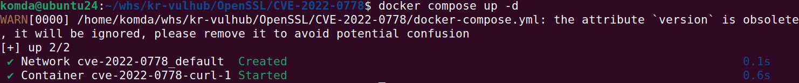
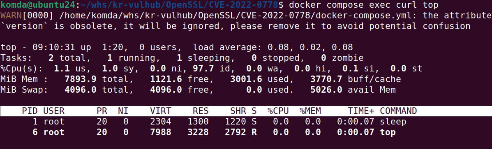
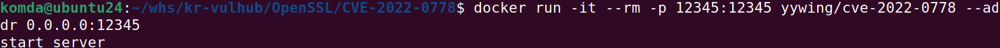
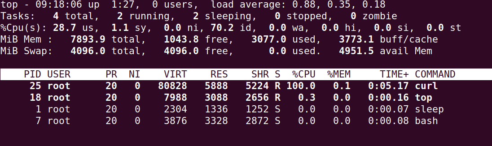
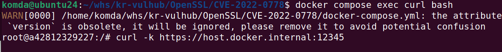

# CVE-2022-0778

**Contributors**

- 김동준(@KOMDA2139)

### 요약

- OpenSSL의 타원 곡선 공개키 사용에서 매개변수를 파싱하는 과정의 결함으로 인해, 악성 인증서를 전송시 무한 루프를 유발하여 대상 서버를 DoS 상태에 빠뜨릴 수 있습니다.

### OpenSSL

- OpenSSL은 네트워크를 통해 전송되는 데이터를 암호화하기 위해 SSL/TLS 프로토콜을 구현한 오픈 소스 기반의 강력한 암호화 툴킷이자 라이브러리입니다.
- 대부분의 웹 서버(Nginx, Apache), 이메일 서버, VPN 등 현대 인터넷 인프라의 가상화 보안 통신에 필수적으로 사용됩니다.

### CVE-2022-0778

- 2022년 3월에 보고된 OpenSSL의 심각한 서비스 거부(DoS) 취약점입니다.
- 이 문제는 OpenSSL 3.0.2 및 OpenSSL 1.1.1n에서 수정되었습니다(영향을 받는 버전: 3.0.0, 3.0.1, 1.1.1~1.1.1m). (여기서 사용할 버전은 1.1.1m)
- 타원 곡선 포인트의 제곱근을 계산하는 내부 함수인 `BN_mod_sqrt()`에서 특정 조건의 잘못된 소수 매개변수가 주어졌을 때, 루프 탈출 조건이 만족되지 않는 결함이 발견되었습니다.
- 공격자가 조작된 ASN.1 구조의 SSL/TLS 인증서를 인증서 서명 검증 단계 전에 전송하면, 해당 인증서를 파싱하는 프로세스가 무한 루프(Infinite Loop)에 빠지게 됩니다.
- 인증서 서명 검증 '이전' 단계에서 트리거되기 때문에, 유효하지 않은 익명의 인증서로도 원격 공격이 가능하다는 점에서 위험도가 매우 높습니다. 이로 인해 CPU 자원이 100% 점유되며 시스템의 가용성이 완전히 상실됩니다.

### 환경 구성 및 실행

1. 터미널 창을 연 후, 대상 디렉터리(`CVE-2022-0778`)로 이동하여 다음 명령을 실행해 도커를 백그라운드로 구동합니다.
    
    ```bash
    sudo docker compose up -d
    ```
    
    
    
2. 환경이 시작된 후, 정상적인 자원 모니터링 상태를 비교 확인하기 위해 새 터미널 창을 열어 시스템의 CPU 상태를 모니터링합니다.
    
    ```bash
    sudo docker compose exec curl top
    ```
    
    
    
3. 이제 별도의 터미널 창에서 악성 인증서가 주입된 컨테이너 서버를 구동합니다. (포트 12345 개방)
    
    ```bash
    sudo docker run -it --rm -p 12345:12345 yywing/cve-2022-0778 --addr 0.0.0.0:12345
    ```
    
    
    
4. 기존 curl 컨테이너 내부로 접속합니다.
    
    ```bash
    sudo docker compose exec curl bash
    ```
    
5. 악성 인증서 서버를 향해 HTTPS 통신을 강제로 발생시킵니다.
    - PoC 코드
        
        ```bash
        curl -k https://host.docker.internal:12345
        ```
        
    
    
    
6. 아래와 같이 CPU 점유율이 100%에 달하여 DoS가 발생함을 확인할 수 있습니다.
    
    
    

### 정리

CVE-2022-0778로 DoS가 발생할 수 있으므로 서버에서 OpenSSL의 버전을 업데이트가 필요하고 다른 서버에서 `curl` 로 접속할 때에 `-k` 옵션(SSL/TLS 인증서 검증을 우회)을 사용하지 않아야 됩니다. 

### 참조

- https://github.com/vulhub/vulhub/tree/master/openssl/CVE-2022-0778
- https://nvd.nist.gov/vuln/detail/CVE-2022-0778
- github.com/yywing/cve-2022-0778
    - 악성인증서 서버 구성 확인
