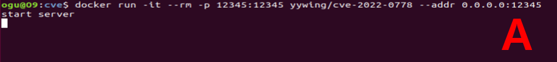

# CVE-2022-0778

**Contributors**

-    [정준수(@jeongjunsoo)](https://github.com/jeongjunsoo) 

<br/>


###  요약

-    CVE-2022-0778 취약점은 OpenSSL에서 소수의 제곱근을 계산하는 `BN_mod_sqrt()`함수에 영향을 미칩니다. 

-    이 함수가 소수 기반이 아닌 악의적으로 조작된 인증서를 처리할 때, 패치되지 않은 서버는 DoS 공격에 노출될 수 있습니다.

<br/>

###  Target
-   OpenSSL 1.0.2
-   OpenSSL 1.1.1
-   OpenSSL 3.0

<br/>


### 패치 전
```
i = 1;
if (!BN_mod_sqr(t, b, p, ctx))
    goto end;
while (!BN_is_one(t)) {
    i++;
    if (i == e) {
        ERR_raise(ERR_LIB_BN, BN_R_NOT_A_SQUARE);
        goto end;
    }
    if (!BN_mod_mul(t, t, t, p, ctx))
        goto end;
}

```

- 이 알고리즘에 따르면, i 값이 e 값에 도달하면 loop가 종료되어야 합니다. 
- 그러나 특정 입력을 통해 i와 e 모두 1의 값을 갖도록 만들면 해당 loop는 끝나지 않고 무한 loop가 발생합니다. 
- 이로 인해 서비스 거부가 발생하게 됩니다.


<br/>

### 패치 후

```
for (i = 1; i < e; i++) {
    if (i == 1) {
        if (!BN_mod_sqr(t, b, p, ctx))
            goto end;
    } else {
        if (!BN_mod_mul(t, t, t, p, ctx))
            goto end;
    }
    if (BN_is_one(t))
        break;
}
/* If not found, a is not a square or p is not prime. */
if (i >= e) {
    ERR_raise(ERR_LIB_BN, BN_R_NOT_A_SQUARE);
    goto end;
}

```

- 기존의 `while` 문을 `for` 문으로 변경되었습니다.
- 이에 따라 i의 값이 e에 도달하면 자동으로 loop가 종료되게 패치되었습니다.
- 위 패치를 통해 무한 loop 위험을 제거했습니다.

<br/>

### 환경 구성 및 실행

- `Ubuntu 환경 구성`

- `docker compose up -d` 테스트 환경 실행

- `docker run -it --rm -p 12345:12345 yywing/cve-2022-0778 --addr 0.0.0.0:12345`

- `docker compose exec curl top` 프로세스 상태 확인

- `docker compose exec curl bash` bash 실행

- `curl -k https://172.17.0.1:12345` 12345 포트로 HTTPS 요청 전송

<br/>

### 환경 구성


- 적당한 위치에 docker-compose.yml 파일을 만듭니다.

<br/>


- `sudo docker compose up -d` 명령어를 통해 테스트 환경을 구축합니다.
<br/>


- `sudo docker compose up -d` 명령어 실행 시 오류가 난다며 
- `sudo vi ~/.docker/config.json` 명령어 실행 후 그림처럼 주석 처리 후 저장합니다.
- `sudo systemctl restart docker` 명령어 실행 후 docker를 재시작 합니다.
- `sudo docker compose up -d` 명령어를 실행합니다.
- 그래도 오류가 난다면 `docker logout`, `docker login` 후 다시 시도해 봅니다.


<br/>

### 실행

- 실습을 위해 세 개의 터미널 창(A, B, C)를 준비합니다.
<br/>


- A 터미널에서 `docker run -it --rm -p 12345:12345 yywing/cve-2022-0778 --addr 0.0.0.0:12345` 명령을 실행하여 Docker 이미지를 시작합니다.

<br/>


- 다음으로 B 터미널에서 `docker compose exec curl top` 명령어를 실행해 현재 실행 중인 프로세스들의 상황을 살펴봅니다.

<br/>


- 마지막으로 C 터미널에서는 `docker compose exec curl bash`를 입력한 후, `curl -k https://172.17.0.1:12345` 12345 포트로 HTTPS 요청 전송을 합니다.

<br/>

### 결과


- B 터미널에서 실행된 top 명령의 결과로 curl 프로세스가 CPU 자원을 거의 100% 사용하는 것을 확인할 수 있습니다. 이는 무한 loop에 빠져서 발생한 것입니다.


<br/>


### 정리

- 해당 취약점은 소수 여부의 검증 부재로 인해 발생한 취약점입니다.
- 무한 loop 문제를 방지하기 위해 while 문을 for 문으로 변경하여 패치 되었습니다.

<br/>

### 레퍼런스

- https://github.com/drago-96/CVE-2022-0778

- https://hackyboiz.github.io/2022/03/19/syru/cve-2022-0778/

- https://github.com/yywing/cve-2022-0778/


<br/>