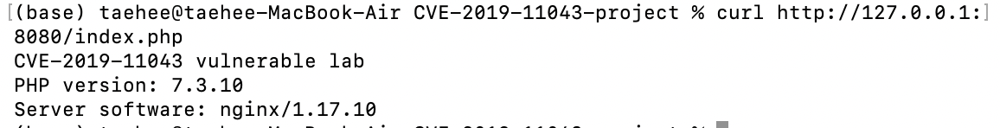
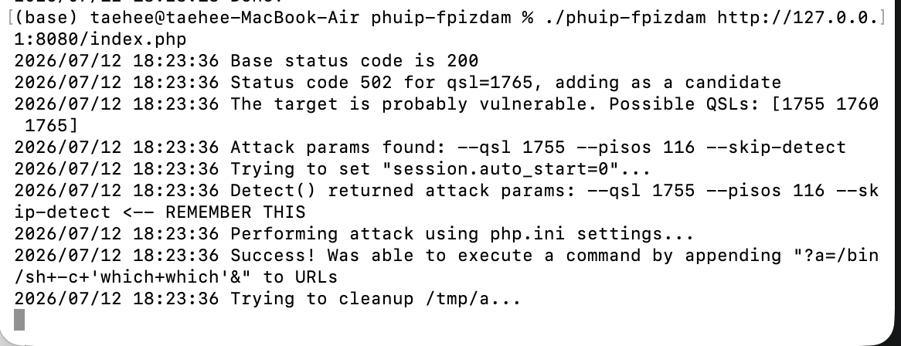
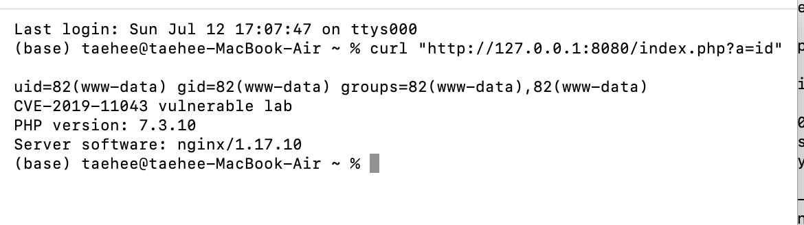
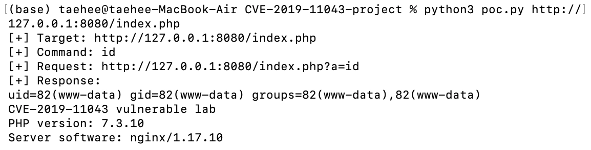

# [WHS 4기] 32반 김태희 CVE-2019-11043 보고서

## 요약
CVE-2019-11043 취약점을 대상으로 Docker Compose 기반의 nginx + PHP-FPM 취약 환경을 직접 구성하고, 원격 코드 실행 가능 여부를 재현한 결과를 정리한 것이다.

취약한 PHP-FPM 버전인 `php:7.3.10-fpm-alpine`과 nginx FastCGI 설정을 사용하였다. 공개 PoC인 `phuip-fpizdam`으로 취약 조건을 확인한 뒤, 직접 작성한 `poc.py`를 통해 `id` 명령 실행 결과가 반환되는 것을 확인하였다.

실행 결과 `uid=82(www-data)` 값이 반환되었으며, 이를 통해 HTTP 요청으로 PHP-FPM 컨테이너 내부에서 명령어가 실행됨을 확인하였다. 대응 방안으로는 PHP-FPM 버전 업데이트, nginx FastCGI 설정 보완, 불필요한 `PATH_INFO` 전달 제한을 제시하였다.

## 1. 취약점 개요
CVE-2019-11043은 nginx와 PHP-FPM이 특정 방식으로 연동된 환경에서 발생할 수 있는 원격 코드 실행(Remote Code Execution, RCE) 취약점이다.

nginx는 PHP 파일을 직접 실행하지 않고 PHP-FPM으로 요청을 전달한다. 이때 취약한 PHP-FPM 버전과 특정 FastCGI 설정이 함께 존재하면, 공격자가 조작된 요청을 통해 서버 내부에서 명령어를 실행할 수 있다.

Docker Compose를 이용하여 nginx와 PHP-FPM 환경을 구성하고, CVE-2019-11043 취약 조건을 재현하였다.

### nginx와 PHP-FPM이란?
nginx는 웹 서버 소프트웨어이다. 사용자가 브라우저나 curl 등을 통해 웹 페이지를 요청하면, nginx는 HTML, CSS, 이미지와 같은 정적 파일을 직접 처리하여 사용자에게 응답한다.

반면 PHP와 같은 동적 웹 페이지는 nginx가 직접 실행하지 못한다. 따라서 PHP 파일에 대한 요청이 들어오면 웹 서버는 이를 PHP-FPM(FastCGI Process Manager)에 전달하고, PHP-FPM이 PHP 코드를 실행한 후 그 결과를 다시 nginx에 전달한다. nginx는 전달받은 실행 결과를 사용자에게 응답하는 구조이다.

이번 과제에서 다루는 CVE-2019-11043은 이러한 nginx와 PHP-FPM이 연동되는 과정에서, 특정 설정과 취약한 PHP-FPM 버전이 함께 사용될 때 발생하는 원격 코드 실행(RCE) 취약점이다.
```text
사용자 요청
   ↓
nginx
   ↓
PHP-FPM
   ↓
PHP 코드 실행
   ↓
응답 반환
```


## 2. 환경 구성 및 실행
Docker Compose를 사용하여 nginx와 PHP-FPM 컨테이너를 동시에 실행한다.
- `nginx` 컨테이너: 웹 요청을 받고 PHP 요청을 PHP-FPM으로 전달
- `php` 컨테이너: 취약 버전인 `php:7.3.10-fpm-alpine` 사용
- Host Port : 8080 → nginx(80)
- PHP-FPM : 9000 (내부 통신)


#### docker-compose.yml
nginx와 PHP-FPM 컨테이너를 함께 실행하기 위한 Compose 설정 파일이다.
- `nginx` 서비스는 웹 요청을 받고 PHP 요청을 PHP-FPM으로 전달한다.
- `php` 서비스는 취약 버전인 `php:7.3.10-fpm-alpine` 이미지를 사용한다.
- 호스트의 `8080` 포트를 nginx 컨테이너의 `80` 포트에 연결한다.

#### nginx/Dockerfile
nginx 컨테이너 이미지를 빌드하기 위한 파일이다.
- `nginx:1.17-alpine` 공식 이미지를 기반으로 사용한다.
- 작성한 `default.conf`를 nginx 설정 경로에 복사한다.
- 이를 통해 CVE-2019-11043 재현에 필요한 FastCGI 설정이 nginx에 적용된다.

#### nginx/default.conf
nginx가 PHP 요청을 PHP-FPM으로 전달하도록 설정하는 파일이다.
- `.php` 요청을 PHP-FPM 컨테이너의 `9000` 포트로 전달한다.
- `fastcgi_split_path_info`를 사용한다.
- `SCRIPT_FILENAME`과 `PATH_INFO` 값을 PHP-FPM으로 전달한다.
- 파일 존재 여부를 확인하는 `try_files $uri =404;` 설정은 포함하지 않는다.

#### php/index.php
PHP-FPM 연동 여부를 확인하기 위한 테스트 페이지이다.
- PHP 버전을 출력한다.
- nginx 서버 정보를 출력한다.
- PoC 실행 대상 URL인 `/index.php` 역할을 한다.


### 환경 실행
다음 명령어로 Docker 이미지를 빌드하고 nginx, PHP-FPM 컨테이너를 백그라운드에서 실행한다.
```
docker compose up -d --build
```

컨테이너 실행 상태를 확인한다.
```
docker compose ps
```

PHP-FPM 연동 여부를 확인한다.
```
curl http://127.0.0.1:8080/index.php
```


실행 결과는 다음과 같다.
```text
CVE-2019-11043 vulnerable lab
PHP version: 7.3.10
Server software: nginx/1.17.10
```
위 결과를 통해 nginx가 요청을 받고 PHP-FPM이 PHP 코드를 정상적으로 실행하고 있음을 확인할 수 있다.


## 3. 취약 조건
CVE-2019-11043은 PHP-FPM 버전이 취약할 뿐만 아니라, nginx가 PHP 요청을 PHP-FPM으로 전달하는 설정이 특정 조건을 만족할 때 재현될 수 있다.

취약 조건은 다음과 같다.
- PHP-FPM 7.3.10 사용
- nginx가 PHP 요청을 PHP-FPM으로 전달
- `fastcgi_split_path_info` 사용
- `SCRIPT_FILENAME`과 `PATH_INFO` 값을 PHP-FPM으로 전달
- `try_files $uri =404;` 설정 없음

특히 `nginx/default.conf`의 다음 설정이 핵심이다.
```nginx
fastcgi_split_path_info ^(.+?\.php)(/.*)$;
fastcgi_param SCRIPT_FILENAME $document_root$fastcgi_script_name;
fastcgi_param PATH_INFO $fastcgi_path_info;
```
`PATH_INFO`는 PHP 파일 뒤에 붙는 추가 경로 정보를 의미한다.
예를 들어 `/index.php/test`에서 `/test` 부분이 `PATH_INFO`이다.
이 값이 부적절하게 PHP-FPM으로 전달되고 PHP-FPM 버전이 취약하면, 조작된 요청을 통해 원격 코드 실행으로 이어질 수 있다.

정상적인 운영 환경에서는 존재하지 않는 PHP 파일 요청이 PHP-FPM으로 전달되지 않도록 검증하지만 본 실습에서는 CVE-2019-11043 재현을 위해 해당 방어 설정을 적용하지 않았다.


## 4. 취약점 재현 절차

취약 조건 탐지 및 초기 트리거에는 공개 PoC인 `phuip-fpizdam`을 사용하였다.
해당 PoC는 제출물에 포함하지 않고, 참고자료에 있는 깃허브 저장소에서 빌드하여 사용하였다.
```bash
./phuip-fpizdam http://127.0.0.1:8080/index.php
```


PoC 실행 결과 대상 서버가 취약한 것으로 확인되었다.
```text
The target is probably vulnerable
Attack params found
Success! Was able to execute a command
```
PoC가 취약 조건을 자동으로 탐지하고, 명령 실행이 가능한 파라미터를 찾아냈음을 의미한다.


이후 다음 요청을 통해 실제 명령 실행 여부를 확인하였다.
```bash
curl "http://127.0.0.1:8080/index.php?a=id"
```


실행 결과 다음과 같이 `id` 명령어 결과가 반환되었다.
```text
uid=82(www-data) gid=82(www-data) groups=82(www-data)
```
이는 HTTP 요청을 통해 PHP-FPM 컨테이너 내부에서 `id` 명령어가 실행되었음을 의미한다. 즉, CVE-2019-11043의 원격 코드 실행 취약점이 재현되었음을 확인할 수 있다.


PoC 실행 이후 명령 실행 여부를 반복 확인하기 위해 `poc.py`를 작성하였다.  
`poc.py`는 대상 URL 뒤에 `?a=id` 파라미터를 붙여 요청을 보내고, 서버 응답을 출력하는 확인용 스크립트이다.  
urllib.request 모듈을 사용하여 HTTP 요청을 전송하였다.

실행 명령어는 다음과 같다.
```bash
python3 poc.py http://127.0.0.1:8080/index.php
```


실행 결과 응답에 다음과 같은 값이 포함되었다.
```text
uid=82(www-data) gid=82(www-data) groups=82(www-data),82(www-data)
```
이는 PHP-FPM 컨테이너 내부에서 `www-data` 사용자 권한으로 `id` 명령어가 실행되었음을 의미한다.


## 5. 실행 결과 정리

위의 과정들을 통해 다음과 같은 결과를 확인하였다.
- Docker Compose로 nginx와 PHP-FPM 컨테이너가 정상 실행됨
- PHP-FPM 7.3.10 취약 버전이 사용됨
- nginx가 PHP 요청을 PHP-FPM으로 전달함
- 공개 PoC 실행 결과 대상 서버가 취약한 것으로 확인됨
- `curl` 요청과 직접 작성한 `poc.py`를 통해 컨테이너 내부 명령 실행 결과가 반환됨

따라서 CVE-2019-11043의 원격 코드 실행 취약점이 재현되었음을 확인하였다.


## 6. 대응 방안

### 6.1 PHP-FPM 버전 업데이트
취약한 PHP-FPM 버전을 사용하지 않고 패치가 적용된 버전으로 업데이트한다.
- PHP 7.1.33 이상
- PHP 7.2.24 이상
- PHP 7.3.11 이상

### 6.2 nginx FastCGI 설정 보완
PHP 파일이 실제로 존재하는지 확인하는 설정을 추가한다.
```nginx
try_files $uri =404;
```

### 6.3 불필요한 PATH_INFO 전달 제한
애플리케이션에서 `PATH_INFO`가 필요하지 않다면 PHP-FPM으로 전달하지 않도록 설정을 단순화해준다.
```nginx
# 불필요한 경우 PATH_INFO 전달 제거
# fastcgi_param PATH_INFO $fastcgi_path_info;
```

## 7. 참고자료
- https://www.cvedetails.com/cve/CVE-2019-11043/  
- https://nvd.nist.gov/vuln/detail/CVE-2019-11043
- https://github.com/neex/phuip-fpizdam   
- https://www.php.net/  
- https://nginx.org/en/docs/
- https://hub.docker.com/_/php/tags?name=7.3.10-fpm-alpine
    
