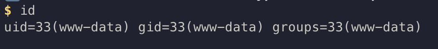
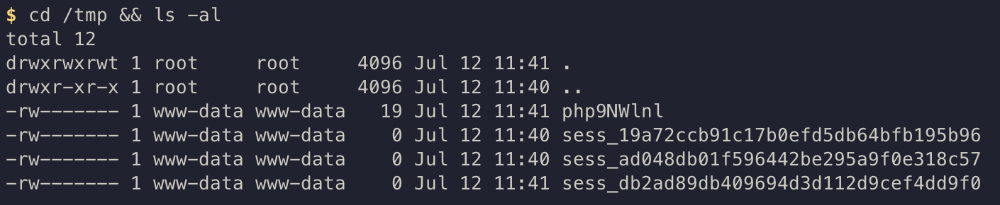

# CVE-2024-8517 
### Score : 9.8[Critical] 
---

### **Contributors**

- WHS 4기 23반 윤두현

---

### 요약
- 대상: 오픈소스 CMS인 SPIP의 내장 파일 업로드 기능인 BigUp
- 원인: multipart 파일 업로드 요청을 처리하는 과정에서 사용자 입력값에 대한 검증이 충분하지 않아 OS 명령어 삽입이 가능함
- 취약점: 공격자가 조작된 multipart 파일 업로드 HTTP 요청을 전송하여 서버에서 임의의 운영체제 명령어를 실행할 수 있음
- 특징: 로그인이나 별도의 인증이 필요하지 않은 비인증 상태에서 취약점 악용이 가능함
- 결과: 공격자는 원격에서 웹 서버 프로세스 권한으로 임의 명령어를 실행할 수 있음
---

### 참고 자료

- https://www.cve.org/CVERecord?id=CVE-2024-8517
- https://nvd.nist.gov/vuln/detail/cve-2024-8517
- https://thinkloveshare.com/hacking/spip_preauth_rce_2024_part_2_a_big_upload/

---# CVE-2024-8517

---

### **Contributors**

- WHS 4기 23반 윤두현

---

### 요약
- 대상: 오픈소스 CMS인 SPIP의 내장 파일 업로드 기능인 BigUp
- 원인: multipart 파일 업로드 요청을 처리하는 과정에서 사용자 입력값에 대한 검증이 충분하지 않아 OS 명령어 삽입이 가능함
- 취약점: 공격자가 조작된 multipart 파일 업로드 HTTP 요청을 전송하여 서버에서 임의의 운영체제 명령어를 실행할 수 있음
- 특징: 로그인이나 별도의 인증이 필요하지 않은 비인증 상태에서 취약점 악용이 가능함
- 결과: 공격자는 원격에서 웹 서버 프로세스 권한으로 임의 명령어를 실행할 수 있음

---

### 참고 자료

- https://www.cve.org/CVERecord?id=CVE-2024-8517
- https://nvd.nist.gov/vuln/detail/cve-2024-8517
- https://thinkloveshare.com/hacking/spip_preauth_rce_2024_part_2_a_big_upload/

---

### 환경 설정

해당 취약점은 SPIP 4.3.2 미만의 환경에서 동작합니다 

다음 명령어를 실행하여, SPIP 4.3.1 기반의 PHP 8.2 Apache 기반의 취약한 애플리케이션을 실행합니다 

```
docker compose up -d --build
```

해당 명령어를 입력하게 되면, 취약점 애플리케이션이 실행됩니다. 

### 취약점 재현

로그인이나, 인증 없이 아래 명령어를 통해 취약한 서버의 웹 쉘을 획득할 수 있습니다 

```
docker compose --profile poc run --rm poc
```



취약점을 악용하여, 서버의 명령어도 실행할 수 있습니다 

README.assets/2.png

---

### 대응 방안

1. 취약점이 수정된 SPIP 버전으로 업데이트
- SPIP 4.3 계열: 4.3.2 이상
- SPIP 4.2 계열: 4.2.16 이상
- SPIP 4.1 계열: 4.1.18 이상
3. BigUp관련 패치 적용
4. 불필요한 업로드 기능 제함
5. 웹 서버 권한 최소화
6. 비정상적인 업로드 요청과 명령 실행 필터링 및 로그 모니터링

### 환경 설정

해당 취약점은 SPIP 4.3.2 미만의 환경에서 동작합니다 

다음 명령어를 실행하여, SPIP 4.3.1 기반의 php 8.2 Apache 기반의 취약한 애플리케이션을 실행합니다 

```
docker compose up -d --build
```

해당 명령어를 입력하게 되면, 취약점 애플리케이션이 실행됩니다. 

### 취약점 재현

로그인이나 인증 없이 아래 명령어를 통해 취약한 서버의 원격 명령 실행에 성공할 수 있다

```
docker compose --profile poc run --rm poc
```


취약점을 악용하여, 서버의 명령어도 실행할 수 있습니다 



---

### 대응 방안

1. 취약점이 수정된 SPIP 버전으로 업데이트
- SPIP 4.3 계열: 4.3.2 이상
- SPIP 4.2 계열: 4.2.16 이상
- SPIP 4.1 계열: 4.1.18 이상
2. BigUp 관련 패치 적용
3. 불필요한 업로드 기능 제한
4. 웹 서버 권한 최소화
5. 비정상적인 업로드 요청과 명령 실행 필터링 및 로그 모니터링