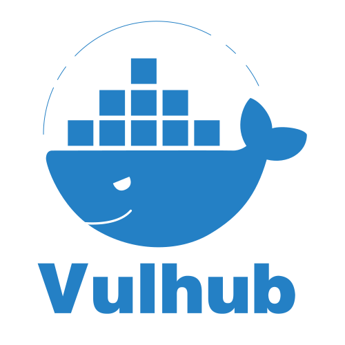

# Korean Vulhub (한글판)

[Vulhub](https://github.com/vulhub/vulhub) (https://vulhub.org/) 을 기반으로 한국어 번역 및 컨텐츠를 추가하는 것을 목표로 공동작업합니다.

차세대 보안리더 양성 프로그램 화이트햇 스쿨 1기 수강생들이 기여하고 있습니다.

 

### Table of Contents

-   Flask
    -   [SSTI](./Flask/SSTI/README.md) | Server Side Template Injection / [신경방 (@positiveWand)](https://github.com/positiveWand)
-   MySQL
    -   [CVE-2012-2122](./MySQL/CVE-2012-2122/README.md) | MySQL Authentication Bypass / [배소정 (@baethwjd2)](https://github.com/baethwjd2)
-   Nginx
    -   [CVE-2017-7529](./Nginx/CVE-2017-7529/README.md) | Nginx Integer Overflow Vulnerability / [박건호 (@c0dep1ayer)](https://github.com/c0dep1ayer)
