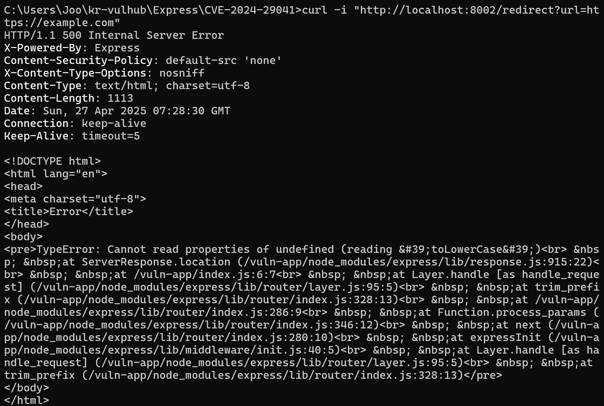
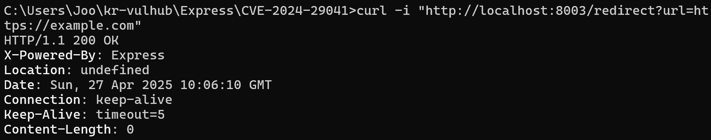
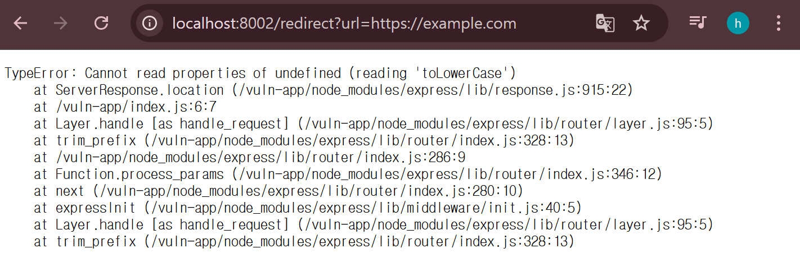
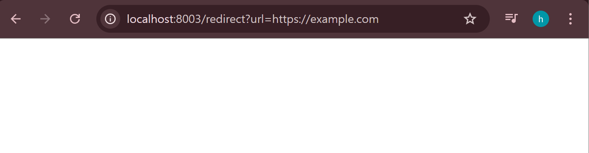
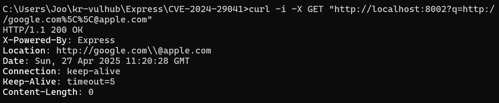
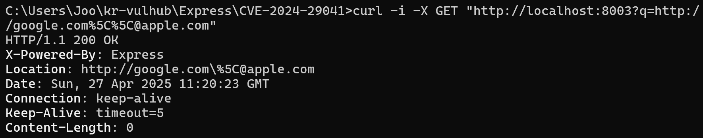
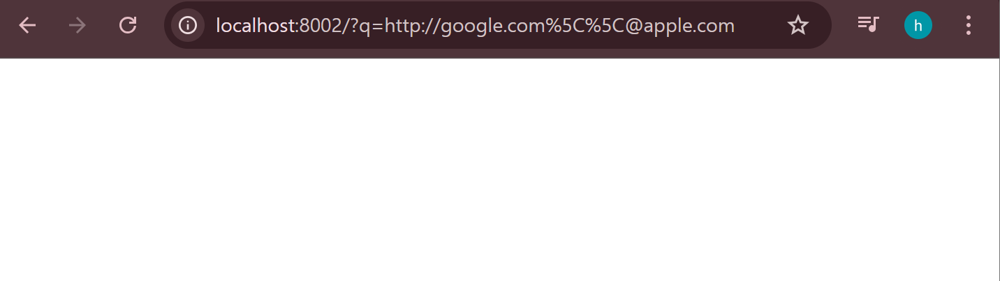
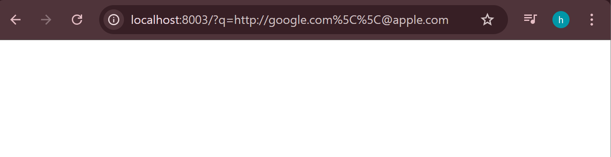

# CVE-2024-29041: Express Open Redirect Vulnerability (PoC)

## 환경 구성

- OS: Windows 11
- Docker Version: 27.4.0
- docker-compose Version: 2.31.0

---

## 실습 준비

1. [gunh0/kr-vulhub](https://github.com/gunh0/kr-vulhub) 레포지토리 Fork 및 클론
```bash
git clone https://github.com/UserJ32/kr-vulhub.git
```
2. 취약점 폴더로 이동
```bash
cd kr-vulhub/express/CVE-2024-29041
```
3. `docker-compose up -d` 명령어로 컨테이너 실행
```bash
docker-compose up -d
```
   - 8002 포트: 취약 서버
   - 8003 포트: 정상 서버

---

## 실습
## PART1. 기본 PoC (단순 리다이렉트 테스트)

1. 취약 서버(8002) 테스트
```bash
curl -i "http://localhost:8002/redirect?url=https://example.com"
```
- 결과 : 500 Internal Server Error (검증 부재로 인한 서버 오류)


2. 정상 서버(8003) 테스트
```bash
curl -i "http://localhost:8003/redirect?url=https://example.com"
```
- 결과 : 정상 처리 (에러 없음)


3. 브라우저 테스트
- 취약 서버(8002) 접속 결과


- 정상 서버(8003) 접속 결과


## 상세 설명
본 실습은 gunh0/kr-vulhub에서 제공하는 CVE-2024-29041 환경을 기반으로 하여, 기본적인 오픈 리다이렉트 취약성 검증을 목적으로 진행되었습니다. 취약 서버(8002)는 `/redirect?url=` 파라미터로 전달된 URL을 별다른 검증 없이 Location 헤더에 삽입하려 했습니다.  
이로 인해 서버 오류(500 Internal Server Error)가 발생하였으며,  
이는 입력값을 검증하지 않고 처리하려는 취약한 동작을 나타냅니다. 정상 서버(8003)는 적절한 검증을 수행하여 안전하게 처리되었습니다.

---

## Part 2. 고급 PoC (URL 파싱 트릭을 이용한 리다이렉션 시도)
1. 취약 서버(8002) 테스트
```bash
curl -i -X GET "http://localhost:8002?q=http://google.com%5C%5C@apple.com"
```
- 결과 : 500 Internal Server Error (검증 부재로 인한 서버 오류)


2. 정상 서버(8003) 테스트
```bash
curl -i -X GET "http://localhost:8003?q=http://google.com%5C%5C@apple.com"
```
= 결과 : 정상 처리 (에러 없음)


3. 브라우저 테스트
- 취약 서버(8002) 접속 결과


- 정상 서버(8003) 접속 결과


---

## 상세 설명
추가적으로, 특수한 URL 파라미터(`\\@`)를 삽입하여 리다이렉션 우회 가능성을 검증했습니다. 취약 서버(8002)는 입력된 URL `http://google.com\\@apple.com`을 검증 없이 Location 헤더에 반영하였고,  
브라우저나 URL 파서에 따라 `google.com`은 인증정보로 처리되어 무시되고, 최종적으로 `apple.com`으로 리다이렉션되는 보안 문제가 발생할 수 있음을 확인했습니다. 정상 서버(8003)는 이러한 특수한 입력에 대해서도 적절히 대응하여 리다이렉션 취약점이 발생하지 않았습니다. 본 고급 PoC를 통해, Express 서버에서 입력값 검증 미흡으로 인한  
오픈 리다이렉트 취약점이 더욱 심각하게 악용될 수 있음을 검증했습니다.

---

## 최종 정리
- 기본 PoC를 통해 단순 입력 검증 부재를 확인했다.
- 고급 PoC를 통해 입력된 URL 파싱 트릭을 통한 인증 우회 및 리다이렉션 가능성을 검증했다.
- CVE-2024-29041 취약점은 Express 서버가 입력값을 제대로 검증하지 않고 Location 헤더에 반영하는 과정에서 발생하는 오픈 리다이렉트 취약점이다.

---

## Github 작업 이력

본 실습은 공개된 취약점 재현 레포지토리(gunh0/kr-vulhub)를 Fork하여, 취약한 Express 서버 환경(CVE-2024-29041)을 로컬에서 Docker로 직접 구성하고 테스트하는 방식으로 진행되었습니다.

- 원본 레포지토리: [https://github.com/gunh0/kr-vulhub](https://github.com/gunh0/kr-vulhub)
- Fork한 레포지토리: [https://github.com/UserJ32/kr-vulhub](https://github.com/UserJ32/kr-vulhub)

(※ 이후 Pull Request를 생성하였습니다.)
- PR 링크: [Pull Request #291 - CVE-2024-29041 PoC Report](https://github.com/gunh0/kr-vulhub/pull/291)
