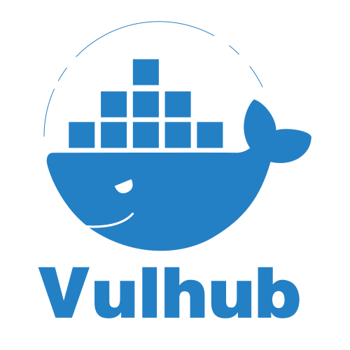

# Korean Vulhub (한글판)

취약한 도커 환경을 구축하여, 이해도를 높이고, 실습을 통해 보안 기술을 익히는 것을 목표로 합니다.

[Vulhub](https://github.com/vulhub/vulhub) (<https://vulhub.org/>) 을 참고하여, 다양한 컨테이너 기반의 취약한 환경을 구축합니다.

 

### Table of Contents

- **Django** — Python 기반 웹 프레임워크
    - [CVE-2021-35042](./Django/CVE-2021-35042/README.md) — QuerySet.order_by() SQL Injection
        - Contributor: [@sj1226m](https://github.com/sj1226m) | Risk Score: 7.5 (Reproducibility: 70%)

- **Express** — Node.js 웹 프레임워크
    - [CVE-2024-29041](./Express/CVE-2024-29041/README.md) — Express 오픈 리다이렉트 취약점
        - Contributor: [@j93es](https://github.com/j93es) | Risk Score: 6.1 (Reproducibility: 75%)

- **Flask** — Python 경량 웹 프레임워크
    - [SSTI](./Flask/SSTI/README.md) — Server Side Template Injection
        - Contributor: [@positiveWand](https://github.com/positiveWand) | Risk Score: 9.0 (Reproducibility: 75%)

- **MySQL** — 관계형 데이터베이스
    - [CVE-2012-2122](./MySQL/CVE-2012-2122/README.md) — MySQL Authentication Bypass
        - Contributor: [@baethwjd2](https://github.com/baethwjd2) | Risk Score: 7.0 (Reproducibility: 70%)

- **Next.js** — React 기반 풀스택 웹 프레임워크
    - [CVE-2025-29927](./Next.js/CVE-2025-29927/README.md) — Next.js 미들웨어 인가 우회
        - Contributor: [@idealinsane](https://github.com/idealinsane) | Risk Score: 9.1 (Reproducibility: 85%)

- **Nginx** — 고성능 웹 서버 / 리버스 프록시
    - [CVE-2017-7529](./nginx/CVE-2017-7529/README.md) — Nginx Integer Overflow Vulnerability
        - Contributor: [@c0dep1ayer](https://github.com/c0dep1ayer) | Risk Score: 7.5 (Reproducibility: 75%)

- **Redis** — 인메모리 키-값 데이터베이스
    - [CVE-2022-0543](./Redis/CVE-2022-0543/README.md) — Lua 샌드박스 탈출을 통한 원격 코드 실행
        - Contributor: [@yeo0n](https://github.com/yeo0n) | Risk Score: 10.0 (Reproducibility: 65%)

- **Spring** — Java 엔터프라이즈 웹 프레임워크
    - [CVE-2022-22963](./Spring/CVE-2022-22963/README.md) — Spring Cloud Function SpEL 코드 주입
        - Contributor: [@foskingson](https://github.com/foskingson) | Risk Score: 9.8 (Reproducibility: 75%)
    - [CVE-2022-22978](./Spring/CVE-2022-22978/README.md) — Spring Security Authorization Bypass in RegexRequestMatcher
        - Contributor: [@sub0810](https://github.com/sub0810) | Risk Score: 9.8 (Reproducibility: 80%)

- **Tiki Wiki** — PHP 기반 오픈소스 CMS / Wiki
    - [CVE-2020-15906](./TikiWiki/CVE-2020-15906/README.md) — TikiWiki CMS Authentication Bypass → RCE
        - Contributor: [@haijun9](https://github.com/haijun9) | Risk Score: 8.8 (Reproducibility: 60%)

 

### Report Evaluation

각 보고서는 취약점 자체의 위험도와 Report Reliability를 분리해 평가합니다. Docker 환경과 제출된 PoC를 재검증한 뒤 기록합니다.

- Reproducibility: 제출된 환경과 PoC를 그대로 따랐을 때 재현 가능한 정도를 0%에서 100%로 표현합니다. 환경 구성, 취약 조건, 재현 절차, PoC 코드, 실행 결과, 대응 방안의 명확성을 기준으로 평가합니다.
- Risk Score: 인증 필요 여부, 원격 악용 가능성, 영향 범위, PoC 및 Docker 환경에서 확인되는 실제 동작을 기준으로 CVSS처럼 0.0에서 10.0 사이로 평가합니다.
