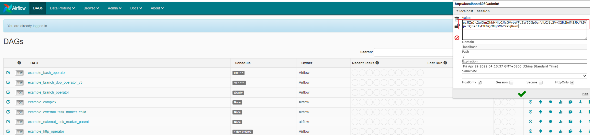

# Jupyter/notebook-rce
@염승빈/n0rel1fe

## 요약
Jupyter Notebook 무단 접근 취약점
Jupyter Notebook(이전에 IPython 노트북으로 알려졌음)은 40가지 이상의 프로그래밍 언어를 실행할 수 있는 대화형 노트북입니다.
관리자가 Jupyter Notebook에 비밀번호를 설정하지 않은 경우 무단 액세스 취약점이 발생할 수 있으며, 방문자는 콘솔을 생성하고 임의의 Python 코드 및 명령을 실행할 수 있습니다.

## 환경 구성 및 실행
- ``` docker compose up -d``` 실행하여 테스트 환경을 구축
- 
-``` http://localhost:8888/```에 접속하여 
- 실행 후 ```http://localhost:8888```에 들어가면 Jupyter Notebook의 웹 관리 인터페이스를 보게 되는데 비밀번호를 입력하는 곳은 없습니다.


- new -> terminal을 눌러 터미널창을 열어준 후 임의의 명령어를 수행해줍니다.

## 결과


## 정리
해당 취약점은 Jupyter Notebook이 비밀번호 없이 구성되어 있을 때 발생합니다. 이로 인해 누구나 시스템에 무단으로 액세스하여 임의의 Python 코드나 명령을 실행할 수 있습니다.
