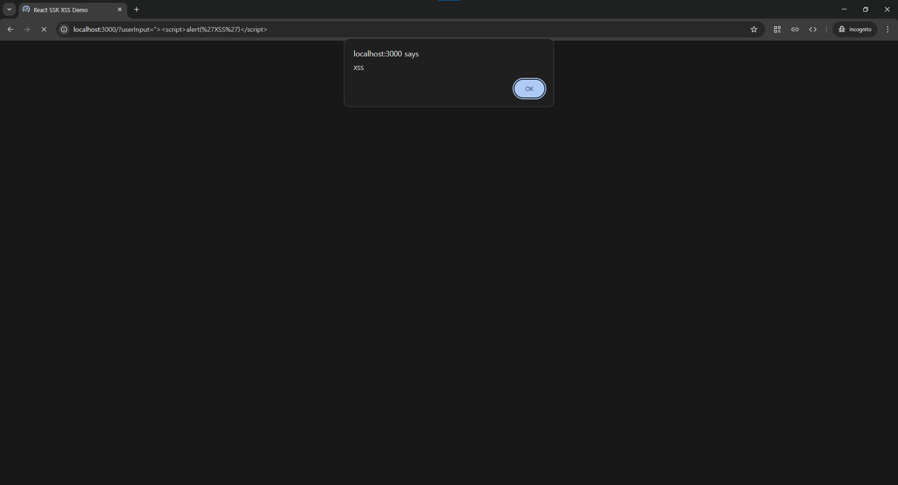
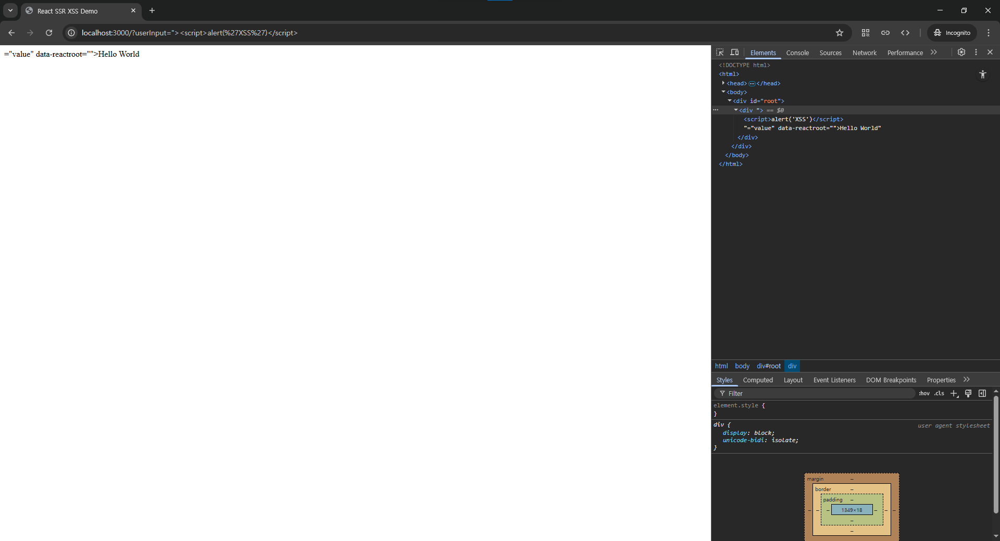

# CVE-2017-7529

> [남현석 (@imnyang)](https://github.com/imnyang)

 

### 요약

- ​CVE-2018-6341은 React 애플리케이션에서 ReactDOMServer API를 사용하여 HTML을 렌더링할 때, 사용자 입력으로 제공된 속성 이름이 적절히 이스케이프되지 않아 XSS 취약점이 발생함

https://ko.legacy.reactjs.org/blog/2018/08/01/react-v-16-4-2.html

 

### 환경 구성 및 실행

- `docker compose up -d`를 실행하여 테스트 환경을 실행
- `http://localhost:3000/?userInput=%22%3E%3Cscript%3Ealert(%27XSS%27)%3C/script%3E`에 접속하여 XSS Exploit 확인

 

### 결과

### 정리

   이 취약점은 React에서 속성이 적절히 이스케이프되지 않아 XSS가 발생할 수 있는 위험이 있습니다.
