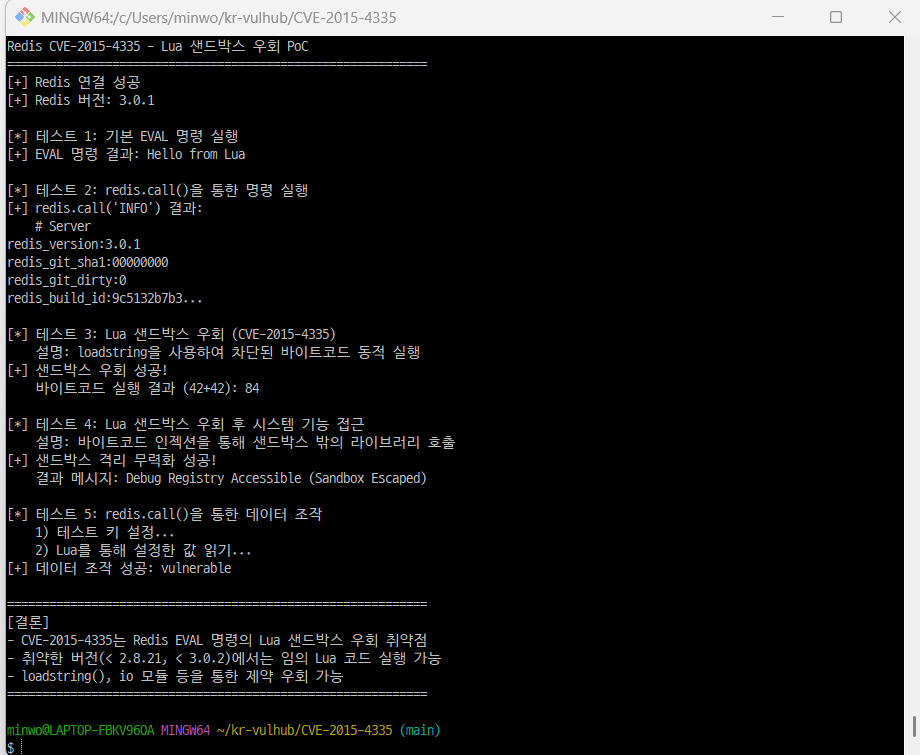

# Redis Lua 샌드박스 우회를 통한 원격 코드 실행 (CVE-2015-4335)

> 화이트햇 스쿨 4기 - [민우 (@minwoo06)](https://github.com/minwoo06)

Redis는 고성능 인메모리 키-값 데이터 저장소로, Lua 스크립트 엔진을 내장하여 `EVAL` 명령을 통해 서버 측에서 Lua 코드를 실행할 수 있습니다.

Redis 2.8.21 이전 및 3.0.2 이전 버전에서는 Lua 샌드박스의 제약이 불충분하여, 공격자가 `EVAL` 명령으로 `loadstring()` 함수를 호출해 임의의 Lua 바이트코드를 로드하고 실행할 수 있습니다. 이를 통해 샌드박스를 탈출하여 시스템 수준의 임의 코드 실행(RCE)이 가능합니다.

기본 설정에서 Redis는 인증 없이 접근 가능하므로, 네트워크에서 Redis 포트(6379)에 접근 가능한 공격자라면 누구나 이 취약점을 악용할 수 있습니다.

**참고 자료 (References):**

- <https://redis.io/blog/cve-2015-4335dsa-3279-redis-lua-sandbox-escape/>
- <https://nvd.nist.gov/vuln/detail/CVE-2015-4335>
- <https://www.cvedetails.com/cve/CVE-2015-4335/>

---

### 환경 설정 (Environment Setup)

다음 명령어를 실행하여 Redis 3.0.1 기반의 취약한 환경을 시작합니다:

```bash
docker compose up -d
```

환경이 시작되면, `redis-cli` 또는 네트워크를 통해 `localhost:6379`로 접속할 수 있습니다.

Redis 버전을 확인하여 취약한 버전(3.0.1)인지 검증합니다:

```bash
docker exec -it redis-vulnerable redis-cli INFO server | grep redis_version
```

```
redis_version:3.0.1
```

---

### 취약점 재현 (Vulnerability Reproduction)

#### 테스트 1: 기본 EVAL 명령 실행

Redis에서 Lua 코드가 실행 가능한지 확인합니다:

```bash
docker exec -it redis-vulnerable redis-cli EVAL "return 'Hello from Lua'" 0
```


정상적으로 `"Hello from Lua"` 문자열이 반환되면, EVAL 명령을 통한 Lua 실행이 가능한 상태입니다.

#### 테스트 2: redis.call()을 통한 서버 정보 유출

Lua 스크립트에서 `redis.call()`을 사용하여 Redis 내부 명령을 실행할 수 있습니다:

```bash
docker exec -it redis-vulnerable redis-cli EVAL "return redis.call('INFO', 'server')" 0
```


Redis 서버의 버전, 빌드 정보, OS 정보 등 민감한 내부 정보가 노출됩니다.

#### 테스트 3: Lua 샌드박스 우회 (CVE-2015-4335 핵심)

`loadstring()` 함수를 사용하여 Lua 바이트코드를 동적으로 로드하고 실행합니다. 이것이 CVE-2015-4335의 핵심 취약점입니다:

```bash
docker exec -it redis-vulnerable redis-cli EVAL "local load = loadstring; return load('return 42+42')()" 0
```


반환값 `84`는 `loadstring()`을 통해 임의의 Lua 바이트코드가 샌드박스 제약 없이 실행되었음을 의미합니다. 패치된 버전(>= 2.8.21, >= 3.0.2)에서는 이 명령이 차단됩니다.

#### 테스트 4: Python PoC 스크립트 실행

보다 체계적인 검증을 위해 Python PoC 스크립트를 실행합니다:

```bash
pip install redis
python3 poc.py
```



모든 테스트에서 `[+]` 표시가 나타나면 취약점 재현에 성공한 것입니다.

---

### 대응 방안 (Mitigation)

**근본적 해결:** Redis를 2.8.21 또는 3.0.2 이상으로 업그레이드합니다.

```bash
# 현재 버전 확인
redis-cli INFO server | grep redis_version

# 패치된 버전으로 업그레이드
# Redis 2.x → 2.8.21 이상
# Redis 3.x → 3.0.2 이상
```

**임시 완화 조치:**

- EVAL/EVALSHA 명령 비활성화: `rename-command EVAL ""`
- Redis 접근에 인증 추가: `requirepass <강력한_비밀번호>`
- Redis 포트를 외부 네트워크에 노출하지 않도록 방화벽 설정: `bind 127.0.0.1`
