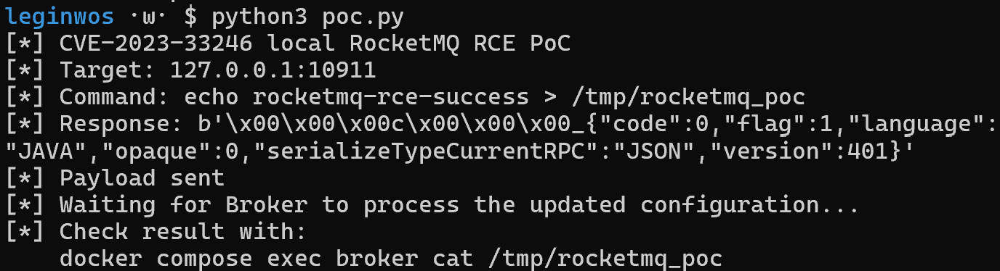
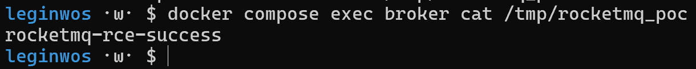
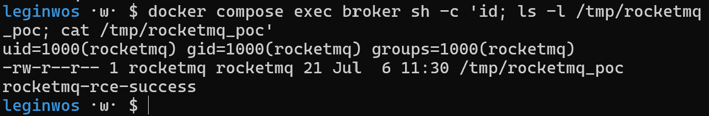

# CVE-2023-33246

## 1. 취약점 요약

CVE-2023-33246은 Apache RocketMQ에서 발생한 원격 명령 실행 취약점이다.

Apache RocketMQ는 Producer가 메시지를 보내고, Broker가 메시지를 저장·전달하며, Consumer가 메시지를 소비하는 분산 메시지 미들웨어이다. 이 중 Broker는 실제 메시지 처리와 설정 관리를 담당하는 핵심 구성요소이다.

해당 취약점은 RocketMQ의 Broker, NameServer, Controller와 같은 구성요소가 외부에서 접근 가능한 상태이고 권한 검증이 부족할 때 발생한다. 공격자는 설정 업데이트 기능 또는 조작된 RocketMQ 프로토콜 요청을 이용해 RocketMQ 실행 사용자 권한으로 명령을 실행할 수 있다.

본 문서에서는 취약한 RocketMQ 4.9.4 Broker 환경을 구성하고, PoC를 통해 컨테이너 내부에 파일을 생성하여 명령 실행 가능 여부를 확인한다.

- CVE ID: CVE-2023-33246
- 취약점 명: Apache RocketMQ Command Execution Vulnerability
- 영향 대상: Apache RocketMQ 5.1.0 이하 및 일부 4.x 버전
- 실습 버전: Apache RocketMQ 4.9.4
- 취약 유형: Remote Command Execution
- CVSS v3.1: 9.8 Critical
- CVSS Vector: `CVSS:3.1/AV:N/AC:L/PR:N/UI:N/S:U/C:H/I:H/A:H`

CVSS v3.1 기준 9.8 Critical로 평가되는 이유는 네트워크를 통해 인증 없이 공격할 수 있고, 사용자 상호작용이 필요 없으며, 성공 시 RocketMQ 실행 사용자 권한으로 임의 명령 실행이 가능하기 때문이다.

## 2. 환경 구성

본 환경은 Docker Compose를 통해 RocketMQ NameServer와 Broker를 실행한다.

```text
CVE-2023-33246/
├── Dockerfile
├── docker-compose.yml
├── broker.conf
├── poc.py
├── README.md
└── images/
    ├── poc_result.png
    ├── file_result.png
    └── docker_check.png
```

## 3. 취약 조건

본 환경에서 CVE-2023-33246이 재현되는 조건은 다음과 같다.

1. 취약한 Apache RocketMQ 버전을 사용한다.
2. Broker가 네트워크에서 접근 가능한 상태이다.
3. 설정 업데이트 기능에 대한 권한 검증이 부족하다.
4. 공격자가 RocketMQ 프로토콜 요청을 전송할 수 있다.
5. 조작된 설정값이 Broker 처리 과정에서 명령 실행으로 이어진다.

공격 흐름:

```text
Attacker
→ RocketMQ Broker 포트 접근
→ 설정 업데이트 요청 전송
→ Broker 설정값 조작
→ RocketMQ 실행 사용자 권한으로 명령 실행
→ /tmp/rocketmq_poc 파일 생성
```

## 4. 재현 절차

### 1) 환경 실행

```bash
docker compose up -d --build
```

상태 확인:

```bash
docker compose ps
```

### 2) PoC 실행

```bash
python3 poc.py
```

### 3) PoC 동작 설명

`poc.py`는 RocketMQ Broker의 remoting port인 `127.0.0.1:10911`로 직접 TCP 요청을 전송한다. 이 요청은 RocketMQ 프로토콜 형식으로 구성되어 있으며, Broker의 설정 업데이트 처리 흐름을 악용한다.

PoC에서 실행되도록 지정한 명령은 다음과 같다.

```bash
echo rocketmq-rce-success > /tmp/rocketmq_poc
```

해당 명령이 실행되면 Broker 컨테이너 내부에 `/tmp/rocketmq_poc` 파일이 생성되고, 파일 안에는 `rocketmq-rce-success` 문자열이 저장된다. 본 문서에서는 이 파일의 존재 여부와 내용을 확인하여 명령 실행 여부를 검증한다.

### 4) PoC 실행 결과

실행 결과:



PoC 실행 결과 Broker가 `code: 0` 응답을 반환하였다. 이는 Broker가 전송된 요청을 처리했음을 의미하며, 이후 컨테이너 내부 파일 생성 여부를 확인한다.

### 5) 파일 생성 확인

```bash
docker compose exec broker cat /tmp/rocketmq_poc
```

파일 생성 및 출력 확인:



### 6) 컨테이너 내부 추가 확인

```bash
docker compose exec broker sh -c 'id; ls -l /tmp/rocketmq_poc; cat /tmp/rocketmq_poc'
```

컨테이너 내부에서 확인:



실행 결과 `/tmp/rocketmq_poc` 파일이 생성되었고, 파일 소유자가 `rocketmq` 사용자로 확인되었다. 이를 통해 PoC 요청이 Broker 처리 과정에서 RocketMQ 실행 사용자 권한의 명령 실행으로 이어졌음을 확인할 수 있다.

### 7) 환경 종료

```bash
docker compose down
```

## 5. 대응 방안

### 1) RocketMQ 업데이트

취약한 Apache RocketMQ 버전을 사용하지 않는다. RocketMQ 5.x는 5.1.1 이상, RocketMQ 4.x는 4.9.6 이상으로 업데이트하는 것이 권장된다.

### 2) Broker와 NameServer 외부 노출 차단

RocketMQ의 주요 포트를 인터넷에 직접 노출하지 않는다.

```text
9876   NameServer
10911  Broker remoting port
10909  Broker fast remoting port
```

방화벽, 보안 그룹, Docker bind address 등을 이용해 신뢰할 수 있는 내부망에서만 접근 가능하도록 제한한다.

### 3) 관리 기능 접근 제어

Broker 설정 업데이트와 같은 관리 기능은 인증된 관리자 또는 신뢰할 수 있는 내부 네트워크에서만 접근 가능하도록 제한한다.

### 4) 이상 설정 변경 탐지

Broker 설정 변경 로그와 비정상적인 설정 업데이트 요청을 모니터링한다.

## 6. 참고자료

- [NVD - CVE-2023-33246](https://nvd.nist.gov/vuln/detail/CVE-2023-33246)
- [Apache RocketMQ Domain Model](https://rocketmq.apache.org/docs/domainModel/01main/)
- [Apache RocketMQ Quick Start](https://rocketmq.apache.org/docs/quickStart/01quickstart/)
- [Apache Archive - RocketMQ 4.9.4](https://archive.apache.org/dist/rocketmq/4.9.4/)